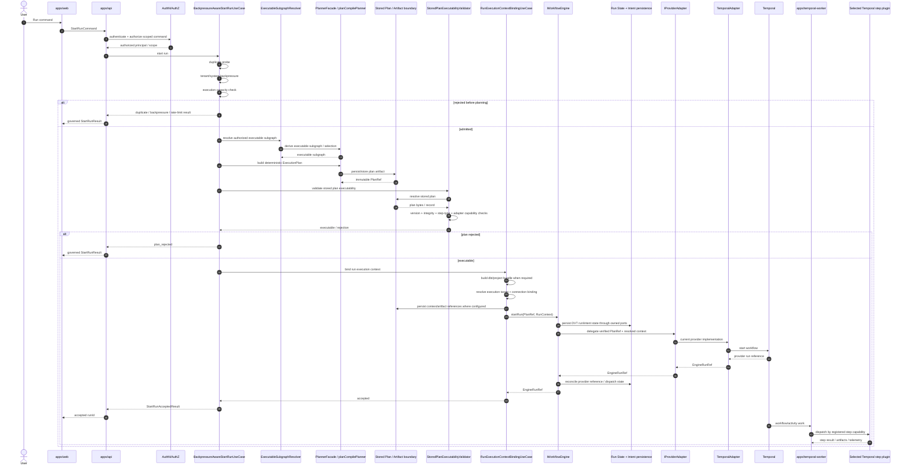

# DVT Start Run Runtime Sequence

This page describes the current `StartRun` command rail at
`main@da5b97b4376789cc561d54fcdf6663c062727ece` from API admission through
planning, stored-plan validation, execution-context binding, Engine dispatch and
provider execution.

It is a derived runtime view. The executable code and canonical Engine
`StartRun` protocol remain authoritative.

## Current command boundary

The public command vocabulary is `StartRunCommand` from
`StartRunBoundary.v1.ts`.

At this baseline the supported start-run adapter set is deliberately narrow:

```text
SUPPORTED_START_RUN_TARGET_ADAPTERS = [temporal]
```

A broader provider vocabulary elsewhere in the repository is not evidence that
another provider is currently supported for start-run.

## End-to-end sequence



The Engine portion above intentionally summarizes its internal start protocol.
The exact write ordering, crash-consistency intent protocol and compensation
rules are owned by the Engine start-run implementation and its canonical
contract documentation.

## API-side composition

`apps/api/src/modules/startRun/buildProtectedStartRunRuntime.ts` composes the
StartRun rail from explicit responsibilities rather than one monolithic service.

The main chain is:

```text
BackpressureAwareStartRunUseCase
  -> PlannerBackedStartRunUseCase
     -> ResolveAuthorizedExecutableSubgraphService
     -> planCompilePlanner
     -> PlanStore
     -> StoredPlanExecutabilityValidator
     -> RunExecutionContextBindingUseCase
        -> EngineStartRunUseCase
           -> IWorkflowEngine.startRun(...)
```

This layering matters because rejection can happen before provider dispatch.

## Admission before expensive execution

The command rail can reject or short-circuit before provider execution for
conditions including:

- duplicate run/intent;
- tenant backpressure;
- system backpressure;
- execution-capacity exhaustion/unavailability;
- outbox rate limiting;
- plan rejection.

These results are represented explicitly by `StartRunResult`; they are not
provider failures masquerading as one generic error.

## Planning phase

When the caller supplies graph/selection inputs, the runtime resolves the
authorized executable subgraph and uses the Planner to build the execution plan.

Planner responsibilities stop at deterministic execution decisions. The Planner
does not call Temporal and does not own run lifecycle persistence.

## Stored-plan boundary

The plan crosses an artifact boundary before execution.

Important properties:

- runtime execution uses a `PlanRef`, not an unverified mutable object;
- the plan is materialized/read back through the stored-plan boundary;
- executability validation checks current supported adapter/capability truth;
- plan integrity remains an Engine/runtime concern and cannot be delegated to
  Temporal as canonical authority.

## Execution-context binding

Before dispatch, the API runtime can bind external execution context required by
the concrete workload. Current DBT-oriented paths include project bundle,
execution target and connection/credential binding concerns.

These details remain outside the generic `IWorkflowEngine` contract.

The result is a `RunContext`/execution-context reference consumed by the Engine
and downstream runtime.

## Engine and provider boundary

The critical separation is:

```text
IWorkflowEngine
  -> IProviderAdapter
     -> TemporalAdapter
        -> Temporal
```

`TemporalAdapter` does not implement `IWorkflowEngine`.

The Engine owns the product lifecycle seam; the provider adapter translates and
delegates provider-specific operations.

## Provider-side execution

At this baseline Temporal is the only supported start-run target.

The Temporal worker executes provider-side activities and composes concrete step
plugins. Current execution plugin packages include:

- `@dvt/temporal-dbt-plugin`;
- `@dvt/temporal-http-json-plugin`;
- `@dvt/temporal-object-file-postgres-plugin`.

This keeps workload-specific semantics out of the generic Temporal adapter.

## State after dispatch

Canonical DVT status is not obtained by treating Temporal as the system of
record.

The state rule is:

```text
ordered persisted RunEvents
  -> Run Domain transition/folding rules
  -> derived WorkflowSnapshot/read model
  -> canonical API status
```

Provider-native status remains a separate diagnostic/enrichment view.

## Failure boundaries

| Failure point | Owning boundary | Expected behavior |
| --- | --- | --- |
| Authentication/authorization | API security | Reject before application command execution |
| Duplicate/backpressure/capacity | Admission | Return typed non-provider `StartRunResult` |
| Graph/selection invalid | Authoring/planning | Fail before provider dispatch |
| Plan invalid/incompatible | Plan verification | `plan_rejected`; do not start provider workflow |
| Context/connection invalid | Execution-context binding | Fail before Engine/provider dispatch |
| Engine intent/state write failure | Engine/State | Do not silently treat provider as canonical success |
| Provider start failure | Provider adapter | Surface failure and preserve Engine consistency protocol |
| Crash around provider dispatch | Engine intent/reconciliation | Reconcile via persisted intent and provider lookup semantics |
| Worker/plugin execution failure | Provider-side runtime | Emit lifecycle evidence; canonical status follows persisted DVT events |

## Sources

- [`packages/@dvt/contracts/src/contracts/engine/StartRunBoundary.v1.ts`](../../../../packages/@dvt/contracts/src/contracts/engine/StartRunBoundary.v1.ts)
- [`apps/api/src/modules/startRun/buildProtectedStartRunRuntime.ts`](../../../../apps/api/src/modules/startRun/buildProtectedStartRunRuntime.ts)
- [`apps/api/src/modules/protectedRuntime/buildProtectedExecutionRuntime.ts`](../../../../apps/api/src/modules/protectedRuntime/buildProtectedExecutionRuntime.ts)
- [`packages/@dvt/engine/src/ports/IWorkflowEngine.ts`](../../../../packages/@dvt/engine/src/ports/IWorkflowEngine.ts)
- [`packages/@dvt/engine/src/adapters/IProviderAdapter.ts`](../../../../packages/@dvt/engine/src/adapters/IProviderAdapter.ts)
- [`packages/@dvt/engine/src/core/WorkflowEngine.ts`](../../../../packages/@dvt/engine/src/core/WorkflowEngine.ts)
- [`packages/@dvt/adapter-temporal/src/TemporalAdapter.ts`](../../../../packages/@dvt/adapter-temporal/src/TemporalAdapter.ts)
- [`packages/@dvt/temporal-dbt-plugin/src/index.ts`](../../../../packages/@dvt/temporal-dbt-plugin/src/index.ts)
