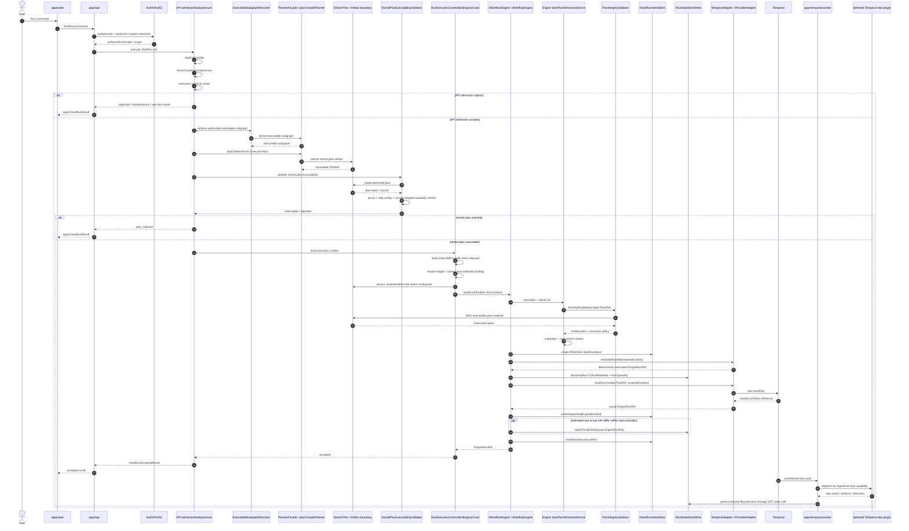

# DVT Start Run Runtime Sequence

This page describes the current `StartRun` command rail at
`main@da5b97b4376789cc561d54fcdf6663c062727ece` from API admission through
planning, stored-plan validation, execution-context binding, Engine admission,
crash-consistent provider dispatch and provider execution.

It is a derived runtime view. The executable code and normative
[`StartRun Protocol`](../../components/engine/contracts/engine/StartRunProtocol.v1.md)
remain authoritative.

## Current command boundary

The public API-to-runtime command vocabulary is `StartRunCommand` from
`StartRunBoundary.v1.ts`.

At this baseline the supported start-run adapter set is deliberately narrow:

```text
SUPPORTED_START_RUN_TARGET_ADAPTERS = [temporal]
```

A broader provider vocabulary elsewhere in the repository is not evidence that
another provider is currently supported for start-run.

## Two admission layers are intentional

The source-first audit confirms that StartRun has two different gates before a
provider side effect:

1. **API orchestration gate**: duplicate/backpressure/capacity handling,
   executable-subgraph resolution, planning, stored-plan executability and
   execution-context binding.
2. **Engine admission gate**: tenant/PlanRef/schema/version/run-id checks,
   provider lookup, scoped plan-integrity verification, execution-policy
   capabilities and run-execution-context admission.

The API gate does not replace the Engine's integrity/semantic ownership.

## End-to-end current Temporal path

`TemporalAdapter` implements `estimateRunRef()`. Therefore the **current Temporal
path uses the estimated-ref branch** in `StartRunExecutionService`: DVT bootstraps
run metadata + `RunQueued` before the provider workflow is started.



The last worker-to-state arrow is a subsystem-level responsibility handoff, not a
claim that every plugin directly imports one state-store implementation.

## API-side composition

`apps/api/src/modules/startRun/buildProtectedStartRunRuntime.ts` composes the
outer StartRun rail from explicit responsibilities rather than one monolithic
service.

The main chain is:

```text
BackpressureAwareStartRunUseCase
  -> PlannerBackedStartRunUseCase
     -> ResolveAuthorizedExecutableSubgraphService
     -> planCompilePlanner
     -> PlanStore
     -> StoredPlanExecutabilityValidator
     -> RunExecutionContextBindingUseCase
        -> EngineStartRunUseCase
           -> IWorkflowEngine.startRun(...)
```

This layering matters because rejection can happen before entering the Engine and
well before provider dispatch.

## API admission before Engine dispatch

The API command rail can reject or short-circuit for conditions including:

- duplicate run/intent;
- tenant backpressure;
- system backpressure;
- execution-capacity exhaustion/unavailability;
- outbox rate limiting;
- stored-plan executability rejection.

These results are represented explicitly by `StartRunResult`; they are not
provider failures masquerading as one generic error.

## Planning and stored-plan boundary

When graph/selection input is present, the API runtime resolves the authorized
executable subgraph and uses the Planner to build a deterministic
`ExecutionPlan`.

The plan then crosses the artifact/store boundary and is materialized for
executability validation. `@dvt/plan-verifier` is used by the stored-plan parser
to validate plan/step configuration, while API runtime validation also checks
current adapter/capability truth.

Planner responsibilities stop at execution decisions. The Planner does not call
Temporal and does not own run lifecycle persistence.

## Execution-context binding

Before Engine dispatch, the API runtime binds external execution context required
by the workload. Current DBT-oriented paths include project bundle, target,
connection and credential-binding concerns.

These details remain outside the generic `IWorkflowEngine` contract. The Engine
receives a `PlanRef` plus `RunContext`/execution-context reference rather than
DBT-specific runtime internals.

## Engine admission is a second, owned gate

Inside `IWorkflowEngine.startRun(...)`, the Engine does not trust the outer API
gate as a substitute for its own invariants.

The Engine start protocol currently performs, among other checks:

- PlanRef and RunContext normalization;
- tenant and run-id validation;
- plan schema/version policy;
- provider resolution;
- scoped plan artifact fetch + integrity verification;
- execution-policy capability checks;
- `runExecutionContextRef` alignment/compatibility checks.

This phase rejects before provider side effects.

## Crash-consistency intent protocol

After Engine admission succeeds, `StartRunApplicationService` creates a
deterministic `PENDING` StartRun intent before provider dispatch.

The intent is the crash-consistency rail for the non-transactional boundary
between DVT persistence and provider startup.

The current order is therefore:

```text
Engine admission + integrity
  -> create PENDING intent
  -> provider-specific start protocol
```

## Current Temporal branch: bootstrap before provider start

Because `TemporalAdapter.estimateRunRef()` exists, the current Temporal path is:

```text
estimateRunRef
  -> bootstrapRunTx(RunMetadata + RunQueued)
  -> TemporalAdapter.startRun
  -> mark intent DISPATCHED
  -> reconcile provider ref if required
  -> resolve intent best-effort
```

`bootstrapRunTx` persists the first lifecycle fact as **`RunQueued`**. It does not
bootstrap a synthetic `RunStarted`; provider/runtime execution owns realized
lifecycle facts once work actually starts.

If a future provider does not implement `estimateRunRef()`, the fallback branch
is different:

```text
adapter.startRun
  -> mark intent DISPATCHED
  -> bootstrapRunTx(RunMetadata + RunQueued)
  -> compensate with adapter.cancelRun if bootstrap fails
```

That fallback is part of the generic Engine protocol but is **not** the current
Temporal ordering.

## Engine and provider boundary

The critical separation is:

```text
IWorkflowEngine
  -> IProviderAdapter
     -> TemporalAdapter
        -> Temporal
```

`TemporalAdapter` implements `IProviderAdapter`, not `IWorkflowEngine`.

The Engine owns product lifecycle/admission/crash-consistency semantics; the
provider adapter translates and delegates provider-specific operations.

## Provider-side execution

At this baseline Temporal is the only supported start-run target.

The Temporal worker executes provider-side activities and composes concrete step
plugins. Current execution plugin packages include:

- `@dvt/temporal-dbt-plugin`;
- `@dvt/temporal-http-json-plugin`;
- `@dvt/temporal-object-file-postgres-plugin`.

This keeps workload-specific semantics out of the generic Temporal adapter.

## Canonical state after dispatch

Canonical DVT status is not obtained by treating Temporal as the system of
record.

The lifecycle rule is:

```text
provider/runtime realizes lifecycle fact
  -> ordered persisted DVT RunEvent
  -> Run Domain transition/folding rules
  -> derived WorkflowSnapshot/read model
  -> canonical API status
```

Provider-native status remains a separate diagnostic/enrichment view.

## Failure boundaries

| Failure point                                      | Owning boundary                  | Expected behavior                                                            |
| -------------------------------------------------- | -------------------------------- | ---------------------------------------------------------------------------- |
| Authentication/authorization                       | API security                     | Reject before application command execution                                  |
| Duplicate/backpressure/capacity                    | API admission                    | Return typed non-provider `StartRunResult`                                   |
| Graph/selection invalid                            | Authoring/planning               | Fail before Engine/provider dispatch                                         |
| Stored plan invalid/incompatible                   | API executability gate           | `plan_rejected`; do not enter provider path                                  |
| Context/connection invalid                         | Execution-context binding        | Fail before Engine/provider dispatch                                         |
| Engine PlanRef/integrity/capability invalid        | Engine admission                 | Reject before provider side effect                                           |
| PENDING intent persistence fails                   | Engine intent rail               | No provider dispatch                                                         |
| Estimated-branch bootstrap fails                   | Engine/State                     | No provider workflow has started yet                                         |
| Provider start fails after estimated bootstrap     | Provider + Engine failure policy | Preserve persisted metadata/failure semantics; do not fabricate success      |
| `markDispatched` fails after provider start        | Engine intent rail               | Raise post-start persistence error; reconciliation remains possible          |
| Estimated/actual provider ref reconciliation fails | Engine/Provider                  | Best-effort provider cancel + intent resolution; rethrow                     |
| Fallback bootstrap fails after provider start      | Engine/Provider                  | Best-effort `cancelRun` compensation                                         |
| Crash around provider dispatch                     | Engine intent/reconciliation     | Reconcile persisted intent with provider lookup semantics                    |
| Worker/plugin execution failure                    | Provider-side runtime            | Emit realized lifecycle facts; canonical status follows persisted DVT events |

## Independent audit note

The audit compared this view against source plus the normative Engine protocol.
Where older diagram text differs from current `StartRunExecutionService`, this
page follows executable source and `StartRunProtocol.v1.md`. In particular, the
current bootstrap event is `RunQueued`, and the Temporal estimated-ref path
bootstraps before `adapter.startRun()`.

## Sources

- [`packages/@dvt/contracts/src/contracts/engine/StartRunBoundary.v1.ts`](../../../../packages/@dvt/contracts/src/contracts/engine/StartRunBoundary.v1.ts)
- [`apps/api/src/modules/startRun/buildProtectedStartRunRuntime.ts`](../../../../apps/api/src/modules/startRun/buildProtectedStartRunRuntime.ts)
- [`apps/api/src/application/services/storedExecutablePlan.ts`](../../../../apps/api/src/application/services/storedExecutablePlan.ts)
- [`apps/api/src/modules/protectedRuntime/buildProtectedExecutionRuntime.ts`](../../../../apps/api/src/modules/protectedRuntime/buildProtectedExecutionRuntime.ts)
- [`packages/@dvt/engine/src/core/WorkflowEngine.ts`](../../../../packages/@dvt/engine/src/core/WorkflowEngine.ts)
- [`packages/@dvt/engine/src/application/StartRunApplicationService.ts`](../../../../packages/@dvt/engine/src/application/StartRunApplicationService.ts)
- [`packages/@dvt/engine/src/services/startRun/StartRunExecutionService.ts`](../../../../packages/@dvt/engine/src/services/startRun/StartRunExecutionService.ts)
- [`packages/@dvt/engine/src/ports/IWorkflowEngine.ts`](../../../../packages/@dvt/engine/src/ports/IWorkflowEngine.ts)
- [`packages/@dvt/engine/src/adapters/IProviderAdapter.ts`](../../../../packages/@dvt/engine/src/adapters/IProviderAdapter.ts)
- [`packages/@dvt/adapter-temporal/src/TemporalAdapter.ts`](../../../../packages/@dvt/adapter-temporal/src/TemporalAdapter.ts)
- [`docs/architecture/components/engine/contracts/engine/StartRunProtocol.v1.md`](../../components/engine/contracts/engine/StartRunProtocol.v1.md)
- [`docs/architecture/system/subsystems/canonical-run-lifecycle/index.md`](../subsystems/canonical-run-lifecycle/index.md)
