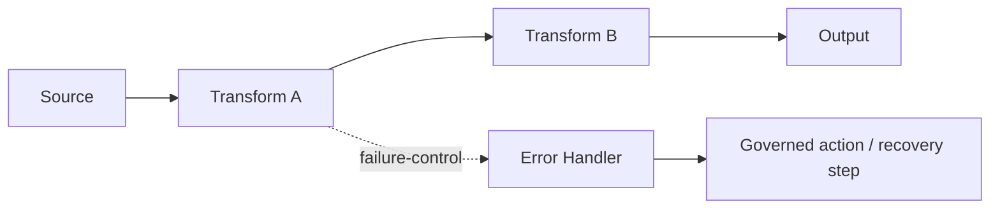
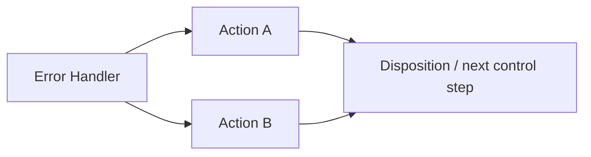
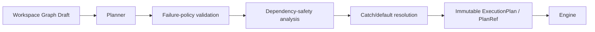
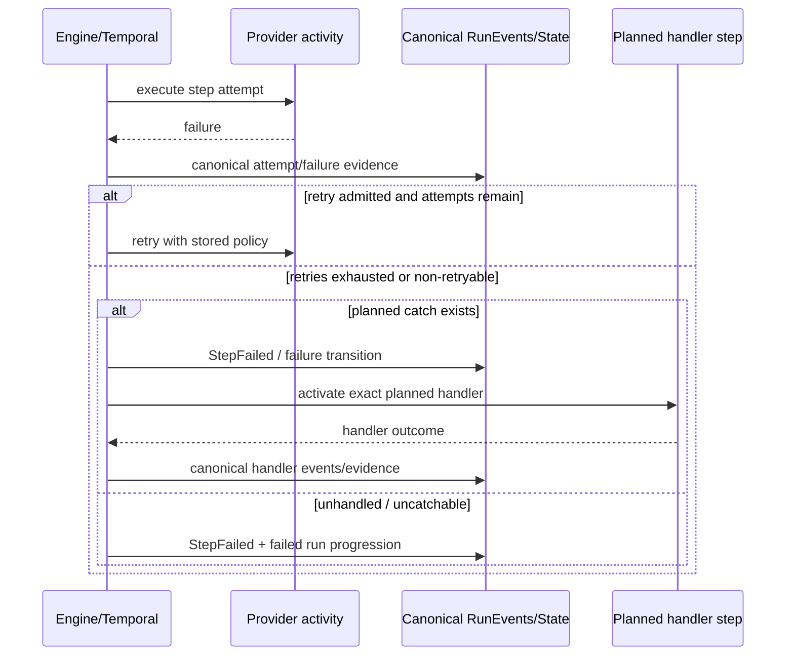
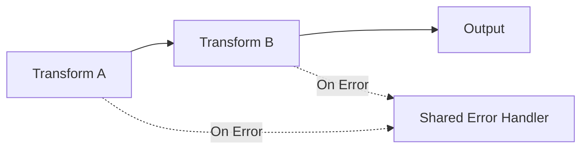
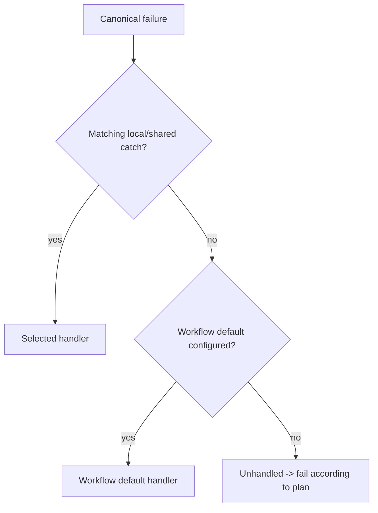

# Workflow Failure Handling And Recovery

## 1. Purpose and authority

This document is the durable architecture and product manual for DVT workflow failure
handling, `On Error` authoring, retry/catch semantics, failure-control routes and handler
execution.

It exists so Web, Planner, Engine, Temporal, State and future action providers can evolve
one feature without recreating policy in each layer.

The implementation programme is tracked in GitHub:

- epic: [#3157](https://github.com/dunay2/dvt/issues/3157);
- authority/contract freeze: [#3158](https://github.com/dunay2/dvt/issues/3158);
- Graph Draft persistence: [#3159](https://github.com/dunay2/dvt/issues/3159);
- Planner lowering: [#3160](https://github.com/dunay2/dvt/issues/3160);
- Engine/Temporal/runtime state: [#3161](https://github.com/dunay2/dvt/issues/3161);
- Canvas UX: [#3162](https://github.com/dunay2/dvt/issues/3162);
- end-to-end acceptance: [#3163](https://github.com/dunay2/dvt/issues/3163).

GitHub Issues remain the task/status authority. This document owns architecture and product
semantics only.

### Current evidence baseline

Source-first study baseline:

`main@1073801b5a7fbf24b7aaeb8789eab72e8f425ad2`

The repository governance-required Planning DB `architecture-designs` read was attempted
before this design work, but the tool was unavailable in the current session. Therefore:

- repository source/contracts/tests are used for current-state facts below;
- exact Planning DB component/rail identities remain **INSUFFICIENT_EVIDENCE** in this
  revision;
- no Planning DB import/rebuild is authorized as a workaround;
- this document remains `Proposed` and production contract changes in ERR1.1 remain
  blocked until the read-only Planning DB consultation is recorded.

## 2. Non-negotiable DVT invariant

Failure handling must preserve the same architectural separation as normal execution:

> **La UI no ejecuta; el engine no decide; el planner no persiste.**

Translated into this feature:

```text
Canvas declares failure-handling intent
        ↓
Workspace Graph Draft persists authoring truth
        ↓
Planner validates and lowers that intent deterministically
        ↓
immutable ExecutionPlan / PlanRef owns executable policy
        ↓
Engine + Temporal execute the stored policy mechanically
        ↓
provider/runtime emits canonical step outcome
        ↓
RunEvents / State remain runtime truth
```

The Engine must never inspect Canvas state to decide what to do after a failure. The Web
must never infer whether a downstream step is safe to continue. The Planner must never
persist runtime state.

## 3. Current source truth that ERR1 extends

ERR1 is not a greenfield error subsystem. The current repository already contains the
foundations that must remain authoritative.

### 3.1 ExecutionPlan already owns per-step retry

`packages/@dvt/contracts/src/contracts/planner/ExecutionPlan.v1.ts` declares:

```ts
export interface ExecutionStepRetryPolicyV1 {
  maxAttempts: number;
  initialInterval: `${number}s`;
  maximumInterval: `${number}s`;
  backoffCoefficient: number;
}

export interface ExecutionStepV1 {
  stepId: string;
  kind: StepKind;
  dependsOn: readonly string[];
  retryPolicy?: ExecutionStepRetryPolicyV1;
  // ...
}
```

The contract explicitly states that `maxAttempts` includes the first execution. ERR1 must
reuse this policy; adding `retryCount`, `retries`, or a Web-only retry object would create
split authority.

`packages/@dvt/adapter-temporal/src/workflows/runPlanWorkflow.activities.ts` resolves the
step activity retry policy from the canonical step. The current Temporal engine policy
manual further states that top-level `step.retryPolicy` is the runtime retry authority and
legacy retry metadata under `stepTypeConfig` is not consumed for activity retry.

### 3.2 Runtime already has one canonical failure event

`packages/@dvt/contracts/src/schema-packs/run-events.ts` already defines:

- `StepFailed` with optional stable `reason` and safe `message`;
- run/tenant/project/environment/plan identity;
- `engineAttemptId` and `logicalAttemptId`;
- `StepCompleted` with `resultEvidence`;
- `StepSnapshot.error { code, message, retryable }`.

`packages/@dvt/adapter-temporal/src/workflows/runPlanWorkflow.layerResults.ts` already emits
`StepFailed` through the canonical event activity when a step layer fails.

`packages/@dvt/engine/src/core/idempotency.ts` already treats `StepStarted`,
`StepCompleted`, `StepFailed` and `StepSkipped` as step event types for idempotency
purposes.

ERR1 therefore does **not** create `ErrorEvent`, `ErrorRun`, `ErrorHistory` or an error-only
state store.

### 3.3 Workspace Graph Draft already owns editable graph semantics

`packages/@dvt/contracts/src/contracts/planner/WorkspaceGraphAuthoringDraft.v1.ts` defines
one graph-first editable aggregate with semantic nodes and semantic edges. Both nodes and
edges already have bounded extension seams through `metadata`.

The contract comment is important: the Graph Draft owns visible/semantic graph authoring,
not runtime execution eligibility.

That means `On Error` authoring may be represented in this aggregate, but executable
recovery policy is not decided by the aggregate itself.

### 3.4 `executionGate` proves the correct pattern for control semantics

`packages/@dvt/contracts/src/contracts/planner/WorkspaceGraphAuthoringEdgeExecution.v1.ts`
already owns a typed, pure execution-control semantic over Graph Draft edge metadata.

The existing FLOW1 implementation demonstrates the desired pattern:

```text
existing Graph Draft metadata
    + one bounded typed semantic helper
    + existing Canvas draft/session/command rail
    + existing protected executable-subgraph projection
    = no second graph and no second store
```

The ERR1 representation should follow this principle. It must not reuse `executionGate`
itself for a different meaning, and it must not overload `executionDependency` to mean
failure routing.

### 3.5 Planner remains pure and deterministic

`packages/@dvt/planner/src/domain/Planner.ts` exposes the domain `buildPlan()` operation;
public callers enter through `PlannerFacade`. Current planner documentation states that
Planner build is deterministic and does not own runtime persistence.

The failure model must therefore be fully determined before the immutable plan leaves the
Planner.

## 4. Product mental model

A user sees a normal data flow most of the time:

```text
Source → Transform A → Transform B → Output
```

Failure handling adds a **control layer**, not another data pipeline:



The normal Canvas should not permanently display every possible failure route. The user
can see/configure failure semantics contextually, and an explicit `Error paths` view can
reveal the control layer when needed.

## 5. Core product decisions

### 5.1 `On Error` is a policy surface, not an action script

Each eligible node/workload may expose a contextual `On Error` section. It describes the
intent that planning must later validate and lower.

Expected concepts are:

```text
Retry
  max attempts
  initial interval
  maximum interval
  backoff coefficient

Catch
  admitted failure classes/codes
  selected local/shared handler or workflow default

Disposition
  fail run
  stop affected branch
  handled-and-continue when dependency-safe
```

Timeout is displayed/configured here only when the owning executable contract actually
supports a per-step timeout. Current Temporal documentation explicitly notes that there is
not yet a generic per-step timeout override matrix. ERR1 must not fabricate one in Web.

### 5.2 Retry precedes catch

The deterministic order is:

```text
failure
  ↓
classify canonical failure
  ↓
retryable AND attempts remain?
  ├─ yes → retry using ExecutionPlan retryPolicy
  └─ no  → evaluate planned catch
                ↓
           planned handler?
             ├─ yes → activate handler
             └─ no  → unhandled failure
```

A policy may classify a failure as non-retryable. In that case catch/unhandled handling is
reached immediately.

A catch does not silently reset attempt counters or invent an additional retry policy.

### 5.3 Error output is contextual

The card does not carry a permanent red output in the default Canvas.

The failure-control port/path is shown when one of these is true:

1. the node has a configured failure route;
2. the user activates `View -> Error paths`;
3. the current contextual editing operation requires selecting a handler.

The visual language must work without color alone. A warning/error-route glyph, line style,
label and accessible name are required in addition to color.

### 5.4 Error Handler is a control-entry boundary

An Error Handler represents the entry point for a typed failure context.

It is **not** a card with vendor-specific checkboxes such as:

```text
[x] send email
[x] send SMS
[x] write database row
```

Instead, handler output can compose with normal governed action/control steps:



Email, SMS, Slack/Teams, webhook, ticketing or database-error-log nodes are independent
capabilities unless the repository already owns those executable operations. ERR1 must not
stub them simply to make a demo green.

### 5.5 Three handler scopes

DVT supports three authoring intents:

#### Local

A specific producer owns a route to a specific handler.

```text
Transform A --failure--> Handler A
```

#### Shared

Multiple producers may route to one reusable handler.

```text
Transform A --failure--┐
Transform B --failure--┼--> Shared Handler
Load C      --failure--┘
```

The handler is shared; the source failure context remains distinct.

#### Workflow default

A workflow/canvas may nominate one default handler for catchable failures that have no
matching local/shared route.

Resolution is deterministic:

```text
matching local/shared route
  else workflow default
  else unhandled failure
```

The exact persisted field location for the workflow default remains an ERR1.1 contract
choice pending Planning DB authority confirmation. It must live in the existing owning
aggregate, not a browser preference.

## 6. Failure taxonomy

Routing on raw exception messages is forbidden. Provider messages are diagnostics, not
stable product policy.

The target taxonomy needs stable code/category plus orthogonal posture flags. The exact
enum names remain provisional until ERR1.1 completes Planning DB/contract review, but the
semantic classes are frozen:

| Semantic class | Typical examples | Default posture |
| --- | --- | --- |
| technical/transient | network interruption, temporary provider unavailability | often retryable/catchable |
| execution/provider | SQL/provider execution failure, permission/constraint/resource failure | typed, catchability depends on code |
| data/validation | malformed input, quality/check failure, admitted data rule failure | usually non-transient; may be catchable |
| control | timeout, cancellation, dependency failure | explicit control semantics; never generic provider prose |
| integrity/security/identity | plan hash mismatch, tenant/scope mismatch, corrupted artifact, semantic/projection identity mismatch | fail closed; user catch may be prohibited |

### Catchability and retryability are not the same property

A failure can be:

```text
retryable + catchable
non-retryable + catchable
non-retryable + uncatchable
```

`retryable` answers whether another attempt is allowed. `catchable` answers whether a
user-authored handler may receive the failure after retry policy is exhausted/bypassed.

Unknown failure classifications must fail closed; they cannot be treated as `catch all`
merely because the UI selected `Any error`.

## 7. Fail-closed failures

Certain failures protect system correctness and therefore must not be suppressible by a
user-authored `Continue` policy.

Candidate protected classes include:

- immutable PlanRef/plan integrity failure;
- tenant/project/environment scope mismatch;
- corrupted or unverified executable artifact;
- semantic/projection/workload identity mismatch;
- unsupported contract/schema version where execution correctness cannot be proven;
- authorization/security boundary failure.

The final list belongs to canonical contracts and provider/runtime admission policy, not to
Web copy.

UI may explain that a failure class is not catchable, but cannot override it.

## 8. Target failure envelope

Handler steps need structured context. They should not receive only a string such as
`SQL execution failed`.

The target model is a bounded, sanitized value equivalent to:

```ts
interface WorkflowFailureEnvelope {
  failureId: string;            // deterministic/idempotent failure transition identity
  runId: string;
  stepId: string;
  logicalAttemptId: number;
  engineAttemptId?: number;

  failure: {
    code: string;               // bounded canonical code
    category: string;           // bounded canonical category
    retryable: boolean;
    catchable: boolean;
    safeMessage?: string;
  };

  source: {
    workloadId?: string;
    authoringNodeId?: string;
  };

  refs?: {
    planRef?: string;
    semanticRef?: string;
    projectionRef?: string;
    artifactRefs?: readonly string[];
    providerDiagnosticRef?: string;
  };

  timing?: {
    startedAt?: string;
    failedAt: string;
    durationMs?: number;
  };
}
```

This is a **target responsibility shape**, not yet a committed public contract or exact
field naming. ERR1.1 must first reconcile existing identity/ref types and Planning DB
ownership to avoid duplicating `PlanRef`, artifact refs or run event identity.

### Envelope security rules

The envelope must not contain, by default:

- connection strings;
- credentials/tokens;
- complete arbitrary provider exceptions;
- unrestricted SQL/text payloads;
- arbitrary input/output data rows;
- raw HTTP authorization headers;
- secrets embedded in provider-specific diagnostic objects.

If detailed diagnostics are retained, prefer a governed bounded diagnostic/artifact
reference rather than copying the payload into every event/handler.

## 9. Persisted authoring model

### 9.1 One Graph Draft authority

Failure handling must extend the existing Workspace Graph Draft, following the same
reduction principle as `executionGate`.

Conceptually the persisted model must capture:

```text
producer failure policy intent
failure-control target identity
workflow-default target identity (if configured)
post-handler disposition intent
```

The exact representation may use bounded node metadata, edge metadata and/or a typed pure
semantic module, but it must satisfy all of these conditions:

- one persisted Graph Draft aggregate;
- one CAS/revision flow;
- one semantic signature path;
- no second list of React-only error edges;
- no error-route store;
- no new persistence table merely for ERR1;
- same reload/conflict rules as other semantic authoring.

### 9.2 Failure-control relation is not a data edge

A failure route must never make a handler appear to consume the failed node's normal data
output.

The design must preserve this distinction:

```text
data dependency: B needs A's successful output
failure-control relation: H may activate because A failed
```

Using the same visual Canvas does not make the semantics equivalent.

### 9.3 Deletion and reconnect rules

No orphan failure route is allowed.

If a producer or handler is removed, the authoring command must either:

- remove/reconcile owned failure intent atomically according to the accepted aggregate
  rule; or
- reject the destructive operation with a typed reason until the route is resolved.

A reconnect must not silently transfer an `On Error` policy to a semantically different
node merely because React Flow reused a visual edge object.

## 10. Planner lowering model

The Planner is the only layer allowed to convert authoring failure intent into executable
failure behavior.



### Planner responsibilities

The Planner must:

1. resolve local/shared/workflow-default precedence;
2. reject missing targets;
3. reject ambiguous catch matches;
4. reject handler self-reference/cycles in v1;
5. bind the already-owned retry policy to the executable step;
6. mark which canonical failure classes/codes are catchable for that step/profile;
7. freeze handler target identity;
8. freeze post-handler disposition;
9. prove whether continuation is safe from executable dependencies/output requirements;
10. ensure execution-semantic failure changes affect plan identity deterministically.

### Planner non-responsibilities

The Planner does not persist run state, classify a concrete provider exception after the
run starts, or send notifications.

## 11. ExecutionPlan target seam

Current `ExecutionStepV1` has `dependsOn`, `retryPolicy`, step kind/config and optional
gateway semantics but no general catch/failure-route contract.

ERR1.1 must choose the minimum versioned extension. A conceptual example is:

```ts
interface ExecutionStepFailurePolicyV1 {
  catches: readonly {
    match: FailureMatcherV1;
    targetStepId: string;
  }[];
  unhandled: 'fail-run';
  dispositionAfterHandler?: 'fail-run' | 'stop-branch' | 'continue-admitted';
}
```

This example is intentionally not yet normative. Exact shape must be reconciled with:

- plan schema/versioning rules;
- current step/gateway/interpreter shape;
- deterministic canonical-plan hashing;
- existing RunExecutionPolicy vocabulary;
- Planning DB component/rail ownership.

What **is** normative now is the boundary: executable catch/handler/disposition semantics
must be explicit in the immutable plan before runtime.

## 12. Dependency-safe continuation

`Continue on error` is too imprecise for DVT and must not become a global boolean.

Consider:

```text
A → B → C
    X
```

If C requires B's successful output/effect, C cannot execute after B fails simply because
an error handler returned successfully.

Now consider independent branches:

```text
       ┌→ B  (fails)
A ─────┤
       └→ C  (independent)
```

The Planner may admit a disposition that stops B's dependent branch while allowing C to
continue.

Therefore continuation is a **planning property**, not an Engine recovery heuristic.

Allowed v1 semantics should be explicit, for example:

```text
FAIL_RUN
STOP_AFFECTED_BRANCH
CONTINUE_ADMITTED
```

Exact enum names remain contract work in ERR1.1.

## 13. Handler recursion and cycles

V1 deliberately rejects cyclic failure-control topology.

Forbidden examples:

```text
A --failure--> A
```

```text
A --failure--> H1
H1 --failure--> H2
H2 --failure--> H1
```

```text
workflow default handler = H
H failure falls back to the same workflow default H
```

The Planner must fail closed before execution if the canonical failure-control graph would
permit such recursion.

A later product version may add bounded escalation semantics, but that is not required for
ERR1.

## 14. Runtime state machine

Runtime executes only the stored plan.



### Runtime must not

- inspect Graph Draft metadata;
- resolve a handler by name/tag at runtime;
- parse a Web `On Error` form;
- decide that an independent branch can continue;
- invent a default retry policy different from the accepted canonical runtime policy;
- translate arbitrary provider strings into user routing rules without canonical mapping.

## 15. Idempotency and side effects

Failure handling often triggers side-effectful actions. At-least-once runtime conditions
make idempotency mandatory.

The failure transition should have a stable identity derived from existing canonical
identities rather than a random UI UUID. Conceptually it binds at least:

```text
run identity
step identity
logical attempt
canonical failure transition
```

A replay/duplicate delivery for the same transition must not activate the same handler
twice.

Side-effect action steps then own their own idempotency contracts. ERR1 routing cannot
promise exactly-once email/SMS/database effects by merely suppressing duplicate UI events.

## 16. Handler actions and capability boundaries

ERR1 builds failure routing, not every recovery action provider.

Possible future compositions include:

```text
Error Handler -> email notification
Error Handler -> SMS
Error Handler -> Slack/Teams
Error Handler -> HTTP webhook
Error Handler -> database audit row
Error Handler -> ticket
Error Handler -> governed subworkflow
```

Before any such action ships, it needs its own supported StepKind/runtime/provider contract,
security policy, idempotency semantics, tests and command/query ownership.

ERR1 acceptance should use an existing safe executable action if one is available on the
candidate baseline. If none is appropriate, the acceptance task records a real dependency;
it must not introduce a fake handler action or stubbed success.

## 17. UI design

### 17.1 Card / contextual panel

Illustrative structure:

```text
On Error

Retry
  Attempts              3
  Initial interval      10 s
  Maximum interval      60 s
  Backoff               x2

Catch
  [technical/transient]
  [execution/provider]

Handler
  Shared production failure handler

After handler
  Stop affected branch
```

The panel must distinguish:

- local authoring apply;
- persisted draft ACK;
- immutable Preview/PlanRef state;
- runtime outcome.

It must never say or imply `saved/executable` before the existing persistence/planning rail
has acknowledged those states.

### 17.2 Error Paths view



The view is a **projection**. Toggling it changes no Graph Draft, PlanRef or execution
state.

### 17.3 Accessibility

Required posture:

- path state is not conveyed by red color alone;
- keyboard/context actions invoke the same commands as pointer interactions;
- error-route labels have accessible names;
- 200% zoom and forced-colors remain usable;
- reduced motion does not remove semantic state;
- EN/ES copy must express the same executable meaning.

## 18. Workflow default handler

The workflow default exists to avoid wiring every card to the same shared handler.

It is not a catch-all bypass. Only catchable failures that have no higher-precedence match
may use it.



The default is resolved by the Planner and becomes explicit in the immutable plan. Engine
does not search workflow settings after a step fails.

## 19. Interaction with materialization and workload boundaries

ERR1 does not change the current operational-lowering principle:

> A Canvas card or Substrait operator is not automatically an ExecutionPlan step/workload.

A failure route is therefore attached to the executable responsibility that can actually
fail, not blindly to every visual transformation card.

If several logical transforms are consolidated into one operational workload, runtime
failure policy applies to that workload unless a real materialization/publication/control
boundary created separate executable responsibilities.

This is important for honest UX: Web may author intent at a logical node, but Planner must
reject or deterministically map intent when the selected executable shape does not provide
a corresponding independently observable runtime boundary.

## 20. Interaction with execution gates

`executionGate` and `On Error` solve different problems.

```text
executionGate = whether a structural execution route participates
On Error     = what planned control path may activate after an admitted executable step fails
```

Closing a normal edge does not create an error handler. Configuring `On Error` does not
open a structurally non-executable edge.

Neither semantic may override the other through a shared boolean.

## 21. Security and tenant isolation

Failure handling must preserve all normal scope boundaries.

A handler reference cannot cross tenant/project/environment scope unless an explicit future
cross-scope contract is introduced and authorized. The default is same authorized workspace
scope.

Error diagnostics must be sanitized at the owner closest to provider/runtime failure. The
Canvas must never receive secrets merely because it displays an error route.

Fail-closed security/integrity failures must remain uncatchable where catching would allow
execution to continue after authority/integrity loss.

## 22. Observability and evidence

Canonical runtime evidence remains based on the current run-event/result-evidence system.

ERR1 may need to enrich stable failure code/category/evidence references, but it must not
create a parallel observability truth.

An operator should ultimately be able to answer:

```text
which step/workload failed?
which logical/engine attempt?
which canonical failure code/category?
was it retryable?
how many attempts were admitted by the PlanRef?
which handler was planned?
was it invoked?
what did the handler do?
what disposition followed?
which independent/dependent work continued or stopped?
```

Every answer should be reconstructable from immutable plan + canonical run events/evidence,
not from browser memory.

## 23. Alternatives rejected

### Permanent error port on every card

Rejected as default presentation. It creates graph noise and suggests a separate data
output even when no route exists.

### `onError: 'continue'` boolean

Rejected. It hides dependency safety, catch matching, uncatchable failures and branch
semantics.

### Error Handler megacard with built-in email/SMS/DB checkboxes

Rejected. It couples failure routing to unrelated action providers and makes the handler a
vendor framework.

### Engine searches for a handler after failure

Rejected. That makes Engine a policy/planning component and breaks deterministic PlanRef
execution.

### Error-specific state store/event bus

Rejected. `StepFailed` and canonical run state already own runtime truth.

### Use `executionGate` for error routing

Rejected. Gate admission and failure recovery are orthogonal semantics.

### Generic BPMN/saga/compensation language in v1

Rejected as speculative generality. ERR1 solves retry/catch/handler/disposition first.

## 24. Fowler / DDD opportunity matrix

| Scenario | Problem smell | Selected direction | DDD owner | Reuse rule |
| --- | --- | --- | --- | --- |
| UI-only `On Error` | hidden/parallel authority | persist typed authoring intent | Workspace Graph Authoring | existing Graph Draft/CAS rail |
| retry configured in multiple layers | duplicated policy | one plan retry policy | Execution Planning | `ExecutionStepV1.retryPolicy` |
| error message drives routing | primitive obsession | typed canonical failure value | Run domain/contracts | existing StepFailed/state |
| Engine chooses fallback | misplaced domain decision | Planner freezes route/disposition | Planner | immutable ExecutionPlan |
| all nodes show red edges | presentation noise | contextual projection | Web Canvas | existing read-model/projection style |
| handler cycle | implicit recursion | fail-closed DAG invariant | Planner validation | existing plan admission/verifier |
| notification vendor embedded in handler | divergent responsibility | action capability per provider | provider/action owner | normal StepKind/plugin mechanisms |

Exact command/query rail identities are pending Planning DB evidence in ERR1.1.

## 25. Delivery sequence and current status

| Slice | Issue | Status | Outcome |
| --- | --- | --- | --- |
| ERR1.1 | #3158 | IN PROGRESS / DESIGN ONLY | authority, contract seam, manual |
| ERR1.2 | #3159 | BLOCKED | Graph Draft authoring/persistence |
| ERR1.3 | #3160 | BLOCKED | deterministic Planner lowering |
| ERR1.4 | #3161 | BLOCKED | Engine/Temporal/state execution |
| ERR1.5 | #3162 | BLOCKED | Canvas `On Error` + Error Paths UX |
| ERR1.6 | #3163 | BLOCKED | end-to-end acceptance/evidence |

The live status remains GitHub, not this table. This table is a navigation snapshot only.

## 26. Required acceptance examples

### Retry then handler

```text
step attempt 1 -> transient failure
step attempt 2 -> transient failure
step attempt 3 -> failure
stored retry policy exhausted
planned catch -> Handler H
Handler H -> success
planned disposition -> stop affected branch
```

### Non-retryable data failure

```text
step -> canonical non-retryable/catchable data failure
no retry
planned catch -> Data Failure Handler
```

### Fail-closed integrity failure

```text
plan/artifact/tenant identity mismatch
user configured catch-all exists
runtime admission classifies failure as uncatchable
catch-all is not eligible
run fails closed
```

### Independent branch continuation

```text
A -> B -> D
 \-> C

B fails
Handler succeeds
Planner had admitted STOP_AFFECTED_BRANCH
D does not run because B output is missing
C remains independent and may continue
```

### Unsafe continue rejected

```text
A -> B -> C
B output required by C
user requests handled-and-continue to C
Planner rejects plan / authoring cannot become executable
```

### Handler cycle rejected

```text
A failure -> H1
H1 failure -> H2
H2 failure -> H1

Planner rejects before runtime effects
```

## 27. Testing strategy

ERR1 must be proven at the layer that owns each truth.

### Contracts

- schema/type round-trip;
- unknown/malformed failure policy values fail closed;
- plan-version/hash implications;
- typed envelope/failure vocabulary once accepted.

### Web authoring/persistence

- Apply/reload/CAS/conflict;
- local/shared/default references;
- deletion/reconnect behavior;
- no React-only truth;
- accessibility/EN/ES/error-path projection.

### Planner

- deterministic local/shared/default resolution;
- retry reuse;
- cycle/ambiguity/missing-target rejection;
- unsafe continuation rejection;
- identical input -> identical plan/hash.

### Engine/Temporal/state

- retry success/exhaustion;
- non-retryable catch;
- unhandled fail;
- handler activation exactly once per failure transition;
- handler failure;
- cancellation/timeout distinctions;
- StepFailed/evidence idempotency.

### Service-backed / browser

- real authoring -> persistence -> Preview/PlanRef -> runtime -> evidence -> reload;
- no direct state injection;
- no stubbed handler success;
- one currently governed executable action used as first handler consumer, or a real
  capability dependency is recorded instead of faking one.

## 28. Open authority questions blocking production contract edits

These are not product questions; the product direction above is frozen. They are exact
implementation-owner questions that require the missing Planning DB read and current-source
reconciliation:

1. Which current command/query rail identity must own Graph Draft failure-policy mutation?
2. Which Planner rail/component identity owns the new failure-policy lowering/verifier
   surface?
3. Should the workflow-default handler live in canvas document metadata, another existing
   workspace metadata owner, or a bounded node/control relation already recorded in
   Planning DB?
4. Which existing shared-kernel contract is the correct owner for the canonical failure
   category/code/catchability value object?
5. Does extending `ExecutionStepV1` require a plan schema/contract version increment under
   the current versioning authority, or can a strictly optional backward-compatible field
   remain within the current version according to the live governed rule?

Until these questions have current Planning DB evidence, ERR1.1 may advance source study,
manuals, issue planning and test design but must not claim production-contract authority.

## 29. Decision summary

DVT failure handling is one plan-driven control capability:

```text
Author once
Persist once
Plan once
Execute exactly
Observe from canonical state
```

It is **not**:

```text
red arrows in React
+ retry logic in Temporal
+ handler lookup in Engine
+ error strings in a table
+ vendor checkboxes in one card
```

The architectural goal is that a user can understand and author `On Error` visually while
the runtime remains deterministic, provider-neutral, auditable and faithful to one immutable
plan.
