# DVT Architecture Handbook (Archived)

Superseded by:

- [Reference Architecture](../architecture/reference-architecture.md)
- [Architecture Atlas](../architecture/atlas/index.md)
- [ADR Index](../adr/index.md)

## Archive Note

This document was moved out of `docs/planning/execution-model/` during the
2026-03-07 architecture documentation consolidation.

The stable reference material was absorbed into the canonical architecture
space. The remaining content is preserved below as historical context and is no
longer maintained.

## Original Content
# DVT+ Architecture Handbook

**Author:** Architecture Team\
**Date:** 2026-03-06\
**Last updated:** 2026-03-05 — aligned to execution model spec and implemented code\
**Status:** Reference Architecture (Staff / Principal level)

---

# 1. Purpose

This handbook defines the **reference architecture** of the DVT+
platform.

Goals:

- Deterministic workflow execution
- dbt orchestration on Snowflake
- Clean separation of concerns
- Replaceable infrastructure
- Observability and cost transparency
- Multi‑tenant secure operation

The architecture follows principles from:

- Martin Fowler --- _Patterns of Enterprise Application Architecture_
- Eric Evans --- _Domain Driven Design_
- Alistair Cockburn --- _Hexagonal Architecture_
- Sam Newman --- _Building Microservices_

---

# 2. Core Architectural Principles

## Hexagonal Architecture

Domain logic is isolated from infrastructure through **ports and
adapters**.

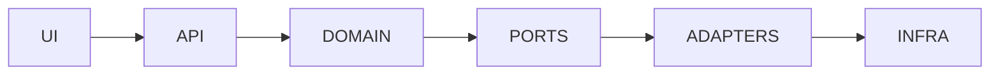

Consequences:

Positive

- testable core
- adapter replaceability
- deterministic logic

Negative

- higher design complexity
- strict contract discipline required

---

# 3. Domain Driven Design

## Bounded Contexts

Context Responsibility Implementation status

---

Planner DAG generation Interface only
Execution run orchestration Implemented
State persistence Implemented
Artifacts dbt metadata Not yet built
UX graph representation Not yet built
Platform observability / security Observability implemented; authz stub only

---

## Domain Entities

Entities:

ExecutionPlan\
Run\
Step\
Artifact _(not yet implemented)_

> **Note:** `Workflow` was removed as a top-level entity. `Run` is the
> effective execution aggregate — it is reconstructed from its ordered
> event log and optional snapshot. `Workflow` is an infrastructure
> concept owned by the Temporal adapter, not a domain entity.

Value Objects:

PlanRef _(uri + sha256 + schemaVersion + planId + planVersion)_\
EngineRunRef\
RunId\
StepId\
RunContext _(tenantId + projectId + environmentId + runId + targetAdapter)_\
SignalRequest\
RunStatusSnapshot\
ArtifactId _(not yet implemented)_

Aggregates:

```text
Run  <- effective execution aggregate
  |- RunMetadata
  |- RunEvent[]  (ordered by runSeq)
  |- WorkflowSnapshot  (optional, derived - never authoritative over events)
```

---

# 4. System Overview

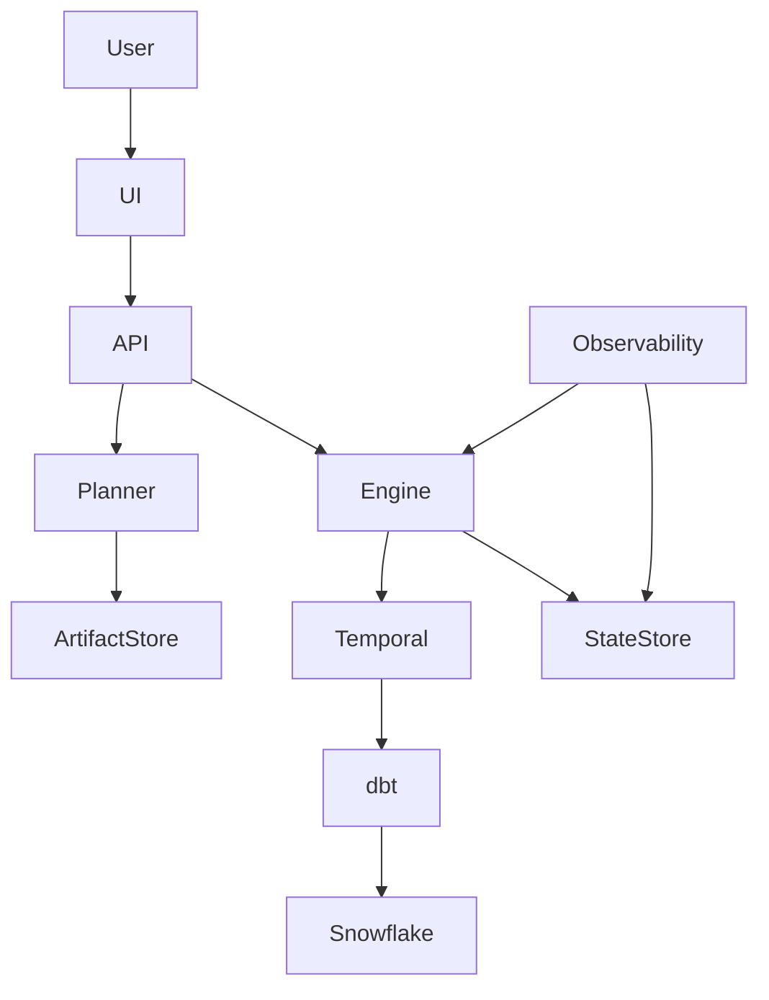

> **Implementation status:** ArtifactStore and the Planner→ArtifactStore
> path are not yet built. All other connections are implemented.

---

# 5. C4 Model

## System Context

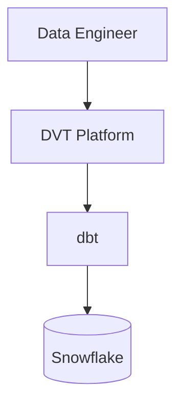

---

## Container Diagram

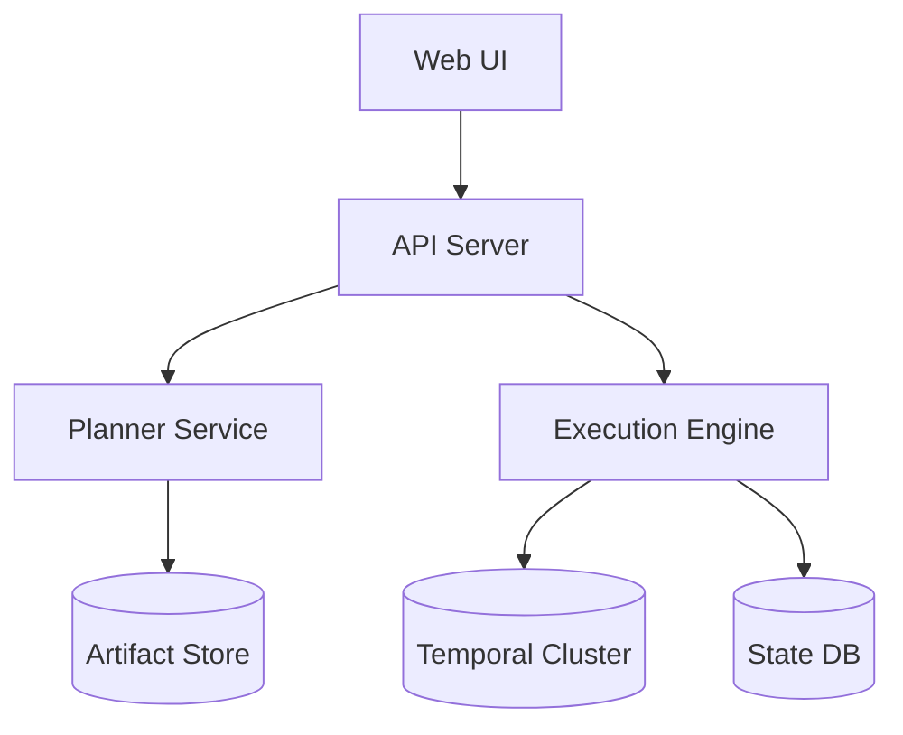

---

## Component Diagram --- Engine

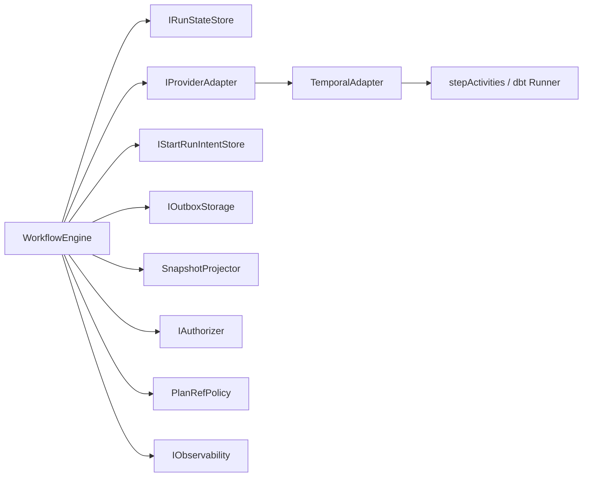

---

# 6. Execution Lifecycle

The engine receives a **PlanRef** (uri + sha256), not the plan bytes.
The adapter is responsible for fetching and verifying the plan (ADR-0012).
Run state is updated asynchronously through the event-sourced state store,
not via a direct callback from Temporal to the engine.

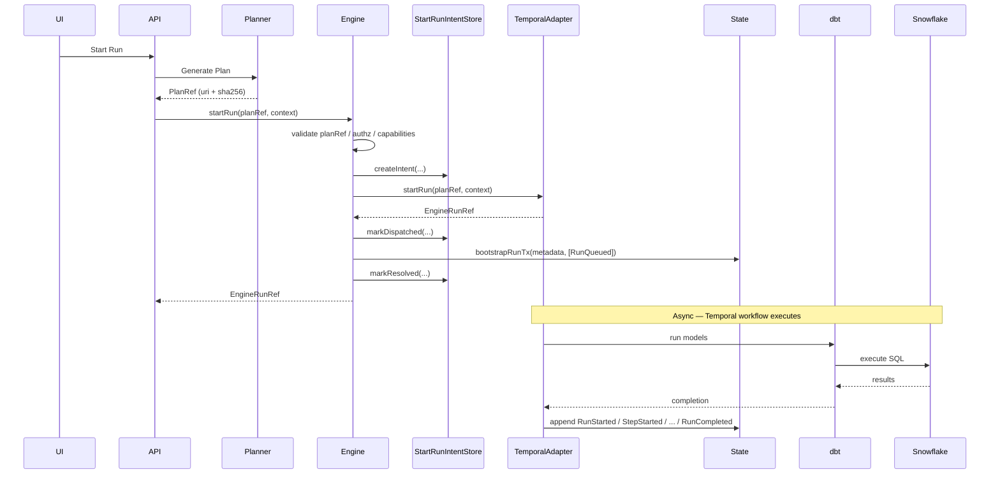

---

# 7. State Model

Run state is event-sourced. Events are immutable once persisted and
ordered by `runSeq` — the only authoritative ordering key per run.

## Run-level events

RunQueued\
RunStarted\
RunCancelRequested _(intent, non-terminal)_\
RunCancelled _(terminal)_\
RunPaused _(non-terminal)_\
RunResumed\
RunCompleted _(terminal)_\
RunFailed _(terminal)_

## Step-level events

StepStarted\
StepCompleted\
StepFailed\
StepSkipped

## State machine

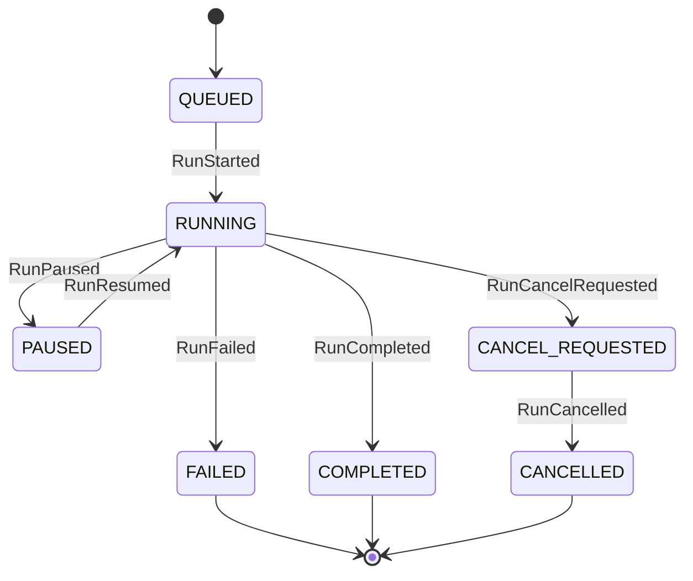

## Event envelope

Every persisted event carries:

`eventId` · `eventType` · `emittedAt` · `tenantId` · `projectId` · `environmentId` · `runId` · `planId` · `planVersion` · `logicalAttemptId` · `engineAttemptId` · `idempotencyKey` · `runSeq` · `persistedAt` · optional `stepId` · optional `payload`

> `runSeq` and `persistedAt` are assigned by the storage authority.
> Callers submit `RunEventInput` (no runSeq / no persistedAt).

Benefits:

- deterministic replay
- audit trail
- debugging capability

---

# 8. Observability Model

Three pillars:

Metrics\
Logs\
Tracing

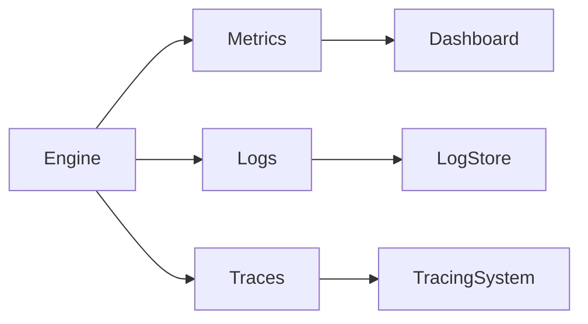

Implementation: `IObservability` port + `OtelObservability` (OpenTelemetry SDK).
A `createNoopObservability()` factory is provided for tests.

Example metrics:

run*duration\
step_duration\
warehouse_cost _(not yet implemented - requires Snowflake query history)_\\
queue_latency _(not yet implemented)_\\

---

# 9. Artifact Ingestion

> **Status: not yet built.** The ExecutionPlan contract and Planner
> interface exist, but the artifact ingestion pipeline is not implemented.

Target pipeline:

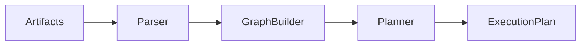

dbt artifacts include:

manifest.json\
run_results.json\
catalog.json

---

# 10. Multi‑Tenant Security

Key principles:

- tenant isolation
- authorization checks
- append‑only audit log

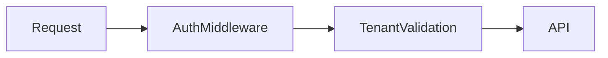

**Implementation status:**

- Storage isolation: implemented — all Postgres queries are scoped by
  `tenantId` (ADR-0031).
- `IAuthorizer` interface: implemented. Only `AllowAllAuthorizer`
  exists; a production OIDC/JWT authorizer is not yet built.
- AuthMiddleware / API layer: not yet built.
- `tenantId` is mandatory on every engine operation boundary.

---

# 11. Testing Strategy

Testing pyramid:

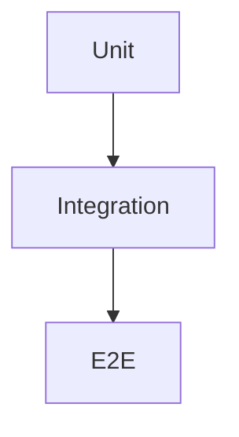

Coverage targets:

Domain 90%\
Adapters 70%\
API 70%

**Implementation status:**

- Domain (engine): ~85–90% — 78+ tests green.
- Adapters (Temporal + Postgres): ~60% — smoke and integration tests.
- API: not yet built.
- E2E: not yet built.
- Replay / determinism certification: planned (Sprint 4).

---

# 12. Failure Handling

Common failure scenarios:

dbt execution error\
warehouse timeout\
network failure\
worker crash

Recovery mechanisms:

retry policies _(Temporal infra retry + OutboxWorker retry)_\
deterministic replay _(event sourcing)_\
run cancellation _(RunCancelRequested intent → RunCancelled terminal)_\
intent reconciliation _(orphaned intents detected via lookupRunRef — ADR-0030)_

---

# 13. Plugin Architecture

> **Status: not yet built.**

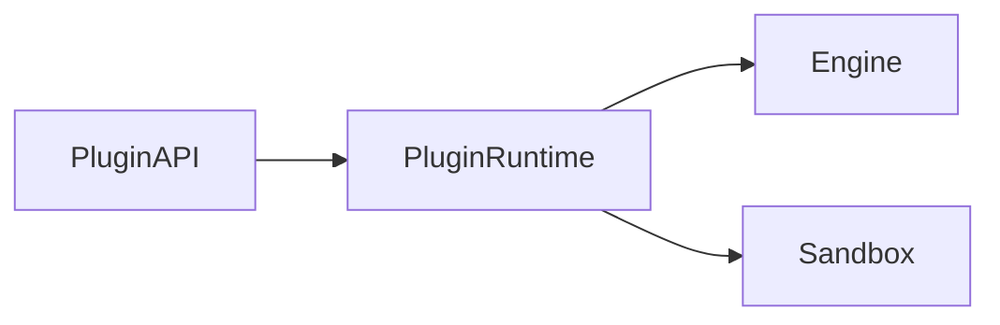

Plugins must:

- run in isolated sandbox
- follow capability contract
- respect tenant security
- operate deny-by-default

---

# 14. Roadmap (High Level)

Sprint 1

Engine stabilization ✅\
State store persistence ✅\
Intent log + crash consistency ✅\
Observability bindings ✅

Sprint 2

Artifact store _(not started)_\
dbt runner + step result mapping _(partial)_

Sprint 3

Lineage UI _(not started)_\
Multi‑tenant security / production authorizer _(not started)_

Sprint 4

Plugin runtime _(not started)_\
Observability completion _(partial)_\
Replay certification suite _(not started)_

---

# 15. Architectural Decision Records

26+ ADRs are maintained under `docs/adr/`. Key decisions:

- ADR-0012 — Engine does not fetch plan bytes; adapter owns fetch + SHA-256
- ADR-0013/0014 — adapter.startRun() called before bootstrapRunTx; runRef included atomically
- ADR-0015 — getRunStatus must not call adapter on default path; enrichRunStatus is opt-in
- ADR-0030 — Pre-dispatch intent log for crash consistency and orphan reconciliation
- ADR-0031 — Storage adapter tenant isolation; all queries scoped by tenantId

ADR template:

```text
ADR-XXXX Title

Status: Proposed | Accepted | Superseded

Context
What problem exists, and why it matters.

Decision
Chosen approach.

Consequences
Positive:
- ...
Negative:
- ...

Alternatives considered
- ...
```

---

# 16. Final Target Architecture


---

# 17. Expected Platform Capabilities

After full implementation:

- workflow orchestration ✅ implemented
- dbt execution ⚠️ partial (step activities exist; result mapping incomplete)
- lineage visualization ❌ not yet built
- artifact inspection ❌ not yet built
- multi‑tenant isolation ⚠️ storage ok; production authz missing
- observability ✅ implemented (OTel)
- cost tracking ❌ not yet built
