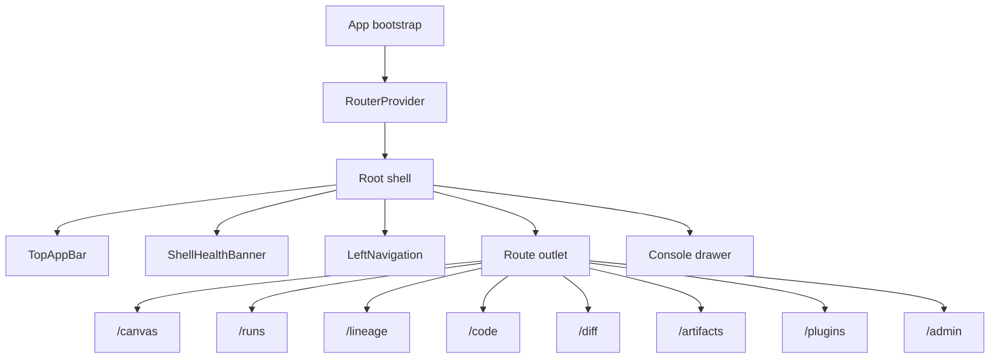

# Frontend subsystem architecture

This pack documents the frontend subsystem as a set of workbench flows,
interaction rules, and supporting UI narratives.

It is not the canonical component home for the frontend workspace. Use
[web component](../../../architecture/components/web/index.md) first when the question is about
`apps/web` itself.

## Use This Page For

1. workbench-wide UX flow and route relationships;
2. interaction rules between Canvas, Runs, Lineage, Code, Diff, and Artifacts;
3. supporting frontend narratives that cut across more than one module.

## Canonical Component Home

- [web component](../../../architecture/components/web/index.md)

## Current Shell Topology

## Reading Order

1. [web component](../../../architecture/components/web/index.md)
2. [Read subsystem](../../../architecture/system/subsystems/read/index.md)
3. [Main Workspace Views And UX](../../../architecture/components/web/main-workspace-views-and-ux.md)
4. [Frontend Data-Boundary Architecture](../../../architecture/components/web/frontend-data-boundary-architecture.md)
5. [Workbench UI Contract And Component Inventory](../../../architecture/components/web/workbench-ui-contract-and-component-inventory.md)
6. [Graph Frontend Architecture](../../../architecture/components/web/graph/graph-frontend-architecture.md)
7. [Runs](../../../architecture/components/web/runs/dvt-runs-frontend-architecture.md)
8. [Lineage](../../../architecture/components/web/lineage/dvt-frontend-lineage.md)
9. [Frontend Observability Architecture](../../../architecture/components/web/observability/front-observability-architecture-dvt.md)

## Related Pages

- [System Architecture](../../../architecture/system/index.md)
- [Subsystem Architecture](../../../architecture/system/subsystems/index.md)
- [DVT Component Map](../../../architecture/component-map.md)
- [UI / Visualization Domain](../../../architecture/domain-ui.md)
