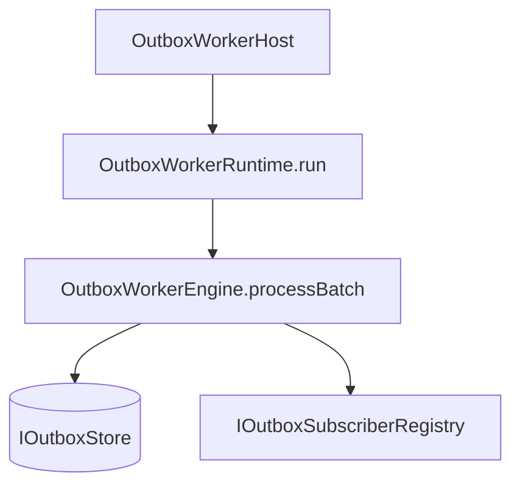

# G5 Outbox Worker Independent — v2 Full Review

## 1. Executive summary

La primera versión acertaba en la dirección general y fallaba en el encuadre técnico fino.

La v2 corrige eso.

Se mantiene la decisión central:

- G5 debe salir del API process,
- debe existir como worker independiente,
- debe apoyarse en PostgreSQL como base transaccional,
- debe dejar una senda compatible hacia CDC.

Pero se corrigen cuatro defectos:

1. **modelo de errores mezclado**,
2. **runtime incompleto**,
3. **ADR con planificación mezclada**,
4. **evolución a CDC demasiado abstracta**.

## 2. Baseline de la decisión

### 2.1 Qué no cambia

- El outbox sigue siendo persist-first.
- El modelo de entrega sigue siendo at-least-once.
- La idempotencia sigue siendo requisito de downstream.
- El claim cooperativo sigue apoyándose en PostgreSQL.
- `LISTEN/NOTIFY` sigue siendo una optimización, no una base de corrección.

### 2.2 Qué cambia

- El subscriber devuelve resultados tipados y no usa excepciones como canal funcional.
- El runtime deja de ser un objeto “tickable” ambiguo y pasa a tener `run()` como contrato principal.
- El diseño se parte en `engine / runtime / host`.
- La evolución a CDC se mueve a un documento aparte con estrategia de transición.

## 3. Crítica incorporada como decisión

### 3.1 Error model

La crítica era correcta: no se debe mezclar `DeliveryResult` con “throws clasificados”.

#### Regla v2

- `DeliveryResult` representa outcomes esperables.
- un `throw` representa un defecto inesperado o violación de contrato.
- el boundary del worker normaliza el throw a `SUBSCRIBER_UNEXPECTED_THROW`.

#### Resultado

Se elimina el clasificador general de excepciones como parte del modelo.

Solo queda una normalización defensiva en el borde.

## 4. Contratos normativos

### 4.1 Topic model

Para G5.x, `OutboxTopic` es cerrado.

```ts
export type OutboxTopic =
  | 'workflow.snapshot.project'
  | 'run.event.publish'
  | 'lineage.export.requested';
```

No se documenta ningún “escape hatch” en el ADR.

Si en el futuro hay que abrir el modelo, irá en otro ADR.

### 4.2 DeliveryResult

```ts
export type DeliveryResult =
  | { kind: 'DELIVERED'; receipt?: string }
  | { kind: 'IGNORED'; reasonCode: string; detail?: string }
  | { kind: 'RETRYABLE_FAILURE'; reasonCode: string; detail?: string }
  | { kind: 'TERMINAL_FAILURE'; reasonCode: string; detail?: string };
```

### 4.3 Subscriber contract

```ts
export interface IOutboxSubscriber {
  readonly subscriberKey: string;
  readonly acceptedTopics: readonly OutboxTopic[];
  readonly maxConcurrency: number;

  deliver(input: DeliverOutboxEventInput): Promise<DeliveryResult>;
}
```

### 4.4 Boundary normalization

```ts
export async function invokeSubscriber(
  subscriber: IOutboxSubscriber,
  input: DeliverOutboxEventInput
): Promise<DeliveryResult> {
  try {
    return await subscriber.deliver(input);
  } catch (error) {
    return {
      kind: 'TERMINAL_FAILURE',
      reasonCode: 'SUBSCRIBER_UNEXPECTED_THROW',
      detail: error instanceof Error ? error.message : 'unknown throw',
    };
  }
}
```

## 5. Runtime ownership

El problema detectado era real: `tick()` por sí solo no define un runtime completo.

### 5.1 Estructura v2



### 5.2 Engine

Responsabilidad:

- procesar un batch,
- sin loop,
- sin sleep,
- sin wiring de proceso.

### 5.3 Runtime

Responsabilidad:

- loop,
- backoff idle,
- wake-up hints,
- graceful shutdown,
- captura de fallos que escapen del batch.

Contrato:

```ts
export interface IOutboxWorkerRuntime {
  run(signal: AbortSignal): Promise<void>;
  tickOnce(signal: AbortSignal): Promise<BatchProcessingReport>;
}
```

`tickOnce()` queda solo para test y diagnóstico.

La API real de producción es `run()`.

### 5.4 Host

Responsabilidad:

- bootstrap de proceso,
- config,
- logger,
- OpenTelemetry,
- metrics endpoint,
- readiness/liveness,
- SIGTERM/SIGINT.

## 6. Concurrency model

No se implementará `mapWithConcurrencyLimit` casero.

Se usará `p-limit`.

```ts
import pLimit from 'p-limit';

const limit = pLimit(maxConcurrency);
const tasks = records.map((record) => limit(() => processRecord(record, signal)));
const settled = await Promise.allSettled(tasks);
```

### Razón

- reduce código asíncrono artesanal,
- hace más explícito el límite,
- se integra bien con tests,
- evita un helper cuya corrección tendríamos que demostrar y mantener.

Referencia: https://github.com/sindresorhus/p-limit

## 7. Claim y escalado

### 7.1 Claim model

Se mantiene la vía estándar y probada:

- `FOR UPDATE SKIP LOCKED`,
- lease por worker,
- re-exposición solo tras expiración o resolución explícita.

Referencia: https://www.postgresql.org/docs/current/sql-select.html

### 7.2 Escalado

El escalado horizontal en G5.x es cooperativo:

- varios workers reclaman lotes distintos,
- no hay coordinador central,
- el rendimiento depende de política de batch, lease y latencia downstream.

## 8. LISTEN/NOTIFY

Se mantiene, pero encuadrado correctamente.

### Regla

- puede despertar antes al runtime,
- no garantiza entrega,
- no sustituye polling,
- no sustituye estado persistido.

Referencia: https://www.postgresql.org/docs/current/sql-listen.html

## 9. Política de outcomes

| Outcome                                      | Acción               |
| -------------------------------------------- | -------------------- |
| `DELIVERED`                                  | `markDelivered`      |
| `IGNORED`                                    | `markIgnored`        |
| `RETRYABLE_FAILURE` con presupuesto restante | `markRetryScheduled` |
| `RETRYABLE_FAILURE` sin presupuesto          | `markDeadLettered`   |
| `TERMINAL_FAILURE`                           | `markDeadLettered`   |

## 10. CDC evolution sin romper contratos

La crítica era válida: no bastaba con decir “más adelante Debezium”.

### 10.1 Regla v2

La compatibilidad futura se mantiene si el write-shape del outbox sigue estable:

- `id`
- `tenant_id`
- `topic`
- `event_type`
- `payload`
- `headers`
- `partition_key`
- `schema_version`
- `created_at`

### 10.2 Estrategia

#### Fase 1

Solo polling worker.

#### Fase 2

CDC shadow mode:

- Debezium lee la misma tabla,
- publica temas sombra,
- se comparan counts, keys, lag y duplicados.

#### Fase 3

Cutover selectivo:

- consumidores externos pasan a Kafka,
- consumidores internos pueden seguir en polling si es más simple.

#### Fase 4

Se documenta el modelo dual soportado o se decide convergencia.

Referencia: https://debezium.io/documentation/reference/stable/transformations/outbox-event-router.html

## 11. Observabilidad mínima obligatoria

### Métricas

- `dvt_outbox_claimed_total`
- `dvt_outbox_delivered_total`
- `dvt_outbox_ignored_total`
- `dvt_outbox_retry_scheduled_total`
- `dvt_outbox_dead_lettered_total`
- `dvt_outbox_unexpected_throw_total`
- `dvt_outbox_runtime_loop_failures_total`
- `dvt_outbox_pending_records`
- `dvt_outbox_oldest_pending_age_seconds`

### Salud

#### Liveness

El loop sigue vivo.

#### Readiness

- store accesible,
- registry cargado,
- endpoints activos,
- configuración válida.

## 12. Roadmap propuesto

### G5.1

- contratos v2,
- paquete `@dvt/outbox-worker`,
- README de capas e invariantes.

### G5.2

- runtime `run()` completo,
- adapter Postgres con claim y lease,
- concurrency con `p-limit`,
- health y metrics.

### G5.3

- retry policy,
- dead-letter,
- replay,
- dashboards y runbook.

### G5.4

- spike CDC shadow mode,
- memo de decisión de cutover.

## 13. Decisiones explícitamente rechazadas

1. mantener la entrega en el API process,
2. usar excepciones como outcomes funcionales,
3. documentar un escape hatch de topics en este mismo ADR,
4. introducir Kafka como dependencia obligatoria del MVP.

## 14. Cierre

La v2 no cambia la tesis central. La hace implementable.

La propuesta que sí sostengo es esta:

- worker independiente,
- polling correcto primero,
- contratos estrictos,
- runtime con ownership claro,
- CDC posterior sin cambiar el contrato de escritura.

Eso está por encima del estándar habitual no por ser más barroco, sino por ser más explícito en boundaries, operación y evolución.
