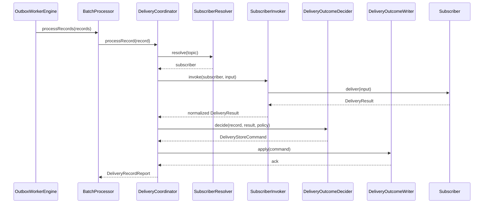

# SPEC-OUTBOX-RUNTIME-CONTRACTS v1

## 1. Runtime split

The polling worker runtime is split into five main collaboration units:

- `OutboxWorkerRuntime`
- `OutboxWorkerEngine`
- `BatchProcessor`
- `DeliveryCoordinator`
- `WorkerHost`

## 2. Contracts

```ts
export interface BatchProcessingReport {
  readonly claimedUnorderedCount: number;
  readonly claimedLaneCount: number;
  readonly processedCount: number;
  readonly deliveredCount: number;
  readonly ignoredCount: number;
  readonly retryScheduledCount: number;
  readonly deadLetteredCount: number;
  readonly unexpectedFailureCount: number;
  readonly hadWork: boolean;
}

export interface IOutboxWorkerEngine {
  processBatch(signal: AbortSignal): Promise<BatchProcessingReport>;
}

export interface IOutboxWorkerRuntime {
  run(signal: AbortSignal): Promise<void>;
  tickOnce(signal: AbortSignal): Promise<BatchProcessingReport>;
}

export interface IWorkerHost {
  start(signal: AbortSignal): Promise<void>;
}
```

## 3. Runtime lifecycle

### 3.1 `run(signal)`

`run` is the production entry point.

It must:

1. initialize telemetry and wake-up source,
2. repeatedly call `tickOnce`,
3. adapt delay depending on whether work was found,
4. handle graceful shutdown on `AbortSignal`,
5. keep the loop alive across recoverable batch failures,
6. expose health/readiness state.

### 3.2 `tickOnce(signal)`

`tickOnce` exists for:

- integration tests,
- deterministic local diagnosis,
- benchmark-style runs.

It must not be the only way the runtime is intended to operate in production.

## 4. Engine responsibilities

`OutboxWorkerEngine` owns one complete batch cycle:

1. claim unordered records,
2. claim lanes,
3. claim lane records,
4. pass records to `BatchProcessor`,
5. aggregate the report.

The engine does **not**:

- sleep,
- open sockets,
- own process lifecycle,
- own metrics server startup.

## 5. BatchProcessor contract

```ts
export interface IBatchProcessor {
  processRecords(
    records: readonly OutboxRecord[],
    signal: AbortSignal
  ): Promise<BatchProcessingReport>;
}
```

### Normative rules

1. Unordered records may be processed up to subscriber concurrency.
2. Ordered records must be grouped by lane and processed serially inside each
   lane.
3. Parallelism across different lanes is allowed.

## 6. DeliveryCoordinator contract

```ts
export interface DeliveryRecordReport {
  readonly messageId: OutboxMessageId;
  readonly outcome: 'DELIVERED' | 'IGNORED' | 'RETRY_SCHEDULED' | 'DEAD_LETTERED';
  readonly reasonCode?: string;
}

export interface IDeliveryCoordinator {
  processRecord(record: OutboxRecord, signal: AbortSignal): Promise<DeliveryRecordReport>;
}
```

### Sequence



## 7. Host contract

`WorkerHost` owns:

- config loading,
- secret/provider wiring,
- store adapter wiring,
- subscriber registry wiring,
- telemetry exporters,
- metrics/health endpoints,
- shutdown hooks.

Reference API:

```ts
export interface WorkerConfig {
  readonly workerId: string;
  readonly allowedTopics: readonly OutboxTopic[];
  readonly pollIntervalMs: number;
  readonly idleBackoffMs: number;
  readonly claimLeaseMs: number;
  readonly laneLeaseMs: number;
  readonly batchSize: number;
  readonly laneBatchSize: number;
  readonly metricsPort: number | null;
}
```

## 8. Failure handling

### 8.1 Per record

Any thrown exception inside the subscriber boundary becomes a terminal failure
command. Any thrown exception outside that boundary but inside the delivery
coordinator increments `unexpectedFailureCount` and is surfaced to the batch
processor.

### 8.2 Per batch

`tickOnce` must catch unexpected engine failures, emit error telemetry, and
allow `run` to apply a protective backoff before continuing.

### 8.3 Process fatality

The runtime may stop only when:

- startup configuration is invalid,
- the store adapter cannot initialize after configured fatal threshold,
- the host receives shutdown,
- operator configuration says fail-fast.

## 9. Wake-up integration

The runtime loop is:

```ts
for (;;) {
  if (signal.aborted) break;

  const report = await tickOnce(signal);

  if (report.hadWork) {
    continue;
  }

  const wakeup = await wakeupSource.waitForWork({
    idleDelayMs: config.idleBackoffMs,
    signal,
  });

  if (wakeup === 'aborted') break;
}
```

### Normative rule

`waitForWork` is a latency optimization. The next cycle must still poll the
store rather than assuming the notification is authoritative.
