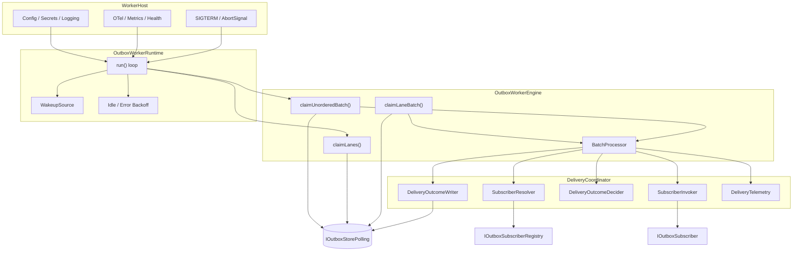

# ARCH-OUTBOX-RUNTIME v4

## 1. Runtime architecture



## 2. Flow description

### 2.1 Unordered path

1. engine claims unordered records (`laneKey IS NULL`),
2. batch processor groups by subscriber/topic,
3. records are processed up to subscriber concurrency,
4. delivery outcomes are written to the store.

### 2.2 Ordered path

1. engine claims lane leases,
2. engine claims rows only from owned lanes,
3. batch processor groups records by lane,
4. each lane is processed serially,
5. different lanes may run concurrently.

## 3. Why the split exists

### Host

Changes when deployment or operations change.

### Runtime

Changes when loop, sleep, shutdown, or wake-up strategy changes.

### Engine

Changes when batch acquisition strategy changes.

### DeliveryCoordinator and collaborators

Change when subscriber invocation, outcome decision, or writeback rules change.

This is the practical SRP split for this package.

## 4. Concrete class boundaries

### `SubscriberResolver`

```ts
export interface ISubscriberResolver {
  resolve(topic: OutboxTopic): IOutboxSubscriber;
}
```

Responsibility: topic-to-subscriber resolution only.

### `SubscriberInvoker`

```ts
export interface ISubscriberInvoker {
  invoke(subscriber: IOutboxSubscriber, input: DeliverOutboxEventInput): Promise<DeliveryResult>;
}
```

Responsibility: call subscriber and normalize throws.

### `DeliveryOutcomeDecider`

```ts
export interface IDeliveryOutcomeDecider {
  decide(
    record: OutboxRecord,
    result: DeliveryResult,
    policy: DeliveryPolicy,
    nowIso: string
  ): DeliveryStoreCommand;
}
```

Responsibility: convert result + policy into a store command.

### `DeliveryOutcomeWriter`

```ts
export interface IDeliveryOutcomeWriter {
  apply(command: DeliveryStoreCommand, audit: DeliveryMutationAudit): Promise<void>;
}
```

Responsibility: persist the chosen outcome and nothing else.

### `DeliveryTelemetry`

```ts
export interface IDeliveryTelemetry {
  recordAttemptStart(record: OutboxRecord): void;
  recordAttemptOutcome(report: DeliveryRecordReport): void;
  recordUnexpectedFailure(messageId: OutboxMessageId, error: unknown): void;
}
```

Responsibility: telemetry only.

### `DeliveryCoordinator`

```ts
export interface IDeliveryCoordinator {
  processRecord(record: OutboxRecord, signal: AbortSignal): Promise<DeliveryRecordReport>;
}
```

Responsibility: orchestrate the collaborators above for one record.

## 5. Pseudo-implementation sketch

```ts
export class DeliveryCoordinator implements IDeliveryCoordinator {
  constructor(
    private readonly resolver: ISubscriberResolver,
    private readonly invoker: ISubscriberInvoker,
    private readonly policyResolver: IDeliveryPolicyResolver,
    private readonly decider: IDeliveryOutcomeDecider,
    private readonly writer: IDeliveryOutcomeWriter,
    private readonly telemetry: IDeliveryTelemetry,
    private readonly clock: IClock
  ) {}

  async processRecord(record: OutboxRecord, signal: AbortSignal): Promise<DeliveryRecordReport> {
    this.telemetry.recordAttemptStart(record);

    const subscriber = this.resolver.resolve(record.topic);
    const input = toDeliverInput(record, this.clock.nowIso());

    const result = await this.invoker.invoke(subscriber, input);
    const policy = this.policyResolver.resolve(record.topic);
    const command = this.decider.decide(record, result, policy, this.clock.nowIso());

    await this.writer.apply(command, {
      workerId: 'resolved-at-runtime',
      decidedAt: this.clock.nowIso(),
      reasonCode: 'reasonCode' in result ? result.reasonCode : undefined,
      detail: 'detail' in result ? result.detail : undefined,
      receipt: 'receipt' in result ? result.receipt : undefined,
    });

    const report = toRecordReport(command);
    this.telemetry.recordAttemptOutcome(report);
    return report;
  }
}
```

## 6. Concurrency policy

Use `p-limit` for bounded concurrency.

Reference sketch:

```ts
import pLimit from 'p-limit';

const limit = pLimit(subscriber.maxConcurrency);

const tasks = records.map((record) => limit(() => coordinator.processRecord(record, signal)));

const settled = await Promise.allSettled(tasks);
```

Ordered lanes wrap the same coordinator but force one-at-a-time within each lane.

## 7. Non-goals

This runtime does not:

- publish to multiple downstream systems for one topic,
- deduplicate across records,
- guarantee monotonic processing across all topics,
- hide CDC behind the polling store abstraction.
