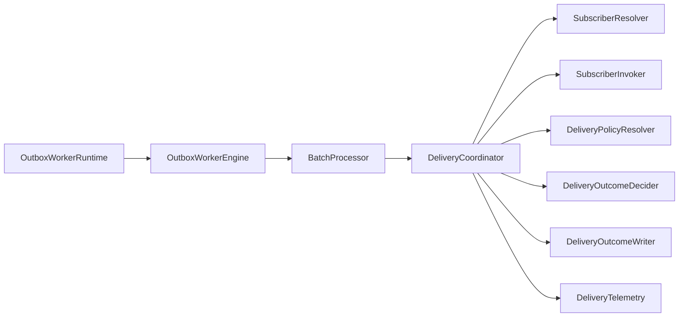

# CLASS-DESIGN-OUTBOX-WORKER v2

## 1. Package shape

```text
packages/@dvt/outbox-worker/
  src/
    contracts/
      DeliveryResult.ts
      IOutboxStorePolling.ts
      IOutboxSubscriber.ts
      IOutboxSubscriberRegistry.ts
      DeliveryPolicy.ts
      TopicDeliveryMode.ts
    runtime/
      OutboxWorkerRuntime.ts
      RuntimeBackoffPolicy.ts
      PostgresNotifyWakeupSource.ts
      TimeoutWakeupSource.ts
    engine/
      OutboxWorkerEngine.ts
      BatchProcessor.ts
    delivery/
      DeliveryCoordinator.ts
      SubscriberResolver.ts
      SubscriberInvoker.ts
      DeliveryPolicyResolver.ts
      DeliveryOutcomeDecider.ts
      DeliveryOutcomeWriter.ts
      DeliveryTelemetry.ts
    host/
      startWorkerHost.ts
      WorkerConfig.ts
      MetricsServer.ts
      HealthServer.ts
```

## 2. Class responsibilities

| Class | Responsibility | Must not own |
|---|---|---|
| `OutboxWorkerRuntime` | loop, backoff, wake-up, shutdown | record delivery rules |
| `OutboxWorkerEngine` | claim unordered, claim lanes, claim lane records, aggregate batch report | sleep or process bootstrap |
| `BatchProcessor` | dispatch records with correct concurrency model | store claiming |
| `DeliveryCoordinator` | one-record orchestration | direct SQL or host lifecycle |
| `SubscriberResolver` | topic lookup | invocation logic |
| `SubscriberInvoker` | call subscriber, normalize throw | policy decision |
| `DeliveryPolicyResolver` | resolve policy by topic | persistence |
| `DeliveryOutcomeDecider` | result → store command | subscriber lookup |
| `DeliveryOutcomeWriter` | apply store command | business outcome selection |
| `DeliveryTelemetry` | metrics/logging/tracing for delivery | writeback policy |
| `startWorkerHost` | wiring/startup | claim logic |

## 3. Collaboration flow



## 4. Concrete interfaces

### `SubscriberResolver`

```ts
export class SubscriberResolver implements ISubscriberResolver {
  constructor(private readonly registry: IOutboxSubscriberRegistry) {}

  resolve(topic: OutboxTopic): IOutboxSubscriber {
    return this.registry.getSubscriber(topic);
  }
}
```

### `DeliveryPolicyResolver`

```ts
export interface IDeliveryPolicyResolver {
  resolve(topic: OutboxTopic): DeliveryPolicy;
}
```

### `DeliveryOutcomeWriter`

```ts
export class DeliveryOutcomeWriter implements IDeliveryOutcomeWriter {
  constructor(private readonly store: IOutboxStorePolling) {}

  async apply(command: DeliveryStoreCommand, audit: DeliveryMutationAudit): Promise<void> {
    switch (command.kind) {
      case 'MARK_DELIVERED':
        return this.store.markDelivered(command.messageId, { ...audit, receipt: command.receipt });
      case 'MARK_IGNORED':
        return this.store.markIgnored(command.messageId, { ...audit, reasonCode: command.reasonCode, detail: command.detail });
      case 'MARK_RETRY_SCHEDULED':
        return this.store.markRetryScheduled(command.messageId, command.nextAttemptAtIso, {
          ...audit,
          reasonCode: command.reasonCode,
          detail: command.detail,
        });
      case 'MARK_DEAD_LETTERED':
        return this.store.markDeadLettered(command.messageId, {
          ...audit,
          reasonCode: command.reasonCode,
          detail: command.detail,
        });
    }
  }
}
```

### `DeliveryOutcomeDecider`

```ts
export class DeliveryOutcomeDecider implements IDeliveryOutcomeDecider {
  decide(
    record: OutboxRecord,
    result: DeliveryResult,
    policy: DeliveryPolicy,
    nowIso: string,
  ): DeliveryStoreCommand {
    switch (result.kind) {
      case 'DELIVERED':
        return { kind: 'MARK_DELIVERED', messageId: record.id, receipt: result.receipt };

      case 'IGNORED':
        return {
          kind: 'MARK_IGNORED',
          messageId: record.id,
          reasonCode: result.reasonCode,
          detail: result.detail,
        };

      case 'TERMINAL_FAILURE':
        return {
          kind: 'MARK_DEAD_LETTERED',
          messageId: record.id,
          reasonCode: result.reasonCode,
          detail: result.detail,
        };

      case 'RETRYABLE_FAILURE': {
        const remainingBudget = record.attemptCount < Math.min(record.maxAttempts, policy.maxAttempts);
        if (!remainingBudget) {
          return {
            kind: 'MARK_DEAD_LETTERED',
            messageId: record.id,
            reasonCode: result.reasonCode,
            detail: result.detail,
          };
        }

        return {
          kind: 'MARK_RETRY_SCHEDULED',
          messageId: record.id,
          nextAttemptAtIso: computeNextAttempt(nowIso, record.attemptCount, policy.backoff),
          reasonCode: result.reasonCode,
          detail: result.detail,
        };
      }
    }
  }
}
```

## 5. Why this is not fake SRP

The design accepts one orchestrator (`DeliveryCoordinator`) because orchestration
is a legitimate responsibility. The actual reasons to change are still split:

- subscriber lookup changes in resolver,
- throw normalization changes in invoker,
- policy mapping changes in decider,
- store mutation changes in writer,
- metrics changes in telemetry.

That is a practical SRP boundary, not dogmatic fragmentation.

## 6. Anti-patterns explicitly rejected

- one `DeliverOutboxRecord` class owning resolution + invocation + policy +
  persistence + telemetry + retry math,
- runtime classes directly building SQL,
- host bootstrap hidden inside engine constructors,
- store adapters deciding delivery policy.
