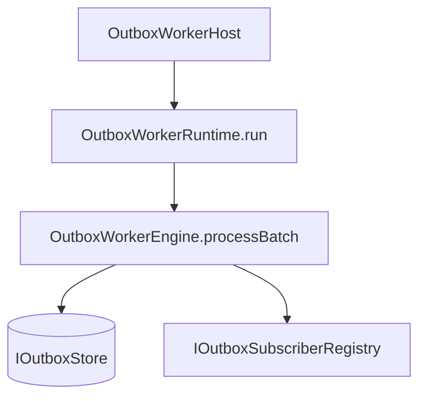
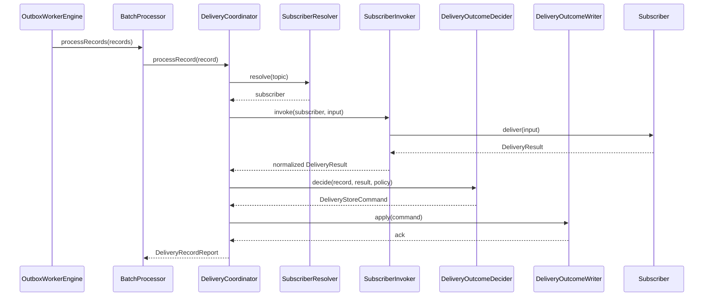
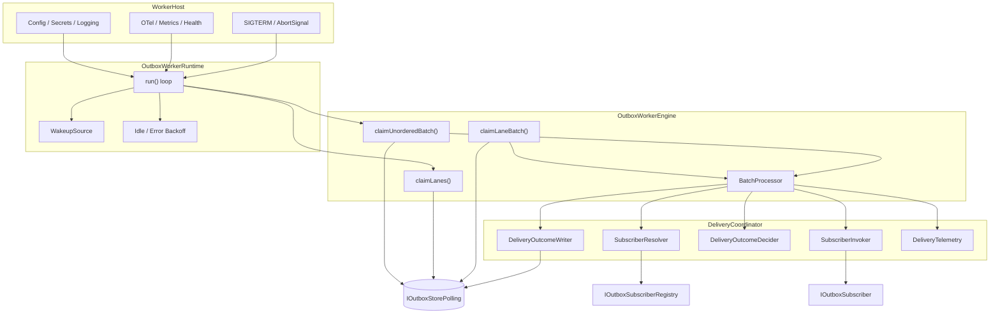
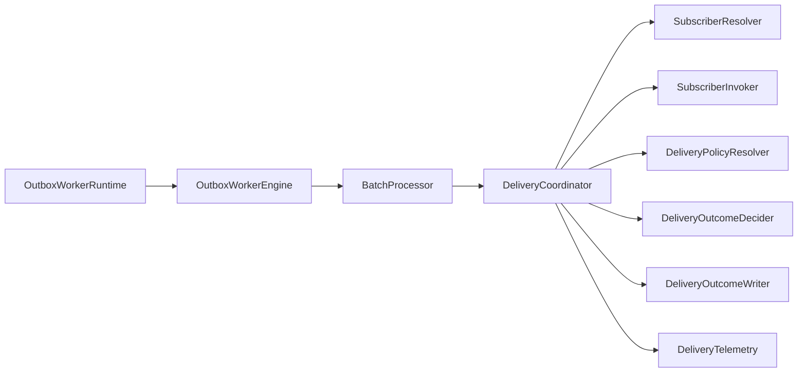

# G5 Outbox Worker Independent — Complete Review Pack v4

This consolidated file contains:

- the previous **v2** review,
- the previous **v3** review,
- the new **v4 ADR**,
- the full **implementation-facing specifications** that were missing,
- architecture, class design, security, quality, migration and roadmap sections.


---

# README

---
title: G5 Outbox Worker Independent — Complete Documentation Pack v4
status: Draft for review
owner: architecture
last_reviewed: 2026-03-08
---

# G5 Outbox Worker Independent — Complete Documentation Pack v4

This pack supersedes the previous draft sets by doing three things at once:

1. preserving the **v2** and **v3** review history,
2. adding the **missing concrete specifications**,
3. making the migration path from the current in-engine worker explicit.

## Included documents

### Archive
- `00-archive/G5_OUTBOX_WORKER_V2_FULL_REVIEW.md`
- `00-archive/G5_OUTBOX_WORKER_V3_FULL_REVIEW.md`

### ADR
- `01-adr/ADR-G5-001-independent-outbox-worker-v4.md`

### Specifications
- `02-spec/SPEC-OUTBOX-DELIVERY-CONTRACTS.v4.md`
- `02-spec/SPEC-OUTBOX-RUNTIME-CONTRACTS.v1.md`
- `02-spec/SPEC-OUTBOX-ORDERING-LANES.v1.md`
- `02-spec/SPEC-OUTBOX-IDEMPOTENCY.v1.md`
- `02-spec/SPEC-OUTBOX-TYPES-POLICY.v1.md`

### Architecture
- `03-architecture/ARCH-OUTBOX-RUNTIME.v4.md`
- `03-architecture/ARCH-OUTBOX-CDC-COEXISTENCE.v1.md`
- `03-architecture/ARCH-OUTBOX-POLLING-SQL.v1.md`

### Class design
- `04-class-design/CLASS-DESIGN-OUTBOX-WORKER.v2.md`

### Quality
- `05-quality/QUALITY-OUTBOX-WORKER.v2.md`

### Security
- `06-security/SECURITY-OUTBOX-WORKER.v2.md`

### Migration
- `07-migration/MIGRATION-PLAN-EXISTING-OUTBOX-WORKER.v1.md`

### Roadmap
- `08-roadmap/ROADMAP-G5_OUTBOX_WORKER.v4.md`

## Baseline alignment with DVT+

This pack assumes the same non-negotiable product split already stated in the
project material:

- the UI does not execute,
- the engine does not decide,
- the planner does not persist state,
- persistent state remains the source of truth,
- execution backends remain replaceable behind explicit boundaries.

That means G5 is treated as a delivery/runtime concern, not as planner logic and
not as UI logic.

## Core position in one page

### What is decided now

- The current outbox logic must be extracted into a **standalone worker process**.
- The production MVP delivery family is **polling with transactional claims**.
- Claiming remains based on PostgreSQL row locking and leases.
- The polling runtime is for **DVT-controlled subscribers**.
- CDC is real and useful, but it is a **second delivery family**, not a hidden
  implementation detail behind the polling store contract.
- The worker provides **at-least-once** delivery only.
- Subscriber-side idempotency is therefore mandatory.
- Ordering is **not global**. When needed, it is provided through **ordering
  lanes**.

### What is explicitly not claimed

- no exactly-once delivery,
- no global total order,
- no magical one-core-abstraction for both polling and CDC,
- no dual-active polling and CDC for the same topic in production.

## How to read this pack

Start with:

1. ADR,
2. delivery contracts,
3. runtime architecture,
4. migration plan,
5. polling SQL,
6. ordering/idempotency specs.

The archive copies are kept only so that review history is not lost.


---

# ARCHIVE — V2

---
title: G5 Outbox Worker Independent — v2 Full Review
status: Draft
owner: architecture
last_reviewed: 2026-03-08
---

# G5 Outbox Worker Independent — v2 Full Review

## 1. Executive summary

La primera versión acertaba en la dirección general y fallaba en el encuadre técnico fino.

La v2 corrige eso.

Se mantiene la decisión central:

- G5 debe salir del API process,
- debe existir como worker independiente,
- debe apoyarse en PostgreSQL como base transaccional,
- debe dejar una senda compatible hacia CDC.

Pero se corrigen cuatro defectos:

1. **modelo de errores mezclado**,
2. **runtime incompleto**, 
3. **ADR con planificación mezclada**,
4. **evolución a CDC demasiado abstracta**.

## 2. Baseline de la decisión

### 2.1 Qué no cambia

- El outbox sigue siendo persist-first.
- El modelo de entrega sigue siendo at-least-once.
- La idempotencia sigue siendo requisito de downstream.
- El claim cooperativo sigue apoyándose en PostgreSQL.
- `LISTEN/NOTIFY` sigue siendo una optimización, no una base de corrección.

### 2.2 Qué cambia

- El subscriber devuelve resultados tipados y no usa excepciones como canal funcional.
- El runtime deja de ser un objeto “tickable” ambiguo y pasa a tener `run()` como contrato principal.
- El diseño se parte en `engine / runtime / host`.
- La evolución a CDC se mueve a un documento aparte con estrategia de transición.

## 3. Crítica incorporada como decisión

### 3.1 Error model

La crítica era correcta: no se debe mezclar `DeliveryResult` con “throws clasificados”.

#### Regla v2

- `DeliveryResult` representa outcomes esperables.
- un `throw` representa un defecto inesperado o violación de contrato.
- el boundary del worker normaliza el throw a `SUBSCRIBER_UNEXPECTED_THROW`.

#### Resultado

Se elimina el clasificador general de excepciones como parte del modelo.

Solo queda una normalización defensiva en el borde.

## 4. Contratos normativos

### 4.1 Topic model

Para G5.x, `OutboxTopic` es cerrado.

```ts
export type OutboxTopic =
  | 'workflow.snapshot.project'
  | 'run.event.publish'
  | 'lineage.export.requested';
```

No se documenta ningún “escape hatch” en el ADR.

Si en el futuro hay que abrir el modelo, irá en otro ADR.

### 4.2 DeliveryResult

```ts
export type DeliveryResult =
  | { kind: 'DELIVERED'; receipt?: string }
  | { kind: 'IGNORED'; reasonCode: string; detail?: string }
  | { kind: 'RETRYABLE_FAILURE'; reasonCode: string; detail?: string }
  | { kind: 'TERMINAL_FAILURE'; reasonCode: string; detail?: string };
```

### 4.3 Subscriber contract

```ts
export interface IOutboxSubscriber {
  readonly subscriberKey: string;
  readonly acceptedTopics: readonly OutboxTopic[];
  readonly maxConcurrency: number;

  deliver(input: DeliverOutboxEventInput): Promise<DeliveryResult>;
}
```

### 4.4 Boundary normalization

```ts
export async function invokeSubscriber(
  subscriber: IOutboxSubscriber,
  input: DeliverOutboxEventInput,
): Promise<DeliveryResult> {
  try {
    return await subscriber.deliver(input);
  } catch (error) {
    return {
      kind: 'TERMINAL_FAILURE',
      reasonCode: 'SUBSCRIBER_UNEXPECTED_THROW',
      detail: error instanceof Error ? error.message : 'unknown throw',
    };
  }
}
```

## 5. Runtime ownership

El problema detectado era real: `tick()` por sí solo no define un runtime completo.

### 5.1 Estructura v2



### 5.2 Engine

Responsabilidad:

- procesar un batch,
- sin loop,
- sin sleep,
- sin wiring de proceso.

### 5.3 Runtime

Responsabilidad:

- loop,
- backoff idle,
- wake-up hints,
- graceful shutdown,
- captura de fallos que escapen del batch.

Contrato:

```ts
export interface IOutboxWorkerRuntime {
  run(signal: AbortSignal): Promise<void>;
  tickOnce(signal: AbortSignal): Promise<BatchProcessingReport>;
}
```

`tickOnce()` queda solo para test y diagnóstico.

La API real de producción es `run()`.

### 5.4 Host

Responsabilidad:

- bootstrap de proceso,
- config,
- logger,
- OpenTelemetry,
- metrics endpoint,
- readiness/liveness,
- SIGTERM/SIGINT.

## 6. Concurrency model

No se implementará `mapWithConcurrencyLimit` casero.

Se usará `p-limit`.

```ts
import pLimit from 'p-limit';

const limit = pLimit(maxConcurrency);
const tasks = records.map((record) => limit(() => processRecord(record, signal)));
const settled = await Promise.allSettled(tasks);
```

### Razón

- reduce código asíncrono artesanal,
- hace más explícito el límite,
- se integra bien con tests,
- evita un helper cuya corrección tendríamos que demostrar y mantener.

Referencia: https://github.com/sindresorhus/p-limit

## 7. Claim y escalado

### 7.1 Claim model

Se mantiene la vía estándar y probada:

- `FOR UPDATE SKIP LOCKED`,
- lease por worker,
- re-exposición solo tras expiración o resolución explícita.

Referencia: https://www.postgresql.org/docs/current/sql-select.html

### 7.2 Escalado

El escalado horizontal en G5.x es cooperativo:

- varios workers reclaman lotes distintos,
- no hay coordinador central,
- el rendimiento depende de política de batch, lease y latencia downstream.

## 8. LISTEN/NOTIFY

Se mantiene, pero encuadrado correctamente.

### Regla

- puede despertar antes al runtime,
- no garantiza entrega,
- no sustituye polling,
- no sustituye estado persistido.

Referencia: https://www.postgresql.org/docs/current/sql-listen.html

## 9. Política de outcomes

| Outcome | Acción |
|---|---|
| `DELIVERED` | `markDelivered` |
| `IGNORED` | `markIgnored` |
| `RETRYABLE_FAILURE` con presupuesto restante | `markRetryScheduled` |
| `RETRYABLE_FAILURE` sin presupuesto | `markDeadLettered` |
| `TERMINAL_FAILURE` | `markDeadLettered` |

## 10. CDC evolution sin romper contratos

La crítica era válida: no bastaba con decir “más adelante Debezium”.

### 10.1 Regla v2

La compatibilidad futura se mantiene si el write-shape del outbox sigue estable:

- `id`
- `tenant_id`
- `topic`
- `event_type`
- `payload`
- `headers`
- `partition_key`
- `schema_version`
- `created_at`

### 10.2 Estrategia

#### Fase 1

Solo polling worker.

#### Fase 2

CDC shadow mode:

- Debezium lee la misma tabla,
- publica temas sombra,
- se comparan counts, keys, lag y duplicados.

#### Fase 3

Cutover selectivo:

- consumidores externos pasan a Kafka,
- consumidores internos pueden seguir en polling si es más simple.

#### Fase 4

Se documenta el modelo dual soportado o se decide convergencia.

Referencia: https://debezium.io/documentation/reference/stable/transformations/outbox-event-router.html

## 11. Observabilidad mínima obligatoria

### Métricas

- `dvt_outbox_claimed_total`
- `dvt_outbox_delivered_total`
- `dvt_outbox_ignored_total`
- `dvt_outbox_retry_scheduled_total`
- `dvt_outbox_dead_lettered_total`
- `dvt_outbox_unexpected_throw_total`
- `dvt_outbox_runtime_loop_failures_total`
- `dvt_outbox_pending_records`
- `dvt_outbox_oldest_pending_age_seconds`

### Salud

#### Liveness

El loop sigue vivo.

#### Readiness

- store accesible,
- registry cargado,
- endpoints activos,
- configuración válida.

## 12. Roadmap propuesto

### G5.1

- contratos v2,
- paquete `@dvt/outbox-worker`,
- README de capas e invariantes.

### G5.2

- runtime `run()` completo,
- adapter Postgres con claim y lease,
- concurrency con `p-limit`,
- health y metrics.

### G5.3

- retry policy,
- dead-letter,
- replay,
- dashboards y runbook.

### G5.4

- spike CDC shadow mode,
- memo de decisión de cutover.

## 13. Decisiones explícitamente rechazadas

1. mantener la entrega en el API process,
2. usar excepciones como outcomes funcionales,
3. documentar un escape hatch de topics en este mismo ADR,
4. introducir Kafka como dependencia obligatoria del MVP.

## 14. Cierre

La v2 no cambia la tesis central. La hace implementable.

La propuesta que sí sostengo es esta:

- worker independiente,
- polling correcto primero,
- contratos estrictos,
- runtime con ownership claro,
- CDC posterior sin cambiar el contrato de escritura.

Eso está por encima del estándar habitual no por ser más barroco, sino por ser más explícito en boundaries, operación y evolución.


---

# ARCHIVE — V3

---
title: G5 Outbox Worker V3 Full Review
status: Draft for review
owner: architecture
last_reviewed: 2026-03-08
---

# G5 Outbox Worker V3 Full Review

## 1. Why a V3 exists

The V2 pack fixed two important problems, but it still had structural drift:

- SRP was preached more strongly than it was actually applied,
- CQRS language was stricter than the runtime reality,
- CDC evolution was still described too loosely,
- idempotency and ordering needed a sharper contract,
- security concerns were under-documented,
- the documentation types were still not separated enough.

This V3 addresses that by splitting the material into document types and making
several limitations explicit rather than decorative.

## 2. Document map

### ADR

- `ADR-G5-001-independent-outbox-worker-v3.md`

### Specifications

- `SPEC-OUTBOX-DELIVERY-CONTRACTS.v3.md`
- `SPEC-OUTBOX-ORDERING-IDEMPOTENCY.v1.md`

### Architecture

- `ARCH-OUTBOX-RUNTIME.v3.md`
- `ARCH-OUTBOX-CDC-EVOLUTION.v2.md`

### Class design

- `CLASS-DESIGN-OUTBOX-WORKER.v1.md`

### Quality / operations

- `QUALITY-OUTBOX-WORKER.v1.md`

### Security

- `SECURITY-OUTBOX-WORKER.v1.md`

### Risks / open questions

- `RISKS-AND-OPEN-QUESTIONS.v1.md`

## 3. Main corrections versus V2

### 3.1 SRP correction

The old delivery shape was still too broad. V3 splits record processing into:

- `SubscriberResolver`,
- `SubscriberInvoker`,
- `DeliveryOutcomeDecider`,
- `DeliveryOutcomeWriter`,
- `DeliveryTelemetry`,
- coordinated by `DeliveryCoordinator`.

That is still orchestration, but with narrower reasons to change.

### 3.2 CQRS wording correction

The outbox store contract is no longer presented as a pure CQRS exemplar.
Claiming is a queue-control primitive that mixes retrieval and ownership change.
That is acceptable and now explicitly acknowledged.

### 3.3 Concurrency correction

The design now recommends `p-limit` rather than a home-grown concurrency helper.
This reduces custom correctness surface in a critical runtime path.

### 3.4 CDC correction

The design now states clearly that CDC is a **different runtime family**, not a
transparent swap of the polling worker core. The continuity boundary is the
**outbox write shape**, not `IOutboxStore`.

### 3.5 Idempotency correction

The worker provides at-least-once delivery only. Subscriber-side idempotency is
therefore a normative contract requirement, not a footnote.

### 3.6 Ordering correction

No implicit ordering guarantee is claimed. If ordering matters, it must be
implemented with lanes, partition-aware claiming, or subscriber-side gating.

### 3.7 Security correction

Worker identity, secret handling, least privilege, and credential separation are
now captured in a dedicated security document.

## 4. Architectural position after V3

The architecture is now deliberately split into two delivery families:

1. **Polling worker**
   - transactional claim/lease semantics,
   - direct control over retries and dead-letter,
   - appropriate for DVT-controlled internal consumers or tightly managed
     subscribers.

2. **CDC relay**
   - database change capture from the outbox table,
   - better fit for external publication/fan-out,
   - operationally different, therefore documented separately.

This is stricter and more honest than pretending both are adapters behind the
same core.

## 5. Implementation consequences

A corresponding codebase should likely be structured around:

```text
packages/@dvt/outbox-worker/
  src/
    runtime/
      OutboxWorkerRuntime.ts
      RuntimeBackoffPolicy.ts
      WakeupListener.ts
    engine/
      OutboxWorkerEngine.ts
      BatchProcessor.ts
    delivery/
      DeliveryCoordinator.ts
      SubscriberResolver.ts
      SubscriberInvoker.ts
      DeliveryOutcomeDecider.ts
      DeliveryOutcomeWriter.ts
      DeliveryTelemetry.ts
    contracts/
      IOutboxStore.ts
      IOutboxSubscriber.ts
      DeliveryResult.ts
      DeliveryPolicy.ts
    host/
      startWorkerHost.ts
      WorkerConfig.ts
      MetricsServer.ts
      HealthServer.ts
```

## 6. What this pack deliberately does not do

- it does not promise exactly-once,
- it does not promise global ordering,
- it does not pretend Debezium reuses the polling core unchanged,
- it does not bury security and operations under architecture prose.

## 7. Recommended next implementation slice

1. implement the split runtime/engine/delivery classes,
2. replace custom concurrency helper with `p-limit`,
3. codify subscriber throw normalization in tests,
4. add integration tests for duplicate delivery around crash windows,
5. define whether ordering lanes are required for any current subscriber.

## 8. References

- PostgreSQL `SELECT ... FOR UPDATE ... SKIP LOCKED`
  https://www.postgresql.org/docs/current/sql-select.html
- PostgreSQL `LISTEN`
  https://www.postgresql.org/docs/current/sql-listen.html
- PostgreSQL `NOTIFY`
  https://www.postgresql.org/docs/current/sql-notify.html
- Debezium Outbox Event Router
  https://debezium.io/documentation/reference/stable/transformations/outbox-event-router.html
- `p-limit`
  https://github.com/sindresorhus/p-limit


---

# ADR

---
title: ADR-G5-001 Independent Outbox Worker v4
status: Proposed
owner: architecture
last_reviewed: 2026-03-08
---

# ADR-G5-001 — Independent Outbox Worker

## Status

Proposed.

This ADR replaces the looser V2/V3 decision texts for forward implementation.

## Context

The current state already contains reusable outbox behavior inside engine code,
but G5 remains partial because the delivery lifecycle is still tied to an
application/engine process rather than to an independently deployable runtime.

That creates several architectural problems:

- delivery lifecycle is coupled to API/engine uptime,
- operational ownership is unclear,
- retry/backoff/dead-letter behavior is under-specified,
- observability is weaker than it should be for a runtime boundary,
- migration to external publication patterns is harder when the worker is
  hidden inside another process.

Within DVT+, this problem must be solved without violating the product split:
the worker delivers persisted facts; it does not plan, it does not own product
state, and it does not invent execution policy outside its contract.

## Decision

### 1. Delivery families

DVT+ will support **two delivery families**, documented separately:

1. **Polling worker family**
   - claims rows from the outbox table transactionally,
   - updates delivery state itself,
   - supports retries, dead-letter, ordering lanes, and direct internal
     subscribers.

2. **CDC relay family**
   - reads changes from the outbox table through change data capture,
   - is suitable for external fan-out and integration publication,
   - does not reuse the polling worker core unchanged.

This ADR decides the **polling worker family** for G5.x.  
CDC is not rejected, but it is not covered by the polling runtime contract.

### 2. Runtime form

The polling worker will run as an **independent process/package** with three
clear layers:

- **engine**: one-batch processing logic,
- **runtime**: loop, backoff, wake-up integration, shutdown handling,
- **host**: process bootstrap, config, telemetry, health endpoints.

### 3. Error model

Expected delivery outcomes must be modeled with a typed result:

- `DELIVERED`
- `IGNORED`
- `RETRYABLE_FAILURE`
- `TERMINAL_FAILURE`

Subscribers must not use exceptions as a functional outcome channel.

Any thrown exception is treated as an unexpected defect and normalized at the
worker boundary.

### 4. Ordering

The worker does **not** guarantee global ordering.

When ordering is required, it is provided by **ordering lanes**:

- rows are assigned a `lane_key`,
- only one worker owns a lane lease at a time,
- records within a lane are processed in sequence order,
- different lanes may run in parallel.

### 5. Idempotency

Delivery is **at-least-once**.  
Subscribers must therefore be idempotent by the provided `idempotencyKey`.

The worker does not perform cross-record deduplication by idempotency key.

### 6. Topic ownership and coexistence

For a given `topic` in a given environment, **exactly one delivery family is
active**:

- either polling,
- or CDC.

Polling and CDC may coexist only in **shadow mode**, where one side is passive
for validation and does not produce the production side effect.

### 7. Existing worker migration

The existing in-engine worker will be migrated by **Option A:
deprecate + rewrite around extracted contracts**.

That means:

- the old worker becomes a compatibility wrapper only for a short transition,
- the new package owns the long-term runtime,
- cutover is controlled by topic allowlists and deployment flags,
- no dual-active delivery for the same topic is allowed.

## Consequences

### Positive

- deployment and operations become explicit,
- retries and dead-letter policy become enforceable,
- internal subscriber delivery stays simple and transactional,
- ordering requirements can be implemented without pretending global order,
- migration to CDC is cleaner because the boundary is now honest.

### Negative

- the polling worker core is explicitly coupled to claim/lease semantics,
- CDC is not a drop-in implementation of the same store contract,
- ordering lanes add schema and operational complexity where required,
- at-least-once requires subscriber discipline and testing.

### Rejected alternatives

#### A. Keep the worker inside the API/engine process

Rejected because lifecycle, observability, and scaling remain coupled to the
wrong process boundary.

#### B. Pretend polling and CDC are adapters behind the same core

Rejected because claim-driven processing and stream-consumer processing are
different runtime families with different failure and ownership models.

#### C. Promise exactly-once through the worker itself

Rejected because that would either be false or would require a much more complex
distributed protocol outside the current product need.

## Normative follow-up documents

- `SPEC-OUTBOX-DELIVERY-CONTRACTS.v4.md`
- `SPEC-OUTBOX-RUNTIME-CONTRACTS.v1.md`
- `SPEC-OUTBOX-ORDERING-LANES.v1.md`
- `SPEC-OUTBOX-IDEMPOTENCY.v1.md`
- `ARCH-OUTBOX-RUNTIME.v4.md`
- `MIGRATION-PLAN-EXISTING-OUTBOX-WORKER.v1.md`


---

# SPEC — DELIVERY CONTRACTS

---
title: SPEC-OUTBOX-DELIVERY-CONTRACTS v4
status: Draft
owner: architecture
last_reviewed: 2026-03-08
---

# SPEC-OUTBOX-DELIVERY-CONTRACTS v4

## 1. Scope

This specification defines the polling-family delivery contracts:

- message record shape,
- subscriber contract,
- result model,
- store command/query contract,
- delivery policy contract,
- registry contract,
- wake-up contract.

It is intentionally concrete enough to implement.

## 2. Terminology

- **Outbox record**: persisted row representing one delivery attempt lifecycle.
- **Subscriber**: in-process delivery target invoked by the polling worker.
- **Delivery outcome**: typed result returned by a subscriber.
- **Lane**: serialized ordering partition.
- **Claim**: temporary worker ownership of a record.
- **Lease**: time-bounded ownership of a record or lane.

## 3. Message shape

```ts
export type OutboxMessageId = string;
export type TenantId = string;
export type OutboxTopic = 
  | 'workflow.snapshot.project'
  | 'run.event.publish'
  | 'lineage.export.requested';

export interface OutboxHeaders {
  readonly idempotencyKey: string;
  readonly correlationId: string;
  readonly causationId?: string;
  readonly schemaVersion: number;
  readonly contentType: 'application/json';
}

export interface OutboxRecord<TPayload = unknown> {
  readonly id: OutboxMessageId;
  readonly tenantId: TenantId;
  readonly topic: OutboxTopic;
  readonly eventType: string;
  readonly payload: TPayload;
  readonly headers: OutboxHeaders;

  readonly deliveryFamily: 'polling' | 'cdc';
  readonly deliveryState:
    | 'PENDING'
    | 'CLAIMED'
    | 'RETRY_SCHEDULED'
    | 'DELIVERED'
    | 'IGNORED'
    | 'DEAD_LETTERED';

  readonly orderingKey: string | null;
  readonly laneKey: string | null;
  readonly sequenceInLane: number | null;

  readonly nextAttemptAt: string;
  readonly attemptCount: number;
  readonly maxAttempts: number;

  readonly claimOwner: string | null;
  readonly claimedUntil: string | null;

  readonly createdAt: string;
  readonly updatedAt: string;
}
```

## 4. Subscriber result model

```ts
export type DeliveryResult =
  | { kind: 'DELIVERED'; receipt?: string }
  | { kind: 'IGNORED'; reasonCode: string; detail?: string }
  | { kind: 'RETRYABLE_FAILURE'; reasonCode: string; detail?: string }
  | { kind: 'TERMINAL_FAILURE'; reasonCode: string; detail?: string };
```

### Normative rules

1. Subscribers **MUST** return `DeliveryResult` for all expected operational
   outcomes.
2. Subscribers **MUST NOT** use exceptions to represent retryable or terminal
   business/infrastructure outcomes.
3. The worker **MUST** normalize any thrown exception to
   `TERMINAL_FAILURE` with reason code `SUBSCRIBER_UNEXPECTED_THROW`, unless a
   future policy explicitly downgrades it.

## 5. Subscriber contract

```ts
export interface DeliverOutboxEventInput<TPayload = unknown> {
  readonly messageId: OutboxMessageId;
  readonly tenantId: TenantId;
  readonly topic: OutboxTopic;
  readonly eventType: string;
  readonly payload: TPayload;
  readonly headers: OutboxHeaders;
  readonly orderingKey: string | null;
  readonly laneKey: string | null;
  readonly sequenceInLane: number | null;
  readonly attemptNumber: number;
  readonly firstSeenAt: string;
}

export interface IOutboxSubscriber<TPayload = unknown> {
  readonly subscriberKey: string;
  readonly acceptedTopics: readonly OutboxTopic[];
  readonly maxConcurrency: number;

  deliver(input: DeliverOutboxEventInput<TPayload>): Promise<DeliveryResult>;
}
```

### Normative rules

1. `maxConcurrency` applies per subscriber instance inside one worker process.
2. If ordering is required for a topic, the effective concurrency inside one
   lane is `1`, even if `maxConcurrency > 1` across lanes.
3. Subscribers **MUST** be idempotent by `headers.idempotencyKey`.

## 6. Subscriber registry

```ts
export interface IOutboxSubscriberRegistry {
  getSubscriber(topic: OutboxTopic): IOutboxSubscriber;
  listSubscribers(): readonly IOutboxSubscriber[];
}
```

### Normative rules

1. Exactly one subscriber is registered per topic in the polling worker family.
2. If no subscriber is registered, the worker **MUST** dead-letter the record
   with reason `NO_SUBSCRIBER_REGISTERED`.
3. If multiple subscribers are required, fan-out belongs to a separate
   publication layer, not to this worker contract.

## 7. Delivery policy contract

```ts
export interface RetryBackoffPolicy {
  readonly strategy: 'fixed' | 'exponential';
  readonly initialDelayMs: number;
  readonly maxDelayMs: number;
  readonly multiplier?: number;
  readonly jitter: 'none' | 'full';
}

export interface DeliveryPolicy {
  readonly maxAttempts: number;
  readonly retryableReasonCodes: readonly string[];
  readonly terminalReasonCodes: readonly string[];
  readonly backoff: RetryBackoffPolicy;
}
```

### Normative rules

1. Policy is resolved per topic.
2. Unknown reason codes default to terminal unless explicitly configured
   otherwise.
3. Policy resolution must be deterministic and side-effect free.

## 8. Polling store contract

```ts
export interface ClaimBatchRequest {
  readonly workerId: string;
  readonly nowIso: string;
  readonly batchSize: number;
  readonly allowedTopics: readonly OutboxTopic[];
  readonly claimLeaseMs: number;
}

export interface ClaimLanesRequest {
  readonly workerId: string;
  readonly nowIso: string;
  readonly laneLeaseMs: number;
  readonly laneBatchSize: number;
  readonly allowedTopics: readonly OutboxTopic[];
}

export interface DeliveryMutationAudit {
  readonly workerId: string;
  readonly decidedAt: string;
  readonly reasonCode?: string;
  readonly detail?: string;
  readonly receipt?: string;
}

export interface IOutboxStorePolling {
  claimUnorderedBatch(request: ClaimBatchRequest): Promise<readonly OutboxRecord[]>;
  claimLanes(request: ClaimLanesRequest): Promise<readonly string[]>;
  claimLaneBatch(request: ClaimBatchRequest & { readonly laneKeys: readonly string[] }): Promise<readonly OutboxRecord[]>;
  markDelivered(messageId: OutboxMessageId, audit: DeliveryMutationAudit): Promise<void>;
  markIgnored(messageId: OutboxMessageId, audit: DeliveryMutationAudit): Promise<void>;
  markRetryScheduled(
    messageId: OutboxMessageId,
    nextAttemptAtIso: string,
    audit: DeliveryMutationAudit,
  ): Promise<void>;
  markDeadLettered(messageId: OutboxMessageId, audit: DeliveryMutationAudit): Promise<void>;
  releaseExpiredLaneLeases(nowIso: string, workerId?: string): Promise<number>;
  getLagSnapshot(allowedTopics: readonly OutboxTopic[], nowIso: string): Promise<OutboxLagSnapshot>;
}
```

```ts
export interface OutboxLagSnapshot {
  readonly pendingCount: number;
  readonly retryScheduledCount: number;
  readonly claimedCount: number;
  readonly oldestPendingCreatedAt: string | null;
}
```

### Normative rules

1. The store contract is **polling-family specific**.
2. Claiming is a queue-control primitive; it is not presented as pure CQRS.
3. `claimUnorderedBatch` handles rows with `laneKey IS NULL`.
4. `claimLanes` plus `claimLaneBatch` handle rows with `laneKey IS NOT NULL`.
5. Claim methods **MUST** be transactionally safe against concurrent workers.

## 9. Wake-up contract

```ts
export interface WaitForWorkInput {
  readonly idleDelayMs: number;
  readonly signal: AbortSignal;
}

export interface IOutboxWakeupSource {
  waitForWork(input: WaitForWorkInput): Promise<'notification' | 'timeout' | 'aborted'>;
}
```

### Normative rules

1. Wake-up is an optimization only.
2. The worker **MUST** continue to function correctly if notifications are lost.
3. A simple timeout-only implementation is valid.

## 10. Normalization boundary

```ts
export interface ISubscriberInvoker {
  invoke(
    subscriber: IOutboxSubscriber,
    input: DeliverOutboxEventInput,
  ): Promise<DeliveryResult>;
}
```

Reference behavior:

```ts
export class SubscriberInvoker implements ISubscriberInvoker {
  async invoke(
    subscriber: IOutboxSubscriber,
    input: DeliverOutboxEventInput,
  ): Promise<DeliveryResult> {
    try {
      return await subscriber.deliver(input);
    } catch (error) {
      return {
        kind: 'TERMINAL_FAILURE',
        reasonCode: 'SUBSCRIBER_UNEXPECTED_THROW',
        detail: error instanceof Error ? error.message : 'unknown throw',
      };
    }
  }
}
```

## 11. Outcome decision contract

```ts
export type DeliveryStoreCommand =
  | { kind: 'MARK_DELIVERED'; messageId: OutboxMessageId; receipt?: string }
  | { kind: 'MARK_IGNORED'; messageId: OutboxMessageId; reasonCode: string; detail?: string }
  | { kind: 'MARK_RETRY_SCHEDULED'; messageId: OutboxMessageId; nextAttemptAtIso: string; reasonCode: string; detail?: string }
  | { kind: 'MARK_DEAD_LETTERED'; messageId: OutboxMessageId; reasonCode: string; detail?: string };

export interface IDeliveryOutcomeDecider {
  decide(
    record: OutboxRecord,
    result: DeliveryResult,
    policy: DeliveryPolicy,
    nowIso: string,
  ): DeliveryStoreCommand;
}
```

### Normative rules

1. `RETRYABLE_FAILURE` with remaining budget becomes `MARK_RETRY_SCHEDULED`.
2. `RETRYABLE_FAILURE` without remaining budget becomes `MARK_DEAD_LETTERED`.
3. `TERMINAL_FAILURE` always becomes `MARK_DEAD_LETTERED`.
4. `DELIVERED` and `IGNORED` are terminal from the worker point of view.

## 12. Explicit exclusions

This specification does not define:

- CDC relay contracts,
- external event-bus publication protocol,
- exactly-once semantics,
- multi-subscriber fan-out.


---

# SPEC — RUNTIME CONTRACTS

---
title: SPEC-OUTBOX-RUNTIME-CONTRACTS v1
status: Draft
owner: architecture
last_reviewed: 2026-03-08
---

# SPEC-OUTBOX-RUNTIME-CONTRACTS v1

## 1. Runtime split

The polling worker runtime is split into five main collaboration units:

- `OutboxWorkerRuntime`
- `OutboxWorkerEngine`
- `BatchProcessor`
- `DeliveryCoordinator`
- `WorkerHost`

## 2. Contracts

```ts
export interface BatchProcessingReport {
  readonly claimedUnorderedCount: number;
  readonly claimedLaneCount: number;
  readonly processedCount: number;
  readonly deliveredCount: number;
  readonly ignoredCount: number;
  readonly retryScheduledCount: number;
  readonly deadLetteredCount: number;
  readonly unexpectedFailureCount: number;
  readonly hadWork: boolean;
}

export interface IOutboxWorkerEngine {
  processBatch(signal: AbortSignal): Promise<BatchProcessingReport>;
}

export interface IOutboxWorkerRuntime {
  run(signal: AbortSignal): Promise<void>;
  tickOnce(signal: AbortSignal): Promise<BatchProcessingReport>;
}

export interface IWorkerHost {
  start(signal: AbortSignal): Promise<void>;
}
```

## 3. Runtime lifecycle

### 3.1 `run(signal)`

`run` is the production entry point.

It must:

1. initialize telemetry and wake-up source,
2. repeatedly call `tickOnce`,
3. adapt delay depending on whether work was found,
4. handle graceful shutdown on `AbortSignal`,
5. keep the loop alive across recoverable batch failures,
6. expose health/readiness state.

### 3.2 `tickOnce(signal)`

`tickOnce` exists for:

- integration tests,
- deterministic local diagnosis,
- benchmark-style runs.

It must not be the only way the runtime is intended to operate in production.

## 4. Engine responsibilities

`OutboxWorkerEngine` owns one complete batch cycle:

1. claim unordered records,
2. claim lanes,
3. claim lane records,
4. pass records to `BatchProcessor`,
5. aggregate the report.

The engine does **not**:

- sleep,
- open sockets,
- own process lifecycle,
- own metrics server startup.

## 5. BatchProcessor contract

```ts
export interface IBatchProcessor {
  processRecords(
    records: readonly OutboxRecord[],
    signal: AbortSignal,
  ): Promise<BatchProcessingReport>;
}
```

### Normative rules

1. Unordered records may be processed up to subscriber concurrency.
2. Ordered records must be grouped by lane and processed serially inside each
   lane.
3. Parallelism across different lanes is allowed.

## 6. DeliveryCoordinator contract

```ts
export interface DeliveryRecordReport {
  readonly messageId: OutboxMessageId;
  readonly outcome: 'DELIVERED' | 'IGNORED' | 'RETRY_SCHEDULED' | 'DEAD_LETTERED';
  readonly reasonCode?: string;
}

export interface IDeliveryCoordinator {
  processRecord(
    record: OutboxRecord,
    signal: AbortSignal,
  ): Promise<DeliveryRecordReport>;
}
```

### Sequence



## 7. Host contract

`WorkerHost` owns:

- config loading,
- secret/provider wiring,
- store adapter wiring,
- subscriber registry wiring,
- telemetry exporters,
- metrics/health endpoints,
- shutdown hooks.

Reference API:

```ts
export interface WorkerConfig {
  readonly workerId: string;
  readonly allowedTopics: readonly OutboxTopic[];
  readonly pollIntervalMs: number;
  readonly idleBackoffMs: number;
  readonly claimLeaseMs: number;
  readonly laneLeaseMs: number;
  readonly batchSize: number;
  readonly laneBatchSize: number;
  readonly metricsPort: number | null;
}
```

## 8. Failure handling

### 8.1 Per record

Any thrown exception inside the subscriber boundary becomes a terminal failure
command. Any thrown exception outside that boundary but inside the delivery
coordinator increments `unexpectedFailureCount` and is surfaced to the batch
processor.

### 8.2 Per batch

`tickOnce` must catch unexpected engine failures, emit error telemetry, and
allow `run` to apply a protective backoff before continuing.

### 8.3 Process fatality

The runtime may stop only when:

- startup configuration is invalid,
- the store adapter cannot initialize after configured fatal threshold,
- the host receives shutdown,
- operator configuration says fail-fast.

## 9. Wake-up integration

The runtime loop is:

```ts
for (;;) {
  if (signal.aborted) break;

  const report = await tickOnce(signal);

  if (report.hadWork) {
    continue;
  }

  const wakeup = await wakeupSource.waitForWork({
    idleDelayMs: config.idleBackoffMs,
    signal,
  });

  if (wakeup === 'aborted') break;
}
```

### Normative rule

`waitForWork` is a latency optimization. The next cycle must still poll the
store rather than assuming the notification is authoritative.


---

# SPEC — ORDERING LANES

---
title: SPEC-OUTBOX-ORDERING-LANES v1
status: Draft
owner: architecture
last_reviewed: 2026-03-08
---

# SPEC-OUTBOX-ORDERING-LANES v1

## 1. Purpose

This specification defines how ordering is implemented in the polling worker
family when ordering matters.

It exists because the worker does not and should not claim global ordering.

## 2. When ordering lanes are required

Ordering lanes are required only for topics whose subscribers depend on
per-key sequencing.

Typical examples:

- workflow snapshot projection per `runId`,
- status compaction per aggregate identifier,
- side-effecting delivery where the downstream system requires key-local order.

If a topic does not require sequencing, `laneKey` is `NULL` and the unordered
claim path is used.

## 3. Lane data model

```ts
export interface OrderedOutboxRecord extends OutboxRecord {
  readonly orderingKey: string;
  readonly laneKey: string;
  readonly sequenceInLane: number;
}
```

### Database requirements

For ordered topics, the enqueue path must write:

- `ordering_key`
- `lane_key`
- `sequence_in_lane`

Recommended rule for MVP:

- `lane_key = ordering_key`

This avoids an extra hashing layer unless proven necessary.

## 4. Lane ownership model

Lane ordering is preserved by a separate lane lease table.

```sql
create table if not exists outbox_lane_lease (
  lane_key text primary key,
  lease_owner text null,
  lease_expires_at timestamptz null,
  last_claimed_at timestamptz null,
  updated_at timestamptz not null default now()
);
```

### Why a lane table exists

Without lane ownership, two workers could claim rows from the same logical key
and process them concurrently, which would break ordering.

## 5. Lane claim protocol

### Step 1 — claim lanes

A worker claims candidate lanes whose lease is absent or expired.

Reference SQL shape:

```sql
with candidate_lanes as (
  select l.lane_key
  from outbox_lane_lease l
  join lateral (
    select 1
    from outbox_message m
    where m.lane_key = l.lane_key
      and m.delivery_family = 'polling'
      and m.delivery_state in ('PENDING', 'RETRY_SCHEDULED')
      and m.next_attempt_at <= now()
      and m.topic = any($1)
    limit 1
  ) pending on true
  where l.lease_expires_at is null
     or l.lease_expires_at < now()
  order by l.last_claimed_at nulls first, l.lane_key
  for update skip locked
  limit $2
)
update outbox_lane_lease l
set lease_owner = $3,
    lease_expires_at = now() + ($4::text || ' milliseconds')::interval,
    last_claimed_at = now(),
    updated_at = now()
from candidate_lanes c
where l.lane_key = c.lane_key
returning l.lane_key;
```

### Step 2 — claim records inside owned lanes

Only records from lanes already leased to the worker may be claimed.

```sql
with candidate_records as (
  select m.id
  from outbox_message m
  where m.lane_key = any($1)
    and m.delivery_family = 'polling'
    and m.delivery_state in ('PENDING', 'RETRY_SCHEDULED')
    and m.next_attempt_at <= now()
    and (m.claimed_until is null or m.claimed_until < now())
    and m.topic = any($2)
  order by m.lane_key, m.sequence_in_lane
  for update skip locked
  limit $3
)
update outbox_message m
set delivery_state = 'CLAIMED',
    claim_owner = $4,
    claimed_until = now() + ($5::text || ' milliseconds')::interval,
    attempt_count = m.attempt_count + 1,
    updated_at = now()
from candidate_records c
where m.id = c.id
returning m.*;
```

## 6. In-process execution rule

Within one lane, records must be delivered serially in ascending
`sequenceInLane`.

Pseudo-code:

```ts
for (const laneGroup of groupByLane(records)) {
  await processLaneSerially(laneGroup);
}
```

Parallelism is allowed only **across lanes**.

## 7. Lane release rules

A lane lease is not released on every successful record. It expires naturally or
is explicitly released when a worker finishes its current lane batch.

Reference rule for MVP:

- explicit release after a lane batch is fully processed,
- fallback cleanup through lease expiry.

## 8. Failure behavior

- If a worker crashes after claiming a lane, another worker may take the lane
  after lease expiry.
- Because delivery is at-least-once, the downstream subscriber must still be
  idempotent even inside an ordered lane.
- Ordering is per lane, not across lanes.

## 9. What this does not solve

- cross-lane ordering,
- exactly-once delivery,
- automatic repartitioning of hot keys.

## 10. Lane selection criteria

A topic must document one of these modes:

- `UNORDERED`
- `ORDERED_BY_RUN_ID`
- `ORDERED_BY_AGGREGATE_ID`
- `ORDERED_BY_CUSTOM_KEY`

That topic-level declaration is configuration, not runtime guesswork.


---

# SPEC — IDEMPOTENCY

---
title: SPEC-OUTBOX-IDEMPOTENCY v1
status: Draft
owner: architecture
last_reviewed: 2026-03-08
---

# SPEC-OUTBOX-IDEMPOTENCY v1

## 1. Core rule

The polling worker provides **at-least-once** delivery, not exactly-once.

Therefore, every subscriber must treat `headers.idempotencyKey` as the primary
deduplication key for downstream side effects.

## 2. Why this is required

The worker can legitimately redeliver the same record when a crash or timeout
happens after the side effect but before the worker persists `markDelivered`.

That window cannot be eliminated by the worker alone without much stronger
distributed guarantees.

## 3. Worker obligations

The worker must:

- preserve `headers.idempotencyKey`,
- preserve `messageId`,
- preserve `correlationId`,
- not mutate the logical meaning of the message across retries.

The worker does **not**:

- maintain cross-record deduplication state by idempotency key,
- check whether another record with the same key already completed,
- guarantee single delivery to the subscriber.

## 4. Subscriber obligations

A subscriber must implement one of these patterns:

### A. Idempotent write in the target system

Examples:

- `insert ... on conflict do nothing`,
- upsert by business key,
- replace/merge semantics keyed by idempotency key.

### B. Deduplication table

Store the processed `idempotencyKey` before or atomically with the side effect.

### C. Natural idempotency

Safe overwrite or deterministic compaction where repeated delivery does not
change the final state.

## 5. Contract note

Two different outbox records may share the same `idempotencyKey` intentionally.
That does not mean the worker should suppress one of them.  
Deduplication scope belongs to the subscriber and its target side effect model.

## 6. Example subscriber pattern

```ts
export class SnapshotProjectorSubscriber implements IOutboxSubscriber {
  readonly subscriberKey = 'snapshot-projector';
  readonly acceptedTopics = ['workflow.snapshot.project'] as const;
  readonly maxConcurrency = 4;

  async deliver(input: DeliverOutboxEventInput): Promise<DeliveryResult> {
    const inserted = await this.processedKeyStore.tryInsert(input.headers.idempotencyKey);

    if (!inserted) {
      return { kind: 'IGNORED', reasonCode: 'DUPLICATE_IDEMPOTENCY_KEY' };
    }

    await this.projector.apply(input.payload);

    return { kind: 'DELIVERED' };
  }
}
```

## 7. Test requirement

Every subscriber package must include at least one integration test that proves:

- first delivery succeeds,
- duplicate delivery with the same `idempotencyKey` does not produce a second
  external side effect.


---

# SPEC — TYPES POLICY

---
title: SPEC-OUTBOX-TYPES-POLICY v1
status: Draft
owner: architecture
last_reviewed: 2026-03-08
---

# SPEC-OUTBOX-TYPES-POLICY v1

## 1. Problem

Previous drafts risked overusing branded types for simple identifiers
(`TenantId`, `RunId`, `OutboxMessageId`, etc.). In practice, that often leads to:

- noisy constructor code,
- adapter friction,
- `as any` escape hatches,
- type ceremony that does not materially improve correctness in this package.

## 2. Decision

The outbox worker package will use **simple string aliases** for identifiers in
its internal contracts.

```ts
export type TenantId = string;
export type RunId = string;
export type OutboxMessageId = string;
export type WorkerId = string;
```

## 3. Boundary rule

If other packages expose stronger nominal/branded identifier types, adapters may
map them into these aliases at the boundary.

The worker package itself must not introduce new branded identifier types.

## 4. Exception

If a future correctness issue proves that a specific identifier requires a
stronger representation, that must be justified in a separate ADR or contract
revision with concrete evidence.

## 5. Rationale

This package is coordination-heavy and IO-heavy. Most of its correctness comes
from:

- deterministic store updates,
- strict result unions,
- topic registration,
- idempotency discipline,
- integration tests,

not from nominal branding of strings.

## 6. Prohibited practice

The worker package must not rely on `as any` to bridge identifier mismatches.
Boundary mappers must be explicit.


---

# ARCH — RUNTIME

---
title: ARCH-OUTBOX-RUNTIME v4
status: Draft
owner: architecture
last_reviewed: 2026-03-08
---

# ARCH-OUTBOX-RUNTIME v4

## 1. Runtime architecture



## 2. Flow description

### 2.1 Unordered path

1. engine claims unordered records (`laneKey IS NULL`),
2. batch processor groups by subscriber/topic,
3. records are processed up to subscriber concurrency,
4. delivery outcomes are written to the store.

### 2.2 Ordered path

1. engine claims lane leases,
2. engine claims rows only from owned lanes,
3. batch processor groups records by lane,
4. each lane is processed serially,
5. different lanes may run concurrently.

## 3. Why the split exists

### Host

Changes when deployment or operations change.

### Runtime

Changes when loop, sleep, shutdown, or wake-up strategy changes.

### Engine

Changes when batch acquisition strategy changes.

### DeliveryCoordinator and collaborators

Change when subscriber invocation, outcome decision, or writeback rules change.

This is the practical SRP split for this package.

## 4. Concrete class boundaries

### `SubscriberResolver`

```ts
export interface ISubscriberResolver {
  resolve(topic: OutboxTopic): IOutboxSubscriber;
}
```

Responsibility: topic-to-subscriber resolution only.

### `SubscriberInvoker`

```ts
export interface ISubscriberInvoker {
  invoke(
    subscriber: IOutboxSubscriber,
    input: DeliverOutboxEventInput,
  ): Promise<DeliveryResult>;
}
```

Responsibility: call subscriber and normalize throws.

### `DeliveryOutcomeDecider`

```ts
export interface IDeliveryOutcomeDecider {
  decide(
    record: OutboxRecord,
    result: DeliveryResult,
    policy: DeliveryPolicy,
    nowIso: string,
  ): DeliveryStoreCommand;
}
```

Responsibility: convert result + policy into a store command.

### `DeliveryOutcomeWriter`

```ts
export interface IDeliveryOutcomeWriter {
  apply(command: DeliveryStoreCommand, audit: DeliveryMutationAudit): Promise<void>;
}
```

Responsibility: persist the chosen outcome and nothing else.

### `DeliveryTelemetry`

```ts
export interface IDeliveryTelemetry {
  recordAttemptStart(record: OutboxRecord): void;
  recordAttemptOutcome(report: DeliveryRecordReport): void;
  recordUnexpectedFailure(messageId: OutboxMessageId, error: unknown): void;
}
```

Responsibility: telemetry only.

### `DeliveryCoordinator`

```ts
export interface IDeliveryCoordinator {
  processRecord(record: OutboxRecord, signal: AbortSignal): Promise<DeliveryRecordReport>;
}
```

Responsibility: orchestrate the collaborators above for one record.

## 5. Pseudo-implementation sketch

```ts
export class DeliveryCoordinator implements IDeliveryCoordinator {
  constructor(
    private readonly resolver: ISubscriberResolver,
    private readonly invoker: ISubscriberInvoker,
    private readonly policyResolver: IDeliveryPolicyResolver,
    private readonly decider: IDeliveryOutcomeDecider,
    private readonly writer: IDeliveryOutcomeWriter,
    private readonly telemetry: IDeliveryTelemetry,
    private readonly clock: IClock,
  ) {}

  async processRecord(record: OutboxRecord, signal: AbortSignal): Promise<DeliveryRecordReport> {
    this.telemetry.recordAttemptStart(record);

    const subscriber = this.resolver.resolve(record.topic);
    const input = toDeliverInput(record, this.clock.nowIso());

    const result = await this.invoker.invoke(subscriber, input);
    const policy = this.policyResolver.resolve(record.topic);
    const command = this.decider.decide(record, result, policy, this.clock.nowIso());

    await this.writer.apply(command, {
      workerId: 'resolved-at-runtime',
      decidedAt: this.clock.nowIso(),
      reasonCode: 'reasonCode' in result ? result.reasonCode : undefined,
      detail: 'detail' in result ? result.detail : undefined,
      receipt: 'receipt' in result ? result.receipt : undefined,
    });

    const report = toRecordReport(command);
    this.telemetry.recordAttemptOutcome(report);
    return report;
  }
}
```

## 6. Concurrency policy

Use `p-limit` for bounded concurrency.

Reference sketch:

```ts
import pLimit from 'p-limit';

const limit = pLimit(subscriber.maxConcurrency);

const tasks = records.map((record) =>
  limit(() => coordinator.processRecord(record, signal)),
);

const settled = await Promise.allSettled(tasks);
```

Ordered lanes wrap the same coordinator but force one-at-a-time within each lane.

## 7. Non-goals

This runtime does not:

- publish to multiple downstream systems for one topic,
- deduplicate across records,
- guarantee monotonic processing across all topics,
- hide CDC behind the polling store abstraction.


---

# ARCH — CDC COEXISTENCE

---
title: ARCH-OUTBOX-CDC-COEXISTENCE v1
status: Draft
owner: architecture
last_reviewed: 2026-03-08
---

# ARCH-OUTBOX-CDC-COEXISTENCE v1

## 1. Scope

This document explains how CDC relates to the polling worker family and how
migration can happen without unsafe dual-active behavior.

## 2. Architectural truth

CDC is a **different delivery family**.

Polling uses:

- explicit record claims,
- explicit lane claims,
- explicit writeback to delivery state.

CDC uses:

- database change capture,
- downstream topic routing,
- consumer-group semantics outside the polling store contract.

Therefore the continuity boundary is not `IOutboxStorePolling`.  
The continuity boundary is the **outbox write shape** and **topic semantics**.

## 3. Stable write shape required for future CDC

The enqueue path must keep these columns stable enough for CDC use:

- `id`
- `tenant_id`
- `topic`
- `event_type`
- `payload`
- `headers`
- `created_at`

Polling-only fields such as `claim_owner`, `claimed_until`, `delivery_state`,
and lane lease metadata are not the CDC continuity boundary.

## 4. Coexistence rule

For a given `(environment, topic)` pair, exactly one of these may be
**production-active**:

- `polling`
- `cdc`

A second mechanism may exist only in **shadow mode**.

## 5. Shadow mode patterns

### 5.1 CDC shadow while polling remains live

Recommended pattern:

- polling remains the production side effect path,
- Debezium/CDC reads the same outbox table,
- CDC output is routed to a **shadow topic** or a **shadow consumer group**,
- counts, latency, schema conformance, and message keys are compared,
- CDC does not trigger the production subscriber side effect.

### 5.2 Polling shadow while CDC is live

Less likely for G5, but symmetrical:
- CDC is live,
- polling may read only canary topics or a shadow topic subset,
- polling does not invoke production subscribers for live-owned topics.

## 6. Why dual-active is rejected

If polling and CDC both perform the production side effect for the same topic,
duplicate delivery is guaranteed sooner or later. Since both families are
at-least-once by nature, dual-active makes duplication structurally expected.

That is rejected.

## 7. Topic ownership registry

Introduce explicit configuration:

```ts
export type DeliveryFamily = 'polling' | 'cdc';

export interface TopicDeliveryMode {
  readonly topic: OutboxTopic;
  readonly deliveryFamily: DeliveryFamily;
  readonly shadowFamily: DeliveryFamily | null;
}
```

This configuration is environment-scoped and must be visible to operators.

## 8. Migration sequence from polling to CDC

1. keep polling live for the target topic,
2. enable CDC in shadow for the same write shape,
3. compare:
   - message count,
   - ordering key preservation,
   - idempotency key preservation,
   - schema version preservation,
   - end-to-end lag,
4. cut traffic by flipping `deliveryFamily` for the topic,
5. keep old family disabled for that topic,
6. observe,
7. remove shadow once stable.

## 9. Constraint

Internal subscribers that depend on direct in-process invocation may remain on
polling permanently. CDC is not mandatory for all topics.


---

# ARCH — POLLING SQL

---
title: ARCH-OUTBOX-POLLING-SQL v1
status: Draft
owner: architecture
last_reviewed: 2026-03-08
---

# ARCH-OUTBOX-POLLING-SQL v1

## 1. Purpose

This document fixes the reference SQL shape for the polling worker family.

It is intentionally practical.

## 2. Reference outbox table

```sql
create table if not exists outbox_message (
  id uuid primary key,
  tenant_id text not null,
  topic text not null,
  event_type text not null,
  payload jsonb not null,
  headers jsonb not null,

  delivery_family text not null default 'polling',
  delivery_state text not null default 'PENDING',

  ordering_key text null,
  lane_key text null,
  sequence_in_lane bigint null,

  next_attempt_at timestamptz not null default now(),
  attempt_count integer not null default 0,
  max_attempts integer not null default 10,

  claim_owner text null,
  claimed_until timestamptz null,

  created_at timestamptz not null default now(),
  updated_at timestamptz not null default now()
);
```

## 3. Indexes

```sql
create index if not exists idx_outbox_polling_claim
  on outbox_message (delivery_family, delivery_state, next_attempt_at, created_at)
  where lane_key is null;

create index if not exists idx_outbox_polling_lane_claim
  on outbox_message (lane_key, delivery_family, delivery_state, next_attempt_at, sequence_in_lane)
  where lane_key is not null;

create index if not exists idx_outbox_claim_expiry
  on outbox_message (claimed_until)
  where delivery_state = 'CLAIMED';
```

## 4. Unordered claim query

This is the baseline concurrency-safe claim path using row locking.

```sql
with candidate as (
  select m.id
  from outbox_message m
  where m.delivery_family = 'polling'
    and m.lane_key is null
    and m.delivery_state in ('PENDING', 'RETRY_SCHEDULED')
    and m.next_attempt_at <= now()
    and (m.claimed_until is null or m.claimed_until < now())
    and m.topic = any($1)
  order by m.created_at, m.id
  for update skip locked
  limit $2
)
update outbox_message m
set delivery_state = 'CLAIMED',
    claim_owner = $3,
    claimed_until = now() + ($4::text || ' milliseconds')::interval,
    attempt_count = m.attempt_count + 1,
    updated_at = now()
from candidate c
where m.id = c.id
returning m.*;
```

## 5. Ordered lane lease query

See `SPEC-OUTBOX-ORDERING-LANES.v1.md` for the full explanation.

```sql
with candidate_lanes as (
  select l.lane_key
  from outbox_lane_lease l
  join lateral (
    select 1
    from outbox_message m
    where m.lane_key = l.lane_key
      and m.delivery_family = 'polling'
      and m.delivery_state in ('PENDING', 'RETRY_SCHEDULED')
      and m.next_attempt_at <= now()
      and m.topic = any($1)
    limit 1
  ) pending on true
  where l.lease_expires_at is null
     or l.lease_expires_at < now()
  order by l.last_claimed_at nulls first, l.lane_key
  for update skip locked
  limit $2
)
update outbox_lane_lease l
set lease_owner = $3,
    lease_expires_at = now() + ($4::text || ' milliseconds')::interval,
    last_claimed_at = now(),
    updated_at = now()
from candidate_lanes c
where l.lane_key = c.lane_key
returning l.lane_key;
```

## 6. Ordered lane record claim

```sql
with candidate_records as (
  select m.id
  from outbox_message m
  where m.delivery_family = 'polling'
    and m.lane_key = any($1)
    and m.delivery_state in ('PENDING', 'RETRY_SCHEDULED')
    and m.next_attempt_at <= now()
    and (m.claimed_until is null or m.claimed_until < now())
    and m.topic = any($2)
  order by m.lane_key, m.sequence_in_lane
  for update skip locked
  limit $3
)
update outbox_message m
set delivery_state = 'CLAIMED',
    claim_owner = $4,
    claimed_until = now() + ($5::text || ' milliseconds')::interval,
    attempt_count = m.attempt_count + 1,
    updated_at = now()
from candidate_records c
where m.id = c.id
returning m.*;
```

## 7. Delivery outcome writeback

### Delivered

```sql
update outbox_message
set delivery_state = 'DELIVERED',
    claim_owner = null,
    claimed_until = null,
    updated_at = now()
where id = $1;
```

### Ignored

```sql
update outbox_message
set delivery_state = 'IGNORED',
    claim_owner = null,
    claimed_until = null,
    updated_at = now()
where id = $1;
```

### Retry scheduled

```sql
update outbox_message
set delivery_state = 'RETRY_SCHEDULED',
    claim_owner = null,
    claimed_until = null,
    next_attempt_at = $2,
    updated_at = now()
where id = $1;
```

### Dead-lettered

```sql
update outbox_message
set delivery_state = 'DEAD_LETTERED',
    claim_owner = null,
    claimed_until = null,
    updated_at = now()
where id = $1;
```

## 8. Notes

- `FOR UPDATE SKIP LOCKED` is the basis for cooperative claiming.
- Claim lease expiry is required for crash recovery.
- `LISTEN/NOTIFY` may reduce latency but does not replace these queries.


---

# CLASS DESIGN

---
title: CLASS-DESIGN-OUTBOX-WORKER v2
status: Draft
owner: architecture
last_reviewed: 2026-03-08
---

# CLASS-DESIGN-OUTBOX-WORKER v2

## 1. Package shape

```text
packages/@dvt/outbox-worker/
  src/
    contracts/
      DeliveryResult.ts
      IOutboxStorePolling.ts
      IOutboxSubscriber.ts
      IOutboxSubscriberRegistry.ts
      DeliveryPolicy.ts
      TopicDeliveryMode.ts
    runtime/
      OutboxWorkerRuntime.ts
      RuntimeBackoffPolicy.ts
      PostgresNotifyWakeupSource.ts
      TimeoutWakeupSource.ts
    engine/
      OutboxWorkerEngine.ts
      BatchProcessor.ts
    delivery/
      DeliveryCoordinator.ts
      SubscriberResolver.ts
      SubscriberInvoker.ts
      DeliveryPolicyResolver.ts
      DeliveryOutcomeDecider.ts
      DeliveryOutcomeWriter.ts
      DeliveryTelemetry.ts
    host/
      startWorkerHost.ts
      WorkerConfig.ts
      MetricsServer.ts
      HealthServer.ts
```

## 2. Class responsibilities

| Class | Responsibility | Must not own |
|---|---|---|
| `OutboxWorkerRuntime` | loop, backoff, wake-up, shutdown | record delivery rules |
| `OutboxWorkerEngine` | claim unordered, claim lanes, claim lane records, aggregate batch report | sleep or process bootstrap |
| `BatchProcessor` | dispatch records with correct concurrency model | store claiming |
| `DeliveryCoordinator` | one-record orchestration | direct SQL or host lifecycle |
| `SubscriberResolver` | topic lookup | invocation logic |
| `SubscriberInvoker` | call subscriber, normalize throw | policy decision |
| `DeliveryPolicyResolver` | resolve policy by topic | persistence |
| `DeliveryOutcomeDecider` | result → store command | subscriber lookup |
| `DeliveryOutcomeWriter` | apply store command | business outcome selection |
| `DeliveryTelemetry` | metrics/logging/tracing for delivery | writeback policy |
| `startWorkerHost` | wiring/startup | claim logic |

## 3. Collaboration flow



## 4. Concrete interfaces

### `SubscriberResolver`

```ts
export class SubscriberResolver implements ISubscriberResolver {
  constructor(private readonly registry: IOutboxSubscriberRegistry) {}

  resolve(topic: OutboxTopic): IOutboxSubscriber {
    return this.registry.getSubscriber(topic);
  }
}
```

### `DeliveryPolicyResolver`

```ts
export interface IDeliveryPolicyResolver {
  resolve(topic: OutboxTopic): DeliveryPolicy;
}
```

### `DeliveryOutcomeWriter`

```ts
export class DeliveryOutcomeWriter implements IDeliveryOutcomeWriter {
  constructor(private readonly store: IOutboxStorePolling) {}

  async apply(command: DeliveryStoreCommand, audit: DeliveryMutationAudit): Promise<void> {
    switch (command.kind) {
      case 'MARK_DELIVERED':
        return this.store.markDelivered(command.messageId, { ...audit, receipt: command.receipt });
      case 'MARK_IGNORED':
        return this.store.markIgnored(command.messageId, { ...audit, reasonCode: command.reasonCode, detail: command.detail });
      case 'MARK_RETRY_SCHEDULED':
        return this.store.markRetryScheduled(command.messageId, command.nextAttemptAtIso, {
          ...audit,
          reasonCode: command.reasonCode,
          detail: command.detail,
        });
      case 'MARK_DEAD_LETTERED':
        return this.store.markDeadLettered(command.messageId, {
          ...audit,
          reasonCode: command.reasonCode,
          detail: command.detail,
        });
    }
  }
}
```

### `DeliveryOutcomeDecider`

```ts
export class DeliveryOutcomeDecider implements IDeliveryOutcomeDecider {
  decide(
    record: OutboxRecord,
    result: DeliveryResult,
    policy: DeliveryPolicy,
    nowIso: string,
  ): DeliveryStoreCommand {
    switch (result.kind) {
      case 'DELIVERED':
        return { kind: 'MARK_DELIVERED', messageId: record.id, receipt: result.receipt };

      case 'IGNORED':
        return {
          kind: 'MARK_IGNORED',
          messageId: record.id,
          reasonCode: result.reasonCode,
          detail: result.detail,
        };

      case 'TERMINAL_FAILURE':
        return {
          kind: 'MARK_DEAD_LETTERED',
          messageId: record.id,
          reasonCode: result.reasonCode,
          detail: result.detail,
        };

      case 'RETRYABLE_FAILURE': {
        const remainingBudget = record.attemptCount < Math.min(record.maxAttempts, policy.maxAttempts);
        if (!remainingBudget) {
          return {
            kind: 'MARK_DEAD_LETTERED',
            messageId: record.id,
            reasonCode: result.reasonCode,
            detail: result.detail,
          };
        }

        return {
          kind: 'MARK_RETRY_SCHEDULED',
          messageId: record.id,
          nextAttemptAtIso: computeNextAttempt(nowIso, record.attemptCount, policy.backoff),
          reasonCode: result.reasonCode,
          detail: result.detail,
        };
      }
    }
  }
}
```

## 5. Why this is not fake SRP

The design accepts one orchestrator (`DeliveryCoordinator`) because orchestration
is a legitimate responsibility. The actual reasons to change are still split:

- subscriber lookup changes in resolver,
- throw normalization changes in invoker,
- policy mapping changes in decider,
- store mutation changes in writer,
- metrics changes in telemetry.

That is a practical SRP boundary, not dogmatic fragmentation.

## 6. Anti-patterns explicitly rejected

- one `DeliverOutboxRecord` class owning resolution + invocation + policy +
  persistence + telemetry + retry math,
- runtime classes directly building SQL,
- host bootstrap hidden inside engine constructors,
- store adapters deciding delivery policy.


---

# QUALITY

---
title: QUALITY-OUTBOX-WORKER v2
status: Draft
owner: architecture
last_reviewed: 2026-03-08
---

# QUALITY-OUTBOX-WORKER v2

## 1. Quality goals

The worker must be:

- deterministic in outcome mapping,
- safe under concurrent claiming,
- robust under crash windows,
- observable in lag/failure state,
- explicit about at-least-once semantics.

## 2. Test matrix

### 2.1 Contract tests

- subscriber throw is normalized to `SUBSCRIBER_UNEXPECTED_THROW`,
- retryable result with remaining budget schedules retry,
- retryable result without budget dead-letters,
- terminal result dead-letters,
- ignored result ends the lifecycle,
- missing subscriber dead-letters.

### 2.2 Store integration tests

- two workers do not claim the same unordered row simultaneously,
- expired claims are reclaimable,
- lane leases prevent concurrent processing of the same lane,
- lane claim expiry recovers after crash,
- topic allowlist restricts claim scope.

### 2.3 Runtime integration tests

- `run()` keeps looping after recoverable batch failures,
- shutdown via `AbortSignal` is graceful,
- wake-up source loss does not stop progress,
- idle backoff applies when no work exists.

### 2.4 Crash-window tests

- subscriber side effect succeeds but process crashes before `markDelivered`,
- message is redelivered after lease expiry,
- idempotent subscriber prevents duplicate external side effect.

### 2.5 Migration tests

- old inline worker and new standalone worker do not overlap on the same topic
  allowlist,
- canary topic moves without duplicate ownership,
- disabled topics are never claimed.

## 3. Metrics

At minimum expose:

- `outbox_pending_total{topic}`
- `outbox_retry_scheduled_total{topic}`
- `outbox_dead_letter_total{topic,reason_code}`
- `outbox_delivery_attempt_total{topic,subscriber}`
- `outbox_delivery_failure_total{topic,reason_code}`
- `outbox_worker_tick_duration_ms`
- `outbox_worker_idle_wakeup_total{mode}`
- `outbox_lane_lease_claim_total{topic}`
- `outbox_oldest_pending_age_seconds{topic}`

## 4. Logs

Every record attempt should log at debug or trace level:

- `messageId`
- `topic`
- `tenantId`
- `attemptCount`
- `laneKey`
- `subscriberKey`
- `outcome`
- `reasonCode`

Do not log payload bodies by default.

## 5. Tracing

Recommended spans:

- `outbox.tick`
- `outbox.claim.unordered`
- `outbox.claim.lanes`
- `outbox.claim.lane_batch`
- `outbox.deliver.record`
- `outbox.store.writeback`

## 6. Release gates

The package should not be considered ready until:

1. unordered claim integration tests pass,
2. lane ordering tests pass,
3. duplicate delivery crash-window test passes,
4. metrics and health endpoints exist,
5. migration canary test passes.


---

# SECURITY

---
title: SECURITY-OUTBOX-WORKER v2
status: Draft
owner: architecture
last_reviewed: 2026-03-08
---

# SECURITY-OUTBOX-WORKER v2

## 1. Security position

Security is handled through adapters, host configuration, and least-privilege
roles. It is not delegated to vague runtime assumptions.

## 2. Worker identity

The standalone worker must run with its own service identity, separate from:

- API process identity,
- planner identity,
- UI identity.

## 3. PostgreSQL access

The worker requires a dedicated database role with only the privileges needed to:

- claim eligible outbox rows,
- update delivery state,
- manage lane leases,
- read lag snapshots.

It must not own broader schema administration rights.

## 4. Secret sources

Secrets may come from:

- environment variables injected by the platform,
- a secrets manager adapter,
- workload identity plus short-lived database credentials.

The worker package does not hardcode secret storage. The host wiring does.

## 5. Rotation

Credential rotation is an operational requirement. The worker host should support
restart-safe rotation through platform rollout or reload, depending on the
deployment model.

## 6. Subscriber authentication

If a subscriber calls an external system, that authentication belongs to the
subscriber adapter, not to the core worker classes.

Examples:

- Kafka client credentials,
- HTTP bearer tokens,
- database credentials for projector targets.

## 7. Logging constraints

Do not log:

- raw secrets,
- full payload bodies by default,
- sensitive headers unless explicitly redacted and approved.

## 8. Network policy

The standalone worker should have outbound access only to:

- PostgreSQL,
- required telemetry endpoints,
- explicit subscriber targets.

## 9. Multi-tenant rule

Every outbox claim and writeback must preserve `tenantId`. A subscriber must not
drop tenant scoping when performing the side effect.

## 10. Security tests

At minimum verify:

- wrong DB credentials fail fast,
- missing secret wiring produces startup failure,
- sensitive configuration is not exposed in logs,
- topic registration cannot be widened by untrusted runtime input.


---

# MIGRATION

---
title: MIGRATION-PLAN-EXISTING-OUTBOX-WORKER v1
status: Draft
owner: architecture
last_reviewed: 2026-03-08
---

# MIGRATION-PLAN-EXISTING-OUTBOX-WORKER v1

## 1. Problem

A reusable outbox worker core already exists inside engine code. G5 requires
moving to an independent runtime without creating double processing or leaving
permanent compatibility debt.

## 2. Migration strategy

Use **Option A: deprecate + rewrite around extracted contracts**.

That means:

- extract reusable contracts and delivery logic into the new package,
- keep the old in-engine worker only as a temporary wrapper,
- move operational ownership to the standalone worker package,
- remove the inline worker after cutover.

## 3. Transition principles

1. no dual-active ownership for the same topic,
2. topic allowlists define ownership during migration,
3. feature flags are environment-scoped,
4. migration is reversible per topic,
5. the standalone worker becomes the default target.

## 4. Phases

### Phase 0 — prepare the new package

- create `packages/@dvt/outbox-worker`,
- extract contracts and delivery classes,
- keep the old worker untouched functionally.

### Phase 1 — wrap old worker with extracted core

- old `OutboxWorker` delegates to extracted engine/delivery code,
- old runtime remains disabled by default in production,
- behavior parity tests are added.

### Phase 2 — standalone worker canary

- deploy standalone worker,
- configure `allowedTopics = ['lineage.export.requested']` or another canary,
- configure inline worker to exclude that topic,
- observe lag, retries, dead letters, and side effects.

### Phase 3 — expand topic ownership

- move one topic at a time from inline to standalone,
- keep explicit allowlists on both sides,
- verify no topic is active in both places.

### Phase 4 — disable inline runtime

- inline worker runtime defaults to disabled everywhere,
- old code remains as compatibility wrapper only if needed for local tests.

### Phase 5 — remove compatibility wrapper

- delete old inline runtime paths,
- keep only the standalone package.

## 5. Topic ownership controls

Introduce explicit configuration on both old and new runtimes:

```ts
export interface WorkerTopicOwnershipConfig {
  readonly enabled: boolean;
  readonly allowedTopics: readonly OutboxTopic[];
}
```

### Rule

A topic may appear in the `allowedTopics` set of only one production-active
polling runtime in an environment.

## 6. How duplication is avoided

During migration, duplication is prevented by **topic partitioning**, not by
hoping claims sort it out.

Reason:

- if old and new runtimes both claim the same topic, they will compete,
- that is operationally ambiguous even if `SKIP LOCKED` prevents same-row
  simultaneous claim,
- ownership must be explicit rather than emergent.

## 7. Compatibility wrapper requirement

The wrapper must not add new behavior. It exists only to:

- call the new delivery classes,
- preserve old entry points temporarily,
- support incremental repository migration.

## 8. Exit criteria

Migration is complete only when:

- standalone worker owns all intended polling topics,
- inline runtime is disabled in production,
- observability dashboards point to the standalone worker,
- old runtime code has either been removed or frozen outside normal execution.


---

# ROADMAP

---
title: ROADMAP-G5_OUTBOX_WORKER v4
status: Draft
owner: architecture
last_reviewed: 2026-03-08
---

# ROADMAP-G5_OUTBOX_WORKER v4

## G5.1 — Extraction and standalone runtime MVP

Deliver:

- new package `packages/@dvt/outbox-worker`,
- extracted contracts,
- standalone runtime with `run()`,
- PostgreSQL polling store adapter,
- `p-limit`-based bounded concurrency,
- metrics and health endpoints,
- migration wrapper for old worker.

Acceptance:

- canary topic runs only on standalone worker,
- no same-topic dual-active ownership,
- crash-window duplicate delivery test passes.

## G5.2 — Ordering lanes

Deliver:

- lane lease table,
- lane claim queries,
- serial processing inside lane,
- lane metrics,
- topic ordering configuration.

Acceptance:

- same lane never processes concurrently on two workers,
- sequence order preserved within a lane in integration tests.

## G5.3 — Operational hardening

Deliver:

- full retry/backoff policy,
- dead-letter tooling,
- lag dashboards,
- wake-up source via `LISTEN/NOTIFY`,
- security hardening and least-privilege deployment.

Acceptance:

- worker remains healthy across transient DB interruptions,
- lag metrics and health semantics are documented and operational.

## G5.4 — CDC shadow path

Deliver:

- topic delivery mode registry,
- CDC shadow validation for selected topic,
- comparison tooling for count/lag/key preservation,
- explicit cutover runbook.

Acceptance:

- one topic can run polling live + CDC shadow without production duplicate side
  effects,
- topic ownership switch is reversible and observable.
