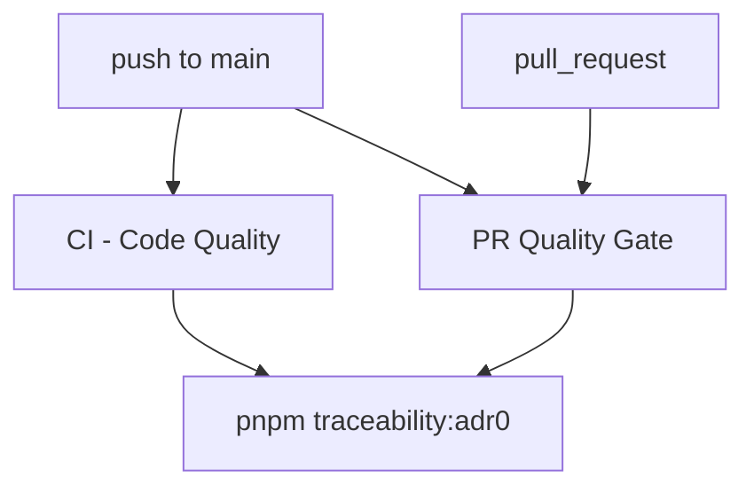
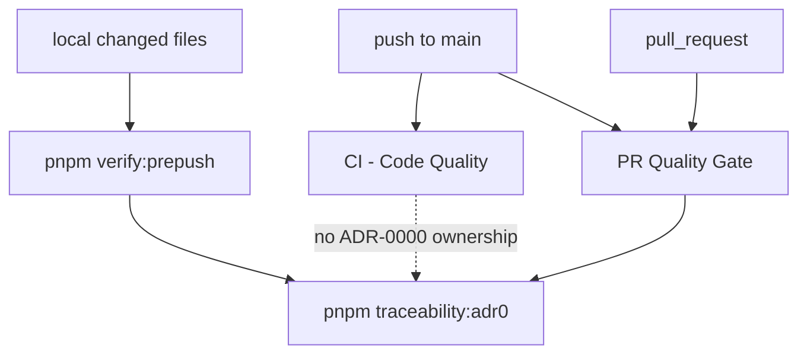

# CI ADR-0000 Owner Consolidation Plan

> **For agentic workers:** REQUIRED SUB-SKILL: Use
> superpowers:subagent-driven-development (recommended) or
> superpowers:executing-plans to implement this plan task-by-task. Steps use
> checkbox (`- [ ]`) syntax for tracking.

**Goal:** Make the remote ADR-0000 traceability gate owned by one GitHub
workflow without weakening local or PR validation.

**Architecture:** Keep `pnpm traceability:adr0` as the canonical command, keep
local changed-file routing in `verify:prepush`, and make `PR Quality Gate` the
single remote workflow owner for the blocking ADR-0000 gate. `CI - Code
Quality` keeps changed-file lint, workspace fan-out, and CI tool contracts, but
does not run the traceability command on push.

**Tech Stack:** GitHub Actions YAML, Node.js `node:test`, repository CI scope
tests, package scripts, docs governance.

---

## Owned Concern

This slice owns remote workflow ownership for the ADR-0000 traceability gate.
It does not change traceability semantics, traceability configuration, governed
paths, or the local `pnpm traceability:adr0` command.

## Current State



Problem: push coverage runs the same ADR-0000 gate twice. This is explicit
governance duplication, not extra semantic safety, because both invocations use
the same command and repository state.

## Target State



`PR Quality Gate` remains the remote governance owner because it already owns
docs governance, ARC evidence, feature mechanization, QA artifacts, and
architecture dependency checks.

## Command And Query Rails

| Rail                        | Type    | DDD owner                | Application port                   | Adapter surface       | Negative test                                             |
| --------------------------- | ------- | ------------------------ | ---------------------------------- | --------------------- | --------------------------------------------------------- |
| `RunAdr0TraceabilityGate`   | command | ADR-0000 traceability    | `package.json` `traceability:adr0` | `pr-quality-gate.yml` | `ci.yml` must not invoke `pnpm traceability:adr0`.        |
| `VerifyRemoteAdr0Ownership` | query   | Repository CI governance | `workflow-pattern-parity.test.mjs` | `pnpm test:ci-tools`  | Exactly one remote workflow owns the ADR-0000 gate.       |
| `BuildVerifyPrepushPlan`    | query   | Repository CI governance | `scripts/verify-prepush.cjs`       | `pnpm verify:prepush` | Local ADR/traceability changes still plan ADR-0000 check. |

## Feature Mechanization Manifest

```feature-mechanization
version: 1
featureId: CI-AUDIT-ADR0-OWNER
mechanizationStatus: closed
noHumanDecisionsRemaining: true
implementationPlan: docs/archive/planning/proposals/ci-adr0-owner-consolidation-plan-20260511.md
componentGuides:
  - docs/guides/testing-and-ci-capabilities.md
  - docs/planning/proposals/mandatory/governance-and-docs/verify-prepush-scope-router-plan-20260511.md
userStories:
  - docs/archive/planning/proposals/ci-adr0-owner-consolidation-plan-20260511.md
governingSources:
  - AGENTS.md
  - docs/planning/status/governance-document-rule-inventory.md
  - docs/guides/ai-work-protocol.md
  - docs/guides/testing-and-ci-capabilities.md
  - docs/architecture/command-query-rail-governance.md
  - docs/architecture/fowler-opportunity-planning-governance.md
  - docs/adr/ADR-0000-Code-generation-with-normative-traceability-required.en.md
allowedImplementationSurfaces:
  - .github/workflows/ci.yml
  - .github/workflows/pr-quality-gate.yml
  - docs/generated-docs-policy.json
  - tools/ci/workflow-pattern-parity.test.mjs
  - docs/guides/testing-and-ci-capabilities.md
  - docs/planning/reviews/ci-and-delivery/20260506-ci-build-audit-review.md
  - docs/archive/planning/proposals/ci-adr0-owner-consolidation-plan-20260511.md
  - docs/planning/closeouts/20260514-ci-audit-adr0-owner-closeout.md
  - docs/planning/status/**
  - docs/.manifest.json
  - docs/**/index.md
forbiddenImplementationSurfaces:
  - package.json
  - scripts/verify-prepush.cjs
  - traceability.config.json
  - traceability.issue-baseline.json
  - traceability.manifest.json
  - packages/**
  - apps/**
domainObjects:
  - RemoteAdr0TraceabilityGate
  - WorkflowOwnershipPolicy
fowlerSignals:
  - Duplicated remote workflow ownership
  - Governance command run in unrelated workflow
  - Local/remote responsibility drift
architectureGuards:
  - tools/ci/workflow-pattern-parity.test.mjs proves PR Quality Gate is the only remote ADR-0000 owner.
  - scripts/verify-prepush.test.cjs keeps local ADR/traceability routing intact.
cypressFlows:
  - none
commandQueryRails:
  - name: RunAdr0TraceabilityGate
    type: command
    dddOwner: ADR-0000 traceability
    object: RemoteAdr0TraceabilityGate
    applicationPort: package.json traceability:adr0
    adapterSurface: .github/workflows/pr-quality-gate.yml
    scopeAuthorization: repository governance validation on PR, push, and explicit manual governance run
    negativeTests:
      - CI - Code Quality must not invoke pnpm traceability:adr0.
      - PR Quality Gate must invoke pnpm traceability:adr0.
completionGate:
  - node --test tools/ci/workflow-pattern-parity.test.mjs scripts/verify-prepush.test.cjs
  - pnpm docs:feature-mechanization:implementation
  - pnpm verify:prepush
redGreenCycles:
  - id: ADR0-REMOTE-OWNER
    redTest: node --test tools/ci/workflow-pattern-parity.test.mjs
    expectedFailure: CI - Code Quality and PR Quality Gate both invoke pnpm traceability:adr0.
    patchSurfaces:
      - tools/ci/workflow-pattern-parity.test.mjs
      - .github/workflows/ci.yml
      - docs/guides/testing-and-ci-capabilities.md
    greenTest: node --test tools/ci/workflow-pattern-parity.test.mjs scripts/verify-prepush.test.cjs
symbols:
  - name: countWorkflowCommand
    path: tools/ci/workflow-pattern-parity.test.mjs
    dddOwner: WorkflowOwnershipPolicy
    cqRails:
      - VerifyRemoteAdr0Ownership
    fowlerSignals:
      - Duplicated remote workflow ownership
    architectureGuard: node --test tools/ci/workflow-pattern-parity.test.mjs
    cypressCoverage: N/A - repository CI workflow ownership only
    unitTests:
      - node --test tools/ci/workflow-pattern-parity.test.mjs
```

## User Stories

- As a maintainer reviewing a PR, I see ADR-0000 traceability enforced by `PR
Quality Gate`, so governance failures appear in the workflow that owns
  governance checks.
- As a maintainer pushing to `main`, I get one remote ADR-0000 traceability run,
  not duplicate runs in both CI and PR Quality.
- As a local contributor changing an accepted ADR, traceability config, or
  governed source path, `pnpm verify:prepush` still plans and runs
  `pnpm traceability:adr0`.
- As a CI maintainer changing workflow ownership, `pnpm test:ci-tools` fails if
  the ADR-0000 gate disappears or is reintroduced into `CI - Code Quality`.

## Execution Steps

- [x] Inventory current ADR-0000 remote workflow invocations.
- [x] Write a failing workflow ownership test proving exactly one remote owner.
- [x] Remove the duplicate ADR-0000 push step from `CI - Code Quality`.
- [x] Update testing/CI documentation to name `PR Quality Gate` as remote owner.
- [x] Keep generated-doc size policy current after the new governed plan increased the local fingerprint baseline artifact.
- [x] Run focused CI tooling tests.
- [x] Run `pnpm verify:prepush`.

## Closeout Update 2026-05-14

The current repository state already matches the target topology: `PR Quality
Gate` invokes `pnpm traceability:adr0` exactly once and `CI - Code Quality`
does not invoke it. This closeout slice removed remaining documentation drift in
the intake review and extended the workflow-pattern parity test to fail if that
stale duplicate-owner wording returns.
