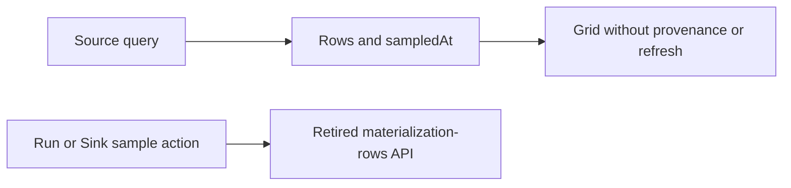
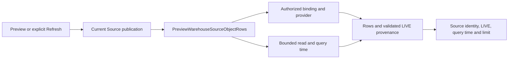
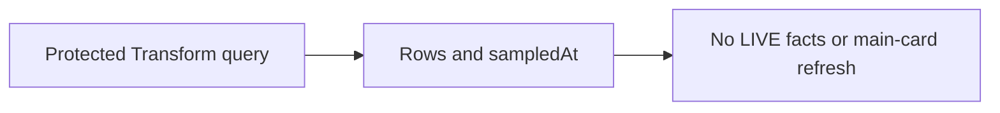
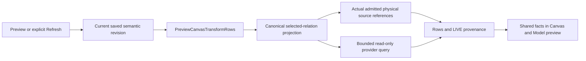

# LIVE and LOCAL data access boundary

This contract defines the boundary introduced by [DAM1 #3510](https://github.com/dunay2/dvt/issues/3510) and [#3511](https://github.com/dunay2/dvt/issues/3511). The Source LIVE wiring below is owned by [#3553](https://github.com/dunay2/dvt/issues/3553). It does not enable a LOCAL runtime.

## Authority and vocabulary

```text
physical Dataset --explicit acquisition--> Working Data (sample or full)
Working Data generation --bounded read--> Preview window
physical Dataset --bounded source query--> LIVE Preview window
```

LIVE reads the authorized remote source. LOCAL reads one authorized, stable READY generation of workspace working data. There is no AUTO/HYBRID placement or silent fallback. Preview is a bounded, transient read model, not the Dataset or an acquisition result. Full working data is labelled `full`, never `sample`.

PostgreSQL remains the transactional/control-plane authority; the workspace DuckDB plane planned by [LDC1 #3388](https://github.com/dunay2/dvt/issues/3388) owns local working rows, not graph state. Substrait plus the DVT identity sidecar remain semantic authority under ADR-0064. The existing protected Preview/Run rails own authentication, scope, provider projection, execution and response publication. A client-supplied dataset or generation identifier is a lookup request, never proof of permission, READY status or current source data.

## Shared selection and result facts

`DataAccessSelection` is a strict discriminated value object:

| Mode    | Selection                              | Admission invariant                                                                                                                                             |
| ------- | -------------------------------------- | --------------------------------------------------------------------------------------------------------------------------------------------------------------- |
| `live`  | Mode only                              | The existing rail resolves source identity and reads the remote provider; no local generation may be supplied.                                                  |
| `local` | Mode, `localDatasetId`, `generationId` | The protected rail authorizes the scope and resolves exactly that generation as READY before calculation. No latest-generation substitution or remote fallback. |

The contract also distinguishes the facts returned to a consumer:

- LIVE provenance names the source binding, query timestamp, bounded limit and pagination guarantee. It does **not** claim a local capture or arbitrary deep paging.
- LOCAL provenance names the dataset/generation, `capturedAt`, working-data coverage (`sample` or `full`) and bounded limit. It does **not** claim remote freshness from a TTL or from the time of the preview request.
- A provisional SEED/BUILDING observation has its own state and cannot be used as a normal LOCAL calculation selection. If a previous READY generation exists, it remains the selected stable generation during refresh; otherwise the calculation is unavailable.

Source observation, capture, refresh, query and serve times are distinct. A later preview of the same generation does not mint a new `capturedAt` or imply source currency. Detailed sampling method, requested/actual sizes and connector freshness evidence belong to #3396/#3397 and cannot be fabricated by this base contract.

## State and failure boundary

The state vocabulary is `absent`, `seed`, `building`, `ready`, `failed` and `cancelled`. `seed` and `building` are provisional and must carry a capture identity. `ready` carries both the completing capture and its new generation identity. `failed` and `cancelled` may retain the last READY generation, but cannot promote the attempted one. Unknown states, incompatible mode fields, malformed identities/timestamps and a provisional generation offered as a stable selection fail validation.

The shared transition guard admits a new attempt from `absent`, a same-attempt `seed -> building -> ready` progression (or a small `seed -> ready`), and a refresh/retry with a new capture identity. Refresh and failure/cancellation preserve the previous READY generation identity. It rejects direct `absent -> ready`, switching capture halfway through an attempt, dropping the previous READY identity, and resuming a failed attempt as if it were still active. Delete is a separate authorized lifecycle command, not an acquisition transition.

This contract validates shapes and selection invariants. The acquisition state machine, atomic promotion and cancellation behavior are implemented under #3514 and LDC1 #3393; this document does not claim they are already running.

## Existing rails and later wiring

`PreviewWarehouseSourceObjectRows`, `PreviewCanvasTransformRows`, `PreviewPlan` and Run remain the product intents. DAM1 wiring will carry the explicit mode and generation through those rails where applicable, without a second semantic IR, a browser SQL surface or a raw DuckDB handle. #3512 owns visible selection/state, #3515 LOCAL preview, #3516 LIVE preview, and #3518 provider/browser proof. Existing preview DTOs remain bounded display contracts until those tasks connect this context end-to-end.

The negative proof for this contract rejects AUTO/HYBRID, a LIVE request with LOCAL identifiers, LOCAL without both identifiers, provisional calculation, a fake full copy without complete coverage, and any attempt to pass SQL, credentials or filesystem paths as mode context.

## Source LIVE preview

`PreviewWarehouseSourceObjectRows` returns required LIVE `provenance` in the
existing `SourceDataSampleResponse`. This is an in-place hard cut: `sampledAt`
is removed from Source responses, not accepted as a legacy alternative.
Transform responses use the same LIVE value object as described below.

The authorized connection catalog owns provider and binding identity. The
provider probe owns `queriedAt`, the time it completed the bounded read in its
read-only transaction; this is neither capture time nor a guarantee that the
source has not changed since. The existing response identity and limit must
match the single provenance binding and limit. Empty results retain the same
provenance. PostgreSQL currently reports `bounded-first-page`: no stable ordering,
cursor, deep paging or snapshot continuation is promised.





The main Canvas Source tab exposes Refresh using its current published selection,
not the callback captured by an older sample. Loading disables repeat activation;
publication changes invalidate displayed rows and in-flight responses. Deletion,
unavailable publication or an empty selected output disables the query. Selecting
a tab never refreshes it. The grid still projects only selected columns; sorting
and column movement remain local presentation. The nested operation editor does
not receive a synthetic refresh callback from a different scope.

Retired Run/Sink row-query consumers are removed, without removing persisted Run
evidence or restoring the retired endpoint. Current destination rows must not be
presented as execution-time evidence.

The real PostgreSQL freshness proof reuses the terminal browser runner's disposable
database lease and observes a provider mutation followed by a new read, then an
empty result. Its explicit proof file is admitted by the existing integration
config only with that lease; it is not part of the generic API integration suite.
Local and CI routing both require the terminal proof when this file or its
admission changes. The retired standalone browser spec must remain absent; its
UI scenarios register inside the terminal spec and share the same runtime.

The selected solution reuses the existing query, result and provenance value
object. A new endpoint, browser clock as freshness authority, optional legacy
parser, automatic refresh, and LOCAL fallback are rejected. Query ownership stays
in the application use case; view components only render facts and emit actions.

| Scenario                  | Opportunity             | Pattern / DDD owner                            | Rail                               | Implementation surfaces                           | Unit or package test                                                   | Architecture test                                     | User-flow test                                       | Out of scope                                 |
| ------------------------- | ----------------------- | ---------------------------------------------- | ---------------------------------- | ------------------------------------------------- | ---------------------------------------------------------------------- | ----------------------------------------------------- | ---------------------------------------------------- | -------------------------------------------- |
| Source provenance         | Hidden authority        | Service Layer / WarehouseSourceDataSample      | `PreviewWarehouseSourceObjectRows` | Existing contracts, use case and PostgreSQL probe | Strict LIVE shape, binding/limit consistency, empty result and denials | No legacy response or retired API consumer            | Real protected Source read and provider-change proof | LOCAL and Transform provenance               |
| Explicit refresh          | Responsibility overload | Presentation Model / Canvas source publication | Same query                         | Source sample hook and operational drawer         | Current selection, stale response, deletion, no automatic query        | View receives facts/actions, never credentials or SQL | Pointer/keyboard Refresh and unchanged tab behavior  | Automatic refresh and nested-scope refresh   |
| Retire dead sample action | Duplicate semantics     | Remove obsolete adapter / Run evidence         | No new rail                        | Web Run/Sink ports, service and views             | Persisted evidence remains; no row-query action                        | Existing API retired-route rejection                  | Existing terminal Run proof remains green            | Reinterpreting historical execution evidence |

## Transform LIVE preview

The Transform continuation is owned by [#3555](https://github.com/dunay2/dvt/issues/3555).
`PreviewCanvasTransformRows` reuses the shared required LIVE provenance in its
existing response, replacing `sampledAt` in place. It remains a protected,
read-only query, not a Run or an acquisition. Its default 20-row and maximum
50-row limits and PostgreSQL statement timeout remain unchanged.





The provenance source set is the distinct physical inputs of the admitted
projection. A selected inner operation must not claim sources used only by a
later operation; repeated occurrences of one physical source are listed once.
All inputs retain the existing one-authorized-PostgreSQL-connection admission.
The provider probe owns query time and navigation facts; the use case owns the
source identities and requested limit. Neither SQL nor credentials are exposed.
Selected-operation previews are limited to relations in the model's saved output
semantic plan. A configured operation retained only in the authoring draft is
not admitted. Its card and contextual preview action stay unavailable with an
ES/EN explanation of this limit. The protected query independently rejects an
outside-plan relation with a typed reason before querying the provider. Source
cards retain their separate source query. Preview never connects a detached
branch to the output, rewrites the model or executes an independent branch.
`bounded-first-page` promises no stable cursor or continuation, even when the
selected relation has an explicit sort. Empty results retain provenance and
column headers.

Refresh reuses the existing revision-checked query lifecycle and current model
authority. Stale or deleted model results are invalidated; late responses cannot
become current. Tab selection and card movement do not query. The Model and
operation view renders the same provenance facts, without acquiring query or
authorization responsibilities. Technical binding identifiers remain secondary
details rather than primary headings.

The selected solution reuses the existing query and shared provenance contract.
A new endpoint, UI-derived source lineage, fallback to LOCAL or historical Run
rows, background refresh and a legacy `sampledAt` decoder are rejected.

The saved-preview response fixture has four consumers: CROSS selected-stage preview,
four-source chain persistence, operation execution and sort/fetch navigation.
Their existing cases register once in the
terminal browser run, sharing its real runtime; the changed-suite router admits
those paths and the fixture together. An import/registration guard rejects an
unregistered consumer of that sample helper. The other persistence exports
(semantic-write inspection) are unchanged by this response-shape cut. Unknown
browser paths still fail closed; Vitest is not substituted for browser evidence.

Reopen evidence waits for a fresh draft GET from that navigation, not a recorded
request from the preceding visit. The dedicated revisit gesture is consumed only
by these saved-preview scenarios; initial navigation and other workbench gestures
are unchanged. Current DOM queries replace cached references across edit-mode
transitions. Neither arbitrary sleeps nor relaxed assertions establish readiness.

| Scenario                    | Opportunity             | Pattern / DDD owner                           | Rail                         | Implementation surfaces                           | Unit or package test                                                            | Architecture test                                     | User-flow test                                                                      | Out of scope                                    |
| --------------------------- | ----------------------- | --------------------------------------------- | ---------------------------- | ------------------------------------------------- | ------------------------------------------------------------------------------- | ----------------------------------------------------- | ----------------------------------------------------------------------------------- | ----------------------------------------------- |
| Actual Transform provenance | Hidden authority        | Service Layer / CanvasTransformDataSample     | `PreviewCanvasTransformRows` | Existing contract, projection, use case and probe | Strict LIVE shape, actual fan-in/subrelation sources, empty results and denials | Existing read-only query boundary and DTO rejection   | Real PostgreSQL Transform preview and changed rows in the existing disposable lease | LOCAL and deep paging                           |
| Current Transform refresh   | Responsibility overload | Presentation Model / current Canvas authority | Same query                   | Sample lifecycle hooks and shared facts view      | Current revision, deleted model, late response and no automatic query           | Rendering never queries or determines source identity | Pointer/keyboard Refresh in existing terminal runner                                | Background polling and new proof infrastructure |
