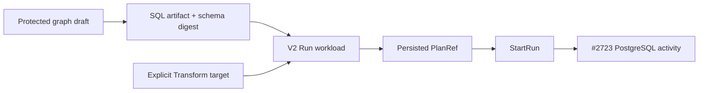

# DVT Operational Run Workload v2

## Intent

[Issue #2524](https://github.com/dunay2/dvt/issues/2524) owns lowering one exact,
protected terminal Transform closure into one Planner workload. This version
closes the minimum contract needed by
[Issue #2723](https://github.com/dunay2/dvt/issues/2723): one PostgreSQL
`table` result, an explicit destination, and no required Sink.

The existing `dvt-operational-workload.v1` remains Preview-only. It is not
reinterpreted as a Run contract.

## Existing rails and ownership

```text
PreviewPlan -> protected draft + semantic revision -> CompilePlan
            -> persisted PlanRef -> StartRun -> #2723 provider activity
```

`PreviewPlan`, `CompilePlan`, and `StartRun` remain the only rails. The Planner
workload value object owns immutable execution facts. PostgreSQL projection owns
the exact SQL artifact and expected output-schema fingerprint. #2723 owns
attempt-specific admission, provider effects, publication and result evidence.

## V2 shape

`dvt-operational-workload.v2` preserves the V1 scope, graph, semantic,
projection and connection identities, and adds these Run facts:

```text
executionIntent: run
targetProjection.schemaDigestSha256: sha256
output:
  kind: transform-result
  nodeId: exact terminal Transform
  disposition: table
  target: DvtTransformResultTargetV1
  publicationPolicy: postgres-stable-table-publication.v1
publicationBoundaries: []
```

The target connection must exactly equal the workload connection. The output
node must equal the single semantic Transform and belong to the selected graph.
Unknown members, non-PostgreSQL targets, unsupported dispositions, absent
targets, non-empty publication boundaries and stale semantic/projection
identities reject before Planner admission.

The empty publication list is deliberate: it proves that a terminal Transform
can Run without a Sink. Sink fan-out remains a later contract version rather
than an implicit side effect of result disposition.

## Output-schema fingerprint

The digest is SHA-256 over JCS of this provider-owned value:

```text
schemaVersion: dvt-postgres-output-schema.v1
columns (ordered):
  ordinal
  name
  postgresType
  nullable
  defaultExpression: null
  generatedExpression: null
  collation: null
constraints: []
indexes: []
```

The first Run cut creates none of the optional metadata represented by the
fixed null/empty members. An output with an unknown or unsupported PostgreSQL
type cannot produce V2. Reordering, renaming or changing a type changes the
digest. #2723 recomputes the same value from the candidate relation before it
can publish and compares it with managed-target metadata under ADR-0066.

## Plan facts versus attempt facts

The stable plan contains the SQL artifact, expected schema digest, exact target,
disposition and publication policy. It does not contain the new publication
token or expected predecessor. Those facts depend on the admitted Run attempt
and are created by `StartRun`/#2723, preventing circular or false plan identity.

Preview remains non-destructive: producing or inspecting this plan cannot run
SQL or materialize the configured table.

## Current and target boundary




## Compatibility and proof

- Existing V1 values and Preview behavior remain byte-shape compatible.
- The canonical step kind remains `DVT_POSTGRES_OPERATIONAL_WORKLOAD`; logical
  operators and Sources do not become steps.
- A configured `table` Transform produces V2; an absent target, `view`, mixed
  connection or unresolvable output schema fails closed rather than falling
  back to V1.
- Contract, projection, API and protected integration tests prove exact
  identities, digest determinism, one-workload N-input behavior and negative
  paths.
- No worker capability or successful Run is claimed until #2723 implements and
  proves the provider activity.

## Governing decisions

- [ADR-0064](../../adr/ADR-0064-substrait-semantic-reference-and-bounded-logical-profile.md)
- [ADR-0066](../../adr/ADR-0066-postgresql-stable-table-publication.md)
- [DVT Transform Result Target v1](./dvt-transform-result-target-v1.md)
- [Command and query rail governance](../../architecture/command-query-rail-governance.md)
