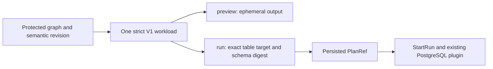

# DVT Operational Workload v1

## One contract, explicit intent

[Issue #2524](https://github.com/dunay2/dvt/issues/2524) owns lowering one exact,
protected terminal Transform closure into one Planner workload. The only admitted
format is `dvt-operational-workload.v1`. Required `executionIntent` distinguishes
`preview` from `run`; versions do not encode product intent.

`PreviewPlan`, `CompilePlan` and `StartRun` remain the existing rails. The workload
value object owns immutable execution facts; PostgreSQL projection owns SQL and
the output-schema fingerprint. The existing PostgreSQL plugin owns provider effects.

## Admission

Both intents bind the exact authorized scope, selected graph, semantic hash,
SQL artifact, projection profile/tool and PostgreSQL connection. The output must
identify the single semantic Transform in the graph. Duplicate identities,
stale hashes and unknown members reject.

| Intent    | Output                                                    | Additional required facts                                                                                                     | Executor admission                                          |
| --------- | --------------------------------------------------------- | ----------------------------------------------------------------------------------------------------------------------------- | ----------------------------------------------------------- |
| `preview` | `ephemeral-preview` and exact node ID                     | None; durable-output members reject                                                                                           | Rejected before context reads or provider effects           |
| `run`     | `transform-result`, exact node ID and `table` disposition | Explicit `DvtTransformResultTargetV1`, output-schema digest, stable-table publication policy and empty publication boundaries | Existing scope, connection, artifact and publication checks |

The Run target connection must equal the workload connection. Missing targets,
non-PostgreSQL providers, unsupported dispositions, non-empty publication
boundaries and missing schema digests reject without Preview fallback.

Physical dependencies and logical Read occurrences are distinct. A JOIN can read
one connected Source repeatedly while retaining one physical graph dependency.
Project, JOIN and Set cardinality checks remain unchanged by this hard cut.

## Stable plan versus attempt

The plan contains the target, SQL artifact, expected ordered PostgreSQL schema
digest and publication policy. Attempt-specific publication tokens and predecessor
observations belong to the existing StartRun binding, not the stable plan.
Previewing a configured Run plan never executes SQL or publishes the result.
Publication remains governed by [ADR-0066](../../adr/ADR-0066-postgresql-stable-table-publication.md).

## Rejection presentation

PreviewPlan and StartRun reuse their existing `code`, `cause`, and `reason`
envelopes. `DvtOperationalRejection.v1.ts` owns named immutable DVT definitions;
`RunExecutionRejection.v1.ts` owns execution-context and DBT Run definitions.
Both reuse the structural message descriptor from ContractsErrorModel.v1.
Binding and projection select definitions, not free-text causes or translated
text. Diagnostic `reason` is not a presentation or branching authority.

Web translates the cause through its existing English/Spanish language preference,
both for StartRun errors and the Preview rejection panel. An unknown DVT or Run cause
gets a localized generic rejection; arbitrary server/provider text is not shown.
No second error envelope, translation infrastructure, or contract version is added.

## Development hard cut and rollout

API, contracts and worker must be deployed together. V2 and old Preview payloads
without an explicit intent are rejected, not rewritten. Recreate affected plans
through protected Preview; no migration, alias, fallback or database deletion is
performed. Drain existing executions before changing workers; do not replay old
workloads through a mixed-version deployment. Rollback requires restoring the
matching producer/consumer set and recreating affected plans.

Contract, registry, projector, protected persistence, StartRun binding and plugin
tests cover both intents and fail-closed paths. Historical V2 evidence is retained
as historical proof, not acceptance of this contract.

Governing decisions: [ADR-0035](../../adr/ADR-0035-planner-public-contract-evolution-protocol.md),
[ADR-0064](../../adr/ADR-0064-substrait-semantic-reference-and-bounded-logical-profile.md),
[result target V1](./dvt-transform-result-target-v1.md) and
[rail governance](../../architecture/command-query-rail-governance.md).
