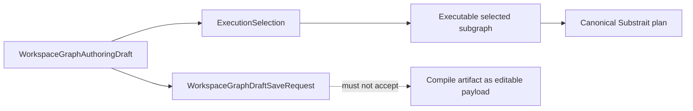

# Workspace graph draft persistence v1

## Purpose

`TF-A2` freezes the first canonical read/write persistence contract for editable
workspace graph drafts so `web`, `api`, and persistence owners share one typed
boundary.

This contract exists to block browser-local authority drift and route-local DTO
invention ahead of `TF-C4` and `TF-E2`.

## Normative sources

- `packages/@dvt/contracts/src/contracts/planner/WorkspaceGraphDraft.v1.ts`
- `packages/@dvt/contracts/src/contracts/planner/WorkspaceGraphAuthoringDraft.v1.ts`
- `packages/@dvt/contracts/src/contracts/planner/WorkspaceGraphAuthoringCommand.v1.ts`
- `packages/@dvt/contracts/src/contracts/planner/ExecutionSelection.v1.ts`
- `packages/@dvt/contracts/src/contracts/planner/ExecutableSubgraph.v1.ts`
- `packages/@dvt/contracts/src/contracts/planner/DvtTransformAuthoringAuthority.v1.ts`
- `packages/@dvt/contracts/src/schemas.ts`
- `packages/@dvt/contracts/src/validation.ts`
- `docs/planning/proposals/mandatory/runtime-and-contracts/tf-a2-workspace-graph-draft-persistence-boundary-plan-20260416.md`
- `docs/planning/proposals/mandatory/runtime-and-contracts/tf-a2-c-execution-selection-and-executable-subgraph-plan-20260423.md`

## Scope and capability envelope

Every caller-visible read and write outcome carries:

- `scope` (`tenantId`, `projectId`, `environmentId`)
- capability mode (`writable`, `read_only`, `forbidden`)
- explicit `canRead` and `canWrite` booleans aligned with mode
- one governed reason from a closed vocabulary

The capability envelope is canonical and must not be replaced by UI-only
heuristics.

## Audit envelope and correlation

Every protected boundary outcome carries:

- `correlationId`
- `decisionId`
- `action` (`draft_read` or `draft_write`)
- `outcome` (`allowed`, `read_only`, `forbidden`, `conflict`)
- server `recordedAt`

`correlationId` is the join key across caller-visible behavior, audit evidence,
and runtime observability.

## Format hard-cut posture

Read success outcomes carry format metadata:

- `schemaVersion`
- `storedSchemaVersion`

Typed format failures are explicit:

- `unsupported_schema_version`
- `corrupt_payload`

Unsupported or corrupt drafts fail closed through typed outcomes; they do not
silently degrade to empty canvas behavior. This contract has no compatibility
migration state: unsupported stored versions are rejected and must be handled
by an explicit product operation outside this read/write route if one is ever
approved.

For `dvt:transform` nodes, an existing `transformAuthoring` metadata value is
part of that format boundary. The aggregate parser must verify the exact pinned
Substrait protobuf version, semantic byte digest, profile coordinates and DVT
sidecar binding on both save and read. Invalid semantic truth is a corrupt
payload; it never falls back to SQL, VTX1 metadata or another document source.

## Compare-and-swap and idempotency

Write requests must include:

- `expectedRevision` (compare-and-swap token)
- `idempotencyKey` (logical save retry identity)
- typed graph draft payload

Write outcomes are explicit and typed:

- `saved`
- `conflict`
- `denied`
- `unsupported_schema_version`
- `idempotency_mismatch`
- `authoring_authority_conflict`

The v1 merge posture is reject-on-stale. The server does not auto-merge
concurrent edits in this contract line.

## Authoring aggregate posture

`WorkspaceGraphDraft.v1` persists `WorkspaceGraphAuthoringDraft` as editable
authoring truth. The payload can represent zero nodes, one node, disconnected
graphs, and partially connected graphs. Those states are valid authoring states
even when they are not compile-ready.

The persisted authoring draft is projected into the canonical VTX2 Substrait
plan only after execution selection. Compile-shaped payloads must not be
accepted as the protected draft save model.

## Canvas authoring field budgets

Every editable string admitted into `WorkspaceGraphAuthoringDraft` has one
contract-owned category, unit, normalization and maximum. The closed PCV1-I1
census and implementation sequence live in
[GH-3019 Canvas authoring field budgets](../../planning/proposals/mandatory/runtime-and-contracts/pcv1-canvas-authoring-field-budgets-3019-20260908.md).

The v1 field categories are:

| Category                                     | Maximum and unit                        | Normalization                                             |
| -------------------------------------------- | --------------------------------------- | --------------------------------------------------------- |
| Human node name                              | 256 Unicode code points                 | trim surrounding whitespace; required                     |
| Node description                             | 4,096 Unicode code points               | preserve admitted Unicode and line breaks                 |
| Business tag                                 | 32 Unicode code points; at most 32 tags | trim surrounding whitespace; reject normalized duplicates |
| PostgreSQL Source, output or Sink identifier | 63 UTF-8 bytes per segment              | validate the exact proposed identifier; no silent repair  |
| String literal                               | 4,096 UTF-8 bytes                       | preserve the exact admitted value                         |
| Timestamp literal                            | canonical RFC3339 with milliseconds     | parse the exact trimmed value                             |
| Closed choice                                | exact declared enum members             | no fallback from an unknown value                         |
| Opaque reference                             | declared membership and scope           | no user-text budget or identity derivation                |

Malformed Unicode, excess length, excess tag count, and unknown closed choices
are typed validation failures. They must leave the stored revision unchanged.
No boundary truncates, slices, repairs or relies on PostgreSQL identifier
truncation. Logical output names remain provider-neutral; publication separately
rejects a name that the selected physical target cannot represent.

`metadata` is not an unbounded user-editable escape hatch. Every editable member
inside node or edge metadata must be represented by a typed contract with one of
these categories or by a separately governed document budget. UI controls consume
the same policy but do not own it. Rejected proposals and focus are preserved by
the existing authoring-result rail; persistence is claimed only after the
`SaveWorkspaceGraphDraft` acknowledgement.

## Selection-to-execution seam

Preview and run must now cross two explicit contracts after draft persistence:

- `ExecutionSelection` carries operator intent only
- `ExecutableSubgraph` carries the derived selected closure and diagnostics

That seam prevents unrelated loose nodes from becoming implicit whole-draft
blockers and keeps compile/runtime concerns out of the persisted draft
envelope.

## Consumer rule

- `api` must validate protected draft read/write boundaries against the shared
  contract.
- `web` must adopt the workspace draft boundary and remove local persistence
  authority from product paths.
- `web` and `api` must preserve capability, audit, and format metadata to keep
  diagnosis and recovery deterministic.
- `web` draft reads in `api` mode must call
  `GET /workspace/graph/draft?tenantId=<...>&projectId=<...>&environmentId=<...>`
  and parse the canonical `WorkspaceGraphDraftReadResponse` envelope instead of
  assuming a bare record payload.
- `web` draft writes in `api` mode must send the canonical
  `WorkspaceGraphDraftSaveRequest` body, including protected `scope`, active
  `schemaVersion`, explicit `expectedRevision`, `idempotencyKey`, and typed
  draft payload.
- `web` should isolate that protected boundary behind a dedicated draft
  authoring port that preserves boundary-native outcomes before any projection
  into route-level DTOs:
  - read path: canonical `WorkspaceGraphDraftReadResponse`, including
    `not_found`
  - write path: canonical `WorkspaceGraphDraftSaveResponse`, including
    unsupported schema, idempotency mismatch, and authoring-authority conflict
  - capability, audit, and format metadata must survive that seam intact
- `web` must treat `WorkspaceGraphDraftSaveResponse` as an outcome envelope:
  `saved` returns `revision`, `conflict` returns `currentRevision`, and callers
  that need the materialized record must perform a follow-up scoped read rather
  than inventing `{ record }` or `{ current }` response shapes.
- `WorkspaceGraphDraft.v1` is structural draft authority. It governs scoped
  node identity, typed node payloads, typed edges, and persisted authoring node
  positions. Any React Flow viewport state beyond those positions remains a
  web projection concern.
- preview and run callers must produce canonical `ExecutionSelection` payloads
  and consume planner-derived `ExecutableSubgraph` results instead of assuming
  whole-draft compile.

## Related

- [Planner contracts index](./index.md)
- [Execution selection and executable subgraph v1](./execution-selection-and-executable-subgraph-v1.md)
- [ADR-0064: Substrait semantic reference](../../adr/ADR-0064-substrait-semantic-reference-and-bounded-logical-profile.md)
- [Workspace authoring draft aggregate](../../architecture/components/planner/workspace-authoring-draft-aggregate.md)
