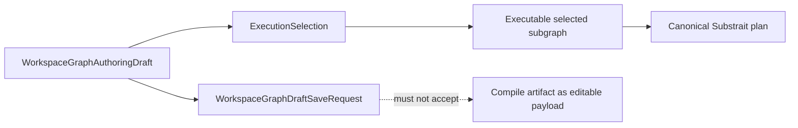
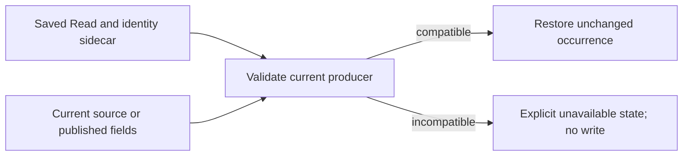
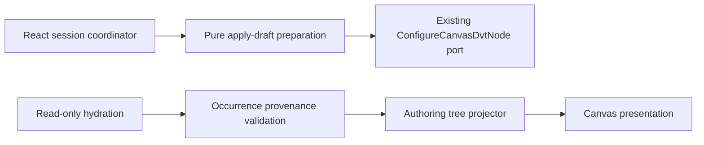

# Workspace graph draft persistence v1

## Purpose

`TF-A2` freezes the first canonical read/write persistence contract for editable
workspace graph drafts so `web`, `api`, and persistence owners share one typed
boundary.

This contract exists to block browser-local authority drift and route-local DTO
invention ahead of `TF-C4` and `TF-E2`.

## Normative sources

- `packages/@dvt/contracts/src/contracts/planner/WorkspaceGraphDraft.v1.ts`
- `packages/@dvt/contracts/src/contracts/planner/WorkspaceGraphAuthoringDraft.v1.ts`
- `packages/@dvt/contracts/src/contracts/planner/WorkspaceGraphAuthoringCommand.v1.ts`
- `packages/@dvt/contracts/src/contracts/planner/ExecutionSelection.v1.ts`
- `packages/@dvt/contracts/src/contracts/planner/ExecutableSubgraph.v1.ts`
- `packages/@dvt/contracts/src/contracts/planner/DvtTransformAuthoringAuthority.v1.ts`
- `packages/@dvt/contracts/src/schemas.ts`
- `packages/@dvt/contracts/src/validation.ts`

## Scope and capability envelope

Every caller-visible read and write outcome carries:

- `scope` (`tenantId`, `projectId`, `environmentId`)
- capability mode (`writable`, `read_only`, `forbidden`)
- explicit `canRead` and `canWrite` booleans aligned with mode
- one governed reason from a closed vocabulary

The capability envelope is canonical and must not be replaced by UI-only
heuristics.

## Audit envelope and correlation

Every protected boundary outcome carries:

- `correlationId`
- `decisionId`
- `action` (`draft_read` or `draft_write`)
- `outcome` (`allowed`, `read_only`, `forbidden`, `conflict`)
- server `recordedAt`

`correlationId` is the join key across caller-visible behavior, audit evidence,
and runtime observability.

## Format hard-cut posture

Read success outcomes carry format metadata:

- `schemaVersion`
- `storedSchemaVersion`

Typed format failures are explicit:

- `unsupported_schema_version`
- `corrupt_payload`

Unsupported or corrupt drafts fail closed through typed outcomes; they do not
silently degrade to empty canvas behavior. This contract has no compatibility
migration state: unsupported stored versions are rejected and must be handled
by an explicit product operation outside this read/write route if one is ever
approved.

For `dvt:transform` nodes, an existing `transformAuthoring` metadata value is
part of that format boundary. The aggregate parser must verify the exact pinned
Substrait protobuf version, semantic byte digest, profile coordinates and DVT
sidecar binding on both save and read. Invalid semantic truth is a corrupt
payload; it never falls back to SQL, VTX1 metadata or another document source.

## Compare-and-swap and idempotency

Write requests must include:

- `expectedRevision` (compare-and-swap token)
- `idempotencyKey` (logical save retry identity)
- typed graph draft payload

Write outcomes are explicit and typed:

- `saved`
- `conflict`
- `denied`
- `unsupported_schema_version`
- `idempotency_mismatch`
- `authoring_authority_conflict`

The v1 merge posture is reject-on-stale. The server does not auto-merge
concurrent edits in this contract line.

## Authoring aggregate posture

`WorkspaceGraphDraft.v1` persists `WorkspaceGraphAuthoringDraft` as editable
authoring truth. The payload can represent zero nodes, one node, disconnected
graphs, and partially connected graphs. Those states are valid authoring states
even when they are not compile-ready.

The persisted authoring draft is projected into the canonical VTX2 Substrait
plan only after execution selection. Compile-shaped payloads must not be
accepted as the protected draft save model.

```mermaid
flowchart LR
  Draft["WorkspaceGraphAuthoringDraft"] --> Save["WorkspaceGraphDraftSaveRequest"]
  Draft --> Selection["ExecutionSelection"]
  Selection --> Subgraph["Executable selected subgraph"]
  Subgraph --> Compile["Canonical Substrait plan"]
  Save -. must not accept .-> Legacy["Compile artifact as editable payload"]
```

## Canvas authoring field budgets

### Incomplete relational source identity

The existing `DvtRelationalAuthoringDraft.v1` contract persists each pending source occurrence as a
single canonical Substrait Read document and its existing DVT identity sidecar.
The source node reference identifies the producer; the saved Read owns local
RelationId, FieldIds, field hierarchy and ordinals. It does not copy the producer's
operations. The former positional `fieldIds` snapshot is unsupported: missing
provenance must not be guessed from array order or display names.

```mermaid
flowchart LR
  Saved[Saved Read and identity sidecar] --> Validate[Validate current producer]
  Current[Current source or published fields] --> Validate
  Validate -->|compatible| Restore[Restore unchanged occurrence]
  Validate -->|incompatible| Reject[Explicit unavailable state; no write]
```

For model producers, validate the saved `producerRef` by stable published FieldId
and admitted type; reorder or alias changes cannot change the local reference.
Additional published fields do not widen a saved occurrence. Removed fields or
incompatible types make restoration unavailable. Physical sources require the
same connected source reference and the same physical column names and types;
physical order may change, but rename, addition, removal or type change must
reject rather than silently bind another column. Physical names are source
identifiers, not display aliases.

Hydration is read-only. An incompatible saved occurrence blocks editing and
preview of that incomplete draft and displays an explicit diagnostic. It does
not silently discard pending operations, initialize a replacement document, or
save a repair. Existing protected draft scope, revision and format outcomes
continue to govern persistence. The current contract is corrected in place:
no second version, compatibility reader or automatic data migration is introduced.
Previously stored positional snapshots are rejected, not guessed or rewritten.

The existing `SaveWorkspaceGraphDraft`, `ConfigureCanvasDvtNode` and
`ProjectCanvasRelationalTree` rails own this boundary. Required regressions cover
reorder with equal cardinality, physical rename/add/remove/type changes, producer
aliases and publication changes, independent occurrences, dependent expressions,
unsupported positional payloads and no implicit hydration writes.

The React session only coordinates hydration, analysis and existing commands.
The pure apply-draft projector owns incomplete/cleared/change decisions and the
exact persistence request. Occurrence identity code does not import tree
presentation; pending Read rendering belongs to the existing authoring query
projector. Catalogue projection owns presentation selection and participation,
not persistence or producer identity validation.

```mermaid
flowchart LR
  Session[React session coordinator] --> Apply[Pure apply-draft preparation]
  Apply --> Command[Existing ConfigureCanvasDvtNode port]
  Hydrate[Read-only hydration] --> Identity[Occurrence provenance validation]
  Identity --> Query[Authoring tree projector]
  Query --> View[Canvas presentation]
```

### Disconnected operation configuration

Operation input cardinality has one contract-owned policy, consumed by both
the draft parser and Web admission. UNION ALL and UNION DISTINCT accept two or
more ordered ports. Other operations retain their declared fixed cardinality.
Null ports represent incomplete authoring, not executable semantics. The current
contract is corrected in place; no new payload version, migration or compatibility
reader is introduced. An explicit UNION topology edit preserves output selection,
aliases and identities and rebinds operand lineage; incompatible schemas or
connections cannot produce executable semantics.

Removing an incorporated relation edge uses the existing incomplete authoring
draft, preserving source and operation identities. `configurationDocument` retains
the original canonical Substrait subtree solely for editing and exact reconnect;
it is not executable authority. It must own the same operation relation identity
and cannot coexist with `semanticDocument`. The latter still requires every Input.
Disconnect invalidates the consumer and all its descendants: they publish no
fields or Preview. Only reconnect to the exact original producer identities and
canonical contents can restore that configuration automatically. Comparison uses
the existing composition mapper to normalize embedding-local relation/function
anchors and excludes unused function declarations inherited from a consumer.
It preserves field identities, schema, aliases, provenance, and expression meaning;
changed function identities or producer contents must not compare equal.
Changed producers require explicit
reconfiguration; display-name matching, default expression replacement and stale
semantic resurrection are forbidden. Apply removes obsolete complete authority
when the terminal is incomplete. Save/reopen preserves this state through the
existing protected draft boundary. No new version or migration is introduced.

### Completed relational layout

Completed relational authoring retains nonempty `positions` in the existing v1
DTO but omits `outputRelationId`. Absence is allowed only when `sources` and
`operations` are empty: the current canonical semantic root owns Output.
`outputRelationId: null` means explicitly disconnected, while a string denotes
pending explicit wiring. Coordinates remain finite and nonnegative and confer no
semantic authority. No new version, migration or compatibility reader is added.
An empty completed snapshot is omitted entirely. Operation completion and
subsequent inspector saves preserve positions by stable card ID. Movement alone
does not become a save command.

Only explicitly moved cards belong to the retained manual-position map. A drag
may temporarily freeze other visible cards, but acceptance must not turn those
automatic coordinates into persisted manual positions. Automatic Output follows
the current canonical root after subsequent insertions; an explicitly moved
Output remains manual. Pointer and keyboard movement obey the same boundary.

### Pending Read identity coverage

Pending source Reads require complete stable field identity coverage of their
saved `baseSchema`: exactly one sidecar binding per root field and nested struct
field, at the correct parent and sibling ordinal. List/map fields remain single
bound fields under the existing structural analysis model. Missing, duplicate,
out-of-range or extra bindings reject the draft on both write and read. The same
contract-owned policy governs Read schema derivation and pending-source restore,
for physical sources and producer-backed inputs alike. Binding array order does
not matter; opaque identities are preserved, never regenerated from position or
display name. Invalid stored state uses the existing format-error outcome, with
no migration, silent repair, fallback or save on reopen.

### String categories

Every editable string admitted into `WorkspaceGraphAuthoringDraft` has one
contract-owned category, unit, normalization and maximum. The closed PCV1-I1
census and implementation sequence live in
[GH-3019 Canvas authoring field budgets](../../planning/proposals/mandatory/runtime-and-contracts/pcv1-canvas-authoring-field-budgets-3019-20260908.md).

The v1 field categories are:

| Category                                     | Maximum and unit                        | Normalization                                             |
| -------------------------------------------- | --------------------------------------- | --------------------------------------------------------- |
| Human node name                              | 256 Unicode code points                 | trim surrounding whitespace; required                     |
| Node description                             | 4,096 Unicode code points               | preserve admitted Unicode and line breaks                 |
| Business tag                                 | 32 Unicode code points; at most 32 tags | trim surrounding whitespace; reject normalized duplicates |
| PostgreSQL Source, output or Sink identifier | 63 UTF-8 bytes per segment              | validate the exact proposed identifier; no silent repair  |
| String literal                               | 4,096 UTF-8 bytes                       | preserve the exact admitted value                         |
| Timestamp literal                            | canonical RFC3339 with milliseconds     | parse the exact trimmed value                             |
| Closed choice                                | exact declared enum members             | no fallback from an unknown value                         |
| Opaque reference                             | declared membership and scope           | no user-text budget or identity derivation                |

Malformed Unicode, excess length, excess tag count, and unknown closed choices
are typed validation failures. They must leave the stored revision unchanged.
No boundary truncates, slices, repairs or relies on PostgreSQL identifier
truncation. Logical output names remain provider-neutral; publication separately
rejects a name that the selected physical target cannot represent.

`metadata` is not an unbounded user-editable escape hatch. Every editable member
inside node or edge metadata must be represented by a typed contract with one of
these categories or by a separately governed document budget. UI controls consume
the same policy but do not own it. Rejected proposals and focus are preserved by
the existing authoring-result rail; persistence is claimed only after the
`SaveWorkspaceGraphDraft` acknowledgement.

## Selection-to-execution seam

Preview and run must now cross two explicit contracts after draft persistence:

- `ExecutionSelection` carries operator intent only
- `ExecutableSubgraph` carries the derived selected closure and diagnostics

That seam prevents unrelated loose nodes from becoming implicit whole-draft
blockers and keeps compile/runtime concerns out of the persisted draft
envelope.

## Consumer rule

- `api` must validate protected draft read/write boundaries against the shared
  contract.
- `web` must adopt the workspace draft boundary and remove local persistence
  authority from product paths.
- `web` and `api` must preserve capability, audit, and format metadata to keep
  diagnosis and recovery deterministic.
- `web` draft reads in `api` mode must call
  `GET /workspace/graph/draft?tenantId=<...>&projectId=<...>&environmentId=<...>`
  and parse the canonical `WorkspaceGraphDraftReadResponse` envelope instead of
  assuming a bare record payload.
- `web` draft writes in `api` mode must send the canonical
  `WorkspaceGraphDraftSaveRequest` body, including protected `scope`, active
  `schemaVersion`, explicit `expectedRevision`, `idempotencyKey`, and typed
  draft payload.
- `web` should isolate that protected boundary behind a dedicated draft
  authoring port that preserves boundary-native outcomes before any projection
  into route-level DTOs:
  - read path: canonical `WorkspaceGraphDraftReadResponse`, including
    `not_found`
  - write path: canonical `WorkspaceGraphDraftSaveResponse`, including
    unsupported schema, idempotency mismatch, and authoring-authority conflict
  - capability, audit, and format metadata must survive that seam intact
- `web` must treat `WorkspaceGraphDraftSaveResponse` as an outcome envelope:
  `saved` returns `revision`, `conflict` returns `currentRevision`, and callers
  that need the materialized record must perform a follow-up scoped read rather
  than inventing `{ record }` or `{ current }` response shapes.
- `WorkspaceGraphDraft.v1` is structural draft authority. It governs scoped
  node identity, typed node payloads, typed edges, and persisted authoring node
  positions. Any React Flow viewport state beyond those positions remains a
  web projection concern.
- preview and run callers must produce canonical `ExecutionSelection` payloads
  and consume planner-derived `ExecutableSubgraph` results instead of assuming
  whole-draft compile.

## Related

- [Planner contracts index](./index.md)
- [Execution selection and executable subgraph v1](./execution-selection-and-executable-subgraph-v1.md)
- [ADR-0064: Substrait semantic reference](../../adr/ADR-0064-substrait-semantic-reference-and-bounded-logical-profile.md)
- [Workspace authoring draft aggregate](../../architecture/components/planner/workspace-authoring-draft-aggregate.md)
