## Evidence Doc: compiledCodeRef Ownership (ADR-0032)

## Qué cambia

- Nuevo tipo `CompiledCodeRef { sha256, storageUri, sizeBytes, encoding? }` en `@dvt/contracts`.
- Campo opcional `compiledCodeRef` en `StepStarted.payload` — no breaking.
- `@dvt/planner` calcula SHA-256 del SQL compilado, lo sube a object storage, adjunta la referencia en `stepTypeConfig` del step del plan (campo opaco, no campo contractual firmado).
- `@dvt/adapter-temporal` activity lee `compiledCodeRef` de `stepTypeConfig` y lo propaga al evento `StepStarted`.
- `@dvt/traceability-service` lee la referencia, resuelve el blob (LRU cache + retry exponencial), construye `SqlJobFacet` para OpenLineage.
- Fail-open en ambas direcciones: ausencia o resolución fallida no falla el run.
- `file://` URI solo para desarrollo local — producción requiere S3/GCS/MinIO compartido.
- Blobs huérfanos gestionados por lifecycle policy del bucket (TTL alineado con run_events retention, default 90d).

## Diagrama de flujo

```mermaid
flowchart LR
  RR["dbt run_results.json\n(compiled_code por nodo)"]
  PLAN["@dvt/planner\nsha256 + upload → storageUri\n(ICompiledCodeStorage port)"]
  STYPE["ExecutionPlan.steps[i]\n.stepTypeConfig.compiledCodeRef\n(transport interno, no contrato firmado)"]
  EVENT["StepStarted.payload\n.compiledCodeRef"]
  STORE["run_events\n(solo referencia, no SQL)"]
  TRACE["@dvt/traceability-service\nLRU cache + retry → SqlJobFacet\n(ICompiledCodeReader port)"]
  OL["OpenLineage\nRunEvent + SqlJobFacet"]
  MARQUEZ["Marquez"]

  RR --> PLAN
  PLAN -->|CompiledCodeRef| STYPE
  STYPE -->|activity propaga| EVENT
  EVENT --> STORE
  STORE --> TRACE
  TRACE -->|fail-open si blob no resuelve| OL
  OL --> MARQUEZ
```

## Ports e implementaciones

| Port                   | Implementación                                     | Entorno                    |
| ---------------------- | -------------------------------------------------- | -------------------------- |
| `ICompiledCodeStorage` | `S3CompiledCodeStorage`                            | Producción                 |
| `ICompiledCodeStorage` | `MinioCompiledCodeStorage`                         | Staging / CI               |
| `ICompiledCodeStorage` | `FileSystemCompiledCodeStorage`                    | Desarrollo local (file://) |
| `ICompiledCodeStorage` | `InMemoryCompiledCodeStorage`                      | Tests unitarios            |
| `ICompiledCodeReader`  | `S3CompiledCodeReader` / `MinioCompiledCodeReader` | Prod / CI                  |
| `ICompiledCodeReader`  | `InMemoryCompiledCodeReader`                       | Tests unitarios            |

## Evidencia (paths/links)

- ADR: `docs/adr/ADR-0032-compiledcoderef-ownership.md`
- Contratos: `packages/@dvt/contracts/src/engine/IRunStateStore.v1.ts` — añadir `CompiledCodeRef`
- Tests unitarios: [TEST PATHS PENDING]
- Tests de integración (MinIO): [TEST PATHS PENDING]
- Golden fixture StepStarted con `compiledCodeRef`: [PENDING]

## Riesgos

- **R-0032-03** (MEDIO): SQL compilado puede contener nombres de tablas/columnas o literales considerados datos sensibles. Mitigación: bucket privado, IAM por tenant, encryption at rest/transit, no loguear key completa de `storageUri` en logs de acceso.
- **R-0032-04** (BAJO): Sin política de lifecycle en el bucket, los blobs crecen indefinidamente. Mitigación: TTL 90d alineado con retención de `run_events`.
- **R-0032-06** (MUY BAJO): Blobs huérfanos si run falla antes de `StepStarted`. Mitigación: lifecycle TTL + content-addressable permite reuso automático.
- **R-0032-07** (BAJO): `file://` URI usado en producción. Mitigación: INV-CCREF-007 + validación en startup.
- Ver tabla completa en ADR-0032 §7.

## Info faltante para cierre del ED

- [ ] PR number cuando se cree
- [ ] Paths reales de tests unitarios e integración una vez implementados
- [ ] `storageUri` scheme acordado para CI (MinIO en docker-compose.test.yml)
- [ ] Decisión de IAM: ¿un bucket por tenant o prefijo por tenant en bucket compartido?
- [ ] Valores finales de `COMPILED_CODE_CACHE_TTL_MS` y `COMPILED_CODE_CACHE_MAX_ENTRIES` tras benchmark
