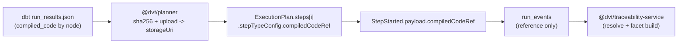

## Evidence Doc: compiledCodeRef Ownership (ADR-0032)

## What changed

- New `CompiledCodeRef { sha256, storageUri, sizeBytes, encoding? }` type in `@dvt/contracts`.
- Optional `compiledCodeRef` in `StepStarted.payload` (non-breaking).
- `@dvt/planner` computes SHA-256 for compiled SQL, uploads to object storage, and attaches the reference in `stepTypeConfig` (opaque transport field).
- `@dvt/adapter-temporal` extracts `compiledCodeRef` with a type guard and propagates it to `StepStarted.payload`.
- `@dvt/contracts` now includes golden fixtures/tests for StepStarted with/without `compiledCodeRef`.
- `@dvt/traceability-service` resolves compiled code via reader+cache+retry and builds SQL facets in fail-open mapping.

## Flow

## Delivery Status by Task

- T4-1 Contracts: closed.
- T4-2 Planner: closed.
- T4-3 Adapter Temporal propagation: closed.
- T4-4 Traceability reader/cache/facet mapping: closed.

## Verification Snapshot

- `pnpm --filter @dvt/contracts test`
- `pnpm --filter @dvt/planner test`
- `pnpm --filter @dvt/adapter-temporal test`
- `pnpm --filter @dvt/traceability-service test`
- Result (2026-03-07): all commands passed.
- Note: `test/integration.time-skipping.test.ts` requires Temporal ephemeral server privileges and failed in this local environment (`os error 5`), so it is tracked as environment-gated integration evidence.

## Closure Decision

G4 (`compiledCodeRef ownership`, ADR-0032) is formally closed as of 2026-03-07.
