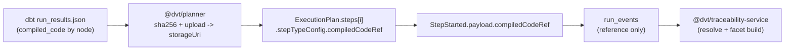

## Evidence Doc: compiledCodeRef Ownership (ADR-0032)

## What changed

- New `CompiledCodeRef { sha256, storageUri, sizeBytes, encoding? }` type in `@dvt/contracts`.
- Optional `compiledCodeRef` in `StepStarted.payload` (non-breaking).
- `@dvt/planner` computes SHA-256 for compiled SQL, uploads to object storage, and attaches the reference in `stepTypeConfig` (opaque transport field).
- `@dvt/adapter-temporal` extracts `compiledCodeRef` with a type guard and propagates it to `StepStarted.payload`.
- `@dvt/traceability-service` remains pending (reader/cache + SqlJobFacet build path).

## Flow

## T4-3 status

- Implemented in adapter-temporal.
- Unit tests added for valid/invalid/absent reference extraction and payload propagation.
- Adapter tests pass: `pnpm --filter @dvt/adapter-temporal test`.
- Post-implementation QA hardening documented in
  [`docs/planning/gaps/G4-T4-3-QA-ARCH-REVIEW.md`](../planning/gaps/G4-T4-3-QA-ARCH-REVIEW.md).

## Remaining items for ED closure

- [ ] PR number when created
- [ ] Contracts golden fixtures for StepStarted with/without compiledCodeRef
- [ ] Traceability service reader/cache/facet implementation and tests
- [ ] Final CI evidence including end-to-end path
