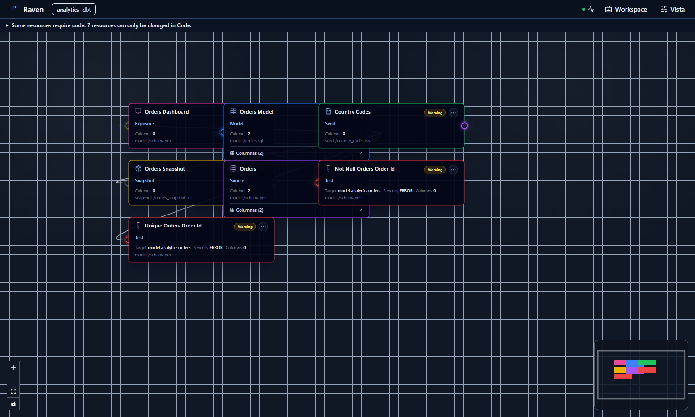
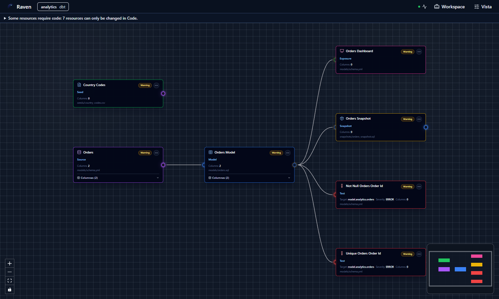
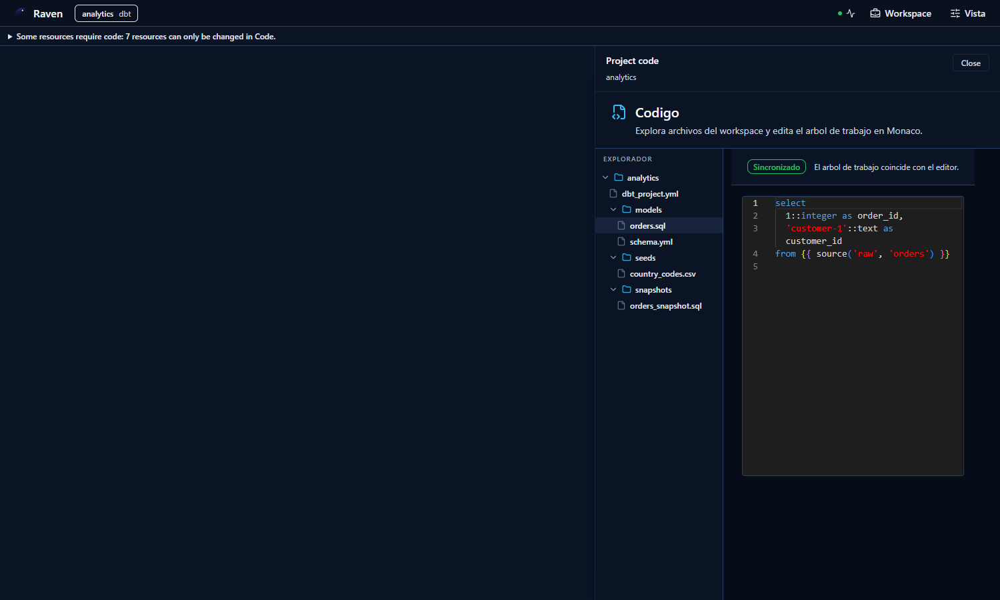
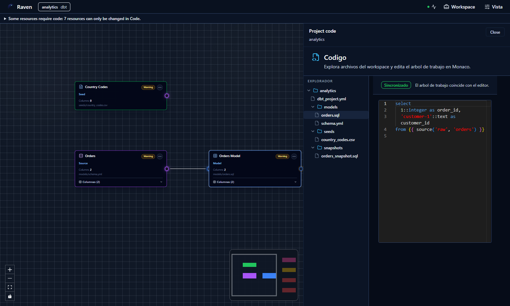

# Summary

This evidence records the additive authority-binding and dbt project graph
projection contracts plus the protected server-side analysis query required by
phase two of ADR-0060.

# Scope

- Canvas authority is explicit and mutually exclusive between graph draft and
  dbt project files.
- `ProjectDbtGraphFromFiles` reuses workspace scope authorization and does not
  infer file authority from project contents.
- The analyzer runs `dbt parse` with a server-managed profile, sanitized
  environment, bounded output and timeout, and isolated target/log paths.
- Pre-existing project `target/manifest.json` files are ignored; only the
  current isolated invocation can produce the projection.
- Valid, invalid, and unavailable analysis remain explicit. Phase two does not
  enable file-backed Preview, Run, or visual mutation.
- Resources and dependencies use dbt `unique_id`; projections are validated for
  duplicate identity and missing edge endpoints.

# Authority

The canonical behavior and DoD remain in ADR-0060, the mandatory dbt project
roundtrip plan, and the Planning DB `ProjectDbtGraphFromFiles` rail. This file is
validation evidence only.

# Browser Evidence

The first browser pass exposed overlapping projected nodes. The corrected
projection applies deterministic layout while preserving the file-authoritative
graph.

The contextual Code split initially collapsed the graph surface. The corrected
layout keeps the graph visible beside the file explorer and editor.

