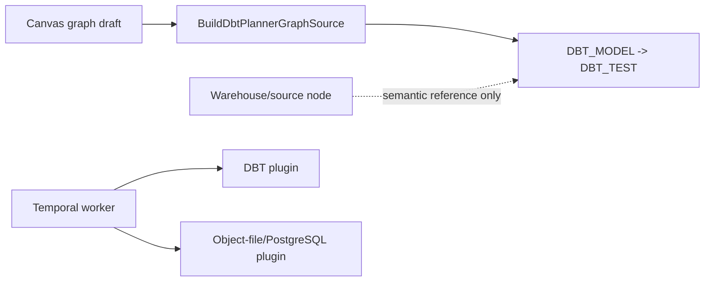
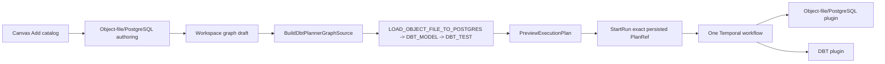

# Summary

HET1 proves that a user can author and execute one heterogeneous Canvas graph
through public product rails:

`LOAD_OBJECT_FILE_TO_POSTGRES -> DBT_MODEL -> DBT_TEST`.

The live proof uses a content-addressed CSV in a pinned MinIO container, the
protected API, PostgreSQL, Temporal, the production worker composition, dbt and
the Web application. It does not intercept graph or plan routes, construct a
plan, seed run state, or insert staging rows outside the run.

# Design evidence

The design and responsibility split were recorded on GitHub issue 2180 before
the implementation slice. The relevant current and target states are preserved
here as ARC evidence.

The retained worker already composed both plugins, but Canvas previously
excluded the executable load from the dbt closure. A warehouse source could not
be reused because it represents a relation that already exists.

# Decisions and invariants

- Object-file/PostgreSQL authoring persists only the strict v1 contract and
  opaque credential references.
- `BuildDbtPlannerGraphSource` remains the single graph-source query and keeps
  the load-to-model edge as both lineage and execution dependency.
- DBT artifact projection points `source()` at the exact scoped staging
  relation produced by the loader; it does not execute ingestion.
- Repeated Preview of an unchanged DBT artifact set returns an authorized no-op
  publication receipt instead of sending an invalid empty mutation to the
  generic workspace batch gateway.
- Runtime dispatch remains registry-owned. No step-family conditional was added
  to the engine, `RunPlanWorkflow`, or `StepActivityDispatcher`.
- Cancellation follows ADR-0007 and ADR-0047: the active layer settles,
  `RunCancelRequested` precedes `RunCancelled`, and the downstream DBT test does
  not start. Recovery creates a distinct run from the exact stored plan and
  trusted context.

# Executable outcomes

The public browser proof establishes:

- the exact three-step Preview and persisted `planId` used by StartRun;
- successful load evidence for two rows, matching source SHA-256 and byte size,
  followed by completed DBT model and test steps;
- an object integrity mismatch that fails ingestion and prevents both DBT
  steps;
- a failing DBT test that retains completed load/model evidence and fails the
  run honestly;
- public cancellation with a complete atomic load, a settled active DBT layer,
  no downstream test execution, and ordered runtime-owned cancellation facts;
- public recovery to a new run using the same persisted plan, completing all
  three steps;
- absence of credentials and source payload bytes from plan-visible run
  evidence.

The `RecordFeatureMechanizationRail` Planning DB command records
`RunHet1PublicVerticalLiveProof` and its reuse of the existing product
command/query rails in the exported canonical state; it creates no parallel
orchestration path or mutable-state SQL migration.
