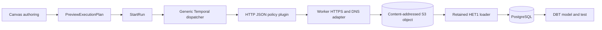

# Summary

HET2 proves the public heterogeneous route
`ACQUIRE_HTTP_JSON_ARTIFACT -> LOAD_OBJECT_FILE_TO_POSTGRES -> DBT_MODEL -> DBT_TEST`
through the existing Preview, StartRun, status, event, cancellation and recovery
rails. The implementation adds no HTTP proxy or product route.

# Boundary evidence

- Plans contain opaque `http-endpoint:*`, `http-auth:*`, object-store and
  PostgreSQL references, never a URL, token or secret header.
- The worker performs HTTPS-only GET, per-hop DNS/IP validation, address
  pinning, same-origin bounded redirects, timeout, byte, encoding, media-type,
  status, SHA-256 and JSON/JSONL checks.
- The artifact store conditionally creates the tenant-scoped content address,
  verifies an identical retry, and rejects conflicting bytes.
- Activity results and run events carry only `ArtifactAcquisitionEvidence` and
  never response bytes, endpoint URLs or credentials.
- The generic engine and Temporal adapter remain step-family agnostic; the HTTP
  plugin, worker network adapter and HET1 loader are independently composed.

# Executable outcomes

The protected browser proof starts with an empty MinIO bucket and an
authenticated TLS fixture. It proves initial publication, verified-existing
retry, two-row JSONL load, DBT success, endpoint-reference denial with no
downstream start, controlled DBT-test failure, cancellation after the active
layer settles, and recovery to a distinct completed run. Evidence assertions
also reject fixture bytes, URL fragments and the bearer token.

The controlled loopback exception exists only in the non-production proof
configuration; production address policy rejects loopback, private, link-local,
metadata, multicast and unspecified addresses, including IPv4-mapped IPv6.
