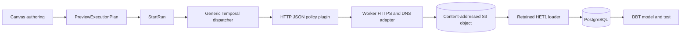

# Summary

This ARC record preserves historical evidence, not current browser acceptance.
Under [#3021](https://github.com/dunay2/dvt/issues/3021), the obsolete HET2 UI
story and its exclusive wrapper/assets were retired after the Canvas hard cut.
The exact [browser proof](https://github.com/dunay2/dvt/blob/b00ebb72f742cf28a6c6af187c06b9ca95681b18/apps/web/cypress/e2e/canvas/canvas-het2-rest-artifact-dbt-live.cy.ts)
and [wrapper](https://github.com/dunay2/dvt/blob/b00ebb72f742cf28a6c6af187c06b9ca95681b18/scripts/run-het2-public-vertical-live-proof.cjs)
remain available in Git. Retained provider proofs and generic Preview/Run/status/
events/Cancel/Recover evidence are described in the
[testing guide](../guides/testing-and-ci-capabilities.md#retired-het-browser-histories-and-retained-runtime-coverage).
They do not replace the complete HTTPS-to-S3-to-PostgreSQL-to-dbt E2E or prove
acquisition recovery to completion. The HET2 risk remains open. Commands above
identify retained validation surfaces, not new PASS receipts.

HET2 historically proved the public heterogeneous route
`ACQUIRE_HTTP_JSON_ARTIFACT -> LOAD_OBJECT_FILE_TO_POSTGRES -> DBT_MODEL -> DBT_TEST`
through the existing Preview, StartRun, status, event, cancellation and recovery
rails. The implementation adds no HTTP proxy or product route.

# Review and size-gate disposition

PR #2226 changed 67,652 lines because its historical DB-first planning operation
regenerated and reordered the then-canonical feature-mechanization snapshot. The
semantic planning delta is revision 14 to 15 plus the nine HET2 implementation
surfaces; product, contract, adapter, test and evidence changes remain separated
into reviewable microcommits. The repository-approved `pr-size-exempt` path was
explicitly authorized for this generated-governance case; no quality, ARC,
review or required-status gate was disabled.

# Boundary evidence

```mermaid
flowchart LR
  Canvas[Canvas authoring] --> Preview[PreviewExecutionPlan]
  Preview --> Start[StartRun]
  Start --> Temporal[Generic Temporal dispatcher]
  Temporal --> Acquire[HTTP JSON policy plugin]
  Acquire --> Client[Worker HTTPS and DNS adapter]
  Client --> Store[(Content-addressed S3 object)]
  Store --> Loader[Retained HET1 loader]
  Loader --> Postgres[(PostgreSQL)]
  Postgres --> Dbt[DBT model and test]
```

- Plans contain opaque `http-endpoint:*`, `http-auth:*`, object-store and
  PostgreSQL references, never a URL, token or secret header.
- The worker performs HTTPS-only GET, per-hop DNS/IP validation, address
  pinning, same-origin bounded redirects, timeout, byte, encoding, media-type,
  status, SHA-256 and JSON/JSONL checks. Its address policy covers mapped and
  compatible IPv4-in-IPv6 forms plus the well-known NAT64 prefix.
- The artifact store conditionally creates the tenant-scoped content address,
  verifies an identical retry, and rejects conflicting bytes.
- Activity results and run events carry only `ArtifactAcquisitionEvidence` and
  never response bytes, endpoint URLs or credentials.
- The generic engine and Temporal adapter remain step-family agnostic; the HTTP
  plugin, worker network adapter and HET1 loader are independently composed.

# Executable outcomes

The historical protected browser proof started with an empty MinIO bucket and an
authenticated TLS fixture. It proved initial publication, verified-existing
retry, two-row JSONL load, DBT success, endpoint-reference denial, real HTTP 503
refusal, same-size response digest mismatch, request timeout, and controlled
DBT-test failure, all with no invalid downstream start. It requested
cancellation while acquisition was active, proved the active layer settled
without starting the loader, and recovered to a distinct completed run. Evidence
assertions also rejected fixture bytes, URL fragments and the bearer token.

The historical HET1 live proof independently exercised source-object integrity
refusal before PostgreSQL mutation, so that combined HET1/HET2 route demonstrated
both acquisition-side and loader-side tamper rejection.

The controlled loopback exception exists only in the non-production proof
configuration; production address policy rejects loopback, private, link-local,
metadata, multicast and unspecified addresses, including IPv4-mapped,
IPv4-compatible and well-known NAT64 representations.
