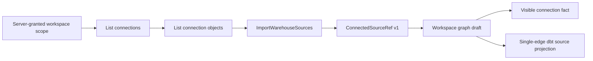

# Summary

PTH1 hardens warehouse source import so the product preserves and shows the
connection-qualified identity that the user actually selected. The same
physical object reached through two connections remains two distinguishable
Canvas sources, while queries and caches remain partitioned by the complete
tenant, project and environment scope.

# Boundary and authority evidence

- `ConnectedSourceRef.v1` is strict, versioned and secret-free. It owns
  `connectionId`, provider and physical `sourceObjectId`; projection-only
  `connectionName` remains outside the identity contract.
- The command admits the existing Canvas authority before external discovery
  and rejects legacy top-level source identity instead of translating or
  migrating it. Post-ready review found that validation did not yet reject two
  existing nodes carrying the same otherwise-valid `ConnectedSourceRef`; that
  multiplicity check is now a blocking correction gate.
- Dedupe and generated source-YAML identity are defined by JCS hashing over
  connection and physical object. Post-ready review found one Graph Draft
  projection lookup still used raw `sourceObjectId` against a map keyed by the
  qualified identity; collision-safe node/YAML agreement must be reproven.
- Workspace file-tree and file-content caches include the full scope key. The
  query-level A/B/A proof uses the colliding path `models/orders.sql`. The
  live-product proof grants two real scopes in one authenticated session, uses
  the visible selector by keyboard in English and Spanish, authors the same
  `models/sources/src_public.yml` path from the same physical PostgreSQL
  relation, presents each distinct YAML in Project Code, and recovers A after B
  without graph or file leakage. Axe finds no serious or critical finding in
  the selector or Project Code Workbench.
- The Inspector shows connection name, provider and identifier without
  truncating the identity or exposing credentials. Missing or malformed
  canonical identity stays absent rather than being guessed.
- A dbt model with exactly one compatible incoming edge uses that explicit
  relationship for generation and authoring validation. Zero, ambiguous or
  explicitly disconnected origins fail closed.
- Node code navigation uses an explicit persisted workspace path or the exact
  node authoring surface; it never fabricates a path or opens an unrelated
  fallback file.
- Exterior whitespace is rejected at the identity boundary, and reserved
  connection-qualified node-ID collisions fail before file or draft mutation.
- Destructive text-editing keys are owned by the focused Workbench SQL editor.
  The editor opts out through React Flow's `nokey` boundary and contains its
  keydown/keyup events; while any contextual Workbench is active, the Canvas
  also disables React Flow's global delete key. `Backspace` and `Delete` cannot
  remove the selected node, while graph deletion outside a Workbench remains
  available through the existing command surface.
- Node code has one visible command entry in the selected-node floating
  toolbar. The More and right-click menus do not repeat that intent, and Add
  Component is available only through the Canvas context menu, opened by
  right-click or its `Shift+F10` keyboard equivalent; no fixed button competes
  with the graph.

# Post-ready review correction gate

PR #2258 is not mergeable on this evidence until both P1 findings are closed:

1. Graph Draft source-node projection must retrieve `WarehouseSourceYamlBinding`
   with the same connection-qualified `sourceObjectIdentity` used to build the
   binding map. A focused normalization-collision test must prove that node
   metadata and generated YAML retain the same collision-safe names and path.
2. Indexing existing warehouse nodes must reject a repeated valid
   `ConnectedSourceRef` with `WarehouseSourceImportDraftConflictError` before
   any file or draft mutation. Silent overwrite and arbitrary duplicate-node
   reuse are not accepted idempotency semantics.

The prior green suite remains historical evidence for the reviewed commit; it
does not satisfy these newly explicit negative cases. Focused red/green proof,
the full closeout baseline and resolved review threads are required before this
evidence authorizes merge.

# Executable outcome

The protected live proof starts from a missing graph draft, creates two real
PostgreSQL connections to the same physical relation, imports through both and
checks two distinct persisted nested identities and nodes. It opens both source
Workbenches without forced interaction, proves their exact connections, then
connects a source to a generated dbt model, edits and persists model SQL,
publishes artifacts, previews the plan and opens the exact generated project
file. In the same live session it selects a second real server-granted Project
and Environment, observes an empty graph, creates its dbt Canvas, imports the
same physical source to the same relative YAML path under a distinct Connection,
then returns to the first scope and recovers its two sources, model and file
content. The switch is performed only through the visible workspace selector;
`Enter` activates the selector in English for B and in Spanish for A.
Authoritative graph/file reads and the visible Project Code Workbench verify
each selected scope and reject the other scope's source identity. Clearing
model SQL with `Backspace` also proves that the selected model remains in the
graph before the authored SQL is entered. Component tests prove that the top
selected-node toolbar remains the sole node-code entry and that right-click is
the sole Canvas entry to Add Component. The Add Source dialog and each
connected-source Workbench remain inside
1440x900, 1280x720, 1000x660 and 500x330 viewports. The dialog's bounded content
and Cancel action stay visible; each Workbench keeps the exact Connection fact
and its close action reachable. Axe finds no serious or critical WCAG 2.0/2.1
A/AA violations on either surface, and cancellation leaves the two-source draft
unchanged. The runner uses native Cypress on Windows
because pnpm directory junctions are not resolvable inside the Linux Cypress
container; non-Windows execution retains the container lane.

No database migration, compatibility state, dual-read path, stub, fixture draft,
browser-invented scope or fake-success route is introduced.

The complete Canvas focus config is run with two explicit workers. The local
default worker fan-out made the unchanged 1,000-node layout CPU benchmark exceed
its 30-second budget under contention, while one-worker CI mode exceeded the
20-minute agent command window. Two workers executed every Canvas test with the
same benchmark and unchanged budget successfully; no file or assertion was
excluded.
