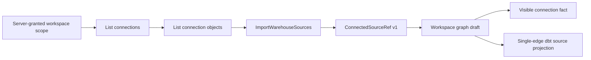

# Summary

PTH1 hardens warehouse source import so the product preserves and shows the
connection-qualified identity that the user actually selected. The same
physical object reached through two connections remains two distinguishable
Canvas sources, while queries and caches remain partitioned by the complete
tenant, project and environment scope.

# Boundary and authority evidence

- `ConnectedSourceRef.v1` is strict, versioned and secret-free. It owns
  `connectionId`, provider and physical `sourceObjectId`; projection-only
  `connectionName` remains outside the identity contract.
- Import validates the complete existing draft before mutation and rejects
  legacy top-level source identity instead of translating or migrating it.
- Dedupe and generated source-YAML identity use JCS hashing over connection and
  physical object. No filename, display label or insertion order substitutes
  for product identity.
- Workspace file-tree and file-content caches include the full scope key. The
  A/B/A proof uses the colliding path `models/orders.sql` and recovers the
  correct content after switching back.
- The Inspector shows connection name, provider and identifier without
  truncating the identity or exposing credentials. Missing or malformed
  canonical identity stays absent rather than being guessed.
- A dbt model with exactly one compatible incoming edge uses that explicit
  relationship for generation and authoring validation. Zero, ambiguous or
  explicitly disconnected origins fail closed.
- Node code navigation uses an explicit persisted workspace path or the exact
  node authoring surface; it never fabricates a path or opens an unrelated
  fallback file.

# Executable outcome

The protected live proof starts from a missing graph draft, imports a real
PostgreSQL source, checks the persisted nested connection identity, connects it
to a generated dbt model, verifies accessible and fully visible connection
facts at 1000x660, edits and persists model SQL, publishes artifacts, previews
the plan and opens the exact generated project file. The runner uses native
Cypress on Windows because pnpm directory junctions are not resolvable inside
the Linux Cypress container; non-Windows execution retains the container lane.

No database migration, compatibility state, dual-read path, stub, fixture draft
or fake-success route is introduced.

The complete Canvas focus config is run with two explicit workers. The local
default worker fan-out made the unchanged 1,000-node layout CPU benchmark exceed
its 30-second budget under contention, while one-worker CI mode exceeded the
20-minute agent command window. Two workers executed every Canvas test with the
same benchmark and unchanged budget successfully; no file or assertion was
excluded.
