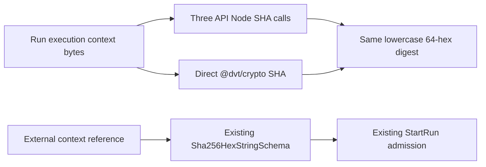

# Summary

First implementation cut against issue #2191 (duplicate/scattered `node:crypto`
usage cleanup, child of epic #2185). Closes the highest-consensus gap already
agreed in the issue: `RunExecutionContextRef.sha256` and
`RunExecutionContext.planSha256` were typed as `NonBlankString` instead of the
already-existing `Sha256HexString` branded type, and three server-side
run-execution-context writers/readers computed SHA-256 digests with
`node:crypto` `createHash('sha256')` instead of the canonical `@dvt/crypto`
package.

# What changed

1. `packages/@dvt/contracts/src/types/contracts.ts`: `RunExecutionContextRef.sha256`
   and `RunExecutionContext.planSha256` are now typed `Sha256HexString` instead
   of `NonBlankString`, matching the existing `pluginCompatibilityFingerprint`
   pattern already present on both types.
2. `packages/@dvt/contracts/src/contracts/engine/RunExecutionContext.v1.ts`:
   `RunExecutionContextRefSchema.sha256` and
   `RunExecutionContextSchema.planSha256` now validate through the existing
   `Sha256HexStringSchema` (64-char lowercase hex) instead of
   `NonBlankStringSchema`.
3. `apps/api/src/infrastructure/dbt/ArtifactBackedRunExecutionContextWriter.ts`,
   `FileRunExecutionContextInheritanceWriter.ts`, and
   `FileRunExecutionContextReferenceReader.ts`: replaced
   `createHash('sha256').update(bytes).digest('hex')` with `sha256Hex(bytes)`
   from `@dvt/crypto`. Byte-for-byte identical output — `sha256Hex` accepts the
   same `Buffer`/`Uint8Array` input already computed at each call site, so no
   re-encoding step changes and no digest produced by this code path changes
   value.
4. Updated pre-existing test fixtures across `@dvt/contracts`, `@dvt/engine`,
   and `dvt-api` that used non-canonical placeholder strings (`'abc123'`,
   `'ctxsha'`, `'plan-sha'`) for these two fields, since the tightened schema
   now rejects them. All updated fixtures use 64-char lowercase hex
   (`'a'.repeat(64)` or equivalent), consistent with the convention already
   used by the vast majority of existing fixtures for these fields.

# Integration design and migration sequence (2026-09-06)

Baseline: `0f4d1e9bcbc1a9a1e69b4920c733a60cfcc3cd28` (released 0.14.0).
The existing StartRun admission command owns run-context binding and rejection;
PublishContentAddressedArtifact / ReadVerifiedArtifactBytes retain immutable
artifact publication and verification. This cut changes neither their ports nor
tenant/project/environment authorization. See the command/query catalog in
`docs/architecture/components/lineage-worker/artifact-lineage-extraction-component.md`.

The migration follows the delete-first protocol linked by #2191. Freeze an
existing persisted-context digest and run reader/writer domain tests before
removing the three old primitive imports. Commit that deletion boundary, run
scanner/typecheck/build/domain tests to expose consumers, then repair all three
with the existing direct API dependency on @dvt/crypto. No helper, facade, alias,
new dependency or fallback is introduced. Existing recovery/tamper tests remain.

Malformed digest representation is rejected at the contracts boundary using the
existing shared schema. Dedicated negative tests must cover both fields with
otherwise valid inputs. Valid producer bytes, digest values, identity versions,
recovery bindings and artifact integrity rejection remain unchanged.

Integration validation results are recorded and verified in GitHub issue #2191;
the older counts below describe the original PR, not a rerun on this baseline.

## Delete-first discovery on the integration branch

The frozen reader/writer context digest passed before removal. Removing the
three imports produced exactly three TS2304 errors in API typecheck/build and
16 failing domain tests (two no-hash cases still passed). Contracts and engine
remained green, as expected for this API-only removal. Five added malformed-SHA
cases also failed before tightening the schemas and pass after the repair.

The attempted deletion-only commit was rejected by the mandatory pre-commit
ESLint `no-undef` rule at those same three consumers. No hook was bypassed and no
rule was relaxed. The deletion and red-discovery sequence occurred in the working
branch, but a separate red commit could not be recorded. For this bounded cut,
the owner explicitly accepted the recorded deletion and RED evidence in place of
the broken commit, with every hook retained. The decision is recorded and read
back in [issue #2191](https://github.com/dunay2/dvt/issues/2191#issuecomment-5558405468).
This acceptance does not authorize bypasses or change other migration cuts.

# Original validation notes

- `@dvt/contracts` build and full vitest suite pass (489/489 tests).
- `dvt-api` build and full vitest suite pass (1071 passed, 27 skipped).
- `@dvt/engine` full vitest suite passes (463/463) after fixing 3 fixtures in
  `WorkflowEngine.test.ts` that used the non-canonical `'ctxsha'` placeholder.
- `@dvt/artifacts`, `@dvt/adapter-temporal`, `@dvt/temporal-dbt-plugin`, and
  `dvt-temporal-worker` full vitest suites pass; no fixture changes were
  needed in these packages (their `sha256`/`planSha256` fixtures already used
  64-char hex).
- `apps/web` was checked and does not consume `parseRunExecutionContext` /
  `parseRunExecutionContextRef`, so no changes were needed there.
- `GIT_BASE=origin/main GIT_HEAD=HEAD node tools/ci/arc-check.mjs` confirms
  `effectiveArcLevel: ARC-2` for this change set (trigger: `contracts`,
  `engine-core`), requiring this evidence doc and a risk-register update.

# Scope note

This is Cut 1 of a larger cleanup tracked by issue #2191. The full inventory
(~39 files, recorded in the issue's comment history) includes other
`createHash`/`randomUUID` consumers outside `@dvt/crypto` that are not part of
this slice. A recurring `md5($1)` SQL-side pattern (6 files, Postgres advisory
locks) and a non-cryptographic CRC32 usage in `@dvt/state-store` were also
flagged in the issue as open, non-blocking governance notes — neither is a
Node `createHash`/`randomUUID` duplicate in scope for issue #2193's
forbidden-pattern list, and neither is touched by this cut.
