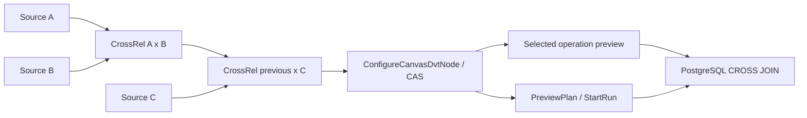

# CROSS JOIN end to end

## Authority and solution rationale

[Issue #3322](https://github.com/dunay2/dvt/issues/3322), ADR-0064, the
command/query rail governance, the standard Substrait capability catalogue,
and Planning DB mechanization `GH-3322-CROSS-JOIN-END-TO-END` govern this
slice. It reuses `ConfigureCanvasDvtNode`, `ProjectCanvasRelationalTree`,
`PreviewCanvasTransformRows`, `PreviewPlan`, and `StartRun`; no parallel
command, query, persistence model, or execution path was introduced.

The canonical identity is the standard binary `substrait.CrossRel`. CROSS has
no JOIN type and no predicate. PostgreSQL SQL is a target projection of that
semantic document, never its authoring source.

## Implemented behavior

- The exact core relation identity `substrait.CrossRel` is admitted without a
  fabricated `JoinRel.JoinType`, empty predicate, `ON TRUE`, or DVT extension.
- Two inputs produce one binary relation. Additional inputs form an explicit
  left-associated chain: `CrossRel(CrossRel(A, B), C)`.
- `RelCommon.emit` selects and reorders the left-then-right field space while
  stable RelationId and FieldId values remain authoritative in the sidecar.
- PostgreSQL receives a real `CROSS JOIN`; a non-emitted side remains in the
  query because it still owns multiplicity and empty-input annihilation.
- The bounded mixed profile accepts `(admitted JoinRel) CrossRel ReadRel` and
  nests the JOIN as a subquery. A LEFT JOIN is therefore never reassociated
  through CROSS.
- Canvas exposes CROSS explicitly in the same operation shelf and drag rail,
  never opens a predicate editor, shows an unknown-cardinality warning without
  querying `COUNT(*)`, supports a third input, Apply/Cancel/reload, contextual
  L/R retirement, and selected-operation data preview.
- Protected preview and workload projection retain every physical dependency,
  including a source whose fields are not emitted, and reuse the existing
  PostgreSQL connection, authorization, timeout, cancellation, and result
  limits.

## Acceptance and validation evidence

- Contract tests prove exact standard capability identity and supported-profile
  admission while unsupported identities remain fail-closed.
- Shared projection tests prove binary and three-input products, selected
  intermediate projection, one-side output selection, real CROSS SQL, invalid
  emit/hash/input rejection, and the non-reassociated outer-JOIN shape.
- Protected API tests prove the selected first CrossRel is previewed instead of
  widening to the final product and that all closure inputs remain required.
- A real PostgreSQL 16 integration executes generated SQL for 2×3 = 6 and
  2×3×2 = 12 products, duplicates, NULL values, empty inputs, and the
  `(A LEFT JOIN B) CROSS JOIN C` counterexample with C empty.
- Web unit tests cover explicit choice, operation drag, source append, warning,
  contextual removal, Apply, persistence, and reload. Native Cypress covers
  the complete visible flow, selected-operation preview, Cancel restoration,
  and persisted reload.

## Compatibility, rollout, and no-debt posture

Deploy contracts/shared projection and API before Web. Existing JOIN, Set, and
Project documents retain their exact identities and behavior. Unsupported
CrossRel nesting still fails before PostgreSQL; the accepted mixed profile is
deliberately limited to an admitted left JOIN subtree and a physical right
ReadRel.

No second semantic model, endpoint, store, StepKind, SQL-authoring authority,
compatibility alias, fake adapter, placeholder, TODO, hidden cardinality query,
rule relaxation, hook bypass, or skipped acceptance check was introduced.
