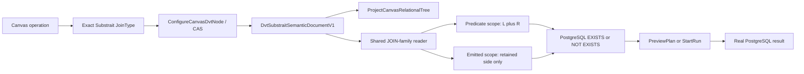

# SEMI and ANTI JOIN end to end

## Authority and solution rationale

[Issue #3320](https://github.com/dunay2/dvt/issues/3320), ADR-0064, the
command/query rail governance, the Substrait capability-admission catalogue,
and Planning DB mechanization `GH-3320-SEMI-ANTI-JOIN-END-TO-END` govern this
slice. It reuses `ConfigureCanvasDvtNode`, `ProjectCanvasRelationalTree`,
`PreviewCanvasTransformRows`, `PreviewPlan`, and `StartRun`; no parallel
command, query, persistence model, or execution path is introduced.

Before this slice, the JOIN corridor admitted binary JOINs whose output always
contained fields from both inputs. SEMI and ANTI JOINs need two independent
field scopes: both inputs are visible to the predicate, while only the retained
input is visible to output selection and later stages.

SQL remains a target projection of canonical Substrait. The implementation
does not rewrite SEMI/ANTI semantics as `DISTINCT`, `IN`, `NOT IN`, a Web-side
filter, or an aggregate. This preserves retained-side multiplicity and avoids
the three-valued-logic trap of `NOT IN` when NULL is present.

## Implemented behavior

- The exact selectors `JOIN_TYPE_LEFT_SEMI`, `JOIN_TYPE_RIGHT_SEMI`,
  `JOIN_TYPE_LEFT_ANTI`, and `JOIN_TYPE_RIGHT_ANTI` are admitted independently;
  unsupported selectors continue to fail closed.
- The shared JOIN reader exposes all fields to predicate validation but exposes
  only retained-side fields to output mappings and downstream stages. RIGHT
  variants rebase retained field ordinals to the emitted schema.
- PostgreSQL lowers LEFT variants with the current left input as the outer
  relation and RIGHT variants with the right input as the outer relation.
  SEMI uses correlated `EXISTS`; ANTI uses correlated `NOT EXISTS`.
- Each stage is nested under stable aliases, so N=3 mixed JOIN trees preserve
  stage order, field identity, operand orientation, and the effective output
  schema.
- Canvas exposes the four exact operations in the operation shelf and drag
  authoring, labels L/R as retained or queried, keeps Apply/Cancel persistence,
  restores exact selectors after reload, and prevents an existing JOIN type
  switch when selected outputs would be destroyed.
- Protected selected-operation Preview and Run reuse the canonical persisted
  semantic document, the shared PostgreSQL projector, and the existing
  operational workload rail.

## Acceptance and validation evidence

- Contract tests prove exact capability admission plus canonical binary
  encode/decode round-trip for persisted semantic documents.
- Shared projection tests prove all four exact SQL shapes, selected retained
  outputs, ordinal rebasing, negative queried-side/global output mappings, and
  rejection of unsupported selectors without a silent fallback.
- Protected API tests prove Preview and Run workload publication for all four
  selectors and retain lineage for both physical dependencies.
- A real PostgreSQL integration suite executes the generated SQL for all four
  multiset cases, empty queried and retained inputs, explicit NULL-equals-NULL,
  a composite predicate, and a noncommutative bigint `<` predicate. The suite
  has 18 executable scenarios and does not assert SQL text as a substitute for
  runtime behavior.
- Web unit, presentation, architecture, and native browser suites cover exact
  operation choice, drag authoring, safe type switching, contextual labels,
  Apply, persistence, reload, N=3 composition, and existing JOIN regressions.
- Final lint, typecheck, documentation governance, ARC, pre-push, PR, and CI
  results are recorded in issue #3320 and its implementation PR.

## Compatibility, rollout, and no-debt posture

Deploy contracts/shared projection and API before Web. Existing INNER, LEFT,
RIGHT, FULL, and Set documents retain their selectors and behavior. Existing
consumers still reject unsupported selectors; only the four named SEMI/ANTI
selectors enter the admitted profile.

No second JOIN model, SQL-authoring authority, compatibility alias, fake
adapter, placeholder, TODO, rule relaxation, hook bypass, or hidden skipped
validation is introduced.
