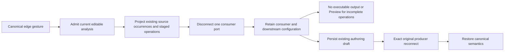

# Canonical edge disconnection

## Authority and rationale

[Issue #3560](https://github.com/dunay2/dvt/issues/3560), ADR-0064,
the command/query rail governance, the Canvas workbench command/query catalog,
and the workspace graph draft persistence contract govern this change.
Planning DB designs `GH-3468-CANVAS-COMPOSITION` and
`GH-3342-COMPOSABLE-RELATION-ANALYSIS-V4` supplied the component identities.
The existing `ConfigureCanvasDvtNode`, `ProjectCanvasRelationalTree`, and
`SaveWorkspaceGraphDraft` rails remain authoritative.

The current-state diagram, solution diagram, opportunity matrix, ownership,
and negative acceptance were published in #3560 before implementation and TDD.
Canonical SVG edges lacked the shared interaction used by pending/output edges.
Substrait requires complete relation operands, so deleting an SVG or retaining
the old executable document would conceal rather than resolve the disconnection.

`configurationDocument` retains the same canonical Substrait and sidecar as
non-executable authoring configuration. It cannot coexist with
`semanticDocument`. Exact reconnect requires both original relation identities
and identical canonical producer contents after composition-local anchor
normalization through the existing mapper. Unused consumer function declarations
are excluded; used function identities, fields, aliases, schema, provenance, and
expressions remain part of identity. Changed producers remain
pending and require explicit reconfiguration, not inferred field remapping.
No parallel AST, persistence version, migration, endpoint, or business logic in
the edge renderer was introduced. N-input operators beyond the existing staged
arity profile fail closed before draft mutation; this slice does not widen that
profile.

## Validation performed

- Contracts: 71 files / 786 tests passed; contract build/typecheck passed.
- Canonical command and projection: 15 tests passed, including read-only,
  failed/stale/disposed analysis, individual JOIN ports, invalid ports,
  exact and changed producer reconnect, downstream invalidation, and Apply
  withdrawing previous semantic authority.
- Existing connection-boundary regression: 3 tests passed after composition-local
  producer identity was normalized; no assertion or existing flow was relaxed.
- Shared edge interaction and existing tree presentation: 21 tests passed.
- Existing workbench architecture boundary: 9 tests passed.
- Related graph action, composition sequence, semantic chain, draft codec, and
  Apply suites passed in scoped runs recorded in #3560 closeout evidence.
- Web lint, typecheck, and production build passed. Contract files passed the
  root ESLint configuration; the contracts package has no separate lint script.
- Real browser at `http://localhost:5173/canvas`: in the user's existing Model,
  keyboard Delete and right-click / Eliminar conexion disconnected JOIN to
  Transform while preserving cards and unrelated pending branches. Exact
  reconnect restored Preview; the pending Transform did not expose Preview.
  Manual edits were canceled; the user's graph was not saved or overwritten.
  Screenshot is retained locally under `.dvt/evidence/3560/` (ignored output).

## Integration and safety

### Review of the pending cut in #3561

The review found a producer-removal defect: detaching direct consumers before
computing reachability hid later consumers from invalidation. A three-operation
regression failed before the fix. `invalidateCanvasOperationConsumers` now owns
the shared transitive invalidation used by canonical disconnection and staged
actions. Removal traverses the original graph before detaching edges, retains
configuration, and preserves unrelated operation objects.

The same review separated `CanvasShell` card projection, Model selection, Code
workbench scope, shared focus, and operation-data docking. The existing Model
leave guard remains authoritative. Unused import-port forwarding and duplicated
shell fixtures were retired; pure card checks now run without a DOM. Design,
current/target diagrams, test mapping, and rationale are recorded in
[issue #3561](https://github.com/dunay2/dvt/issues/3561) and the Canvas workbench
catalog. No parallel DTO or policy path was added.

Final-candidate `pnpm verify:prepush`, required ARC checks, exact-SHA authority
validation, and integration results are recorded in #3560 and #3561. The scoped
checks above are not a substitute for those gates; GitHub owns their current
delivery status.

No application tables, schemas, or warehouse data were changed. Only the
existing Planning DB feature mechanization writer registered the governed
implementation identities. No Planning DB import/rebuild was performed.
No new debt entry, placeholder, fake execution path, disabled rule, bypassed
hook, or concealed skipped check was introduced.
