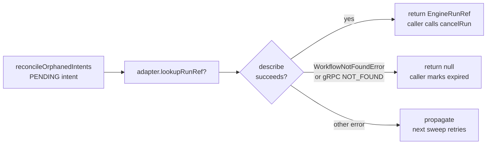

## What changed (bullets)

- Added `describe(): Promise<unknown>` to the local `WorkflowHandleLike` interface in `TemporalAdapter.ts`.
- Implemented `lookupRunRef(runId, tenantId): Promise<EngineRunRef | null>` on `TemporalAdapter`:
  - Derives `workflowId` via `toTemporalWorkflowId(runId)` — same derivation as `startRun()`, deterministic.
  - Calls `handle.describe()` to probe Temporal for the workflow's existence.
  - Returns a fully-formed `EngineRunRef` when the workflow exists.
  - Returns `null` on `WorkflowNotFoundError` (Temporal SDK ≥1.x) or `ServiceError` with gRPC code 5 (older SDK versions).
  - Propagates all other errors (network, auth, etc.).
- Added `isWorkflowNotFound()` private helper with dual check for SDK version robustness.
- Bumped file version to 1.1.0.

## Evidence (paths/links)

- Tests: [`packages/@dvt/adapter-temporal/test/TemporalAdapter.lookupRunRef.test.ts`](../../../packages/@dvt/adapter-temporal/test/TemporalAdapter.lookupRunRef.test.ts)
  - 6 cases: workflow exists → returns EngineRunRef; WorkflowNotFoundError → null; ServiceError NOT_FOUND → null; network error → propagates; non-Error thrown → propagates; workflowId/taskQueue derivation consistent with startRun.
- Code: [`packages/@dvt/adapter-temporal/src/TemporalAdapter.ts`](../../../packages/@dvt/adapter-temporal/src/TemporalAdapter.ts)
- Interface contract: [`packages/@dvt/engine/src/adapters/IProviderAdapter.ts`](../../../packages/@dvt/engine/src/adapters/IProviderAdapter.ts) — `lookupRunRef?` already declared as optional on `IProviderAdapter`.

## Risks (only real ones)

- New risks: none.
- Residual: `describe()` on the real Temporal SDK may have latency under high load. This is acceptable — `lookupRunRef` is called only during reconciliation sweeps (background, not hot path). Documented in ADR-0030 §4 threshold tuning note.

## Design notes (ADR-012)

- **Testability**: method is fully testable via injected `workflowClient` mock (no Temporal SDK required). Six unit tests added.
- **Separation of concerns**: `lookupRunRef` delegates entirely to the provider layer (Temporal) for existence check; no state store interaction, consistent with the adapter-first model (ADR-0014).
- **Determinism**: `workflowId` derivation is identical to `startRun()` — `toTemporalWorkflowId(runId) = runId`. This is the StartRunIdempotency §3.3 invariant referenced in ADR-0030.
- **Non-breaking**: `lookupRunRef` is declared `optional` on `IProviderAdapter`. This implementation does not change the interface definition. All other adapters (MockAdapter, ConductorAdapterStub, TemporalAdapterStub) omit it, and the reconciler handles absent `lookupRunRef` by treating PENDING intents as having no orphaned workflow (safe fallback, documented in `IProviderAdapter.ts`).
- **Error handling**: dual check (`WorkflowNotFoundError` name + ServiceError gRPC code 5) ensures the adapter is robust across Temporal SDK patch versions without requiring an SDK version pin for this specific behavior.

