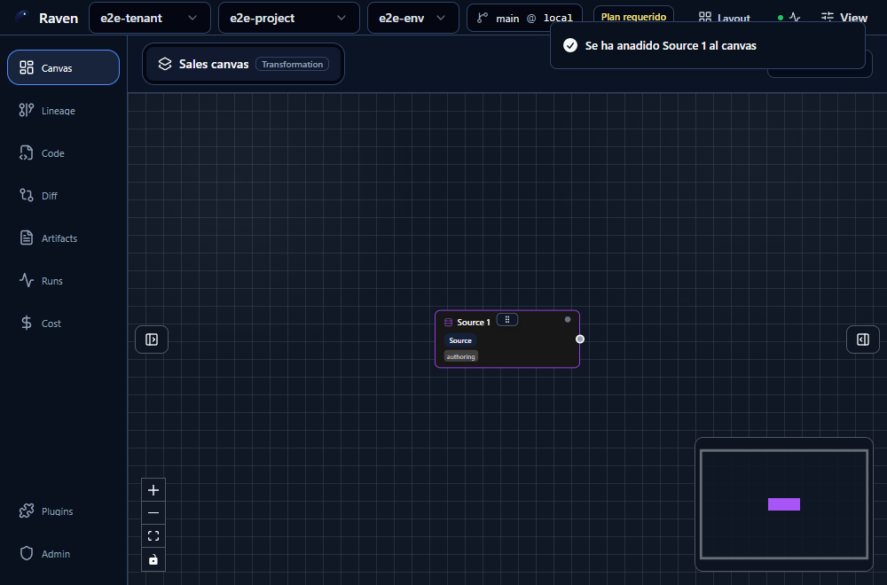
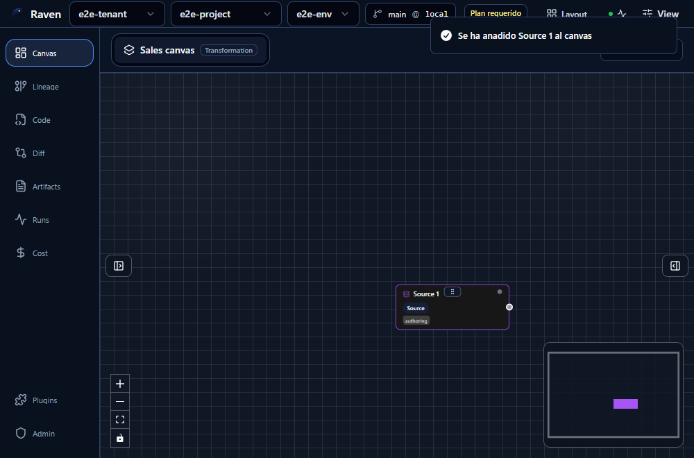

# Canvas happy-path draggable proof after create/save

## Scope

This evidence proves the Canvas happy path is writable after create/save:

- no `projection_gap` blocking banner (`El draft persistido va por delante...`)
- first node can be dragged after creation
- drag interaction remains enabled in the same flow

## Cypress proof

Spec:

- `apps/web/cypress/e2e/canvas/canvas-happy-path-draggable.cy.ts`

Run result:

- 1 passing
- 0 failing
- 2 screenshots generated by Cypress

## Screenshots

Before drag:

After drag:

