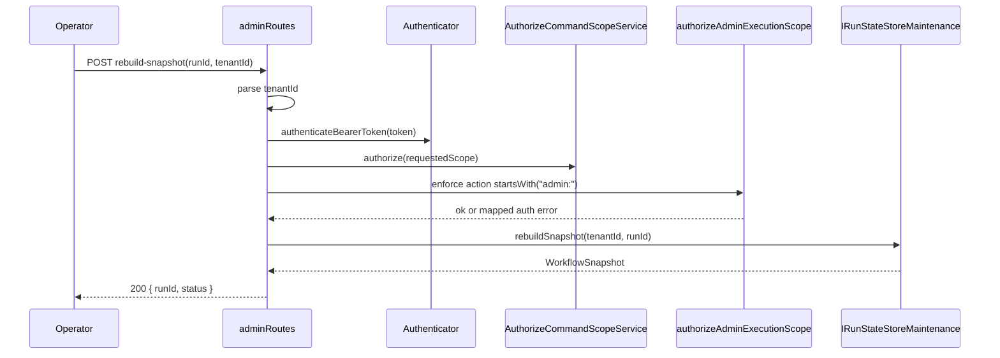

# Admin Rebuild Snapshot Technical Manual

This manual defines the technical behavior of the admin snapshot rebuild
endpoint in the API.

## Scope

- Route: `POST /admin/runs/:runId/rebuild-snapshot`
- Boundary: API entrypoint + authorization + state-store maintenance port
- Purpose: operational snapshot repair from persisted run events

## Governing implementation

- `apps/api/src/entrypoints/http/adminRoutes.ts`
- `apps/api/src/entrypoints/http/authorizeAdminExecutionScope.ts`
- `apps/api/test/contracts/adminRebuildSnapshotAccessContract.test.ts`
- `apps/api/test/entrypoints/http/adminRoutes.test.ts`

## Runtime flow



## Request and response contract

Request:

- path param: `runId` (string)
- body: `{ tenantId: string }`
- auth header: `Authorization: Bearer <token>`

Response `200`:

- `{ runId: string, status: WorkflowSnapshot["status"] }`

Failure envelopes:

- `400` invalid body/tenant (`invalid_body`, `missing_tenant_id`,
  `invalid_tenant_id`)
- `401` authentication failure (`missing_token` and related)
- `403` authorization failure (`action_not_granted`)
- `404` mapped domain error (`run_not_found`)
- `500` uncategorized runtime error (`internal_error`)

## Authorization rules

1. Request must pass standard execution-scope auth.
2. Effective authorized action must be a command with `admin:` prefix.
3. Rebuild route uses command action name `admin:rebuild-snapshot`.
4. Any non-admin action context is rejected as forbidden.

## Data and tenant invariants

1. Tenant is mandatory and parsed from body.
2. Tenant is validated before authorization and store call.
3. State-store call is scoped by `(tenantId, runId)`.
4. `RunNotFoundError` maps to `404`, no silent fallback.

## Failure behavior

- Recoverable input/auth failures return governed HTTP envelopes.
- Unexpected store/runtime failures are logged and normalized to
  `internal_server_error`.
- Legacy string-only not-found errors are intentionally treated as `500`
  to avoid heuristic parsing.

## Test coverage

Contract-level:

- Success envelope shape
- Missing tenant input
- Forbidden envelope
- Not found envelope

Route-level:

- 401/403/400/404/500 mappings
- Admin-action prefix enforcement path
- Unexpected runtime failure normalization

## Change checklist

When modifying this endpoint:

1. Keep action name and admin prefix guard aligned.
2. Preserve error envelope compatibility.
3. Update both contract and route tests for behavior changes.
4. Run validation gates before push.

## Validation commands

```bash
pnpm --filter dvt-api test -- test/contracts/adminRebuildSnapshotAccessContract.test.ts
pnpm --filter dvt-api test -- test/entrypoints/http/adminRoutes.test.ts
pnpm verify:prepush
```
