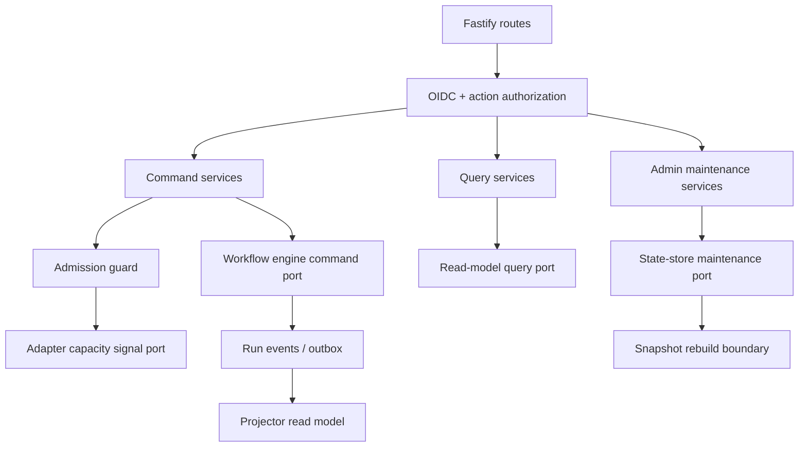
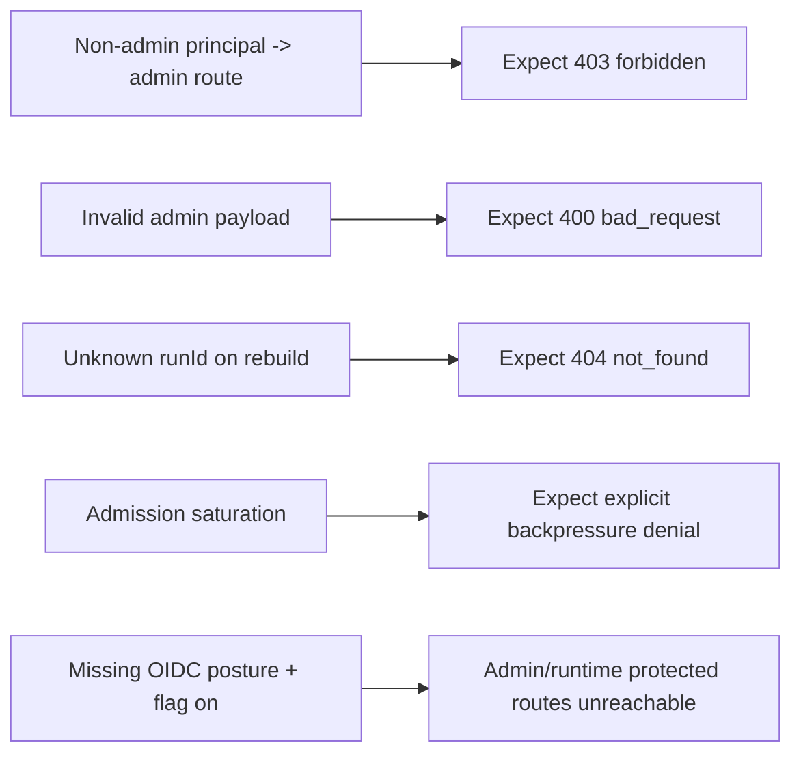

# API Control-Plane Technical Manual

This manual defines the target technical posture for API runtime safety,
admission, RBAC, and observability under Lane C (`AR-C1`, `AR-C2`, `AR-C3`,
`AR-C4`).

## Architectural Intent

- SOLID and SRP at service/module boundaries
- CQRS split between command and query routes
- hexagonal ports for engine/adapters/state store
- Fowler-style event sourcing and projection read models

## Technical Topology

## Class And Module Responsibilities

| Module/Class                                                      | Responsibility                                           | Must not do                     |
| ----------------------------------------------------------------- | -------------------------------------------------------- | ------------------------------- |
| `startRunRoute.ts`                                                | parse/validate transport input and map response envelope | domain mutation logic           |
| `StartRunAuthorizedFacade`                                        | orchestrate authz + admission + command dispatch         | direct DB or adapter calls      |
| `BackpressureAwareStartRunUseCase`                                | apply admission and backpressure policy                  | HTTP mapping                    |
| `EngineStartRunUseCase`                                           | call engine command boundary                             | token parsing                   |
| `listRunsUseCase` / `getRunStatusUseCase` / `getRunEventsUseCase` | CQRS query path with authz-first posture                 | mutate run state                |
| `adminRoutes.ts`                                                  | admin transport and envelope mapping                     | feature-flag-only security      |
| `stateStoreRoles.ts`                                              | explicit read/write/maintenance role wiring              | ad hoc aggregate reconstruction |

## Procedures

### Runtime Command Procedure

1. parse route payload and tenant scope
2. enforce action grant
3. run admission policy (including backpressure signals)
4. dispatch to engine command port
5. map typed result to HTTP envelope

### Runtime Query Procedure

1. enforce action grant first
2. read from read-model/state query boundary
3. optionally enrich with bounded enrichment seam
4. map typed query result to HTTP envelope

### Admin Maintenance Procedure

1. require explicit admin action
2. call maintenance port (`rebuildSnapshot`)
3. return typed success or typed not-found/bad-request envelope

## Invariants (Must Hold)

| ID                         | Invariant                                                                              | Evidence target                           |
| -------------------------- | -------------------------------------------------------------------------------------- | ----------------------------------------- |
| `INV-C1-ADMIN-RBAC`        | admin maintenance routes require explicit admin action grant                           | route unit + contract tests               |
| `INV-C2-CQRS`              | query routes never mutate run lifecycle state                                          | architecture tests + route/use-case tests |
| `INV-C3-ADMISSION`         | command acceptance requires admission pass with explicit backpressure reason on denial | use-case tests                            |
| `INV-C4-MAINTENANCE-TYPED` | maintenance not-found and bad-request stay typed and stable                            | contract tests                            |
| `INV-C5-OBSERVABILITY`     | every implemented canonical SLO signal has explicit metric and alert policy            | SLA runbook                               |

## Observability Truth Model

- Implemented now:
  - `dvt_api_run_start_latency_seconds`
  - `dvt_api_plan_compile_latency_seconds`
  - `dvt.api.run_status.snapshot_staleness_result_total`
  - `dvt.api.run_status.snapshot_staleness_fallback_unknown_total`
  - `dvt_outbox_oldest_claimed_lag_seconds`
  - `dvt_delivery_outbox_drain_lag_seconds`
  - `dvt_delivery_event_delivery_latency_seconds`
- Planned instrumentation:
  - none; AR-C2 remains open for dashboard/alert evidence, not metric emission
- Rule: no review should treat planned metrics as active alert sources.

## Negative Test Plan

Required negative suites:

- `apps/api/test/entrypoints/http/adminRoutes.test.ts`
- `apps/api/test/contracts/adminRebuildSnapshotAccessContract.test.ts`
- `apps/api/test/integration/protectedRuntime.integration.test.ts`

The protected runtime integration lane now uses seam files under
`apps/api/test/integration/protectedRuntime.integration.*.ts` for auth,
bootstrap, persistence, runtime scenarios, workspace-draft scenarios, and
assertions. The executable entrypoint remains
`protectedRuntime.integration.test.ts`.

Instrumentation-negative review scenarios (documentation gate):

- fail review if a document claims alerting on a metric not emitted in code
- fail review if PromQL uses a metric name that cannot be found in telemetry emission code
- keep `AR-C2` open until metric emission + dashboard/alert evidence is committed

## TDD Execution Order

1. add/extend failing contract test for envelope and schema invariants
2. add/extend failing route/use-case negative test
3. implement minimal production change
4. run package tests
5. run `pnpm verify:prepush`

## Delivery Gate

A Lane C change is not complete unless:

- invariants above are reflected in tests
- at least one negative case per changed boundary exists
- SLA/runbook mapping remains aligned with emitted signals
