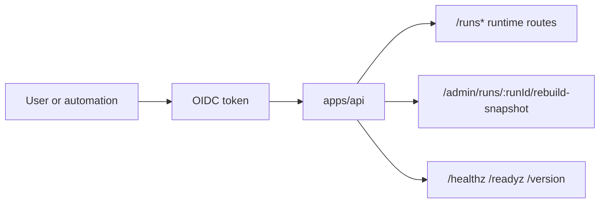

# API Control-Plane User Manual

This manual describes how a consumer should use the current authenticated API
surface safely and predictably.

## Audience

- frontend engineers consuming runtime endpoints
- operators invoking runtime/admin endpoints
- automation clients using token-based access

## Entry Surface

## Route Families

| Family            | Endpoints                                                                  | What the caller gets                             |
| ----------------- | -------------------------------------------------------------------------- | ------------------------------------------------ |
| Runtime commands  | `POST /runs/start`, `POST /runs/:runId/signal`, `POST /runs/:runId/cancel` | command acceptance or typed error envelope       |
| Runtime queries   | `GET /runs`, `GET /runs/:runId`, `GET /runs/:runId/events`                 | paged run state and event timeline               |
| Admin maintenance | `POST /admin/runs/:runId/rebuild-snapshot`                                 | maintenance result with access contract envelope |
| Operational       | `GET /healthz`, optional `GET /readyz`                                     | liveness/readiness state                         |

## Access Rules

| Endpoint                                   | Required action                                              |
| ------------------------------------------ | ------------------------------------------------------------ |
| `POST /runs/start`                         | `run:start`                                                  |
| `GET /runs`                                | `run:list`                                                   |
| `GET /runs/:runId`                         | `run:view`                                                   |
| `GET /runs/:runId/events`                  | `run:logs:view`                                              |
| `POST /runs/:runId/signal`                 | `run:signal` (or `run:cancel` for CANCEL compatibility path) |
| `POST /runs/:runId/cancel`                 | `run:cancel`                                                 |
| `POST /admin/runs/:runId/rebuild-snapshot` | `admin:rebuild-snapshot`                                     |

## Caller Procedures

1. Authenticate and obtain a bearer token.
2. Include tenant-scoped parameters required by the route.
3. Use command routes for mutations and query routes for reads.
4. Treat `401` as token/auth posture failure and `403` as scope/action denial.
5. For admin routes, require explicit admin grant; feature flags are not access control.

## Expected Error Envelopes

- `400 bad_request`: malformed payload or required query/path mismatch
- `401 unauthorized`: token/auth context invalid
- `403 forbidden`: authenticated principal lacks required action
- `404 not_found`: missing target resource or route inactive due composition posture
- `500 internal_error`: unexpected runtime failure

## User-Side Negative Scenarios To Validate

- token valid but missing action grant -> must return `403`
- tenant mismatch between token context and request -> must deny
- invalid command payload -> must return typed `400`
- admin endpoint with non-admin principal -> must return `403`

## TDD Consumption Checklist

Before integrating a new client flow:

1. Write a failing consumer test for one successful call and one deny path.
2. Wire the client request against the documented envelope.
3. Keep assertions on `code`, `message`, and HTTP status, not free-text logs.
4. Add one stale/unknown freshness assertion when consuming `GET /runs/:runId`.

## SLA And Operations

Runtime expectations and thresholds are governed in:

- [API Runtime SLA Canonical](../runbooks/api-runtime-sla-canonical-20260404.md)
- [Backend MVP Control-Plane Runbook](../runbooks/backend-mvp-control-plane-runbook-20260329.md)

## What Is Observable Now Vs Target-State

Observable now:

- `dvt_api_run_start_latency_seconds`
- `dvt_api_plan_compile_latency_seconds`
- `dvt.api.run_status.snapshot_staleness_result_total`
- `dvt.api.run_status.snapshot_staleness_fallback_unknown_total`
- `dvt_outbox_oldest_claimed_lag_seconds`
- `dvt_delivery_outbox_drain_lag_seconds`
- `dvt_delivery_event_delivery_latency_seconds`

Target-state only (not emitted yet as active metrics):

- none; pending AR-C2 closure is dashboard/alert wiring and sustained evidence
