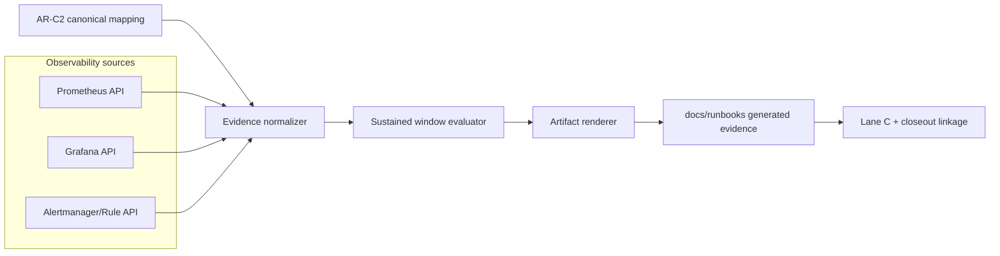
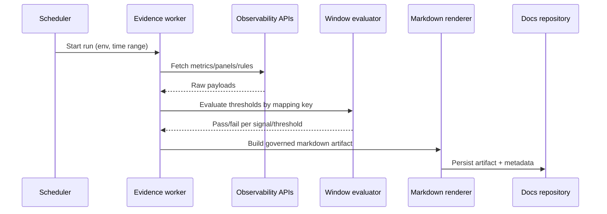

# AR-C2 Automated Evidence Technical Manual

This manual defines the technical architecture for automatic AR-C2 evidence
generation.

## Context

AR-C2 has canonical SLA and mapping artifacts, but technical closure still
depends on manual extraction from monitoring tools.

The missing capability is an automated collector and renderer pipeline that
produces governed evidence artifacts directly from source systems.

## Objective

Define a deterministic technical architecture that:

- collects AR-C2 observability signals and rule metadata,
- evaluates sustained threshold windows,
- renders a governed artifact consumable by lane closeout.

## Technical scope

- collector for metrics, dashboard metadata, and alert metadata,
- threshold evaluator across sustained windows,
- deterministic artifact generator for governed docs integration.

## Domain architecture



## Runtime sequence



## Data contract (minimum)

- `signal_key`
- `dashboard_ref`
- `panel_key`
- `alert_rule_id`
- `severity`
- `routing_target`
- `window_start_utc`
- `window_end_utc`
- `threshold_result`

## Collector command and inputs

Execution command:

```bash
pnpm ops:ar-c2:evidence
```

Supported input env vars:

- `AR_C2_EVIDENCE_OUTPUT_PATH` (optional output markdown path)
- `AR_C2_DASHBOARD_SNAPSHOT_FILE` (optional JSON file with `panelKeys`)
- `AR_C2_ALERT_SNAPSHOT_FILE` (optional JSON file with `rules[]`)
- `AR_C2_METRICS_SNAPSHOT_FILE` (optional JSON file with `windows[]`)

For duplicate `signal_key` rows (for example stale ratio and unknown ratio that
share the same source metric key), provide distinct `windows[]` entries with
different `expected` values so T4 rows can be resolved independently.

## Invariants

1. Generated artifact must be reproducible from same input window.
2. `signal_key` must exist in canonical AR-C2 mapping.
3. No closure when any required row is missing.
4. Timestamps must be UTC and immutable.
5. Evidence run must report collection gaps explicitly.

## Failure modes

- missing API credentials -> artifact marked `incomplete`.
- missing dashboard panel -> row status `missing_panel`.
- missing alert rule -> row status `missing_alert`.
- insufficient time-series data -> row status `insufficient_window_data`.

## Validation gates

- `pnpm docs:sync`
- `pnpm qa:artifact:check`
- `pnpm verify:prepush`

## References

- [AR-C2 automated evidence generation plan](../planning/proposals/mandatory/runtime-and-contracts/ar-c2-automated-evidence-generation-plan-20260404.md)
- [AR-C2 SLA Signal Threshold Mapping](../runbooks/ar-c2-sla-signal-threshold-mapping-20260404.md)
- [AR-C2 SLA operational closure checklist](../planning/closeouts/20260404-ar-c2-sla-operational-closure-closeout.md)
