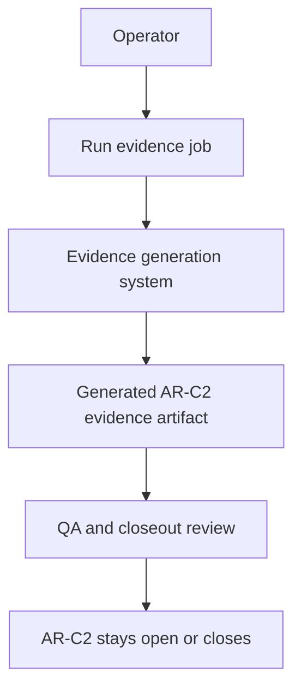
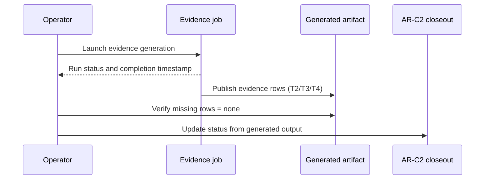

# AR-C2 Automated Evidence User Manual

This manual explains how operators use automatic AR-C2 evidence generation.

## Context

Today AR-C2 evidence is partially manual, which delays closure and increases
review friction.

This manual documents the future operating mode where the system generates the
evidence artifact directly from observability sources.

## Objective

Enable operators to run one process that produces complete AR-C2 evidence for
dashboard wiring, alert wiring, and sustained validation windows.

## Who is this for

- on-call operators
- product owners validating SLA posture
- QA reviewers checking closure readiness

## Domain view



## Sequence of use



## User procedure

1. Launch the evidence-generation run for target environment and window.
2. Wait until status is `completed`.
3. Open generated artifact and confirm:
   - dashboard matrix filled,
   - alert matrix filled,
   - sustained window results present.
4. If any row is missing, keep AR-C2 open and create follow-up issue.
5. If all rows are present and pass, proceed to AR-C2 closure review.

Command:

```bash
pnpm ops:ar-c2:evidence
```

## Expected output fields

- environment
- execution timestamp (UTC)
- dashboard panel reference (immutable)
- alert rule reference (immutable)
- threshold window result
- reviewer notes

## References

- [AR-C2 automated evidence generation plan](../planning/proposals/mandatory/runtime-and-contracts/ar-c2-automated-evidence-generation-plan-20260404.md)
- [AR-C2 Dashboard And Alert Wiring Evidence](../runbooks/ar-c2-dashboard-alert-wiring-evidence-20260404.md)
