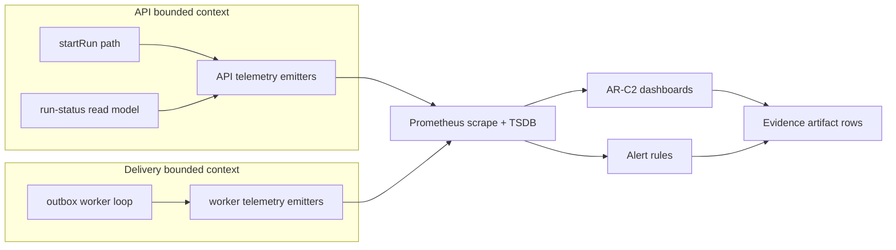
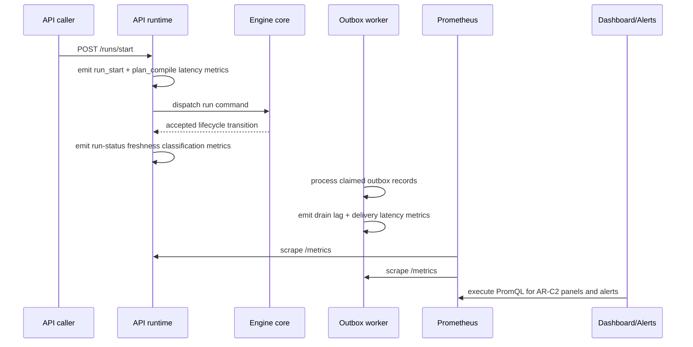

# AR-C2 Observability Technical Manual

This manual defines how AR-C2 telemetry is produced, queried, validated, and
accepted as closure evidence.

## Technical Scope

- planner-to-runtime latency visibility
- run-status freshness visibility
- outbox drain and delivery visibility
- dashboard and alert evidence capture posture

## Domain Model

## Runtime Sequence

## Canonical Signal Contract

AR-C2 signal names are owned by the canonical mapping source. Do not create
local aliases in dashboard, alert, evidence, or closeout artifacts.

The active mapped signals are:

| Logical signal                     | Logical metric ID                                              | Dashboard panel key               |
| ---------------------------------- | -------------------------------------------------------------- | --------------------------------- |
| Start-run latency p50/p99          | `dvt_api_run_start_latency_seconds`                            | `ar-c2.start-run-latency`         |
| Plan compile latency p50/p99       | `dvt_api_plan_compile_latency_seconds`                         | `ar-c2.plan-compile-latency`      |
| Snapshot staleness counts          | `dvt.api.run_status.snapshot_staleness_result_total`           | `ar-c2.snapshot-staleness-counts` |
| Snapshot unknown fallback counts   | `dvt.api.run_status.snapshot_staleness_fallback_unknown_total` | `ar-c2.snapshot-unknown-fallback` |
| Outbox claimed-lag gauge           | `dvt_outbox_oldest_claimed_lag_seconds`                        | `ar-c2.outbox-claimed-lag`        |
| Outbox drain lag p95               | `dvt_delivery_outbox_drain_lag_seconds`                        | `ar-c2.outbox-drain-lag`          |
| Event delivery latency p95/p99     | `dvt_delivery_event_delivery_latency_seconds`                  | `ar-c2.event-delivery-latency`    |
| Stale ratio for `GET /runs/:runId` | derived from staleness counts                                  | `ar-c2.run-status-stale-ratio`    |
| Unknown freshness ratio            | derived from staleness counts                                  | `ar-c2.run-status-unknown-ratio`  |

Canonical mapping and thresholds are governed in:

- [AR-C2 SLA Signal Threshold Mapping](../runbooks/ar-c2-sla-signal-threshold-mapping-20260404.md)

## How Metrics Are Read

1. Use exported metric names in PromQL (`dvt_api_*`, `dvt_delivery_*`,
   `dvt_outbox_*`).
2. Compute quantiles from histogram buckets when signal requires p95/p99.
3. Compute stale/unknown ratios from staleness result counters.
4. Bind each query to a dashboard panel key and alert rule identifier.

## Technical Invariants

| Invariant ID  | Rule                                                                  |
| ------------- | --------------------------------------------------------------------- |
| `AR-C2-INV-1` | Do not mark AR-C2 done without immutable dashboard and alert evidence |
| `AR-C2-INV-2` | Signal naming must match canonical mapping source                     |
| `AR-C2-INV-3` | Alert thresholds must be traceable to canonical SLA/runbook           |
| `AR-C2-INV-4` | Sustained validation windows are mandatory for closure                |
| `AR-C2-INV-5` | QA artifact gate must run in non-skip mode for changed artifacts      |

`AR-C2-INV-3` is enforced by the AR-C2 evidence collector. Every
threshold-backed mapping row must declare canonical alert threshold keys and a
`docs/runbooks/**` SLA/runbook source reference. Generated evidence repeats
that source next to each alert threshold so reviewers can trace alert wiring
back to the SLA text without relying on local monitor names.

## Evidence Assembly Workflow

1. Fill dashboard matrix rows in AR-C2 evidence runbook (`T2`).
2. Fill alert matrix rows in AR-C2 evidence runbook (`T3`).
3. Add sustained window outcomes and operator actions (`T4`).
4. Run `pnpm ops:ar-c2:evidence -- --require-dashboard-alert-evidence`.
5. Run `pnpm ops:ar-c2:evidence -- --require-sustained-validation-windows`.
6. Update lane and review artifacts only after evidence is attached.
7. Run `pnpm qa:artifact:check`, `pnpm docs:sync`,
   `pnpm docs:workboard:generate`, and `pnpm verify:prepush`.

## Primary References

- [API Runtime SLA Canonical](../runbooks/api-runtime-sla-canonical-20260404.md)
- [AR-C2 Dashboard And Alert Wiring Evidence](../runbooks/ar-c2-dashboard-alert-wiring-evidence-20260404.md)
- [AR-C2 Fowler hard QA review](../planning/reviews/architecture-and-governance/20260404-ar-c2-fowler-hard-qa-review.md)
- [AR-C2 SLA operational closure checklist](../planning/closeouts/20260404-ar-c2-sla-operational-closure-closeout.md)
