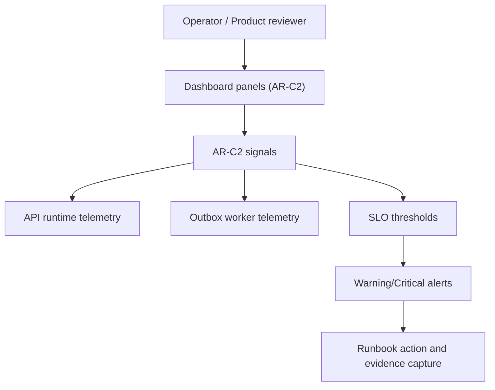
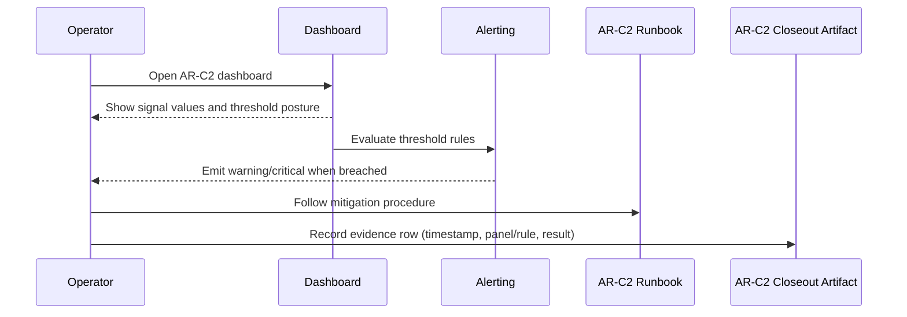

# AR-C2 Observability User Manual

This manual explains how operators and product stakeholders should read AR-C2
signals and act on dashboard and alert outcomes.

## Audience

- product owners validating service posture
- on-call operators triaging incidents
- QA reviewers validating operational evidence

## Domain View

## Sequence Of Use

## What To Read

| Signal key             | What you read                                    | Healthy posture                            | Action when unhealthy                          |
| ---------------------- | ------------------------------------------------ | ------------------------------------------ | ---------------------------------------------- |
| `plan_compile_latency` | p50/p99 compile latency panel                    | p50 <= 1200ms, p99 <= 6000ms               | investigate planner/API compile path           |
| `run_start_latency`    | p50/p99 run-start latency panel                  | p50 <= 500ms, p99 <= 2500ms                | investigate API start-run admission and engine |
| `run_status_freshness` | stale/unknown ratio panels from staleness counts | stale <= 5%, unknown <= 0.1%               | investigate projection freshness and fallback  |
| `outbox_delivery_lag`  | outbox lag and delivery-latency panels           | drain lag p95 <= 30s, delivery p99 <= 5000 | investigate outbox drain and delivery pressure |

## Daily Operating Procedure

1. Open the AR-C2 dashboard and confirm all four signal families are present.
2. Check warning/critical posture for each threshold-backed signal.
3. For every breach, record incident metadata and applied mitigation.
4. Update evidence matrices in the AR-C2 evidence runbook.
5. Keep AR-C2 as open unless sustained validation windows are captured.

## Evidence You Must Capture

- immutable dashboard reference (UID/URL/hash)
- panel key/id and query expression
- alert rule identifier, severity, and routing
- UTC capture time and reviewer
- pass/fail result for each threshold window

## Canonical Sources

- [API Runtime SLA Canonical](../runbooks/api-runtime-sla-canonical-20260404.md)
- [AR-C2 SLA Signal Threshold Mapping](../runbooks/ar-c2-sla-signal-threshold-mapping-20260404.md)
- [AR-C2 Dashboard And Alert Wiring Evidence](../runbooks/ar-c2-dashboard-alert-wiring-evidence-20260404.md)
- [AR-C2 SLA operational closure checklist](../planning/closeouts/20260404-ar-c2-sla-operational-closure-closeout.md)
