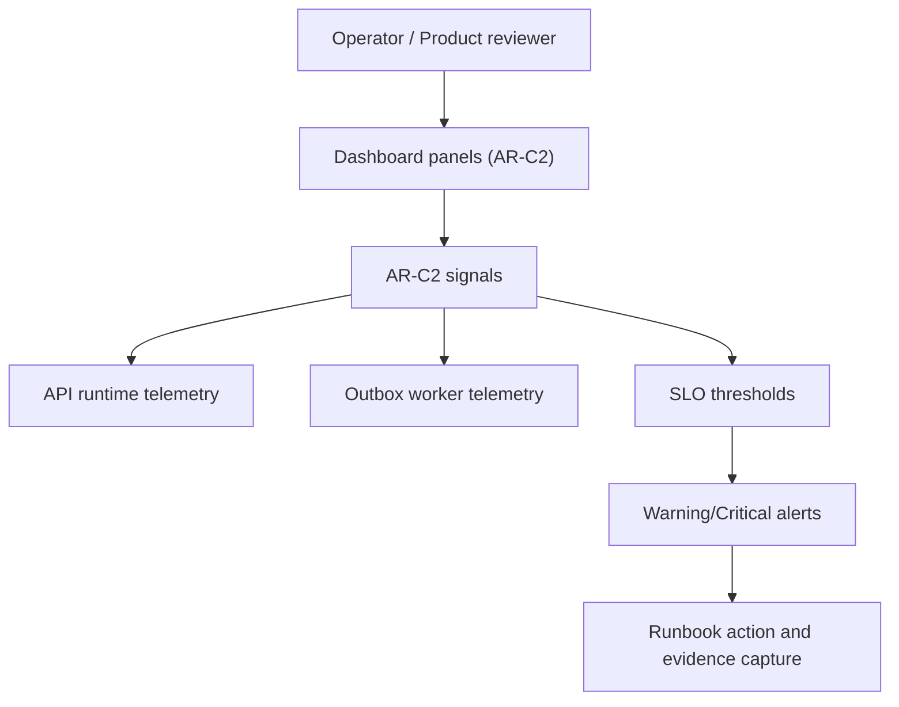
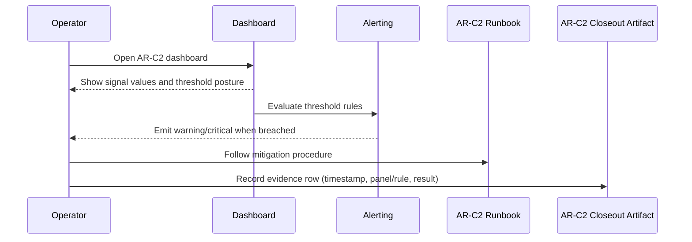

# AR-C2 Observability User Manual

This manual explains how operators and product stakeholders should read AR-C2
signals and act on dashboard and alert outcomes.

## Audience

- product owners validating service posture
- on-call operators triaging incidents
- QA reviewers validating operational evidence

## Domain View

## Sequence Of Use

## What To Read

Use the signal and panel names from the canonical mapping source. Dashboard and
alert evidence must not introduce local aliases.

- Start-run latency p50/p99 (`ar-c2.start-run-latency`): read the p50/p99
  run-start latency panel. Healthy posture is p50 <= 500ms and p99 <= 2500ms;
  investigate API start-run admission and engine behavior when unhealthy.
- Plan compile latency p50/p99 (`ar-c2.plan-compile-latency`): read the p50/p99
  compile latency panel. Healthy posture is p50 <= 1200ms and p99 <= 6000ms;
  investigate the planner/API compile path when unhealthy.
- Snapshot staleness counts (`ar-c2.snapshot-staleness-counts`): read staleness
  classification counts as the source for stale and unknown ratios; investigate
  projection freshness when unhealthy.
- Snapshot unknown fallback counts (`ar-c2.snapshot-unknown-fallback`): read
  unknown fallback reasons as the source for unknown fallback diagnostics;
  investigate fallback cause when unhealthy.
- Outbox claimed-lag gauge (`ar-c2.outbox-claimed-lag`): read oldest
  claimed-record lag as an observational baseline; inspect worker ownership and
  stuck claims when unhealthy.
- Outbox drain lag p95 (`ar-c2.outbox-drain-lag`): read outbox drain lag.
  Healthy posture is p95 <= 30s; investigate outbox drain pressure when
  unhealthy.
- Event delivery latency p95/p99 (`ar-c2.event-delivery-latency`): read event
  delivery latency. Healthy posture is p95 <= 1500ms and p99 <= 5000ms;
  investigate downstream delivery pressure when unhealthy.
- Stale ratio for `GET /runs/:runId` (`ar-c2.run-status-stale-ratio`): read the
  stale ratio from staleness counts. Healthy posture is stale <= 5%;
  investigate projection freshness when unhealthy.
- Unknown freshness ratio (`ar-c2.run-status-unknown-ratio`): read the unknown
  ratio from staleness counts. Healthy posture is unknown <= 0.1%; investigate
  projection fallback and telemetry when unhealthy.

## Daily Operating Procedure

1. Open the AR-C2 dashboard and confirm all mapped signals are present.
2. Check warning/critical posture for each threshold-backed signal.
3. For every breach, record incident metadata and applied mitigation.
4. Update evidence matrices in the AR-C2 evidence runbook.
5. Keep AR-C2 as open unless sustained validation windows are captured.

## Evidence You Must Capture

- immutable dashboard reference (UID/URL/hash)
- panel key/id and query expression
- alert rule identifier, severity, and routing
- UTC capture time and reviewer
- pass/fail result for each threshold window

## Canonical Sources

- [API Runtime SLA Canonical](../runbooks/api-runtime-sla-canonical-20260404.md)
- [AR-C2 SLA Signal Threshold Mapping](../runbooks/ar-c2-sla-signal-threshold-mapping-20260404.md)
- [AR-C2 Dashboard And Alert Wiring Evidence](../runbooks/ar-c2-dashboard-alert-wiring-evidence-20260404.md)
- [AR-C2 SLA operational closure checklist](../planning/closeouts/20260404-ar-c2-sla-operational-closure-closeout.md)
