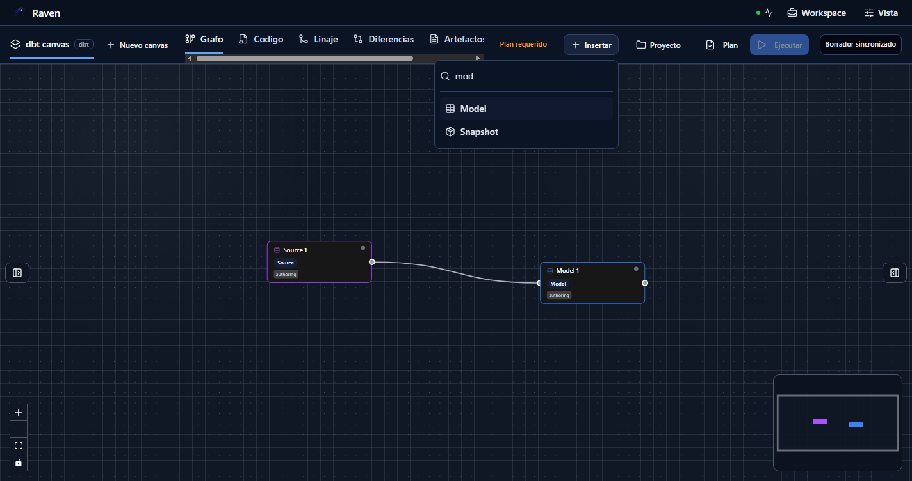
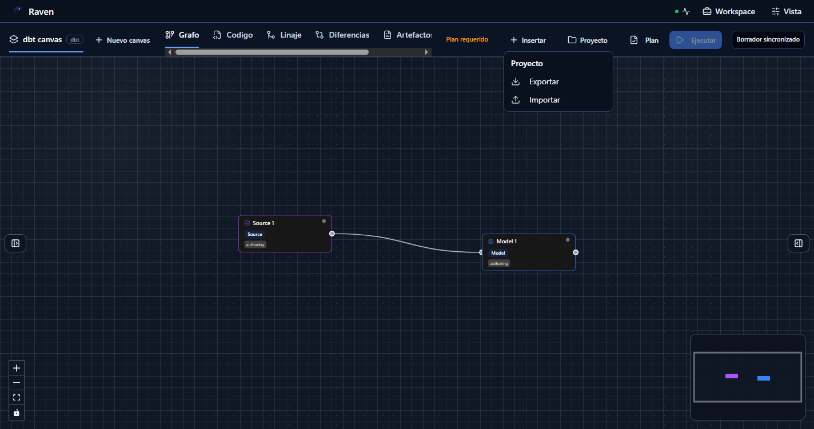
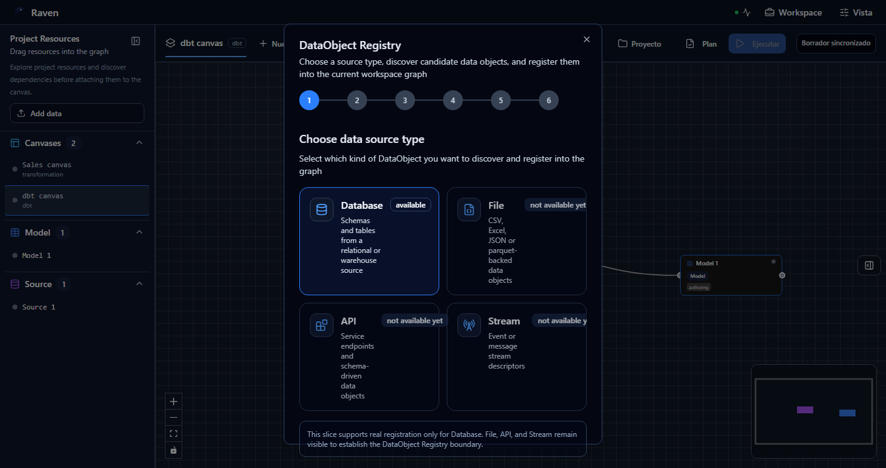
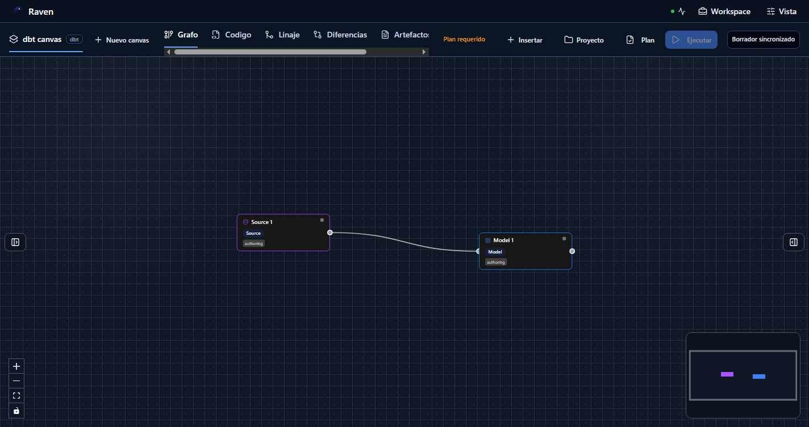

# Manual de usuario de autoria en Canvas

## Estado de evidencia

Este documento no debe leerse como prueba de un flujo SQL profesional completo.
Las capturas existentes muestran capacidades parciales del Canvas, pero no
demuestran todavia el flujo exigente de producto desde un canvas vacio hasta:

- exploracion real de origenes con conexion, tablas, columnas y metadata;
- seleccion visible de tablas origen antes de crear el grafo;
- autoria de transformacion SQL con contexto de columnas de entrada;
- seleccion explicita de destino con adaptador, base de datos, esquema, tabla,
  materializacion y modo de escritura;
- preview, ejecucion y evidencia que nombren el mismo origen y destino elegidos.

El gap operativo esta registrado en la BBDD como
`SQL-CANVAS-UX-P0-PRO-FLOW-1`. Hasta que ese trabajo cierre con pruebas E2E y
capturas nuevas, este manual es una guia limitada de superficies existentes, no
un visto bueno de producto maduro.

## Audiencia

Este manual es para usuarios, QA y revisores de producto que validan la autoria
visual de workflows en Canvas. Describe como usar la herramienta, que casos de
uso estan cubiertos por el flujo actual y que casos siguen condicionados o fuera
de alcance.

Los nombres de controles se citan como aparecen en la evidencia inglesa. Desde
`Vista > Idioma` se puede elegir `Espanol` o `Ingles`; etiquetas, tooltips,
mensajes y estados deben cambiar juntos al idioma seleccionado.

## Prerrequisitos

- El usuario debe tener una sesion autenticada.
- Debe existir tenant, proyecto y entorno seleccionados.
- El backend debe responder salud, capacidades y borrador de workspace.
- El canvas debe ser escribible para crear nodos, conectar nodos o importar
  fuentes.
- Las acciones visibles dependen del tipo de canvas activo. Un canvas `dbt`
  muestra tipos `dbt`; un canvas de transformacion no debe mezclar tipos
  incompatibles.

La pantalla no debe inventar datos de ejemplo cuando falta proyecto, entorno o
autoridad de borrador.

## Mapa rapido

La vista principal tiene estas zonas:

- Barra superior de workspace: estado de conexion, workspace y vista.
- Superficie de grafo: nodos, aristas, controles de zoom y minimapa.
- Menu contextual del canvas: creacion de nodos, `Add source`, exploracion de
  proyecto, codigo de proyecto, validacion y preview.
- Workbench contextual del nodo: propiedades, columnas, metadata, tests,
  codigo y evidencia del nodo seleccionado.
- Consola inferior: eventos de ejecucion cuando existe un run activo.

## Abrir un canvas existente

1. Abrir `/canvas` con sesion y proyecto seleccionados.
2. Confirmar que aparece el canvas activo, por ejemplo `dbt canvas`.
3. Confirmar que los nodos persistidos se renderizan en el grafo.
4. Confirmar el estado del borrador: `Borrador sincronizado`, `Plan requerido`
   u otro estado explicito.

Resultado esperado: el usuario ve un grafo real de proyecto. Si falta autoridad
de backend o de proyecto, la vista debe bloquear autoria en vez de mostrar datos
de muestra.

## Cambiar de proyecto sin mezclar datos

1. Pulsar el nombre `Proyecto: ...` de la barra superior para abrir `Espacio de
trabajo`.
2. Revisar el tenant, proyecto y entorno activos en `Contexto del proyecto`.
   Esos campos son informativos; no se editan escribiendo sobre ellos.
3. En `Proyectos disponibles en esta sesion`, elegir el scope
   `tenant / proyecto / entorno` deseado.
4. Confirmar que el menu se cierra y que la barra superior muestra el proyecto
   nuevo antes de continuar.
5. Volver al proyecto anterior con el mismo selector cuando sea necesario.

Resultado esperado: la seleccion usa el rail `SelectWorkspaceScope`, vuelve a
cargar el borrador, archivos y conexiones del scope elegido y no reutiliza el
contenido de otro proyecto aunque ambos tengan una ruta como
`models/sources/src_public.yml`. La prueba mas exigente usa el mismo objeto
fisico PostgreSQL en A y B, confirma que B empieza sin el grafo de A y, al
volver, recupera las dos fuentes y `Model 1` de A. Si solo existe un proyecto
autorizado, aparece `No hay otro proyecto disponible en esta sesion.`; no se
inventan alternativas.

## Insertar nodos

1. Hacer click derecho sobre una zona vacia del canvas.
2. Elegir el tipo de nodo permitido por el canvas activo.
3. Confirmar que el nodo aparece en el punto contextual del grafo.
4. Abrir el workbench del nodo con doble click o menu contextual del nodo.

Resultado esperado: el menu contextual solo muestra acciones del canvas y no
mezcla propiedades de nodos. En un canvas `dbt`, las acciones crean tipos
compatibles con dbt; en un canvas DVT, crean tipos compatibles con el flujo DVT.
La insercion de nodos no sustituye al importador de fuentes gobernadas.

## Usar el explorador de proyecto

1. Hacer click derecho sobre el canvas.
2. Elegir `Explore project`.
3. Buscar archivos, artefactos o canvases del workspace en el dialogo
   contextual.
4. Cerrar el dialogo para volver al grafo sin dejar un panel fijo abierto.

Resultado esperado: el explorador lista recursos existentes del proyecto bajo
demanda. No debe aparecer un panel lateral fijo `Project Resources` en el modo
base del grafo.

## Registrar fuentes de datos

1. Hacer click derecho sobre una zona vacia del canvas.
2. Elegir `Add source`.
3. En `Connections`, elegir una conexion gobernada.
4. En `Browse`, revisar esquemas, tablas, filas y columnas disponibles.
5. En `Metadata`, revisar columnas y metadata del origen activo.
6. En `Selected`, confirmar la cesta de tablas y pulsar `Attach sources to
canvas`.
7. Si la cesta supera el alto visible, usar la barra de desplazamiento del
   contenido. `Cancel` y `Attach sources to canvas` permanecen accesibles.
8. Abrir el Workbench del nodo importado y comprobar en `General` la fila
   `Connection`, con nombre, proveedor e identificador completos.

Resultado esperado: el flujo registra fuentes gobernadas desde los rails
`ListWarehouseConnections`, `ListWarehouseConnectionSourceObjects` e
`ImportWarehouseSources`, y las proyecta como nodos de fuente en el canvas cerca
del punto donde se abrio el menu contextual. La identidad persistida es la
combinacion de conexion y objeto fisico: importar el mismo objeto mediante dos
conexiones produce dos nodos distinguibles. No se muestran secretos ni se
deduce una conexion a partir del nombre de tabla.

## Gestionar proyecto

1. Pulsar `Proyecto`.
2. Usar `Exportar` para descargar un snapshot del proyecto/canvas.
3. Usar `Importar` para cargar un snapshot compatible.

Resultado esperado: `Proyecto > Importar` importa un snapshot de proyecto. No
abre el wizard de conexiones ni descubre fuentes externas.

## Crear plan y ejecutar

1. Completar un grafo valido.
2. Revisar que el estado deje de indicar `Plan requerido`.
3. Pulsar `Plan` para generar la previsualizacion.
4. Revisar el plan antes de iniciar la ejecucion.
5. Pulsar `Ejecutar` cuando el boton este habilitado.
6. Revisar logs y evidencia en `Ejecuciones`.

Resultado esperado: no se puede ejecutar un canvas sin plan valido. En la
captura principal, `Ejecutar` esta deshabilitado porque la barra indica
`Plan requerido`.

## Revisar codigo y artefactos

1. Seleccionar un nodo y pulsar el icono `Codigo` de su barra flotante.
2. Si el nodo declara una ruta persistida, confirmar que se abre ese archivo
   exacto en el Workbench de codigo del proyecto.
3. Si el nodo es nuevo o generado y aun no tiene archivo persistido, confirmar
   que se abre `More: Code` del propio nodo para revisar o editar su SQL.
4. Con el editor SQL enfocado, usar `Backspace` o `Delete` y confirmar que solo
   cambia el texto; el nodo seleccionado debe seguir en el grafo.
5. Para revisar el proyecto completo, abrir `Espacio de trabajo > Open project
code` y elegir un archivo del explorador.
6. Abrir `Artefactos` para revisar artefactos sincronizados y usar `View` o
   `Download` cuando esten disponibles.

Resultado esperado: codigo y artefactos son vistas de inspeccion del workspace;
no sustituyen el grafo, no fabrican rutas `models/<nombre>.sql` y nunca deben
mostrar el primer archivo disponible o contenido de otro nodo como sustituto
del recurso seleccionado.

## Casos de uso con evidencia parcial

- Abrir canvas con borrador:
  `/canvas` con proyecto y entorno validos. Evidencia:
  `08-current-dbt-canvas.png`. Limite: no prueba flujo desde canvas vacio hasta
  ejecucion.
- Crear nodo del catalogo:
  `Insertar` y elegir tipo compatible. Evidencia:
  `09-insert-node-search.png`. Limite: no prueba seleccion de origen real ni
  metadata de tabla.
- Buscar tipos de nodo:
  escribir en la paleta de insercion. Evidencia:
  `09-insert-node-search.png`. Limite: busca tipos, no origenes warehouse.
- Inspeccionar recursos:
  abrir `Explore project` desde el menu contextual del canvas. Limite: no
  demuestra columnas ni metadata de warehouse.
- Abrir Add Source:
  `Canvas context menu > Add source`. Evidencia E2E:
  `apps/web/cypress/e2e/canvas/canvas-source-import-live-clean.cy.ts`. Cubre
  runtime protegido, conexion warehouse real, metadata, seleccion, attach al
  canvas, conexion source-model y preview sin stubs de draft.
- Importar/exportar snapshot:
  `Proyecto > Exportar` o `Importar`. Evidencia:
  `10-project-snapshot-menu.png`. Limite: es snapshot, no flujo de conexion,
  origen y destino.
- Bloquear ejecucion sin plan:
  `Ejecutar` queda deshabilitado. Evidencia:
  `08-current-dbt-canvas.png`. Limite: no prueba readiness profesional de
  origen, transformacion y destino.
- Canvas de solo lectura:
  grafo visible sin acciones de escritura. Evidencia:
  `05-read-only-canvas.png`. Limite: solo postura de permisos.
- Primer nodo en canvas vacio:
  catalogo tipado del canvas activo. Evidencia:
  `06-empty-canvas.png`, `07-empty-canvas-first-node.png`. Limite: no prueba
  flujo SQL completo.

## Casos no contemplados o condicionados

### Flujo SQL profesional completo no esta probado

No existe todavia evidencia aceptable de que un usuario pueda empezar desde un
canvas vacio, explorar origenes reales con columnas y metadata, seleccionar las
tablas origen, crear la transformacion SQL, escoger destino exacto, planificar,
ejecutar y revisar evidencia sin depender de campos manuales o supuestos de
fixture. Ese trabajo queda fuera de este manual hasta que cierre
`SQL-CANVAS-UX-P0-PRO-FLOW-1`.

### API, File y Stream no estan disponibles aun

El registro de objetos muestra `File`, `API` y `Stream`, pero los marca como no
disponibles. La slice actual solo permite registro real de `Database`.

### `Proyecto > Importar` no conecta fuentes

El menu `Proyecto` solo contiene importacion y exportacion de snapshot. No debe
usarse para crear conexiones Postgres, REST, API o warehouse.

### No hay ejecucion sin plan valido

Cuando aparece `Plan requerido`, el boton `Ejecutar` permanece deshabilitado.
El usuario debe corregir el grafo o generar un plan antes de ejecutar.

### Borrado contextual de aristas no demostrado en esta evidencia

La pasada de captura de 2026-06-02 hizo clic contextual sobre el elemento SVG
de la arista, pero no mostro `Eliminar conexion`. Por tanto este manual no lo
presenta como flujo validado. El borrado de nodos si aparece como menu
contextual independiente.

### Conectores externos reales siguen gobernados por rail

La UI abre `Add source` desde el canvas, pero la verdad de conexiones no debe
salir de fixtures locales ni de formularios ad hoc. Las conexiones deben venir
de rails protegidos como `ListWarehouseConnections`,
`ListWarehouseConnectionSourceObjects` e `ImportWarehouseSources`.

## Lista de comprobacion QA

- Abrir `/canvas` y comprobar que no se cargan datos de muestra sin proyecto.
- Confirmar que el menu contextual del canvas muestra solo acciones de canvas.
- Confirmar que no existe panel fijo `Project Resources` ni accion `Add data`
  en el modo base del grafo.
- Crear un nodo y verificar que queda visible en el mismo contexto del grafo.
- Seleccionar un nodo y revisar que el workbench contextual muestra datos del
  nodo real.
- Abrir `Add source` desde el menu contextual y comprobar conexiones, tablas,
  columnas, metadata y cesta de seleccion.
- Con una cesta alta, recorrerla con teclado y puntero; comprobar que la barra
  de desplazamiento es visible y que `Cancel` y `Attach sources to canvas` son
  alcanzables sin perder contexto.
- Abrir el nodo importado y verificar que `Connection` muestra nombre,
  proveedor e identificador completos, sin elipsis y sin secretos.
- Importar el mismo objeto fisico mediante dos conexiones y confirmar que no se
  deduplican entre si.
- Cambiar entre dos proyectos autorizados que compartan una ruta de archivo y
  un nombre de nodo; confirmar que B empieza limpio, crea su propio estado y que
  cada uno conserva su contenido al volver A -> B -> A.
- Abrir `Proyecto` y confirmar que `Importar` es snapshot, no conexion.
- Confirmar que `Ejecutar` no se habilita con `Plan requerido`.
- Pulsar `Codigo` en un nodo persistido y en uno generado; comprobar que cada
  accion abre el recurso exacto y nunca un archivo de respaldo no relacionado.
- Borrar texto dentro del editor SQL con `Backspace` y `Delete`; comprobar que
  el nodo seleccionado no se elimina y que el Canvas conserva su grafo.
- Repetir la comprobacion de visibilidad a 1000x660, 1280x720 y 1440x900, con
  zoom de navegador al 100 % y al 200 %, sin texto truncado que oculte identidad
  ni controles fuera del alcance del scroll.
- Recorrer las acciones con teclado, comprobar foco visible, nombres
  accesibles, orden logico, cierre con `Escape` y ausencia de violaciones axe
  `serious` o `critical` en las superficies revisadas.
- Abrir `Codigo`, `Artefactos` y `Ejecuciones` y comprobar que cada vista muestra
  informacion alineada con el workspace activo.

### Cobertura automatizada y comprobacion manual exigente

La prueba protegida de Source Import ejecuta 1440x900, 1280x720, 1000x660 y
500x330. Este ultimo tamano ejerce la presion de layout equivalente a ampliar al
200 % la base 1000x660. En cada tamano exige el dialogo y el Workbench de la
fuente completamente dentro del viewport, `Connection` visible con su identidad
exacta, scroll util, cierre y `Cancel` alcanzables, cero hallazgos axe
`serious`/`critical` y ninguna tercera fuente persistida al cancelar. No se usan
clicks forzados.

La misma prueba abre dos scopes concedidos por el servidor en una unica sesion,
cambia mediante el selector visible, crea B desde su estado vacio, reutiliza la
ruta `models/sources/src_public.yml` y el mismo objeto fisico, y vuelve a A. Las
lecturas autorizadas de borrador y archivo deben devolver A, B y A sin datos
cruzados. Tambien vacia el SQL con teclado y exige que `Model 1` permanezca antes
de continuar la autoria.

El usuario exigente debe repetir ademas el 200 % con el zoom real del navegador,
porque el rasterizado, las preferencias de fuente y el escalado del sistema
operativo no quedan completamente representados por un viewport CSS reducido.
Si titulo, conexion, identificador, acciones o foco quedan ocultos, el resultado
es `NO-GO` aunque la prueba automatizada sea verde.

## Diagnostico rapido

| Sintoma                                  | Revision                                                         |
| ---------------------------------------- | ---------------------------------------------------------------- |
| Menu contextual no abre                  | Permisos de escritura y captura de click derecho en el canvas    |
| El nodo creado no persiste               | Respuesta del guardado de borrador y revision esperada           |
| No aparece `Add source`                  | Capacidad de source import y plugin `dvt.warehouse-source`       |
| `Proyecto > Importar` no descubre tablas | Es correcto: es importacion de snapshot                          |
| `Ejecutar` esta deshabilitado            | Revisar `Plan requerido` y generar plan valido                   |
| El inspector no muestra datos            | Seleccion activa y metadata del nodo en el borrador              |
| El menu de arista no aparece             | Flujo no validado por esta evidencia; registrar bug si reproduce |

## Evidencia de capturas

Las capturas `01` a `07` proceden de pruebas Cypress E2E del build `@dvt/web`
y representan proyectos ya seleccionados. Las capturas `08` a `13` se
generaron el 2026-06-02 con Chrome headless contra `http://localhost:5173/canvas`.

Estas capturas son evidencia de comportamiento UI, no sustituyen pruebas de
contrato ni validacion de backend.
