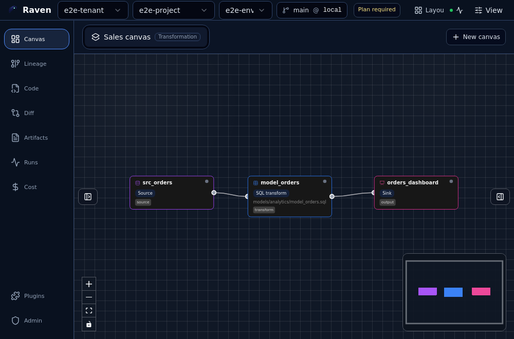
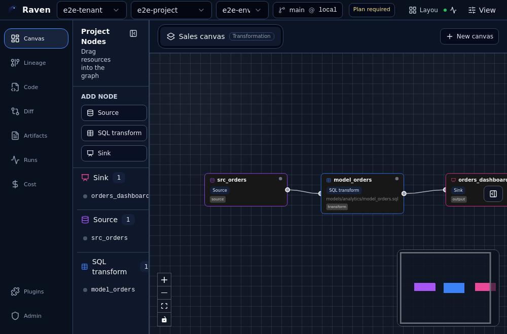
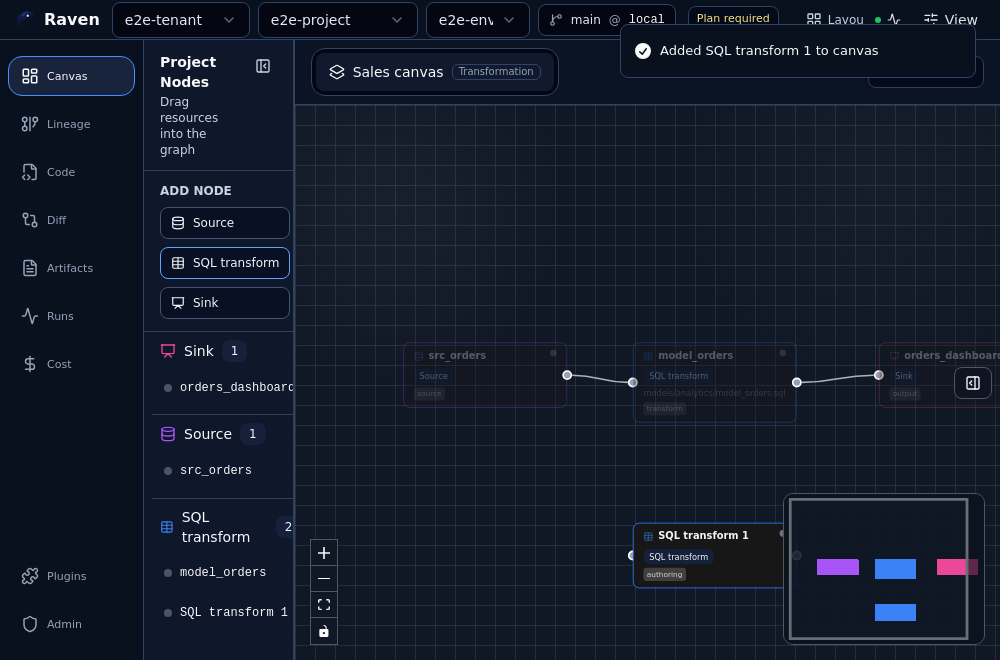
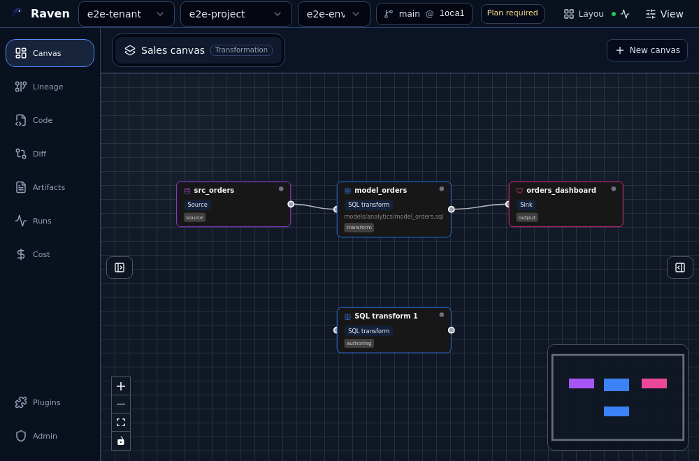
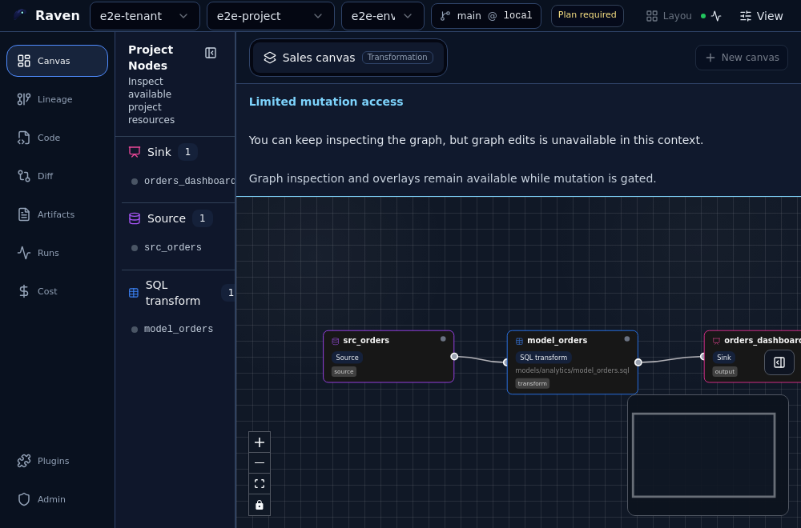
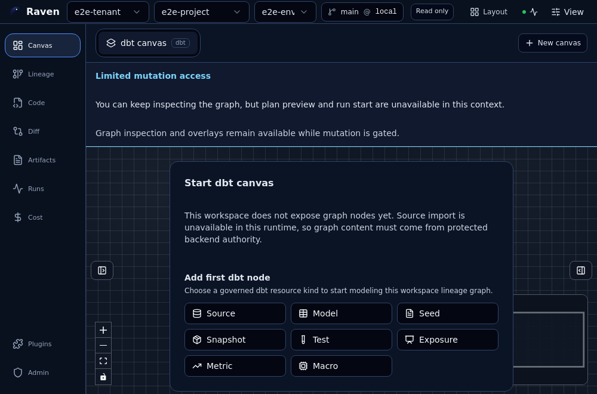
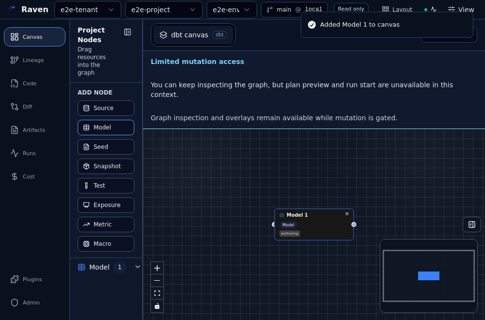

# Canvas Authoring User Manual

## Audience

This manual is for users and QA reviewers who validate Canvas graph authoring.
It covers the UI flows that are currently testable: opening a project-backed
canvas, adding nodes from the typed catalog, confirming persistence after
reload, removing nodes, working with empty typed canvases, and recognizing
read-only posture.

## Product Scope And Prerequisites

- The user must already have an authenticated product session.
- The user must have a selected tenant, project, and environment.
- The selected project must expose a workspace graph draft.
- The backend must answer health, readiness, capabilities, and workspace draft
  requests.
- The canvas must be writable for the `Add node` entry point to appear.
- Each canvas only shows node types allowed by the active canvas kind.

If no project is selected, Canvas must not render sample nodes. The expected
startup posture is a project selection or project creation flow. The screenshots
below use Cypress E2E fixtures after a project and draft have already been
selected; they are evidence for Canvas authoring behavior, not evidence for
login or project onboarding.

## Open An Existing Canvas

1. Open `/canvas` after selecting a valid project.
2. Confirm that the canvas title appears in the workspace header.
3. Confirm that the existing nodes render in the graph.
4. Use the `Project Nodes` panel to inspect the available categories.

Expected result: the user sees the active canvas, context top bar, project
resource panel, and loaded graph.

## Add A Node To The Canvas

1. Open the `Project Nodes` panel.
2. Find the `Add node` section.
3. Select the governed node type that belongs to the active canvas kind.

Expected result: the catalog shows only node types compatible with the active
canvas. For a transformation canvas, `Source`, `SQL transform`, and `Sink` are
available.

## Confirm The Node Is Created In The Same Visual Context

After selecting `SQL transform`, the new node appears in the same loaded canvas
cluster. It must not be created at a disconnected origin or outside the useful
viewport.

Expected result: the new node is visible, selected by the authoring UI, and
saved through the workspace draft.

## Validate Persistence After Reload

1. Add the node.
2. Wait for the draft save to complete.
3. Reload the page or open `/canvas` again.
4. Confirm that the node remains in the canvas and keeps its position.

Expected result: the created node is still present after reload. If it is
missing, the save did not complete or the remote draft rejected the write.

## Remove A Node

1. Open the context menu on the node.
2. Choose `Remove node`.
3. Confirm that the node disappears from the graph.
4. Reload the canvas and confirm that the removal persists.

Expected result: the removed node does not return after reload. Edges that
depended on that node also stop rendering.

## Read-Only Canvas

When the draft allows reads but not writes, Canvas still renders the graph but
does not expose authoring actions.

Expected result: `Add node` does not appear and no
`PUT /workspace/graph/draft` mutation is sent. This avoids presenting local
changes as persisted when the user lacks write permission.

## First Node In An Empty Typed Canvas

If the selected project contains an empty canvas, the screen shows the typed
entry point for that canvas. The first node must come from the catalog for the
active canvas kind.

In a `dbt` canvas, the catalog offers `dbt` node types such as `Model`. After
creating the first node, the canvas moves from empty state to editable graph.

Expected result: the first node appears in the canvas and is ready for further
authoring. A `dbt` canvas must not show generic transformation types unless
they belong to its catalog.

## Expected Negative Cases

| Situation              | Expected behavior                                                    |
| ---------------------- | -------------------------------------------------------------------- |
| No authenticated user  | Product routes redirect to login; Canvas does not render graph data. |
| No selected project    | Canvas shows project selection or creation, not sample nodes.        |
| Read-only draft        | `Add node` is hidden and no draft write is sent.                     |
| Remote save fails      | The node may appear locally, but must not reappear after reload.     |
| Incompatible node type | The type is absent from the active canvas catalog.                   |
| Empty typed canvas     | Only node types defined for the active canvas kind are shown.        |
| Backend unavailable    | Canvas blocks authoring and shows the error or waiting posture.      |

## QA Checklist

- Open `/canvas` with a selected project and confirm that the existing canvas
  loads with its nodes.
- Open `Project Nodes` and confirm that `Add node` appears only in writable
  mode.
- Create a compatible node and confirm that it appears in the same visual
  context as the loaded graph.
- Reload and confirm that the created node remains present.
- Remove the node, reload, and confirm that it does not return.
- Repeat in read-only mode and confirm that no creation entry point exists.
- Repeat with an empty typed canvas and confirm that the first node comes from
  the typed catalog.
- Start without an authenticated session and confirm that login is required.
- Start without a selected project and confirm that no fixture or sample nodes
  appear.

## Troubleshooting

- `Add node` is missing: check write permission and draft mode.
- A node appears in the wrong place: check the persisted value in
  `draft.nodePositions`.
- A node disappears after reload: check the draft save response and expected
  revision.
- Node types from another vertical appear: check the active canvas kind and
  node-kind registry.
- Canvas blocks on open: check `/healthz`, `/readyz`, `/capabilities`, and the
  workspace draft request.
- Sample nodes appear on product startup without a project: remove fixture/demo
  seeding from the runtime path and route the user through project onboarding.

## Screenshot Evidence

The screenshots in this manual were generated with Cypress against the
`@dvt/web` E2E build. The fixture nodes in those screenshots come from
`apps/web/cypress/support/canvasDraftAuthoring.ts` and represent an already
selected project draft. They must not be treated as default production startup
data.

The covered cases are:

- existing canvas with loaded nodes;
- editable node catalog;
- compatible node creation;
- persistence after reload;
- read-only posture;
- empty typed canvas;
- first node in an empty typed canvas.
