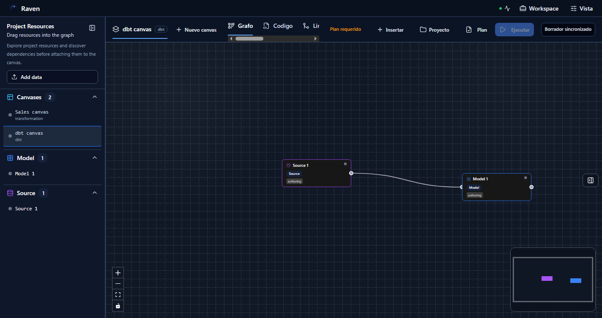

# Manual de usuario de autoria en Canvas

## Estado de evidencia

Este documento no debe leerse como prueba de un flujo SQL profesional completo.
Las capturas existentes muestran capacidades parciales del Canvas, pero no
demuestran todavia el flujo exigente de producto desde un canvas vacio hasta:

- exploracion real de origenes con conexion, tablas, columnas y metadata;
- seleccion visible de tablas origen antes de crear el grafo;
- autoria de transformacion SQL con contexto de columnas de entrada;
- seleccion explicita de destino con adaptador, base de datos, esquema, tabla,
  materializacion y modo de escritura;
- preview, ejecucion y evidencia que nombren el mismo origen y destino elegidos.

El gap operativo esta registrado en la BBDD como
`SQL-CANVAS-UX-P0-PRO-FLOW-1`. Hasta que ese trabajo cierre con pruebas E2E y
capturas nuevas, este manual es una guia limitada de superficies existentes, no
un visto bueno de producto maduro.

## Audiencia

Este manual es para usuarios, QA y revisores de producto que validan la autoria
visual de workflows en Canvas. Describe como usar la herramienta, que casos de
uso estan cubiertos por el flujo actual y que casos siguen condicionados o fuera
de alcance.

## Prerrequisitos

- El usuario debe tener una sesion autenticada.
- Debe existir tenant, proyecto y entorno seleccionados.
- El backend debe responder salud, capacidades y borrador de workspace.
- El canvas debe ser escribible para crear nodos, conectar nodos o importar
  fuentes.
- Las acciones visibles dependen del tipo de canvas activo. Un canvas `dbt`
  muestra tipos `dbt`; un canvas de transformacion no debe mezclar tipos
  incompatibles.

La pantalla no debe inventar datos de ejemplo cuando falta proyecto, entorno o
autoridad de borrador.

## Mapa rapido

La vista principal tiene estas zonas:

- Barra superior de workspace: estado de conexion, workspace y vista.
- Barra del canvas: canvas activo, pestanas de trabajo y acciones.
- Superficie de grafo: nodos, aristas, controles de zoom y minimapa.
- Explorador lateral izquierdo: recursos de proyecto y entrada `Add data`.
- Inspector lateral derecho: propiedades del nodo o canvas seleccionado.
- Consola inferior: eventos de ejecucion cuando existe un run activo.

## Abrir un canvas existente

1. Abrir `/canvas` con sesion y proyecto seleccionados.
2. Confirmar que aparece el canvas activo, por ejemplo `dbt canvas`.
3. Confirmar que los nodos persistidos se renderizan en el grafo.
4. Confirmar el estado del borrador: `Borrador sincronizado`, `Plan requerido`
   u otro estado explicito.

Resultado esperado: el usuario ve un grafo real de proyecto. Si falta autoridad
de backend o de proyecto, la vista debe bloquear autoria en vez de mostrar datos
de muestra.

## Insertar nodos

1. Pulsar `Insertar`.
2. Buscar el tipo de nodo en el campo de la paleta.
3. Seleccionar un tipo permitido por el canvas activo.
4. Configurar el nodo en el inspector cuando quede seleccionado.

Resultado esperado: la paleta filtra el catalogo de nodos gobernado. En un
canvas `dbt`, la busqueda `mod` muestra tipos como `Model` y `Snapshot`. La
paleta de insercion no es el importador de datos; solo crea nodos del catalogo
del canvas.

## Usar el explorador de proyecto

1. Abrir el panel izquierdo con el boton lateral.
2. Revisar `Project Resources`.
3. Arrastrar recursos disponibles al canvas cuando el recurso sea arrastrable.
4. Pulsar `Add data` para abrir el registro de objetos de datos si la capacidad
   esta habilitada.

Resultado esperado: el explorador lista recursos existentes del proyecto. La
creacion de nodos nuevos sigue estando en `Insertar`; el descubrimiento de
fuentes gobernadas empieza en `Add data`.

## Registrar fuentes de datos

1. Abrir el explorador lateral izquierdo.
2. Pulsar `Add data`.
3. En `DataObject Registry`, elegir `Database`.
4. Avanzar para cargar conexiones gobernadas desde el catalogo o desde el rail
   protegido de warehouse.
5. Seleccionar tablas candidatas y confirmar el registro.

Resultado esperado: el flujo registra objetos de datos de tipo `Database` y los
proyecta como nodos de fuente en el workspace. Los tipos `File`, `API` y
`Stream` aparecen como frontera de producto, pero no estan disponibles todavia
en esta slice.

## Gestionar proyecto

1. Pulsar `Proyecto`.
2. Usar `Exportar` para descargar un snapshot del proyecto/canvas.
3. Usar `Importar` para cargar un snapshot compatible.

Resultado esperado: `Proyecto > Importar` importa un snapshot de proyecto. No
abre el wizard de conexiones ni descubre fuentes externas.

## Crear plan y ejecutar

1. Completar un grafo valido.
2. Revisar que el estado deje de indicar `Plan requerido`.
3. Pulsar `Plan` para generar la previsualizacion.
4. Revisar el plan antes de iniciar la ejecucion.
5. Pulsar `Ejecutar` cuando el boton este habilitado.
6. Revisar logs y evidencia en `Ejecuciones`.

Resultado esperado: no se puede ejecutar un canvas sin plan valido. En la
captura principal, `Ejecutar` esta deshabilitado porque la barra indica
`Plan requerido`.

## Revisar codigo y artefactos

1. Abrir la pestana `Codigo` para revisar archivos del workspace.
2. Abrir `Artefactos` para revisar artefactos sincronizados.
3. Usar `View` o `Download` cuando el artefacto este disponible.
4. Verificar que el archivo mostrado corresponde al nodo o artefacto esperado.

Resultado esperado: codigo y artefactos son vistas de inspeccion del workspace;
no sustituyen el grafo ni deben mostrar contenido que no corresponda al recurso
seleccionado.

## Casos de uso con evidencia parcial

- Abrir canvas con borrador:
  `/canvas` con proyecto y entorno validos. Evidencia:
  `08-current-dbt-canvas.png`. Limite: no prueba flujo desde canvas vacio hasta
  ejecucion.
- Crear nodo del catalogo:
  `Insertar` y elegir tipo compatible. Evidencia:
  `09-insert-node-search.png`. Limite: no prueba seleccion de origen real ni
  metadata de tabla.
- Buscar tipos de nodo:
  escribir en la paleta de insercion. Evidencia:
  `09-insert-node-search.png`. Limite: busca tipos, no origenes warehouse.
- Inspeccionar recursos:
  abrir panel izquierdo de proyecto. Evidencia:
  `13-dataobject-registry-connections.png`. Limite: no demuestra columnas ni
  metadata completas.
- Abrir DataObject Registry:
  `Project Resources > Add data`. Evidencia:
  `11-dataobject-registry-connection.png`. Limite: no demuestra seleccion
  profesional de origen con destino final.
- Importar/exportar snapshot:
  `Proyecto > Exportar` o `Importar`. Evidencia:
  `10-project-snapshot-menu.png`. Limite: es snapshot, no flujo de conexion,
  origen y destino.
- Bloquear ejecucion sin plan:
  `Ejecutar` queda deshabilitado. Evidencia:
  `08-current-dbt-canvas.png`. Limite: no prueba readiness profesional de
  origen, transformacion y destino.
- Canvas de solo lectura:
  grafo visible sin acciones de escritura. Evidencia:
  `05-read-only-canvas.png`. Limite: solo postura de permisos.
- Primer nodo en canvas vacio:
  catalogo tipado del canvas activo. Evidencia:
  `06-empty-canvas.png`, `07-empty-canvas-first-node.png`. Limite: no prueba
  flujo SQL completo.

## Casos no contemplados o condicionados

### Flujo SQL profesional completo no esta probado

No existe todavia evidencia aceptable de que un usuario pueda empezar desde un
canvas vacio, explorar origenes reales con columnas y metadata, seleccionar las
tablas origen, crear la transformacion SQL, escoger destino exacto, planificar,
ejecutar y revisar evidencia sin depender de campos manuales o supuestos de
fixture. Ese trabajo queda fuera de este manual hasta que cierre
`SQL-CANVAS-UX-P0-PRO-FLOW-1`.

### API, File y Stream no estan disponibles aun

El registro de objetos muestra `File`, `API` y `Stream`, pero los marca como no
disponibles. La slice actual solo permite registro real de `Database`.

### `Proyecto > Importar` no conecta fuentes

El menu `Proyecto` solo contiene importacion y exportacion de snapshot. No debe
usarse para crear conexiones Postgres, REST, API o warehouse.

### No hay ejecucion sin plan valido

Cuando aparece `Plan requerido`, el boton `Ejecutar` permanece deshabilitado.
El usuario debe corregir el grafo o generar un plan antes de ejecutar.

### Borrado contextual de aristas no demostrado en esta evidencia

La pasada de captura de 2026-06-02 hizo clic contextual sobre el elemento SVG
de la arista, pero no mostro `Eliminar conexion`. Por tanto este manual no lo
presenta como flujo validado. El borrado de nodos si aparece como menu
contextual independiente.

### Conectores externos reales siguen gobernados por rail

La UI puede abrir `DataObject Registry`, pero la verdad de conexiones no debe
salir de fixtures locales ni de formularios ad hoc. Las conexiones deben venir
de rails protegidos como `ListWarehouseConnections`,
`ListWarehouseConnectionTables` e `ImportWarehouseSources`.

## Lista de comprobacion QA

- Abrir `/canvas` y comprobar que no se cargan datos de muestra sin proyecto.
- Confirmar que `Insertar` muestra solo tipos compatibles con el canvas activo.
- Buscar `mod` y confirmar que aparecen tipos `dbt` como `Model`.
- Crear un nodo y verificar que queda visible en el mismo contexto del grafo.
- Seleccionar un nodo y revisar que el inspector muestra datos del nodo real.
- Abrir el explorador lateral y comprobar que `Add data` abre
  `DataObject Registry`.
- Confirmar que `Database` aparece disponible y `File`, `API`, `Stream` no.
- Abrir `Proyecto` y confirmar que `Importar` es snapshot, no conexion.
- Confirmar que `Ejecutar` no se habilita con `Plan requerido`.
- Abrir `Codigo`, `Artefactos` y `Ejecuciones` y comprobar que cada vista
  muestra informacion alineada con el workspace activo.

## Diagnostico rapido

| Sintoma                                  | Revision                                                         |
| ---------------------------------------- | ---------------------------------------------------------------- |
| `Insertar` no abre catalogo              | Permisos de escritura y catalogo del canvas activo               |
| El nodo creado no persiste               | Respuesta del guardado de borrador y revision esperada           |
| No aparece `Add data`                    | Capacidad de source import y plugin `dvt.warehouse-source`       |
| `Proyecto > Importar` no descubre tablas | Es correcto: es importacion de snapshot                          |
| `Ejecutar` esta deshabilitado            | Revisar `Plan requerido` y generar plan valido                   |
| El inspector no muestra datos            | Seleccion activa y metadata del nodo en el borrador              |
| El menu de arista no aparece             | Flujo no validado por esta evidencia; registrar bug si reproduce |

## Evidencia de capturas

Las capturas `01` a `07` proceden de pruebas Cypress E2E del build `@dvt/web`
y representan proyectos ya seleccionados. Las capturas `08` a `13` se
generaron el 2026-06-02 con Chrome headless contra `http://localhost:5173/canvas`.

Estas capturas son evidencia de comportamiento UI, no sustituyen pruebas de
contrato ni validacion de backend.
