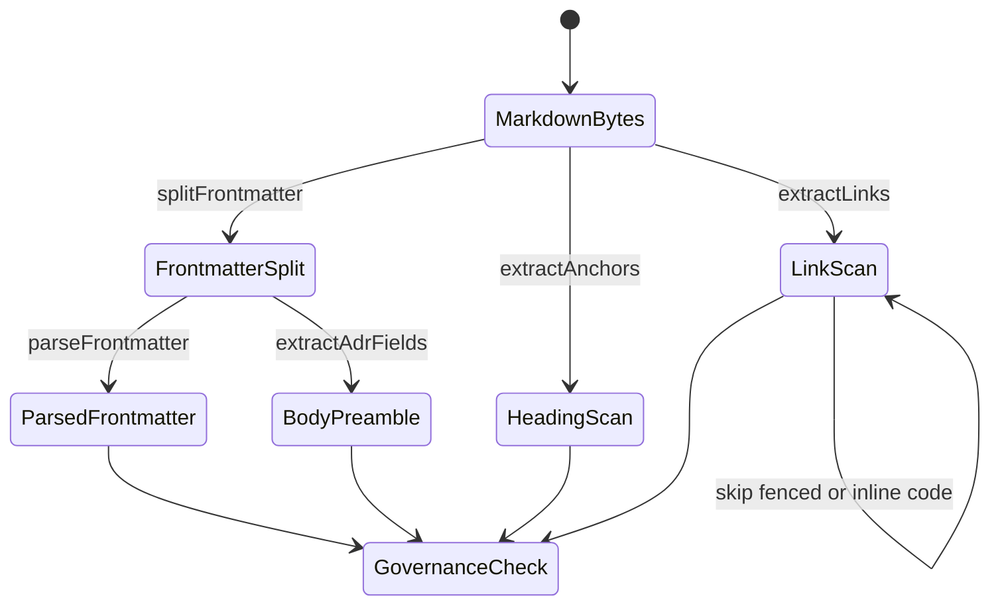
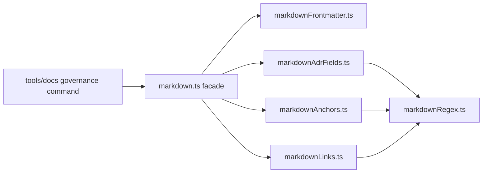
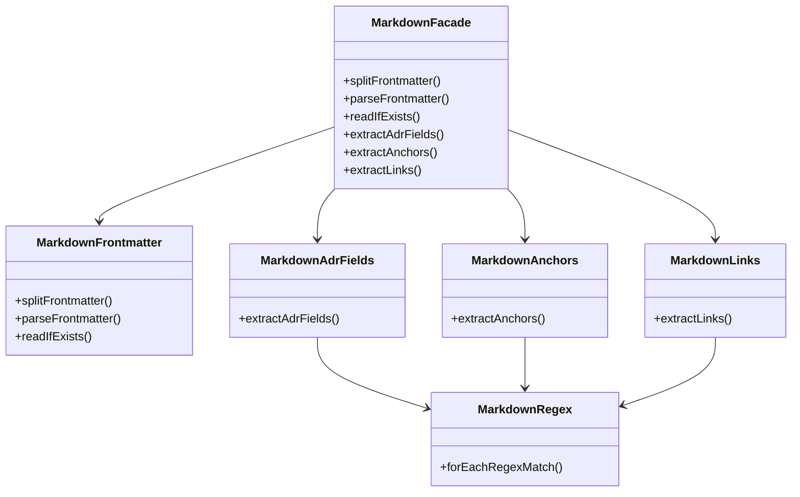

# Docs Markdown Governance Parser Component

This local component guide describes the small markdown parsing component used
by documentation governance checks.

The component lives under `tools/docs/lib/` and is consumed by docs governance
commands such as filename checks, frontmatter checks, link checks, ADR catalog
checks, and manifest generation.

## Owned Concern

The component owns local markdown extraction for repository governance tools:

- YAML frontmatter splitting and parsing
- ADR-style metadata field extraction
- GitHub-style heading and explicit-anchor extraction
- outbound markdown link extraction
- deterministic iteration over stateful regular expressions
- one public facade for docs governance consumers

It does not own full Markdown AST parsing, rendering, Zensical behavior,
markdownlint behavior, docs index generation, or canonical governance policy.

## Public API

docs governance tools must import the facade:

```ts
import {
  extractAdrFields,
  extractAnchors,
  extractLinks,
  parseFrontmatter,
  readIfExists,
  splitFrontmatter,
} from './lib/markdown.js';
```

The stable public module is:

- `tools/docs/lib/markdown.ts`

The facade exports:

- `splitFrontmatter(content)`
- `parseFrontmatter(frontmatter)`
- `readIfExists(filePath)`
- `extractAdrFields(content)`
- `extractAnchors(content)`
- `extractLinks(content)`
- `MarkdownLink`
- `FrontmatterResult`

Helper modules under `tools/docs/lib/markdown*.ts` are internal
subcomponents. Governance commands should not import them directly.

## Invariants

- Frontmatter parsing accepts a UTF-8 BOM before the opening `---`.
- Malformed YAML returns an empty frontmatter object instead of crashing a
  docs scan.
- ADR field extraction merges frontmatter and body preamble fields without
  making body sections parse YAML.
- Anchor extraction follows the repo's GitHub-style heading anchor behavior
  and preserves explicit `<a id>` / `<a name>` anchors.
- Link extraction ignores fenced code blocks and inline code examples.
- Stateful `RegExp` iteration resets `lastIndex` before scanning.
- Consumers import the facade, not helper internals.

## Transitions



## Component Flow



## Module Map



## Consumers

- `tools/docs/check-adr-catalog.ts`
- `tools/docs/check-frontmatter.ts`
- `tools/docs/check-links.ts`
- `tools/docs/generate-docs-manifest.ts`
- `tools/ci/docs-frontmatter-bom.test.mjs`
- `tools/ci/docs-markdown-component-architecture.test.mjs`

## Fowler Reading

This is a small Facade over specialized parser helpers. The mature-system
comparison is the same pattern used in CI documentation stacks that avoid
making every check own parsing details: a shared facade gives governance tools
a stable interface, while specialized helpers keep concerns narrow enough to
test and replace.

The rejected shape is a Transaction Script-style `markdown.ts` utility that
parses frontmatter, links, anchors, ADR metadata, and regex state in one module.
That shape is easy to extend locally but hard to reason about globally because
each new check can accidentally change another check's parsing semantics.

## Drift To Prevent

- Do not add a second markdown parsing facade beside `markdown.ts`.
- Do not import helper internals from docs governance commands.
- Do not move frontmatter parsing into ADR, anchor, or link helpers.
- Do not let link extraction treat examples inside code spans as governed
  links.
- Do not replace semantic helper names with anonymous regex chains when a named
  operation explains the rule.

## Validation

The component is guarded by:

```bash
node --test tools/ci/docs-markdown-component-architecture.test.mjs
pnpm test:ci-tools
```
