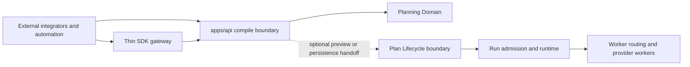
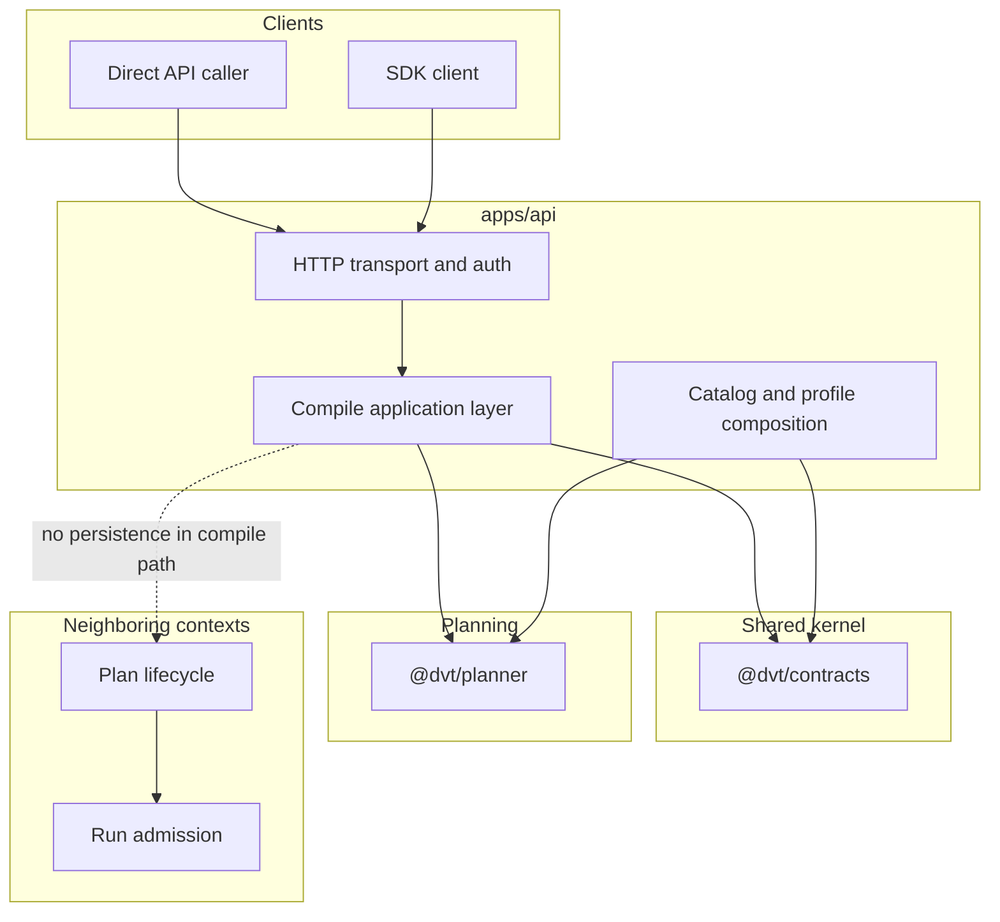
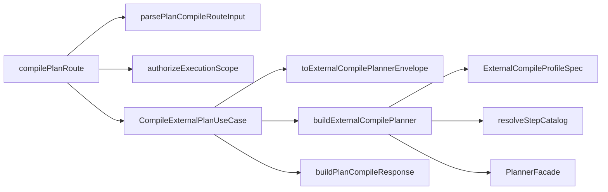
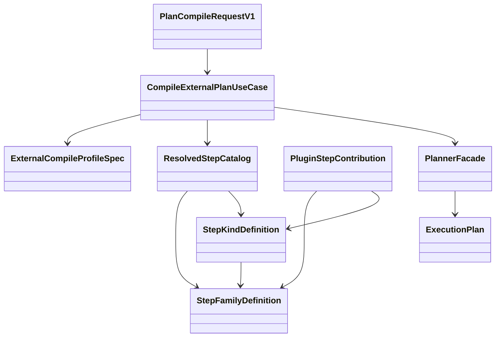
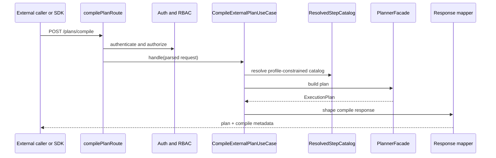
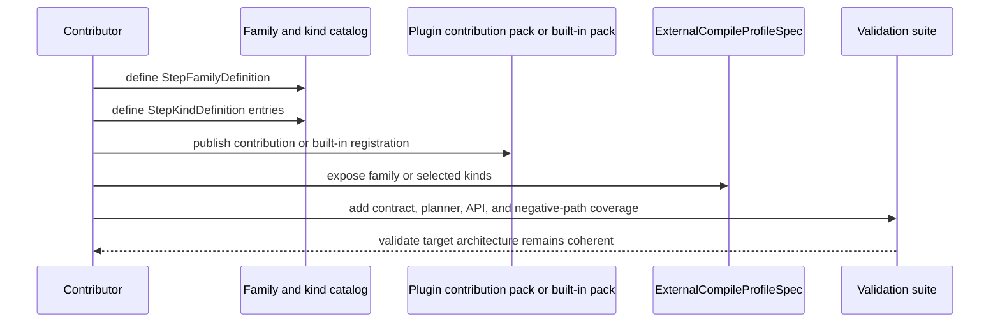
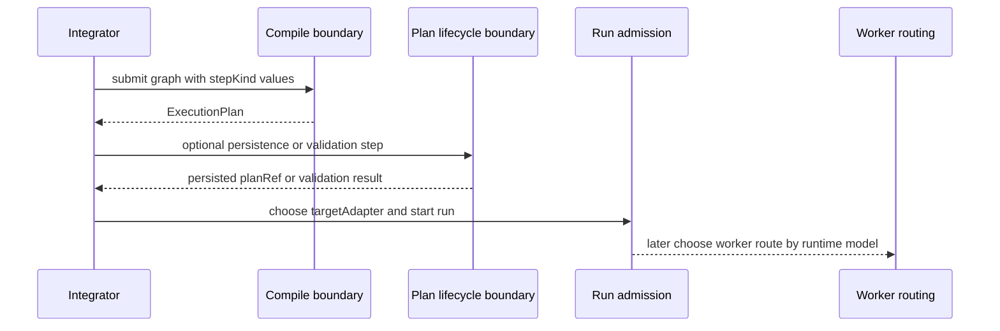

# External Compile Target Architecture Technical Manual

## Purpose

This manual is the target-state technical reference for `MW-D1`.

It defines the architecture that the implementation plan is trying to reach,
without claiming that the current worktree already matches that architecture.

Use this document when the question is architectural rather than tactical:

- what bounded contexts participate in external compile
- what the aggregate roots and service roots are
- which ports and adapters are required
- how compile fits into the broader system at C4 level
- how the target compile path should collaborate internally

For roadmap sequencing and backlog execution, use
[MW-D1 External Plan Definition SDK/API Plan 2026-04-17](../planning/proposals/mandatory/runtime-and-contracts/mw-d1-external-plan-definition-sdk-api-plan-20260417.md).

## Governing sources

- `AGENTS.md`
- `docs/guides/ai-work-protocol.md`
- `docs/adr/ADR-0003-execution-model.md`
- `docs/adr/ADR-0012-plan-integrity-ownership.md`
- `docs/adr/ADR-0034-bounded-context-boundaries-and-communication-rules.md`
- `docs/adr/ADR-0035-planner-public-contract-evolution-protocol.md`
- `docs/architecture/components/planner/planner-ddd.md`
- `docs/architecture/components/api/api-current-to-target-architecture.md`
- `docs/planning/proposals/mandatory/runtime-and-contracts/mw-d1-external-plan-definition-sdk-api-plan-20260417.md`
- `docs/guides/external-compile-catalog-extension-technical-manual-20260417.md`

## Scope and non-goals

This manual covers:

- external compile as a target authoring architecture
- the relationship between compile, preview, and run admission
- target ownership seams for contracts, services, catalogs, and composition
- target diagrams and definitions needed to implement the architecture cleanly

This manual does not claim to define:

- the worker-routing model by queue or image
- provider-specific execution internals
- a new planner contract authority outside `@dvt/contracts`
- a compatibility bridge for preview-era or manifest-era ingress

## Target-state summary

The target architecture is a compile-first external authoring boundary.

That means:

- callers submit canonical graph definitions through one compile contract
- compile derives `ExecutionPlan` without persistence side effects
- preview and run admission remain downstream concerns
- compile policy is selected from a canonical family and kind catalog
- plugin extensibility is typed and governed, not dynamic and free-form

## C4 Level 1: system context

Interpretation:

- external compile stops at plan derivation
- preview and persistence live in a neighboring lifecycle boundary
- runtime admission and worker routing are later boundaries

## C4 Level 2: container view

## C4 Level 3: component view for external compile

## DDD context map

| Context or governed surface | Kind                             | Responsibility                                                             | Must not own                                   |
| --------------------------- | -------------------------------- | -------------------------------------------------------------------------- | ---------------------------------------------- |
| External Authoring          | entry/application boundary       | caller-facing compile request and SDK gateway                              | planner internals, persistence, worker routing |
| API Admission               | entry/application boundary       | authn/authz, request parsing, response contract                            | planning semantics                             |
| Planning Domain             | core domain                      | deterministic graph validation and `ExecutionPlan` assembly                | HTTP, persistence, provider lifecycle          |
| Catalog Governance          | shared kernel governed surface   | family and kind definitions, profile-relevant metadata, contribution model | route-local allowlists                         |
| Plan Lifecycle              | neighboring supporting context   | preview persistence, executability validation, `planRef` import            | external compile authoring                     |
| Runtime Admission           | neighboring application boundary | `targetAdapter` choice, run preconditions, execution start                 | compile semantics                              |

## Aggregate roots, logical roots, and service roots

| Root kind                  | Name                                                               | Owner                               | Responsibility                                            | Notes                                                   |
| -------------------------- | ------------------------------------------------------------------ | ----------------------------------- | --------------------------------------------------------- | ------------------------------------------------------- |
| aggregate root             | `ExecutionPlan`                                                    | Planning Domain                     | immutable plan result of compile                          | canonical planning aggregate                            |
| logical catalog root       | `ResolvedStepCatalog`                                              | Catalog Governance plus composition | resolved family and kind inventory for one boundary       | immutable resolved view, not a mutable domain aggregate |
| application service root   | `CompileExternalPlanUseCase`                                       | API application layer               | compile-only orchestration                                | should accept and return plain data                     |
| composition root           | `buildProtectedRuntimeModule` and compile-specific planner builder | `apps/api`                          | bind ports, policies, planner configuration, and adapters | root of runtime composition                             |
| neighboring aggregate root | `Run`                                                              | Runtime domain                      | execution lifecycle after compile                         | outside `MW-D1`, included for boundary clarity          |

## Ports and adapters inventory

| Port or seam               | Direction                 | Owner                            | Status in target architecture   | Notes                                                    |
| -------------------------- | ------------------------- | -------------------------------- | ------------------------------- | -------------------------------------------------------- |
| compile transport boundary | inbound                   | `apps/api`                       | explicit route plus SDK gateway | HTTP and SDK are gateways over one contract              |
| authentication port        | inbound dependency        | API admission                    | existing seam                   | current code uses `IAuthenticator`                       |
| authorization service seam | inbound dependency        | API admission                    | existing seam                   | tenant and action scope enforcement                      |
| planner port               | outbound                  | Planning Domain contract surface | existing seam                   | current planner boundary is `PlannerFacade` / `IPlanner` |
| compile profile selector   | outbound composition seam | `apps/api`                       | target seam                     | chooses one `ExternalCompileProfileSpec`                 |
| step catalog resolver      | outbound composition seam | `apps/api`                       | target seam                     | resolves built-ins plus approved plugin contributions    |
| plugin contribution loader | outbound composition seam | `apps/api`                       | target seam                     | may load approved contribution packs, not arbitrary code |
| plan lifecycle boundary    | neighboring outbound seam | Plan Lifecycle                   | out of compile path             | preview/import use it, compile does not                  |
| run admission boundary     | neighboring outbound seam | Runtime Admission                | out of compile path             | start-run owns `targetAdapter`                           |

## Target module and package ownership map

| Target module or package seam                  | Proposed home                        | Responsibility                                             | Must not own                            |
| ---------------------------------------------- | ------------------------------------ | ---------------------------------------------------------- | --------------------------------------- |
| external compile request and response contract | `packages/@dvt/contracts`            | caller-visible DTOs and validation semantics               | route policy or runtime composition     |
| compile route and route contract parser        | `apps/api` HTTP entrypoint layer     | transport parsing, auth handoff, response status mapping   | planner orchestration or catalog policy |
| compile application service                    | `apps/api` application layer         | compile-only orchestration over plain data                 | HTTP concerns or persistence lifecycle  |
| compile envelope mapper                        | `apps/api` application support layer | canonical input assembly for planner                       | auth logic or route formatting          |
| compile profile selector                       | `apps/api` composition root          | choose one typed boundary policy                           | route-local literals                    |
| step catalog resolver                          | `apps/api` composition root          | merge built-ins plus approved plugin contributions         | mutable runtime registry semantics      |
| planner facade and deterministic plan assembly | `@dvt/planner`                       | graph validation and `ExecutionPlan` derivation            | HTTP or persistence concerns            |
| preview and persistence services               | Plan Lifecycle boundary              | persistence, executability validation, `planRef` lifecycle | compile-only authoring semantics        |
| run-admission services                         | Runtime Admission boundary           | `targetAdapter` choice and run-start preconditions         | compile boundary policy                 |

Interpretation:

- this map is the target code shape, not proof that every file already exists
- the route owns transport truth
- the use case owns compile orchestration truth
- the composition root owns catalog and profile truth
- the planner owns deterministic plan derivation truth

## Port contracts and primary interactions

| Port or contract                     | Primary caller                 | Primary callee                   | Data crossing the seam                            | Invariant                                                      |
| ------------------------------------ | ------------------------------ | -------------------------------- | ------------------------------------------------- | -------------------------------------------------------------- |
| `PlanCompileRequestV1`               | external caller or SDK         | compile route                    | graph source, selection, execution scope context  | compile request stays generic and non-dbt-first                |
| auth and authorization seam          | compile route                  | authentication and RBAC services | principal plus tenant or project scope            | compile never bypasses protected runtime scope                 |
| compile application service boundary | compile route                  | `CompileExternalPlanUseCase`     | parsed request plus authorized scope              | orchestration remains transport-agnostic                       |
| planner ingress envelope seam        | compile application service    | planner facade                   | canonical planner envelope plus resolved catalog  | compile uses one planner model only                            |
| catalog resolution seam              | compile composition root       | catalog resolver                 | built-ins, approved plugin packs, compile profile | unknown families and kinds fail closed                         |
| compile response contract            | compile presenter              | external caller or SDK           | `ExecutionPlan` plus compile metadata             | response never implies persistence or executability validation |
| preview lifecycle seam               | client or neighboring boundary | plan lifecycle services          | optional persisted plan request                   | compile does not cross this seam implicitly                    |
| start-run seam                       | client or neighboring boundary | runtime admission                | `planRef`, `targetAdapter`, run intent            | provider selection stays outside compile                       |

Observability note:

- compile request observability supports extension keys
- compile envelope mapping must preserve extension keys instead of narrowing to
  a fixed field subset

## Domain and class relationship view

## Sequence: external compile happy path

## Sequence: add a new family and expose it

## Sequence: compile-to-run handoff

Interpretation:

- compile owns authoring and derivation
- preview owns lifecycle and persistence
- run admission owns provider selection
- worker routing is a later concern owned by `MW-D2`

## Domain glossary

| Term                         | Meaning in `MW-D1`                                                    | Notes                                                                      |
| ---------------------------- | --------------------------------------------------------------------- | -------------------------------------------------------------------------- |
| external compile boundary    | the caller-facing compile-only API or SDK gateway                     | the first product-facing authoring seam                                    |
| `ExecutionPlan`              | immutable compile result                                              | canonical planning aggregate                                               |
| `ResolvedStepCatalog`        | immutable resolved family and kind inventory for one boundary         | composition-owned view, not a mutable route registry                       |
| `ExternalCompileProfileSpec` | typed policy selection for one compile boundary                       | selects from the resolved catalog only                                     |
| `PluginStepContribution`     | typed plugin-owned contribution pack                                  | contributes families or kinds without becoming a second contract authority |
| Plan Lifecycle boundary      | neighboring context for preview, persistence, and `planRef` lifecycle | outside compile-only flow                                                  |
| Runtime Admission boundary   | neighboring context for start-run and provider choice                 | owns `targetAdapter`                                                       |
| worker routing               | later execution-routing concern by queue, image, or worker role       | explicitly deferred to `MW-D2`                                             |

## Architecture invariants

- external compile must remain compile-only
- compile policy must come from a canonical catalog or approved contribution
  pack
- compile planner registry must be fail-closed to profile-selected
  `allowedStepKinds`
- step-family semantics must not be inferred from naming conventions
- route modules must not become the home of planner policy
- free-form JSON must not become the authority for schemas or handlers
- worker routing must remain outside `MW-D1`

## Relationship to the extension guide

Use this manual for:

- target architecture reading
- ports, roots, aggregates, and C4 views
- compile-to-runtime boundary clarity

Use
[External compile catalog extension technical manual](external-compile-catalog-extension-technical-manual-20260417.md)
for:

- how to add a new family or kind
- how to package plugin contributions
- how to update compile profiles safely
