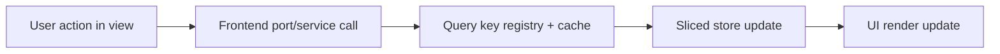

# F-04 Frontend Data Boundary User Manual

## Who This Is For

- Product and QA teams validating frontend behavior.
- Integrators wiring API-backed frontend ports.
- Operators triaging frontend/backend data mismatches.

## What Changed

- Product runtime uses the API as its single data authority.
- Views read data through stable frontend ports and service context.
- Tests inject explicit port doubles without enabling a product runtime mode.
- Query cache keys are standardized to avoid stale data behavior drift.

## Expected Behavior

1. App startup creates one API-backed service graph for the session.
2. Views load data from shared service context.
3. Platform health and capabilities report backend-owned runtime truth.
4. Canvas/runs/cost/lineage stay aligned with centralized query key policy.
5. Starting a run requires a valid `planRef` on the current execution plan.

## Troubleshooting

### Symptom: stale data after navigation

- check if the route uses registered query keys.
- verify no ad-hoc inline cache key was introduced.

### Symptom: fixture behavior appears in product runtime

- confirm product composition imports only API adapters.
- confirm test doubles enter through explicit test overrides only.

### Symptom: inconsistent UI state across panels

- verify features use sliced stores by concern.
- avoid re-introducing retired monolithic store selectors.

### Symptom: "Plan reference is unavailable"

- this is a boundary guard, not a transport error.
- expected behavior: run start is blocked and plan modal is reopened.
- resolution path:
  - backend plan preview/import payload must include canonical `planRef`;
  - tests that exercise run start must inject a plan fixture with `planRef`.

## Validation Checklist (User-Facing Confidence)

- `RunsView` opens run workspace with consistent state.
- `LineageView` and `CostView` data refresh behavior is consistent.
- Top app bar environment selectors and shell controls remain functional.
- Platform status banner matches backend health state.

## Operational Map

## Non-Goals

- This guide does not define backend contracts.
- This guide does not replace technical architecture docs.
- This guide does not include plugin authoring details.
