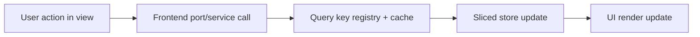

# F-04 Frontend Data Boundary User Manual

## Who This Is For

- Product and QA teams validating frontend behavior.
- Integrators using API mode vs mock mode.
- Operators triaging frontend/backend data mismatches.

## What Changed

- Frontend data mode is selected centrally at startup.
- Views read data through stable frontend ports and service context.
- Query cache keys are standardized to avoid stale data behavior drift.

## Expected Behavior

1. App startup resolves one data mode (`mock` or `api`) for the session.
2. Views load data from shared service context.
3. Platform health and capabilities reflect the same mode context.
4. Canvas/runs/cost/lineage stay aligned with centralized query key policy.

## Troubleshooting

### Symptom: stale data after navigation

- check if the route uses registered query keys.
- verify no ad-hoc inline cache key was introduced.

### Symptom: mixed mock/api behavior

- confirm mode is resolved by composition root only.
- confirm no runtime module is calling direct mode resolution.

### Symptom: inconsistent UI state across panels

- verify features use sliced stores by concern.
- avoid re-introducing legacy monolithic store selectors.

## Validation Checklist (User-Facing Confidence)

- `RunsView` opens run workspace with consistent state.
- `LineageView` and `CostView` data refresh behavior is consistent.
- Top app bar environment selectors and shell controls remain functional.
- Platform status banner matches backend health state.

## Operational Map

## Non-Goals

- This guide does not define backend contracts.
- This guide does not replace technical architecture docs.
- This guide does not include plugin authoring details.
