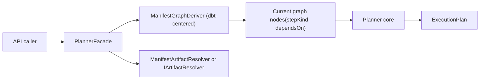
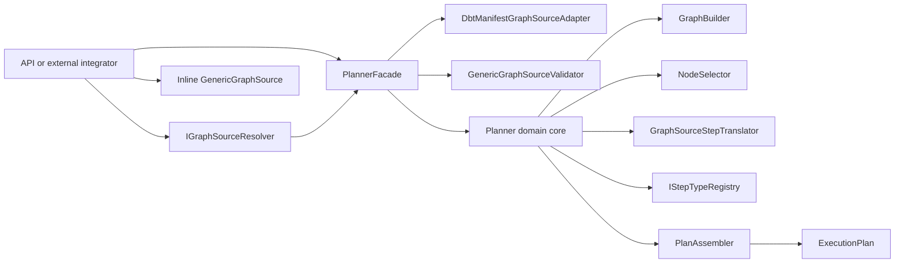
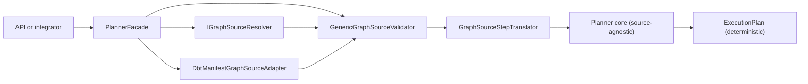
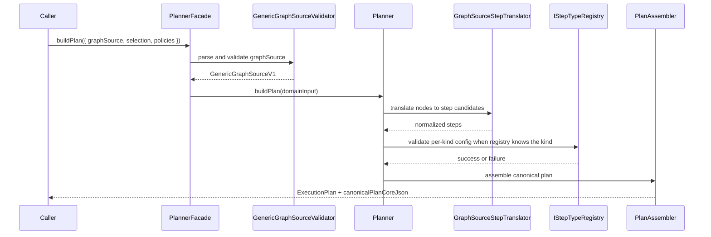
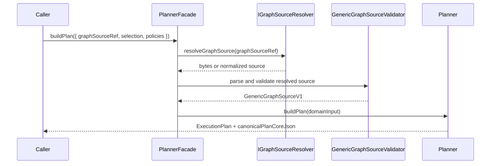

---
title: GenericGraphSource Technical Manual
status: Draft
owner: Planning Domain / Architecture / API
last_reviewed: 2026-04-04
---

# GenericGraphSource Technical Manual

## Purpose

This manual defines the target technical model for `MW-A2`: making
`GenericGraphSource` the canonical planner input instead of treating dbt
manifest ingestion as the planner's semantic center.

It describes the target boundary, the intended collaborator split, the
governing invariants, and the negative-path test plan needed before the slice
can be considered closed.

This manual also enforces the execution rule for this arc: documentation is a
hard gate before TDD-based implementation waves.

## Governing sources

- `AGENTS.md`
- `docs/adr/ADR-0003-execution-model.md`
- `docs/adr/ADR-0012-plan-integrity-ownership.md`
- `docs/adr/ADR-0017_ExecutionPlan_Schema_Versioning.md`
- `docs/adr/ADR-0034-bounded-context-boundaries-and-communication-rules.md`
- `docs/adr/ADR-0035-planner-public-contract-evolution-protocol.md`
- `docs/planning/proposals/mandatory/runtime-and-contracts/dvt-dbt-agnostic-generalization-plan-20260403.md`
- `docs/planning/status/planner-current-state-assessment.md`

## Current baseline

The repository already has a typed planner boundary, but it is still too thin
to be the long-term generic source model:

- `PlannerGraphSourceV1` exists in
  `packages/@dvt/contracts/src/contracts/planner/ExecutionPlan.v1.ts`
- the current normalized shape is only:
  - `kind`
  - `nodes[{ nodeId, stepKind, dependsOn, stepTypeConfig? }]`
- `PlannerFacade` currently accepts dbt and graph-source paths that must be
  converged into a single canonical graph-source contract
- `ManifestGraphDeriver` and `ManifestArtifactResolver` are the active dbt
  source seams

That is enough for normalized dbt topology, but it is not enough to describe a
general workflow source with explicit step semantics, stable provenance, and a
clear source-family adaptation model.

## Current architecture (as-is)



## Target outcome

`GenericGraphSource` becomes the canonical planner input contract.

This means:

- the planner core accepts a generic normalized graph, not a dbt-shaped payload
- dbt manifest parsing becomes one source adapter into that contract
- non-dbt systems can describe a DAG without pretending to be dbt
- `PlannerFacade` remains the application boundary and the domain planner
  remains pure

This slice does **not** claim that every documented step kind is executable
today. Runtime dispatch still depends on `MW-A1`, `MW-A3`, and `MW-C1`.

## In-system context



## Target architecture (to-be)



## Target contract model

`GenericGraphSourceV1` is the canonical target contract for `MW-A2`.

```ts
export interface GenericGraphSourceV1 {
  kind: 'generic-graph-v1';
  sourceFamily: string;
  sourceVersion: string;
  nodes: readonly GenericGraphNodeV1[];
}

export interface GenericGraphNodeV1 {
  nodeId: string;
  stepKind: string;
  dependsOn: readonly string[];
  stepTypeConfig?: Record<string, unknown>;
  metadata?: {
    displayName?: string;
    sourceRef?: string;
    tags?: Record<string, string>;
  };
}
```

### Boundary notes

- `sourceFamily` identifies the producer family, not the execution runtime.
- `stepKind` is explicit in the target node shape even if per-kind schema
  enforcement lands in `MW-A1`.
- authoring adapters must derive `stepKind` from an explicit source-owned
  mapping seam such as a typed node-kind registry. Free-form metadata is not a
  governed `stepKind` authority.
- `stepTypeConfig` stays open at the shared-kernel contract level. Per-kind
  semantic validation remains registry-owned.
- `dependsOn` is the only dependency authority. No implicit ordering is
  accepted.
- identity rule (must remain deterministic): in `MW-A2`, plan identity keeps
  following current planner semantics where `inputHashSha256` is computed from
  normalized `nodes`, `selection`, and `policies` only. `sourceFamily`,
  `sourceVersion`, and node `metadata` are provenance fields and do not
  participate in `planId` unless a later ADR changes the hash contract.

## Target collaborator map

| Collaborator                    | Owner                                                   | Role                                                                                                        | Current mapping                                                            |
| ------------------------------- | ------------------------------------------------------- | ----------------------------------------------------------------------------------------------------------- | -------------------------------------------------------------------------- |
| `PlannerFacade`                 | `@dvt/planner`                                          | application boundary, one-active-source rule, orchestration                                                 | existing class remains                                                     |
| `IGraphSourceResolver`          | `@dvt/planner` port                                     | resolve immutable graph-source refs into canonical graph sources                                            | evolves current `IArtifactResolver`                                        |
| `GenericGraphSourceValidator`   | `@dvt/contracts` + `@dvt/planner`                       | contract parsing plus semantic graph-source checks                                                          | today split across parser + planner                                        |
| `DbtManifestGraphSourceAdapter` | `apps/api` composition root and infrastructure boundary | normalize dbt manifest payloads into `GenericGraphSourceV1` and adapt external artifact IO to planner ports | evolves current `ManifestGraphDeriver` and `ManifestArtifactResolver` path |
| `GraphSourceStepTranslator`     | `@dvt/planner`                                          | map normalized graph nodes to planner steps without hard-coding dbt as the universal source                 | new collaborator                                                           |
| `GraphBuilder`                  | `@dvt/planner`                                          | DAG validation and adjacency build                                                                          | existing class remains                                                     |
| `NodeSelector`                  | `@dvt/planner`                                          | subgraph selection                                                                                          | existing class remains                                                     |
| `PlanAssembler`                 | `@dvt/planner`                                          | canonical plan assembly and hashing                                                                         | existing class remains                                                     |

## Main procedures

### Procedure 1: Direct inline generic graph source



### Procedure 2: Ref-based generic graph source



Status: planned target path. The current implementation still resolves
`manifestRef` via `IArtifactResolver` in API/planner wiring.

### Procedure 3: dbt manifest source-adapter path

1. Caller provides dbt manifest input through the dbt adapter boundary.
2. The dbt-specific adapter reads and validates the raw manifest artifact.
3. The adapter converts that payload into `GenericGraphSourceV1`.
4. `PlannerFacade` forwards only the normalized graph source into the planner
   core.
5. The planner does not branch on dbt semantics after that boundary.

## Invariants

- `INV-GGS-001`: exactly one active source is allowed at the planner boundary.
- `INV-GGS-002`: the canonical planner input is a normalized graph source, not
  a raw dbt manifest.
- `INV-GGS-003`: every `nodeId` is unique inside one graph source.
- `INV-GGS-004`: every dependency target named in `dependsOn` must exist in the
  same graph source.
- `INV-GGS-005`: the normalized graph must be acyclic before plan assembly.
- `INV-GGS-006`: step ordering is determined by the planner's deterministic
  graph algorithm, never by caller-provided array order.
- `INV-GGS-007`: dbt manifest ingestion is an adapter path, not a core planner
  semantic contract.
- `INV-GGS-008`: source-family metadata may explain provenance but must not
  change the DAG semantics of the normalized graph.
- `INV-GGS-009`: ref-based graph sources must resolve through immutable,
  integrity-verifiable references.
- `INV-GGS-010`: runtime-only adapter data must not be embedded in the graph
  source contract.
- `INV-GGS-011`: `stepTypeConfig` remains open in the shared contract but must
  not bypass registry validation for known step kinds.
- `INV-GGS-012`: mixed plans are valid at the model layer if all dependencies
  are explicit and every node can be translated into a planner step.
- `INV-GGS-013`: `sourceFamily`, `sourceVersion`, and node `metadata` are
  non-identity provenance fields in `MW-A2`; changing those fields alone must
  not change `inputHashSha256` or `planId`.

## Negative-path test plan

### Contract tests

- reject graph sources with duplicate `nodeId` values
- reject graph sources with missing dependency targets
- reject graph sources with empty `nodes`
- reject graph sources where `stepKind` is missing on a generic node
- reject malformed `graphSourceRef`
- reject planner envelopes with more than one active source

### Planner application tests

- reject malformed graph sources returned by the resolver
- reject inline graph sources whose nodes cannot be translated into planner
  steps
- reject selections that name unknown node ids
- reject cycles in generic graph sources before plan assembly
- reject graph sources that differ only by source-order noise if canonical
  sorting is missing

### Compatibility adapter tests

- reject dbt manifests that cannot be normalized into a valid generic graph
- reject ref payloads whose integrity metadata does not match
- reject unsupported resolver schemes on the graph-source ref path
- prove that dbt manifest key ordering does not change the normalized graph

### Determinism tests

- same generic graph with different node array order yields the same
  `canonicalPlanCoreJson`
- same dbt manifest content with different raw key ordering yields the same
  normalized graph source
- graph-source provenance-only differences (`sourceFamily`, `sourceVersion`,
  node `metadata`) do not affect `inputHashSha256` or `planId`

## Validation baseline

The implementation slice for `MW-A2` should not be considered complete without
at least:

```bash
pnpm --filter @dvt/contracts build
pnpm --filter @dvt/contracts test
pnpm --filter @dvt/planner build
pnpm --filter @dvt/planner test
pnpm --filter dvt-api test
pnpm verify:prepush
```

## Documentation gate before TDD

### Gate rule

No implementation PR for `MW-A2-B/C/D/E` is valid until these are aligned and
accepted as the canonical source:

- this technical manual
- `docs/guides/generic-graph-source-user-manual-20260404.md`
- `docs/planning/proposals/mandatory/runtime-and-contracts/mw-a2-generic-graph-source-plan-20260404.md`

### Documentation DoD

- as-is and to-be diagrams are explicit and consistent
- invariants are fully enumerated and testable
- negative paths are mapped to test ownership
- current-vs-target gaps are explicit and sequenced
- `MW-A2-A..E` wave ordering is documented with no hidden scope

### TDD sequence after gate

1. `MW-A2-B`: write failing contract tests, then evolve parser/schema/contracts.
2. `MW-A2-C`: write failing planner-boundary tests, then refactor facade and translator seams.
3. `MW-A2-D`: write failing API/ref-resolution tests, then update composition-root wiring.
4. `MW-A2-E`: write failing determinism and negative integration tests, then harden behavior.

## Current-to-target gap summary

1. The planner input contract is not yet cleanly swapped to
   `GenericGraphSourceV1` across all entry points.
2. Step translation in planner core is still dbt-centered (`stepKind` is mapped
   through DBT-only resource types in this wave).
3. The resolver port is still manifest-specific.
4. The active dbt normalization path is still the semantic center for graph
   derivation.
5. Determinism coverage for dbt key ordering is still an explicit queued item.
6. Runtime execution for non-dbt kinds remains outside `MW-A2`.

## Non-goals

- implementing worker dispatch for new step kinds
- replacing `IStepTypeRegistry`
- defining the full step artifact model
- introducing provider runtime behavior into planner contracts
