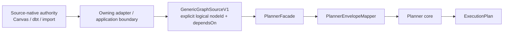

---
title: GenericGraphSource Technical Manual
status: Active
owner: Planning Domain / Architecture / API
last_reviewed: 2026-09-05
---

# GenericGraphSource Technical Manual

## Purpose

`GenericGraphSourceV1` is the canonical typed graph ingress for Planner.
Source-native syntax and artifacts are translated before this boundary. Planner
owns deterministic graph validation, selection and execution-plan materialization;
it does not own source parsing or logical-identity allocation.

This page supersedes the old MW-A2 target wording that described a retained
manifest-normalization utility inside `@dvt/planner`.

## Governing sources

- `AGENTS.md`
- `docs/adr/ADR-0034-bounded-context-boundaries-and-communication-rules.md`
- `docs/adr/ADR-0035-planner-public-contract-evolution-protocol.md`
- `docs/adr/ADR-0064-substrait-semantic-reference-and-bounded-logical-profile.md`
- `docs/architecture/domain-planning.md`
- `docs/planning/proposals/mandatory/runtime-and-contracts/gh-2904-stable-logical-physical-binding-hardcut-20260905.md`

## Current architecture



The adapter boundary may consume external dbt artifacts, provider catalogs or
Canvas state. It must emit an already-governed graph. Planner never falls back
to dbt manifest keys, names, paths, provider coordinates, ordinals or aliases to
manufacture missing logical identity.

## Canonical contract model

The planner contract remains:

```ts
export interface GenericGraphSourceV1 {
  kind: 'generic-graph-v1';
  sourceFamily?: string;
  sourceVersion?: string;
  nodes: readonly GenericGraphNodeV1[];
}

export interface GenericGraphNodeV1 {
  nodeId: string;
  stepKind: string;
  dependsOn: readonly string[];
  stepTypeConfig?: Record<string, unknown>;
  metadata?: {
    displayName?: string;
    sourceRef?: string;
    tags?: Record<string, string>;
  };
}
```

The executable schema in `@dvt/contracts` is authoritative if this explanatory
snippet ever drifts.

## Identity versus provenance

| Field                  | Owner                              | Semantics                                               |
| ---------------------- | ---------------------------------- | ------------------------------------------------------- |
| `nodeId`               | authoring/source owner             | logical identity used by dependencies and Planner steps |
| `dependsOn[]`          | authoring/source owner             | references logical `nodeId` values only                 |
| `stepKind`             | source mapping / governed registry | explicit execution responsibility                       |
| `stepTypeConfig`       | step-kind contract                 | typed/configured execution semantics                    |
| `sourceFamily`         | source adapter                     | provenance only                                         |
| `sourceVersion`        | source adapter                     | provenance only                                         |
| `metadata.displayName` | presentation/source adapter        | mutable metadata                                        |
| `metadata.sourceRef`   | source adapter                     | provenance/binding metadata, not logical identity       |
| `metadata.tags`        | source adapter                     | provenance/observability metadata                       |

For DVT-native semantic authoring, ADR-0064 remains stronger and more specific:
Substrait owns relational semantics while the DVT sidecar owns stable
`RelationId` / `FieldId` and provenance bindings. `GenericGraphSource` does not
replace that semantic authority; it is the Planner-facing graph boundary.

## Planner responsibilities

`PlannerFacade` and Planner collaborators:

1. parse/validate the canonical planner envelope;
2. pass `graphSource.nodeId` and `dependsOn` through without reminting identity;
3. reject duplicate nodes, missing dependency targets and cycles;
4. resolve selection and policies deterministically;
5. validate step-kind configuration through the registry;
6. assemble/hash the immutable `ExecutionPlan`.

Planner does **not**:

- parse raw dbt manifests;
- derive DVT node IDs from dbt `unique_id`;
- repair a missing ID from a display name, path or ordinal;
- query provider catalogs to recover identity;
- persist authoring identity;
- create a second relational IR.

## Source-adapter responsibilities

An owning source adapter/application boundary must:

1. validate the source-native representation;
2. resolve/preserve the source's governed logical identity according to that
   source's authority contract;
3. map dependencies to explicit logical IDs;
4. map source-native node kinds to governed `stepKind` values;
5. retain external/source-native identifiers as provenance when required for
   round-trip or binding, not as an implicit DVT identity fallback;
6. emit `GenericGraphSourceV1` before calling Planner.

A dbt source adapter may therefore retain dbt `unique_id` for dbt authority and
round-trip, while DVT-native logical identity remains independently governed.
The removed `derivePlannerGraphSourceFromManifest()` bridge is not a supported
compatibility path.

## Determinism

Plan identity follows the existing Planner hash contract. `sourceFamily`,
`sourceVersion` and node metadata are provenance-only and do not affect
`inputHashSha256` / `planId`; logical `nodeId`, dependency topology, step
semantics, selection and policies do.

Consequences:

- renaming display metadata does not change plan identity when logical IDs and
  semantics are unchanged;
- moving a physical binding/path does not change dependency identity;
- changing a logical `nodeId` is a semantic graph change;
- node/dependency array ordering is normalized deterministically.

## Fail-closed invariants

- `INV-GGS-001`: `GenericGraphSource` is the only Planner graph ingress.
- `INV-GGS-002`: every `nodeId` is explicit and unique.
- `INV-GGS-003`: every `dependsOn` target resolves to an explicit node in the
  admitted graph.
- `INV-GGS-004`: dependency cycles reject before plan assembly.
- `INV-GGS-005`: Planner never derives or repairs identity from metadata,
  manifest keys, names, paths, providers or ordinals.
- `INV-GGS-006`: provenance-only changes do not mutate plan identity.
- `INV-GGS-007`: source-native adapters remain outside `@dvt/planner`.
- `INV-GGS-008`: no compatibility alias or second graph ingress is retained for
  the removed dbt-manifest bridge.

## Verification

Focused gates for this boundary:

```bash
pnpm --filter @dvt/contracts test
pnpm --filter @dvt/contracts typecheck
pnpm --filter @dvt/planner test
pnpm --filter @dvt/planner typecheck
pnpm --filter dvt-api test
pnpm --filter dvt-api typecheck
GIT_BASE=origin/main GIT_HEAD=HEAD node tools/ci/arc-check.mjs
pnpm verify:prepush
```

Required negative proofs include duplicate logical IDs, unknown dependency
references, cycles, invalid step kinds/config, unresolved execution bindings and
absence of the retired manifest identity bridge from current source/public
exports.

## Historical note

The 2026-04 MW-A2 plans and closeouts are historical evidence for the migration
toward a generic planner source. They must not be read as permission to restore
the temporary `ManifestGraphDeriver` compatibility path after GH-2904.
