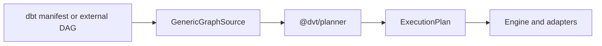
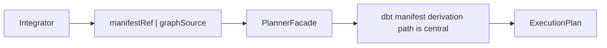
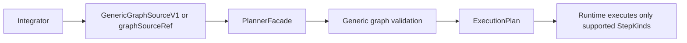

# GenericGraphSource User Manual

## Audience

This guide is for integrators, platform engineers, and API callers who need to
prepare planning inputs without treating dbt manifest format as the only way to
describe a workflow DAG.

## What GenericGraphSource is

`GenericGraphSource` is the target planner-facing model for a normalized
workflow graph.

It answers one question only:

> What nodes exist, what depends on what, and what step kind does each node
> represent?

It is not a runtime worker contract, not a provider adapter contract, and not a
secret payload container.

## Delivery policy for this arc

This arc is delivered in two explicit stages:

1. documentation gate (manuals + target model + invariants)
2. TDD implementation waves (`MW-A2-B` to `MW-A2-E`)

No implementation wave is considered valid if it is not traceable to the
accepted documentation gate.

## What path to use

### Current supported input policy (implemented)

The currently implemented public planner-source paths are:

| Path                                                   | Use when                             | Notes                               |
| ------------------------------------------------------ | ------------------------------------ | ----------------------------------- |
| inline `graphSource` with `GenericGraphSourceV1` shape | caller has a non-dbt normalized DAG  | canonical typed inline source       |
| `manifestRef`                                          | source graph comes from dbt artifact | adapter-backed source normalization |

Planned but not yet implemented in this arc:

- `graphSourceRef` (immutable generic graph ref path)

## Mental model



## As-is vs to-be flow

### As-is (current usage)



### To-be (target usage, planned)



The graph source describes planning intent. Execution still depends on runtime
support for the step kinds used by that graph.

## Authoring checklist

1. Give every node a stable `nodeId`.
2. Declare every dependency explicitly in `dependsOn`.
3. Use a real `stepKind` for each node.
4. Keep `stepTypeConfig` focused on step configuration, not secrets.
5. Keep runtime-only worker details out of the graph source.
6. Treat array order as cosmetic. The planner decides deterministic order.

If your source of truth starts from richer domain nodes, normalize those nodes
into explicit `stepKind` values before calling the planner. Do not make
planner-facing `stepKind` depend on ad hoc metadata keys.

## Target shape

The target authoring model is:

```json
{
  "kind": "generic-graph-v1",
  "sourceFamily": "custom-api",
  "sourceVersion": "1.0",
  "nodes": [
    {
      "nodeId": "extract.iot-readings",
      "stepKind": "API_CALL",
      "dependsOn": [],
      "stepTypeConfig": {
        "operationRef": "artifacts://operations/iot-readings.json"
      }
    },
    {
      "nodeId": "warehouse.refresh-proc",
      "stepKind": "DB_PROC_EXEC",
      "dependsOn": ["extract.iot-readings"],
      "stepTypeConfig": {
        "procedureRef": "artifacts://sql/refresh_proc.sql"
      }
    }
  ]
}
```

## Example 1: dbt source through graph-source adapter

If your source of truth is dbt, convert it through the dbt source adapter and
submit the resulting generic graph source.

## Example 2: mixed plan target

Mixed plans are valid at the model layer.

```json
{
  "graphSource": {
    "kind": "generic-graph-v1",
    "sourceFamily": "integration-suite",
    "sourceVersion": "1.0",
    "nodes": [
      {
        "nodeId": "dbt.model.orders",
        "stepKind": "DBT_MODEL",
        "dependsOn": [],
        "stepTypeConfig": {
          "uniqueId": "model.analytics.orders"
        }
      },
      {
        "nodeId": "notify.billing",
        "stepKind": "EMAIL_SEND",
        "dependsOn": ["dbt.model.orders"],
        "stepTypeConfig": {
          "templateRef": "artifacts://mail/orders-ready.json"
        }
      }
    ]
  },
  "selection": {
    "selectedNodeIds": ["notify.billing"],
    "includeUpstream": true
  }
}
```

Important: this example describes the target planner contract. Runtime
execution for non-dbt kinds still depends on later registry and dispatcher
work.

## What the planner validates

### Current boundary behavior

The planner boundary currently rejects:

- requests with no active source
- requests with more than one active source
- malformed `graphSource` payloads

Graph-level checks such as duplicate ids, missing dependencies, and cycle
validation happen after source normalization in the planner pipeline.

### Target boundary behavior (MW-A2)

After `MW-A2-B/C/D`, the boundary should also reject:

- malformed `graphSourceRef`
- generic graph sources with duplicate node ids
- generic graph sources with missing dependency targets
- generic graph sources with cycles
- generic nodes that cannot be translated into planner steps

## What the planner does not promise

The planner does not promise:

- runtime executability for every documented step kind
- provider-specific retry or timeout behavior
- secret distribution through `stepTypeConfig`
- worker routing decisions

Those concerns belong to later slices and other bounded contexts.

## Common failures

### `more than one active source`

You sent more than one active planner source (for example inline
`graphSource` and `manifestRef` together).

### `missing dependency target`

A node depends on another node id that is not present in the same graph.

### `unsupported step kind`

The graph describes a step kind that the planner or runtime has not registered
yet.

### `invalid step config`

The graph uses a known `stepKind`, but `stepTypeConfig` does not match that
kind's schema.

### `manifest integrity mismatch`

Current-state (`manifestRef`) error.

The bytes resolved from the manifest ref do not match the declared hash.

## Determinism rules for authors

To keep plan identity stable:

1. keep `nodeId` stable across equivalent graphs
2. declare the same dependencies for the same logical workflow
3. do not rely on node array order
4. keep provenance metadata outside the canonical plan core unless the contract
   explicitly says otherwise

## Contributor validation

If you are changing this boundary, use at least:

```bash
pnpm --filter @dvt/contracts test
pnpm --filter @dvt/planner test
pnpm --filter dvt-api test
pnpm verify:prepush
```

## Documentation traceability checklist

Before requesting implementation or review, ensure:

- this user manual and the technical manual are aligned
- as-is/to-be diagrams match the current lane plan
- invariants and common failures are not contradictory
- every intended behavior change has a corresponding test expectation in the
  technical manual
- wave references (`MW-A2-B`..`MW-A2-E`) stay consistent with the proposal

## Related documents

- `docs/guides/generic-graph-source-technical-manual-20260404.md`
- `docs/planning/proposals/mandatory/runtime-and-contracts/mw-a2-generic-graph-source-plan-20260404.md`
- `docs/planning/proposals/mandatory/runtime-and-contracts/dvt-dbt-agnostic-generalization-plan-20260403.md`
