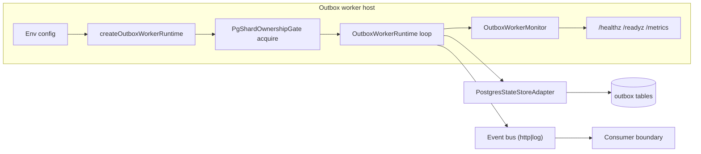

# Outbox worker technical manual

This manual defines the technical runtime model, invariants, and validation posture for `apps/outbox-worker`.

## Scope

- standalone worker host lifecycle
- ownership and shard fencing model
- startup and shutdown interruption semantics
- readiness and health semantics
- delivery boundary and dedupe contract expectations

## Runtime model

## Ownership and fencing

- Active mode requires shard-scoped ownership before draining starts.
- Ownership fencing is enforced by PostgreSQL advisory locks (`ADR-0033`).
- Loss of ownership after startup forces host stop and readiness withdrawal.
- Passive mode is healthy but non-owning (`ready=false`, `owner=false`).

## Startup/shutdown invariants

| Invariant ID | Rule                                                                                       |
| ------------ | ------------------------------------------------------------------------------------------ |
| `OW-INV-1`   | Abort before startup completion must interrupt pending adapter/bus operations.             |
| `OW-INV-2`   | Abort after startup completion must not poison runtime by late `abortPendingOperations()`. |
| `OW-INV-3`   | `stop()` is idempotent at handle boundary and always releases pooled resources.            |
| `OW-INV-4`   | Runtime boot is blocked when required ownership is unavailable in active mode.             |

## Readiness contract

- `ready=true` only when state is `idle` or `draining` and last tick is fresh.
- `ready=false` in `starting`, `passive`, `stopping`, `failing`, and `stopped`.
- Freshness window is governed by `readyStaleAfterMs` in monitor state.

## Delivery boundary and dedupe expectations

- Worker guarantees ordered at-least-once delivery at the outbox boundary.
- Downstream consumers MUST absorb duplicates using envelope keys (`eventId`, `idempotencyKey`).
- Dedupe policy is consumer-side contract, not worker-side exactly-once guarantee.

## Validation baseline

- Runtime/unit lane:
  - `pnpm --filter dvt-outbox-worker test -- createOutboxWorkerRuntime.test.ts`
  - `pnpm --filter dvt-outbox-worker test -- OutboxWorkerRuntime.test.ts`
- Ownership integration lane (real PostgreSQL):
  - `DATABASE_URL=<dsn> pnpm --filter dvt-outbox-worker test -- PgShardOwnershipGate.integration.test.ts`
- Adapter/outbox integration smoke for delivery semantics:
  - `pnpm --filter @dvt/adapter-postgres test -- smoke.test.ts`

## Governing references

- [Outbox Worker Runbook](../runbooks/outbox-worker-g5.md)
- [R-20260311-G5-4-QA-01](../risk-register/quality/R-20260311-g5-4-operability-and-fencing-residuals.md)
- [ADR-0033 outbox worker sharding and fencing model](../adr/ADR-0033-outbox-worker-sharding-and-fencing-model.md)
